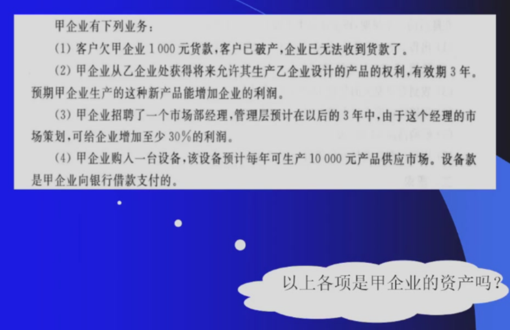
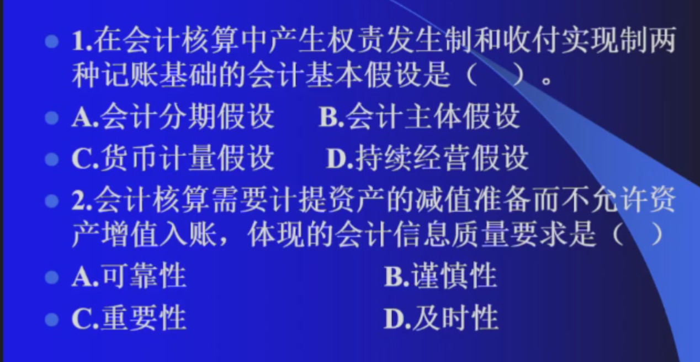
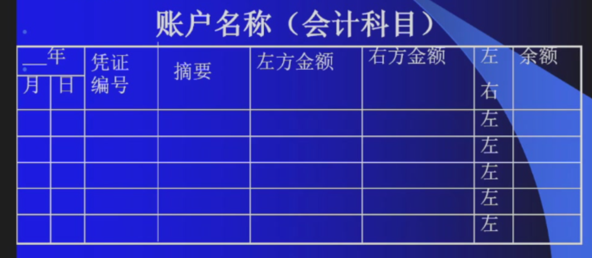
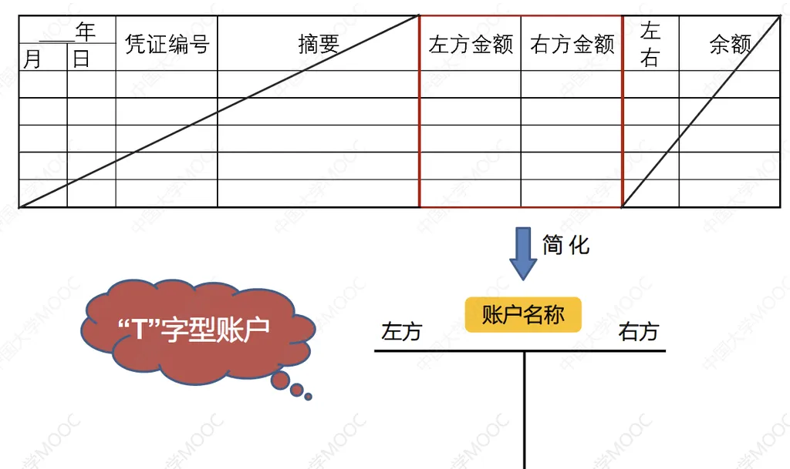
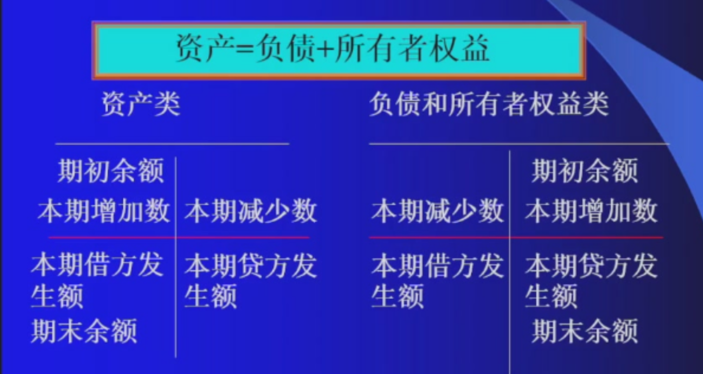
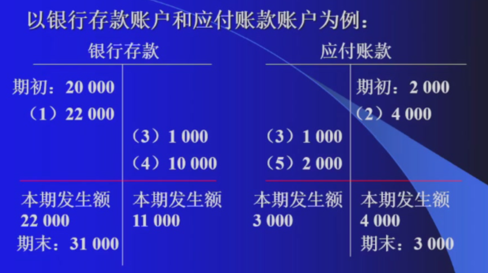
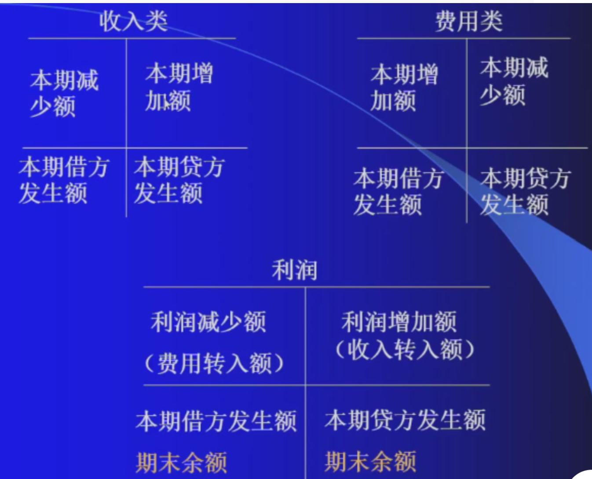
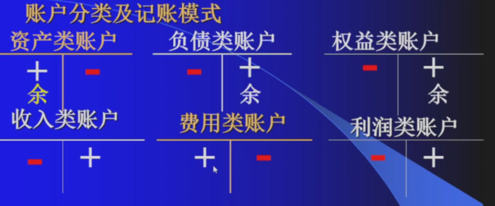

# 第二章 会计要素与复式记账
## 第一节 会计要素
### 一、会计要素的含义
- 会计要素是对会计对象的基本分类
- 资产负债所有者权益属于反映企业财务状况的会计要素，在资产负债表中列示
- 收入费用和利润属于反映企业经营成果的会计要素，在利润表中列示
### 二、六大会计要素
#### （一）资产

资产（按流动性，依据是变现能力与被耗用的时间长短）：指企业过去的交易或者事项形成的、由企业拥有或者控制的资源、预期会给企业带来经济利益的资源
> 最低一级要素是最终落账的对象,也就是记账的名称。资产确认时：与该资源有关的经济利益很可能流入企业；该资源的成本或者价值能够可靠地计量
- 1. 流动资产
    - 货币资金
        - 库存现金
        - 银行存款
    - 交易性金融资产(短期持有)
    - 应收及预付款项（自己的资产但是钱不在自己手里）
        - 应收账款（销售产生的款项，收入增加钱没增加）
        - 应收票据（没有资金，有汇票）
        - 预付账款（先将钱打给供应商，没有话语权的体现）
        - 其他应收款（由于特殊原因借给个人或其他企业，与业务活动没有关联）
            - 个人出差预支差旅费
        - 应收股利
        - 应收利息
    - 存货
        - 原材料（在途物资入库）
            - 购买原材料所需要的运费往往也算在原材料里面
        - 在途物资
        - 库存商品
- 2. 非流动资产（长期资产）
    - 固定资产
    - 在建工程（完工后即为固定资产，尚未达到可用状态）
    - 债权投资
    - 长期股权投资(长期持有)
    - 无形资产（专利等，没有实物形态）

- （1）不是
- （2）是（无形资产入账）
- （3）人的能力无法用货币计量，不是
- （4）是（作为固定资产）

#### （二）负债

负债（按偿还日）：指企业过去的交易或者事项形成的、预期会导致经济利益流出企业的现时义务
> 负债确认：与该业务有关的经济利益很可能流出企业；未来流出的经济利益和金额能够可靠地计算
- 1. 流动负债(近期)
    - 短期借款（银行）
    - 应付及预收款项
        - 应付票据
        - 应付账款
            - 二者是都是与采购业务相关联的，是对上游话语权的体现。企业在这两个款项负债高，话语权高。应付账款略高于应付票据
        - 预收账款：与销售业务相关，无息负债。预收账款越多，企业价值越高
        - 其他应付款：与销售采购没有关联的应付未付款项
        - 应付股利：已宣告但未发放，与股权对应
        - 应付利息：与负债对应
            
    - 应付职工薪酬：企业欠员工的工资，存在时间不长
    - 应交税费：企业欠国家
- 2. 长期负债(长期)
    - 长期借款：发生频率不高
    - 应付债券：企业向社会发行的债券，企业需要达到一定资历
    - 长期应付款

#### （三）所有者权益

所有者权益(净资产=资产-负债)：

- 实收资本：对于股份公司也称为股本，为投资者投入企业的资本部分
- 资本公积：形成的主要途径是资本溢价或股本溢价，是指所有者投入的资本超过其实收资本或者股本中所占份额的部分(股东投资预占三分之一股份价值一百万，投入一百三十万。则银行存款增加一百三十万，实收资本增加一百万，资本公积增加三十万)
- 盈余公积：企业按照规定从净利润中提取的、存留与企业内部、具有特定用途的各种累计资金，包括法定盈余公积、任意盈余公积等。<<中华人民共和国公司法>>特别规定，法定盈余公积提取比例为百分之十(可以高于百分之十)
- 未分配利润：指企业实现的净利润经过弥补亏损、提取盈余公积和向投资者分配利润后留存在企业的、历年结存、未指定用途、留待以后年度分配或待分配的利润。
> 未分配利润相较于其他所有者权益项目有较强的灵活性

> 1. A  2. B

####  （四）收入

收入(及利得)

- 特点
    - 在日常活动中形成
    - 与所有者投入资本无关
    - 会导致所有者权益的增加
    - 收入会导致经济利益的流入

- 主营业务收入(产品销售收入)
- 其他业务收入(包装物出租、固定资产出租的租金收入)
    - 营业收入
- 投资利益(也可能属于费用)
- 营业外收入(如罚款收入、政府补贴收入)

> 收入与所有者投资无关：股东投资所形成的经济流入应该计入所有者权

> 企业获得银行贷款应该被记为负债而不计入收入

####  （五）费用

费用(及损失)
- 特点
    - 企业在日常活动中发生
    - 与想所有者分配的利润无关
    - 会导致所有者权益减少
    - 会导致经济利益的流出

- 生产过程中的费用
    - 生产成本(直接费用)，和利润没有直接关联，直接影响利润的是主营业务成本，主营业务成本是**销售出的那部分产品的生产成本**
    - 制造费用(间接费用)
- 管理过程中的费用：管理费用
    - 办公费
- 销售过程中的费用：销售费用，如广告、销售人员工资等
- 融资过程中的费用：财务费用，**借款需要承担的利息**
> 期间费用：管理费用、销售费用和财务费用
- 其他业务成本
- 资产减值损失
- 公允价值变动损益(也可能属于收入)
- 税金费用：所得税费用、税金及附加
- 营业外支出
    - **支付罚款**

> 企业还债不应当记录费用，而应当冲减负债
#### （六）利润

利润

- 净利润=利润-所得税费用
- 利润总额=营业利润+营业外收入-营业外支出
- 营业利润=营业收入-营业成本-税金及附加-管理费用-销售费用-财务费用+投资收益+公允价值变动收益+资产减值损失(损失用负数表示)
- 利润=盈余公积+未分配利润
## 第二节 会计等式(会计要素之间的相互联系)
1. 静态要素之间的联系：资产-负债=所有者权益

2. 动态要素之间的联系：收入-费用=利润

3. 静态要素与动态要素之间的联系：资产=负债+所有者权益+(收入-费用 )

**结论**
1. 每一项经济业务的发生，至少要影响两个具体项目发生增减变化

2. 经济业务的发生，不外乎引起会计等式某一边的一增一减或等式两边的同增同减

3. 经济业务的发生，不会破坏会计方程是的平衡关系

## 第三节 会计科目与账户
### 一、会计科目
1. 含义：对会计要素进一步分类的项目

2. 种类：按反映的经济内容分：
- 资产类
- 负债类
- 成本类：生产成本，制造费用
- 损益类
    - 反映收入的科目：主营业务收入，其他业务收入等科目
    - 反映消费的科目：主营业务成本，销售费用，管理费用等科目
- 所有者权益类

3. 总分类科目下都可以划分明细科目

### 二、会计账户
1. 含义：根据会计科目开设，具有一定的结构，用来连续反映科目的增减变动及其结果

2. 结构

## 第四节 借贷复式记账法
### 一、 复式记账法
对于任何一笔经济业务都要用相等的金额在两个或两个以上的有关账户中进行相互联系的记录

### 二、 借贷复式记账法
#### (一)含义
以"借""贷"为记录符号的复式记账法
#### (二)借贷复式记账法账户的结构

- 资产类账户期末余额=期初余额+本期借方发生额-本期贷方发生额
- 负债和所有者权益类期末余额=期初余额+本期贷方发生额-本期借方发生额
- **记账规则**:有借必有贷，借贷必相等
- 资产初始必然在借方，负债与所有者权益初始必然在贷方

- 收入借方发生情况很少见，只有企业被退货才会出现
- 收入贷方引起利润增加，要在借方登账实现从收入的贷方向利润转出。收入减少额往往体现在利润的增加额
- 费用的登账形式与收入相反

- 借贷记账法下记账的分析步骤 
    - 涉及什么账户
    - 增加还是减少
    - 借方还是贷方

#### （三）借贷记账法的记账原则
1. 内容：有借必有贷，借贷必相等

2. 影响：有借必有贷---账户之间发生借贷对应关系，从一个账户与另一个账户的借贷关系中可以了解企业发生了什么样的经济业务；借贷必相等---账户之间发生借贷平衡关系，从平衡关系中可以检查企业记账是否正确
- 所有账户的借方发生额合计数=所有账户的贷方发生额合计数
- 所有账户的借方期末余额合计数=所有账户的贷方期初余额合计数
- 所有账户的借方期初额合计数=所有账户的贷方期初余额合计数

- 作用：编制时算平衡表用以检查记账是否正确