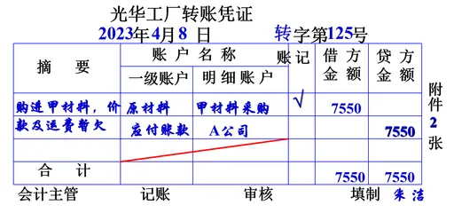
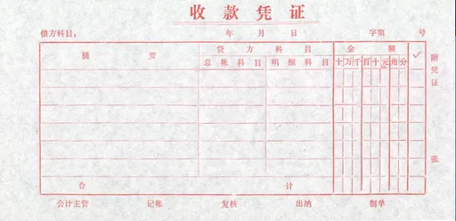
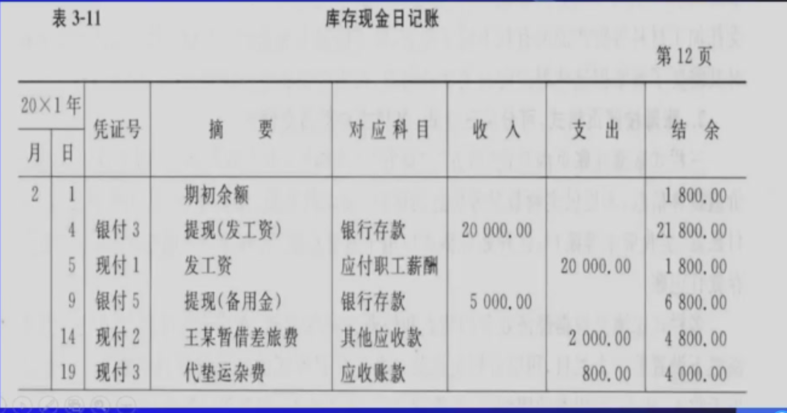
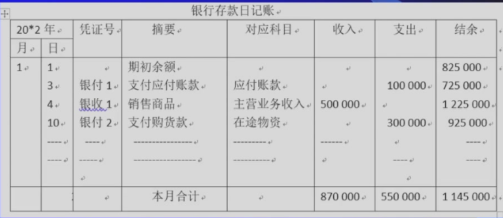
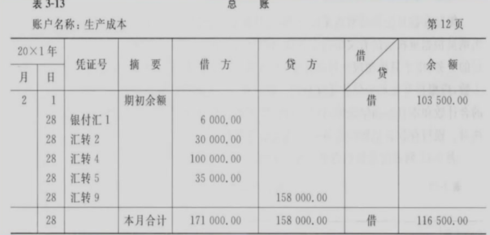
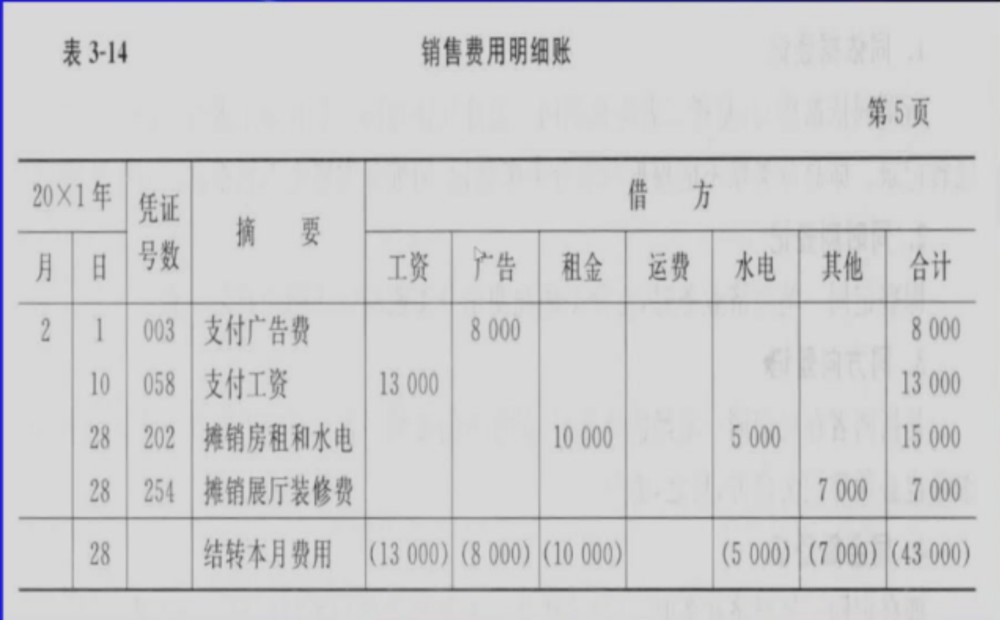
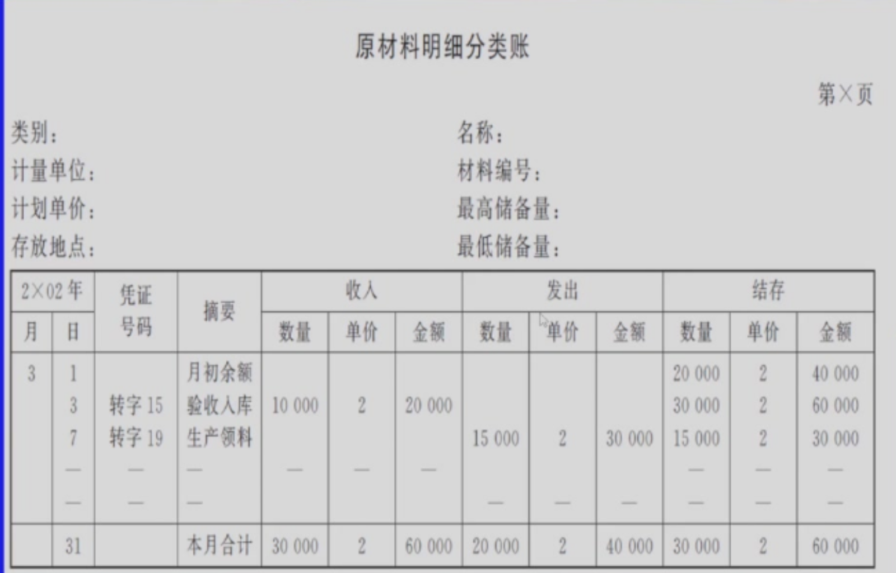
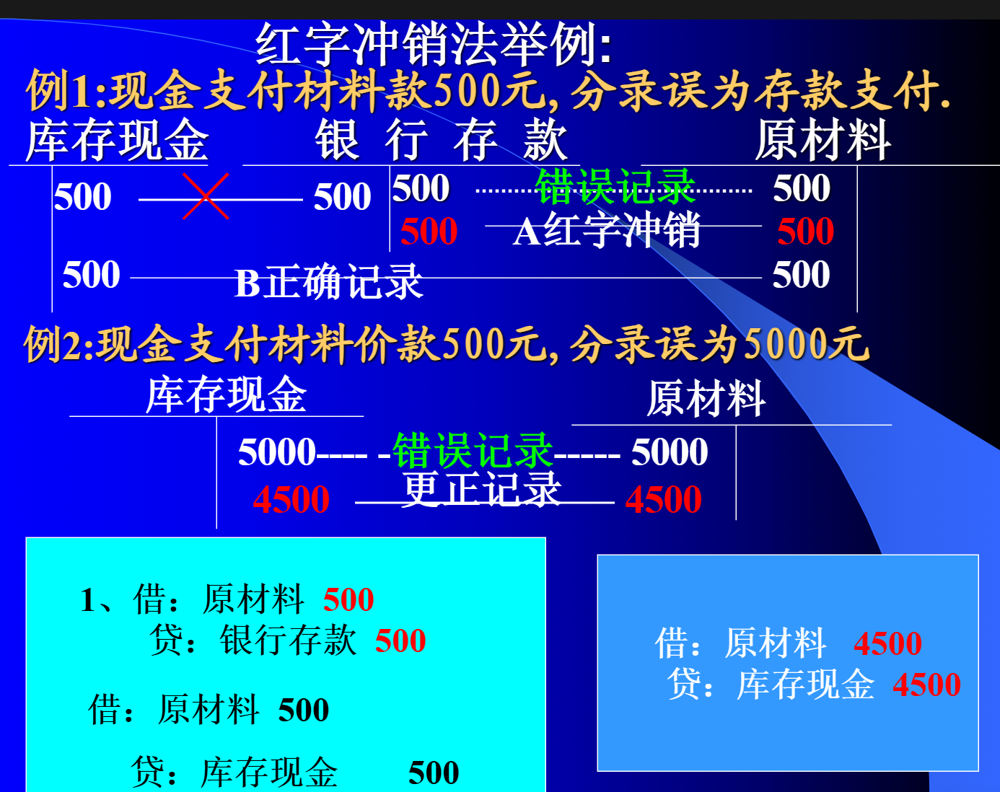
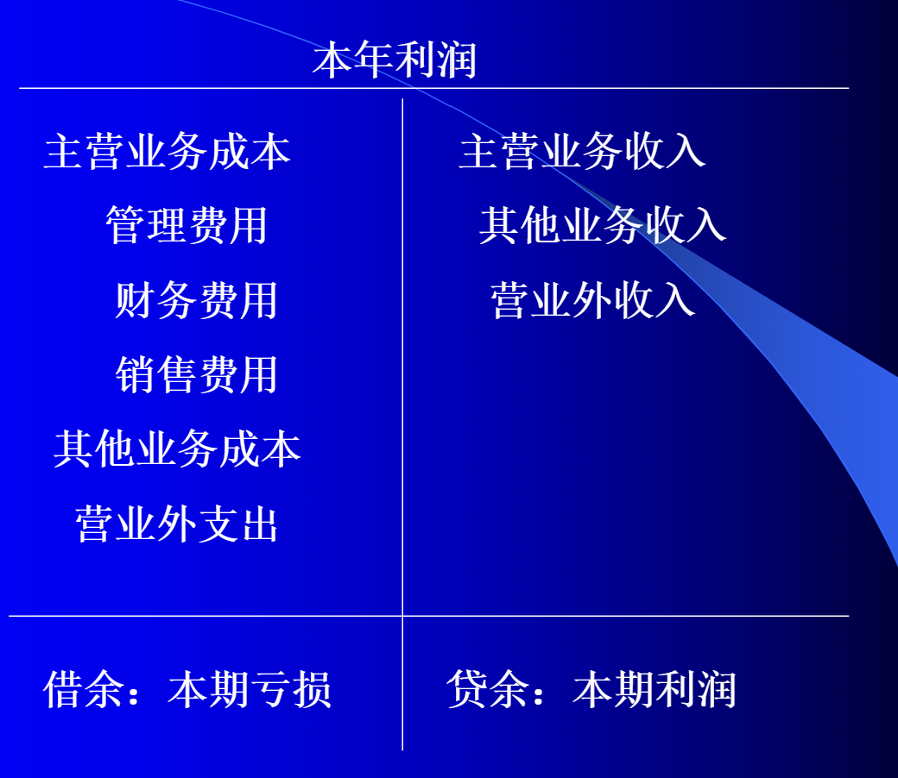
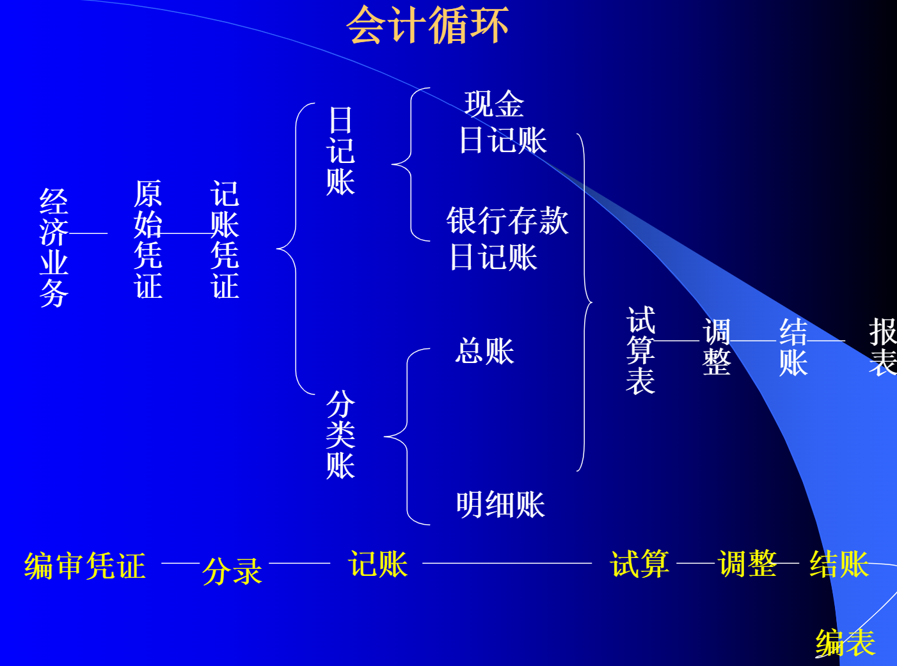

# 第三章 会计循环
## 第一节 分录与记账
### 一、会计分录
1. 定义：指明经济业务应以账户名称、记账方向、记入金额的记录
> 在会计实务中，会计分录即为记账凭证

$2. 会计分录的格式$

!!!note
    - 借:***(账户名)  \*\*\* (金额)
    -  贷:***(账户名)  \*\*\* (金额)
    > 先借后贷，上下错开

$3. 如何编制会计分录$

分析的步骤和程序是

- 引起哪些要素项目的变化(变化的账户名称)
- 判断变化项目的变化方向(金额的增或减)
- 根据账户性质判断应记账户的借方还是贷方

$4. 种类$

- 简单分录：一借一贷的对应关系
- 复合分录：一借多贷，一贷多借

$5. 三要素$

- 账户名称
- 记账方向
- 记账金额

> 银行存款3000归还银行短期借款，同时支付当月借款里写 300，共计3300
>
> 借：短期借款3000 财务费用300 贷：银行存款

### 二、会计凭证 
#### （一）会计凭证
1. 含义：会计凭证是记录经济业务，明确经济责任，并作为记账依据的书面证明文件

2. 种类(按填制的程序和用途分)
- 原始凭证(不一定由会计人员编制)
- 记账凭证

#### （二）原始凭证
1. 含义：经济业务发生时取得或填制的，用以记录和证明经济业务发生或完成情况的书面文件，它作为记账的原始依据

2. 种类
- 按来源分
    - 外来凭证
    - 自制凭证(占比较高，企业内部之间，如企业内部的材料领用单)
- 按填制手续分
    - 一次凭证
    - 累计凭证(相同的凭证加总在一起，减少记账的工作量)
    - 汇总原始凭证

#### （三）记账凭证
1. 含义：会计人员**根据审核无误的原始凭证或原始凭证汇总表**编制的，用来确定会计分录并据以登记账簿的一种凭证
> 有借贷信息，用于登账。每一张记账凭证都有对应的原始凭证

2. 种类
- 按适用业务
    - 通用记账凭证(企业规模较小)
    - 专用记账凭证
        - 收款凭证：货币资金增加
        - 付款凭证：货币资金减少
            - 借贷方要和银行存款或库存现金(货币资金)关联
        - 转账凭证：与资金无关
> 在实务中，涉及现金与银行存款之间的业务，一般只填制付款凭证
- 按填制方式
    - 单式记账凭证:指将一项经济业务所涉及的每个会计科目都单独编制一个记账凭证。
        - 便于汇总计算每一个会计科目的发生额
        - 不利于反映经济业务的全貌及会计科目之间的对应关系
    - 复式记账凭证：将一项经济业务所涉及的会计科目及发生额都集中在一张记账凭证中反映，即每项经济业务只填制一张记账凭证

### 三、会计账簿
#### （一）会计账簿的含义及基本类别
1. 含义：由具有专门格式并互相联系的账页组成的，用以序时或分类记录经济业务的簿籍
- 账户记录是账簿的实质内容

2. 会计账簿的分类
- 序时账(日记账)
    - 现金日记账
    - 银行存款日记账
    - 转账日记账
- 分类账
    - 总分类账
    - 明细分类账
- 备查账：记录时序账和分类账都不予记录的信息

#### （二）现金日记账的设置与登记
1. 格式：一般为三栏式

2. 登账依据(可能是现金收款凭证，现金付款凭证，银行存款付款凭证)

#### （三）银行存款日记账的设置与登记
1. 格式：一般三栏式

2. 登账依据(可能是银行存款付款凭证，银行存款收款凭证，库存现金付款凭证)

#### （四）总账的设置与登记
1. 格式：按以及会计科目设置，一般为三栏式

2. 登记依据：记账凭证或汇总后的记账凭证

#### （五）明细账的设置与登记
1. 格式：
- 三栏式：适用于只需记录金额的明细账
- 多栏式：借方或贷方设特别专栏，适用于**费用成本及收入成果类**的明细账

- 数量金额式：适用于需掌握数量，金额的财产物资明细账

2. 登记依据:根据记账凭证、原始凭证逐日逐笔登记或定期汇总登记

#### （六）总账与明细账的关系
- 总账对明细账起着统驭控制作用
- 明细账对总账起着补充说明作用
    - 同时期
    - 同依据
    - 同方向
    - 同金额
- 平行登记规则

## 第二节 试算与调整
### 一、试算

1. 依据："借贷必相等"产生的平衡关系

2. 方式：编制试算表

3. 优点：可用来检查经济业务的会计记录是否正确

缺陷：平衡不一定表示账户处理完全正确
- 借贷同时遗漏
- 借贷同时重复记账
- 借方或贷方发生同数错误

4. 更正账簿错误的规则
- 划线更正法：如果发现账簿记录中数字或文字错误，但是**记账凭证正确**，可以用划线更正法进行更正

- 红字更正法：因分录错误而造成的账户名称、金额错误

- 补充登记法：分录金额减少记造成账户的错误
    - 更正方法：将少记的金额用蓝字编制正确的分录并登记入账

    

 ### 二、调整
 - 往往没有原始凭证作为支撑
 #### （一）账项调整的含义
 1. 调账基础：权责发生制

 2. 调账目的：合理反应各期的收入和费用

 3. 调账时间：会计期末

 #### （二）期末结账前应予调整的项目

 1. 应计项目
 - 应付费用
 - 应收收入

 2. 递延项目
 - 预付费用
 - 预收收入

 1. 应计项目

 特点：应归属于本期但现金尚未收到(表现为本期收入)或现金尚未付出(表现为本期费用)

 - 应付费用：如应付工资、应付租金、应付利息等
    - 遗漏应付费用调整分录会导致：本月费用降低，本月利润增加，本月负债降低从而美化资产负债表

 
 - 应收收入 如应收租金、应收利息等
    - 遗漏应收收入调整分录会导致：本月收入降低，本月利润降低，本月资产降低从而丑化资产负债表

 

 2. 递延项目

 特点：以前已收到现金，但有一部分归属于本期(表现为收入)；以前已付出现金，但有一部分归属于本期(表现为费用)

 - 预付费用 如预付保险、预付租金等

 - 预收收入 如预收贷款、预收利息、预收租金等

 
- 年初时计银行存款和预收账款

## 第三节 结账与编表

### 一、账户的分类(按账户是否有余额)
1. 虚账户：收入、费用类账户 即利润表上的账户

2. 实账户：资产、负债及所有者权益类账户，即资产负债表账户

### 二、结账的含义

会计期末，结清虚账户(虚账户不能留有余额)，结转实账户(实账户的期末余额转为下期期初余额)

### 三、虚账户的结清
1. 计算虚账户的余额

2. 编制结账分录
- 实质：将各收入、费用类账户的余额转入"本年利润"账户之间发生借贷对应关系

3. 年末，将“本年利润”账户结清
- 实质：将“本年利润”账户的余额转入“利润分配---未分配利润”

### 四、实账户的结转
- 实质：转入下期，不需要编制结账分录

### 五、编制报表

### 六、定期对账
账证相符、账账相符、账实相符、账表相符

