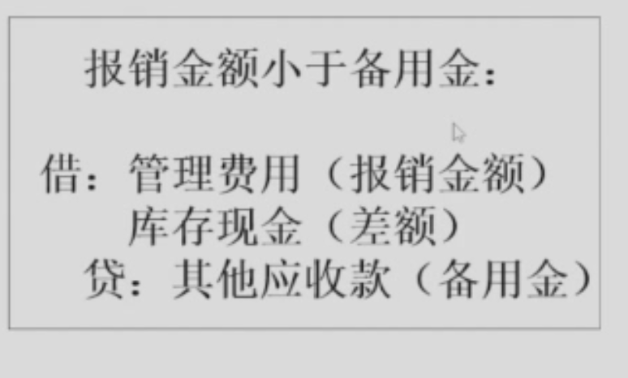
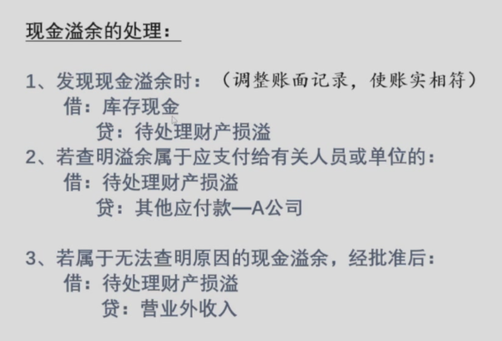
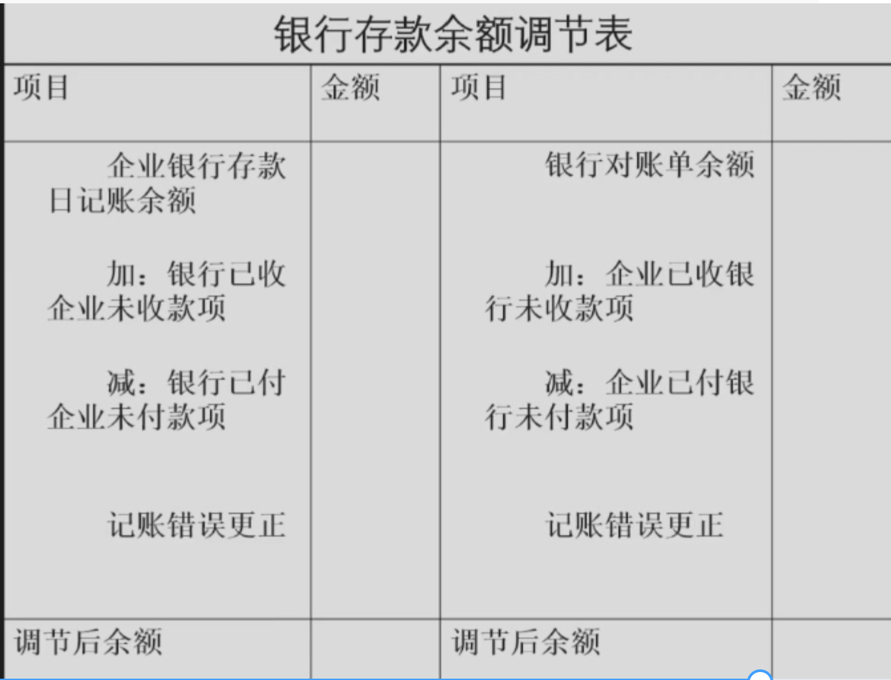
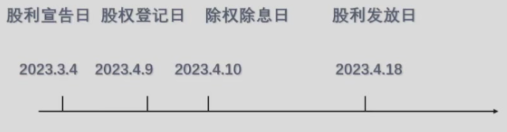
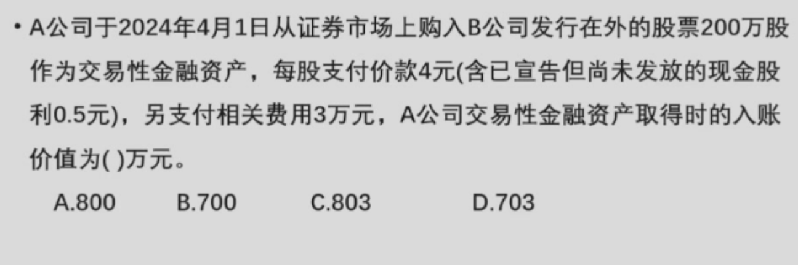
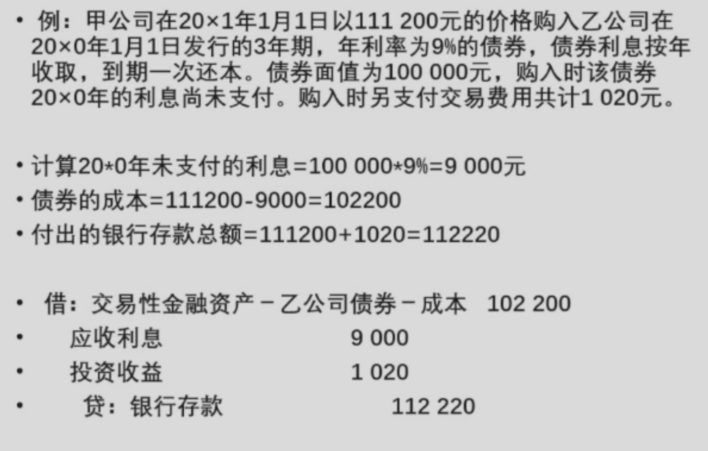
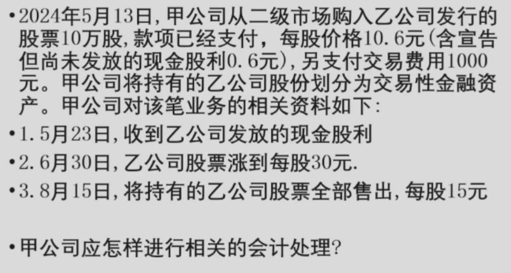
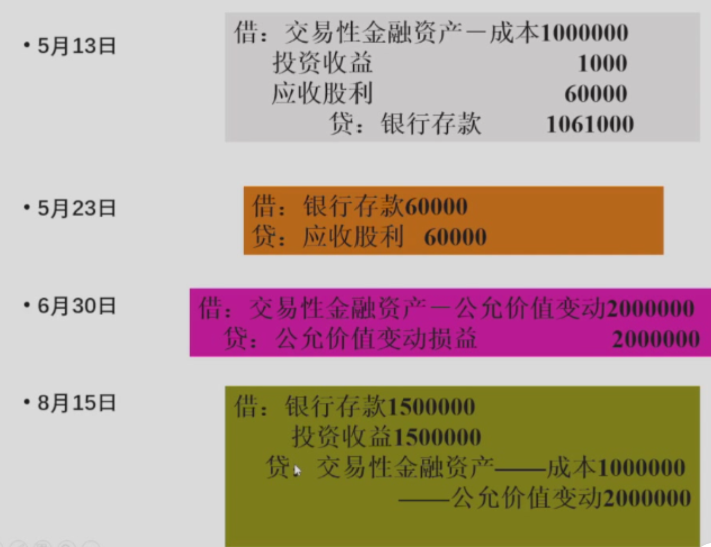
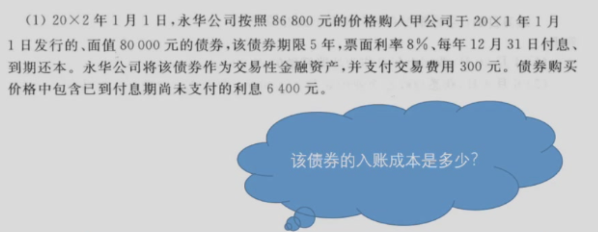
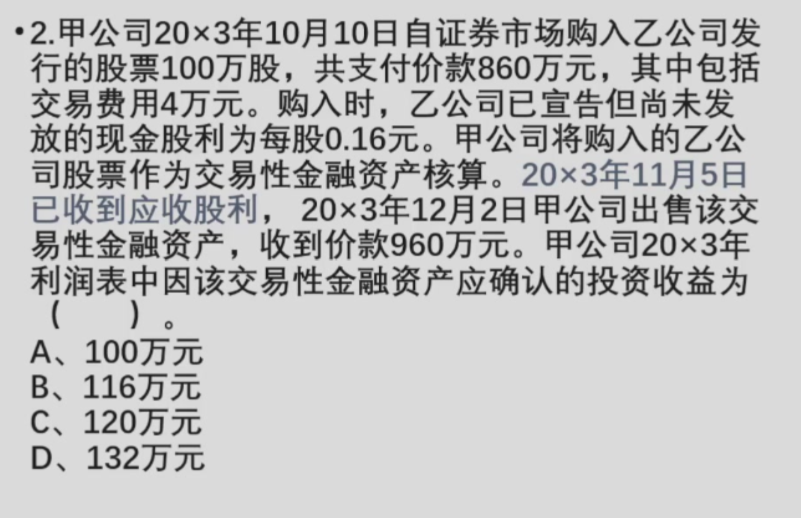

# 第四章 货币资金与交易性金融资产

## 第一节 货币资金
### 一、库存现金
#### （一）现金的备用金制度

1. 含义：企业实现付给内部部门或业务人员一笔一定金额的现金，供其零星开支使用，称为备用金
> 例如公司出差人员预支差旅费

2. 备用金的会计处理

建立备用金时

借：其他应收款

    贷：库存现金

业务发生后报销时的会计处理




#### （二）现金的清查

1. 清查目的：账实相符

2. 清查方法：盘点

3. 清查结果的会计处理

- 设置“待处理财产损溢-待处理流动资产损溢账户”
- 分两步
    - 通过待处理财产损溢，使账实相符
    - 批准后转销“待处理财产损溢”
- 盘盈：作为营业外收入(除应付给有关人员或单位外)
- 盘亏
- 需要过失人赔偿部分，应作其他应收款
- 无法查明原因的盘亏，应借记为“管理费用”


**现金短缺的会计处理**

1. 发现现金短缺时(调整账面记录，使账实相符)
```
借：待处理财产损溢

    贷: 库存现金
```

2. 若查明短缺应由责任人赔偿的

```
借：其他应收款
    
    贷：待处理财产损溢
```
3. 属于无法查明原因的短缺则经批准后：

```
借：管理费用

    贷：待处理财产损溢
```



> 应注意到待处理财产损溢只是起到过渡作用，不起到实质性作用

### 二、银行存款的期末检查

1. 方法：每月月末，将企业"银行存款日记账"的余额与银行送来的对账单核对

2. 余额不一致的原因

- 企业和银行任何一方发生的记账错误
- 未达账项
    - 含义：指由于阶段凭证在企业与银行之间实际结算与入账时间不同而产生，一方收到凭证已经入账，另一方尚未收到凭证而未能入账的款项
    - 原因
        - 企业已经收款入账，银行尚未收到入账的款项
        - 企业已经付款入账，银行尚未付出入账的款项
        - 银行已经收款入账，企业尚未收到入账的款项
        - 银行已经付款入账，企业尚未付出入款的款项
    > 未达账项是正常的




3. 余额不一致的处理

- 对记账错误造成的双方不符，编制更正分录更正
- 对未达账项造成的不符，进行余额调节
- 具体操作：编制银行存款余额调节表
- 按现行会计准则规定，“未达账项”不能以银行存款余额调节表作为原始凭证，在月末据以调整银行存款的账面记录。只有在结算凭证到达企业以后，才能做相应的会计处理
- 对于企业存款日记账的错误：应进行错账更正，并将更正分录计入银行存款日记账及银行存款总账

#### 三、其他货币资金的会计处理
1. 含义：其他货币资金是指不同的存放地点或不同的结算方式引起的除现金、银行存款以外的各种货币资金

2. 种类

- 外埠存款：企业到外地进行临时或零星采购时，汇往采购地银行开立采购专户的款项
- 银行汇票存款：为取得银行汇票，按照规定存入银行的款项
- 银行本票存款：为取得银行本票，按规定存入银行的款项
- 信用卡存款：为取得信用卡证按照规定存入银行信用证保证金专户款项
- 存储投资款：指企业已存入证券公司但尚未进行短期投资的款项

3. 会计处理


## 第二节 交易性金融资产
### 一、取得交易性金融资产的核算

取得时应按交易性金融资产的实际成本(公允价值)入账

1. 交易性股票投票

股票投资成本=买价-已选购尚未支取的现金股利

手续费+税金计入当期损益，计入投资收益账户

已宣告尚未支取的现金股利计入应收股利账户


- 印花税税率是调节股市的工具

#### 上市公司股利支付的程序
- 股利宣告日：年报+利润分配方案(分多少+分给谁)
- 股权登记日-依然有分红权利，有应收股利
- 除权日-没有分红权利
- 股利发放日-应收股利变现




> 在股权登记日前买进，实际成本为3.5元。借：交易性金融资产700万，应收股利100万，投资收益3万 贷银行存款803万

2. 交易性债券投资

债权投资成本=买价-已到期尚未领取的债券利息

对已到期尚未领取的债券利息应计入应收利息账户

手续费+税金计入当期损益，记入投资收益账户


> 债券利息按照票面计算，不按照实际购入价格计算



## 二、交易性金融资产持有期间的投资收益

持有期间取得的现金股利或利息，作为应确认期间的投资收益入账

确认期：借：应收股利(利息) 贷：投资收益

收到购入时已宣告而尚未领取的现金股利，或已到期而尚未领取的利息，冲减应收股利或应收利息。只要持有且未收到就不做该账

收到期：借：其他货币资金 贷：应收股利(利息)

## 三、交易性金融资产的期末计价--市价法

1. 含义：每期期末，将金融资产调整为市价计价

2. 方法：设置公允价值变动损益账户 期末应调整的金额=市价-成本

3. 会计处理：
    - 市价-成本>0时 借：交易性金融资产--公允价值变动 贷：公允价值变动损益
    - 市价-成本<0时 借：公允价值变动损益 贷：交易性金融资产--公允价值变动

## 四、交易性金融资产的出售
### （一）处置时投资成本的结转
1. 全部处置某项短期投资时，其成本为投资的账面余额

2. 部分处置某项短期投资时，应按照该项投资的总平均成本确定其处置部分的成本

### （二）处置时损益的确定

将售价款与交易性金融资产账面价值的差额确认为投资收益

但若有未收的应收股利必须先扣除





#### 分析与启示
- 交易性金融资产出售带来的投资收益具有不可持续性
- 持有交易性金融资产发生的公允价值变动损益也具有不可持续性
- 大概率交易性金融资产的存在极容易引起企业利润的波动


!!! Question 
    
    ??? solution "答案"
        
    
    ??? solution "答案"
        (960-840)-4=116 
    - 某企业销售产品一批，发票总金额为100万元，该笔业务的发生将直接引起利润增加100万元
    ??? solution "答案"
        ```
        借：银行存款 100

            贷：主营业务收入 100/(1+增值税率)
                
                应收税费-应交(销项税额) 100*(1+增值税率)*(增值税率)
        ```
