# 第五章 应收款项 
## 第一节 应收账款
- 主营业务收入一定与应交税费关联
### 一、应收账款的初始计价
- 按照实际发生的交易价格入账，主要包括发票金额和代垫运费
- 销售时，借：应收账款 贷：主营业务收入和应交税费-应交增值税(销项税额)

> 如果税率上调，销售方也会负担税额，但是不能全部转嫁(话语权越强的企业，税务转嫁能力越强)

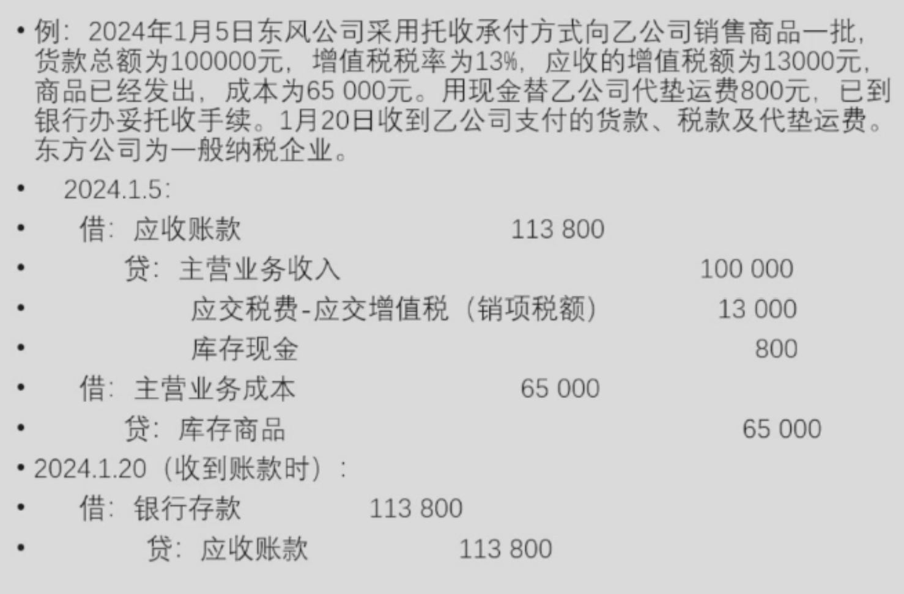

### 二、应收账款的收回与坏账

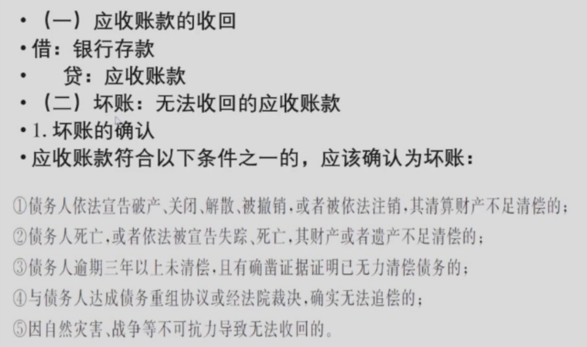

**2. 坏账的会计处理：直接法与备抵法**

- 直接法是指发生坏账时，将坏账的实际金额


!!! note
    信用减值损失属于损益类科目
    坏账准备属于 资产类科目中的“备抵科目”（或称“资产备抵账户”）

- 缺陷：不符合收入与费用配比原则，也不符合谨慎性的会计信息质量要求

- 备抵法
    - 特点：预先估计坏账损失，记入信用减值损失(在平时关注坏账企业，对坏账有预期处理)
    - 尚未坏账时：借：信用减值损失 贷：坏账准备(应收账款不适宜放在报表中时)
    - 实际发生坏账时：借：坏账准备 贷：应收账款
    - 备抵法估计的准确性会直接影响利润
    - 估计坏账损失的方法
        - 销货百分比法：估计坏账损失=本期赊销金额（借方发生额）*坏账百分比。
            - 缺点：坏账发生额与赊销金额事实上没有直接关联。因此在事务中不使用这种方法
        - 应收账款余额百分比
            - 要求：应收账款余额与坏账准备余额保持相应的比例
            - 年末坏账准备应保留的余额=应收账款余额*比例
            - 本年应计提的金额=应保留余额-计提前余额
            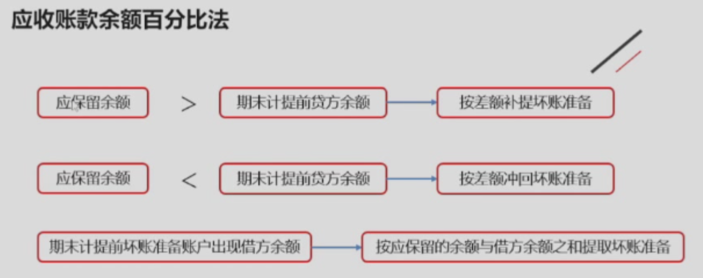
        - 账龄分析法--余额百分比法的进一步
            - 要求：根据应收账款拖欠时间的长短。估计坏账损失。具体处理与余额百分比相同
            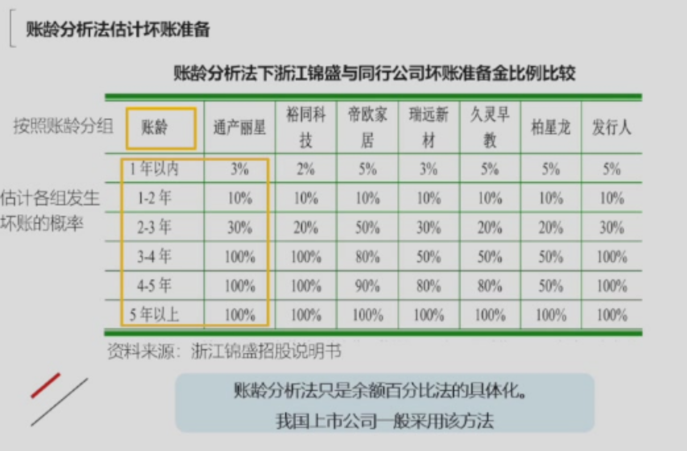

        !!! example
            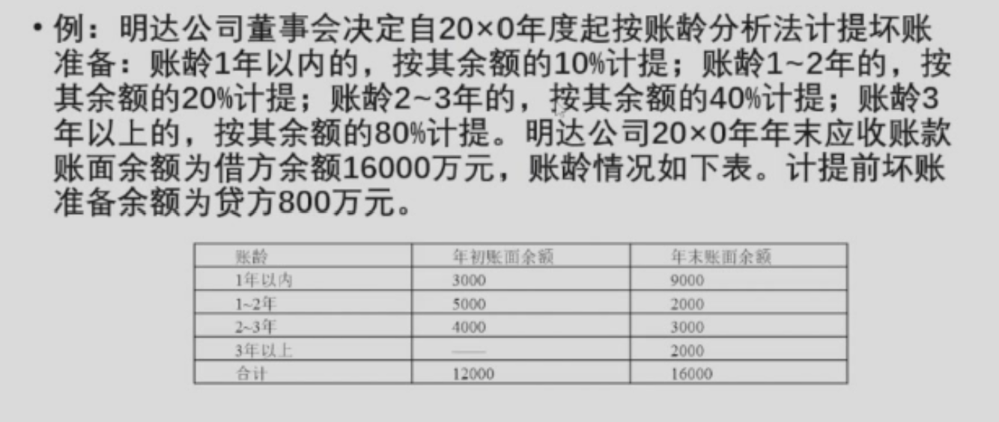
            ??? answer
                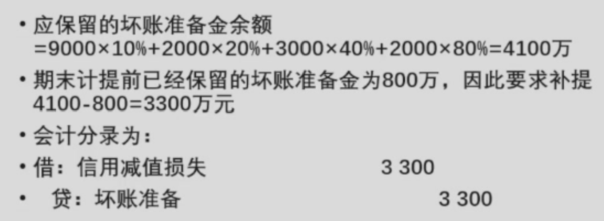

> 冲回导致利润增加，计提导致利润减少

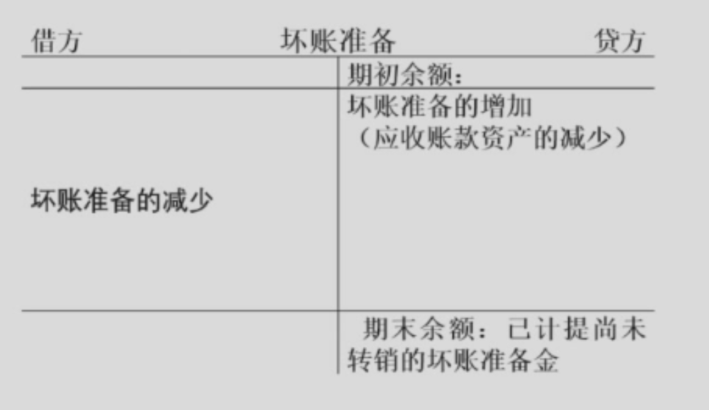

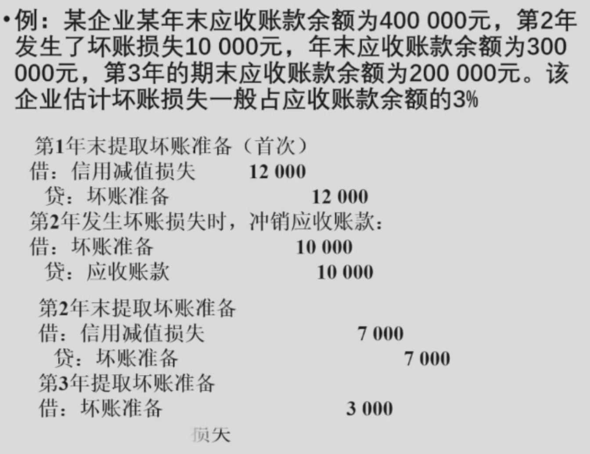

> 每年都要根据应收账款余额计算坏账准备的余额从而进行计提或者冲减 

!!! quesion
    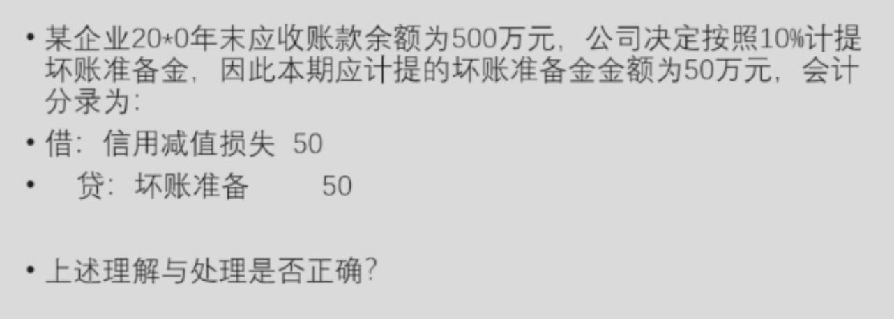
    ??? answer
        错误 坏账准备金计提或冲销与期初坏账准备金余额有关，余额<应计提坏账准备金时计提，余额>应计提坏账准备金时，冲销

!!! warning
    坏账准备是应收账款的备抵账户。企业真实发生坏账时，应收账款的贷方即为坏账准备的借方

**3. 坏账收回的会计处理**

首先应恢复已经冲销的应收账款和坏账准备，即

```
借：应收账款 
    贷：坏账准备
```
同时，反映应收账款的收回，即

```
借：银行存款
    贷：应收账款
```

!!! example
    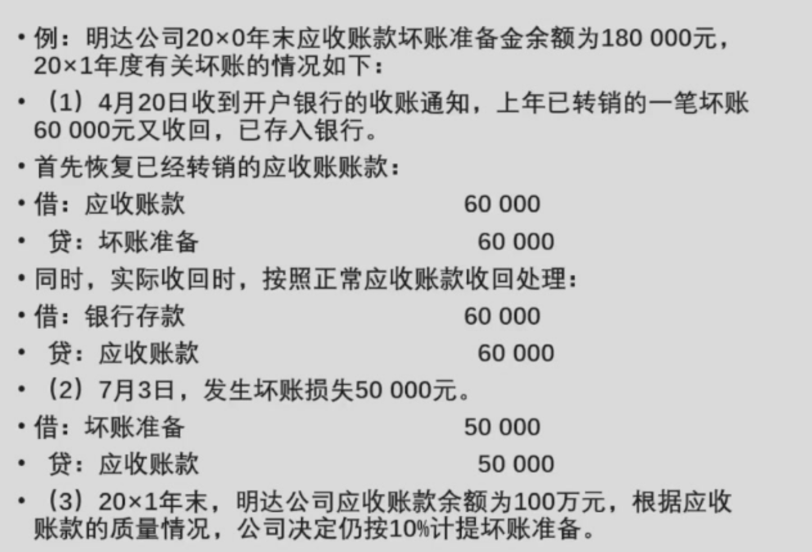
    

    - 若本期没有发生坏账收回，本期应该计提多少坏账准备
    ??? answer
        

!!! question "课堂思考"
    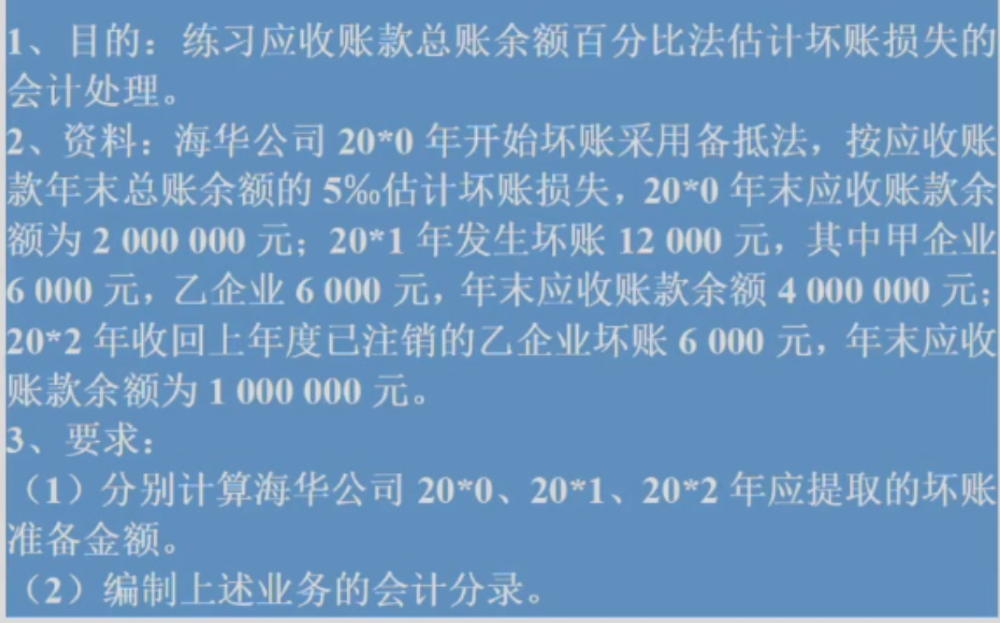
    ??? answer
        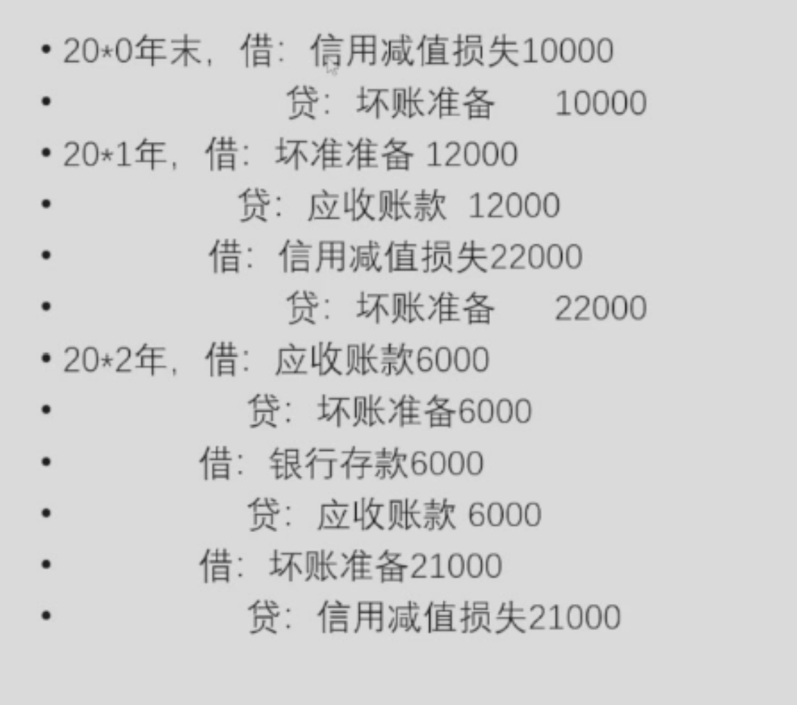

## 第二节 应收票据
### 一、应收票据的含义及分类
#### 1. 应收票据中的票据是指商业票据

!!! warning
    应收票据本身不是钱，这与银行汇票和银行本票不同

#### 2. 按是否计息分为带息票据和不带息票据
#### 3. 按承兑人分为银行承兑汇票与商业承兑汇票
!!! tip
    银行承兑汇票的质量更高

### 二、应收票据的会计处理
#### 1. 销售时，按照面值
```
借：应收票据--面值
    贷：主营业务收入
        应交税费--应交增值税(销项税额)
```
!!! warning
    主营业务收入按照不含增值税的销售额入账
#### 2. 带利息票据期末计提利息
```
借：应收票据--利息

    贷：财务费用
```
!!! tips
    调整分录

#### 3. 到期时

```
若对方支付

借：银行存款

    贷：应收票据
            
            -面值
            
            -利息
```

```
若对方无力支付

借：应收账款

    贷：应收票据
            
            -面值
            
            -利息

```
!!! tips 
    若各月末没有计提应收利息，则到期时贷记财务费用

!!! example
    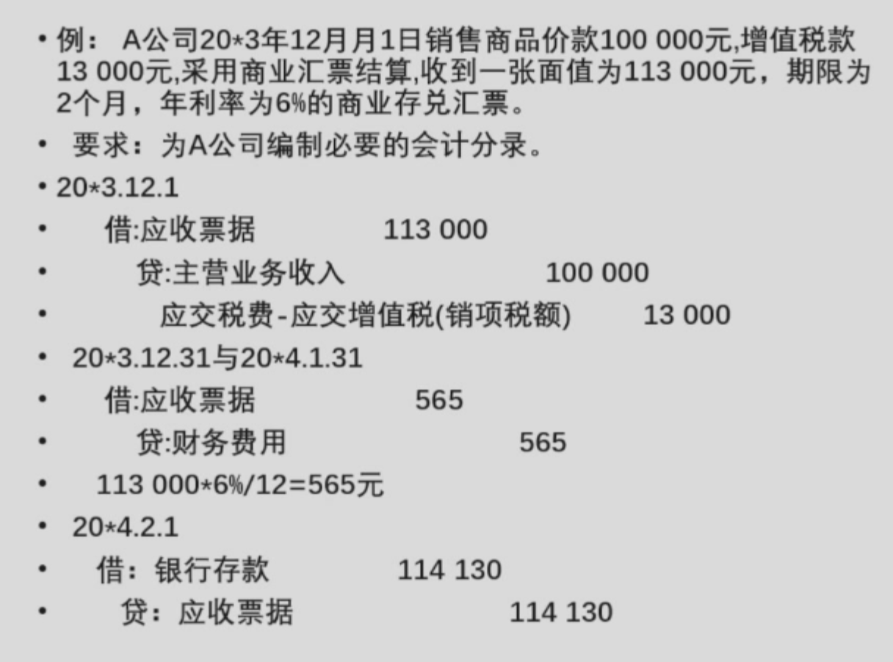 
    !!! tips
        20*3.12.31与20*4.1.31都是根据权责发生制各计一个月利息

!!! warning 
    应收票据在做会计分录时只根据票据面值落账，差额用应收账款补齐

    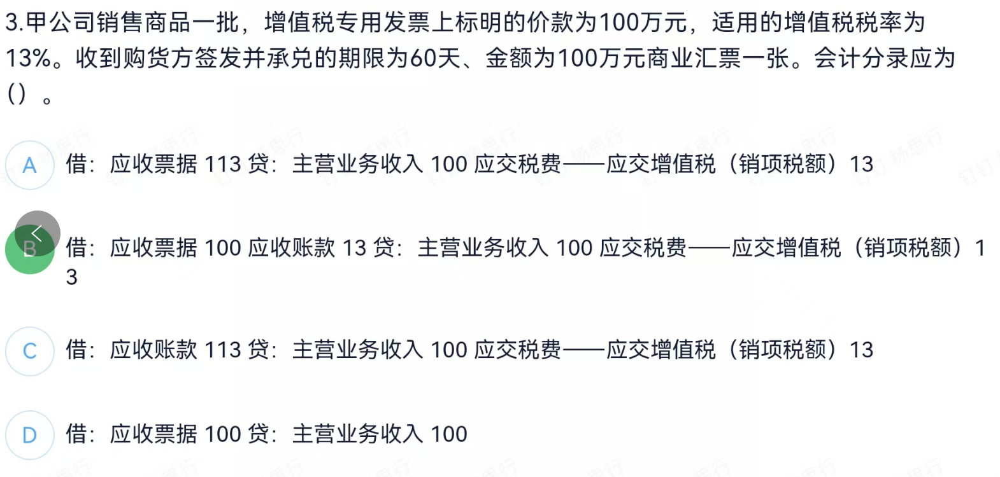
    
#### 4. 贴现的处理

- 计算：贴现所得=票据到期值-贴现息
- 票据到期值=本金+利息
- 贴现息=票据到期值\*年利率\*贴现期

> 贴现相当于银行借钱给我们，贴现息可以理解为获得贴现的代价

!!! tips "处理要点"
    - 不带息票据，贴现息直接作为财务费用的增加
    - 带息票据，贴现所得与面值(而不是票据到期值)之间的差额增减财务费用
    - 带有追索权的票据贴现，由于不符合资产的终止确认条件，会计上不应冲销应收票据账户，一般根据实际收到的贴现款借记"银行存款"，按照到期价值贷记"短期借款"

!!! example "不带追索权应收票据贴现"
    东方公司在6月9日将持有的一张大中公司5月10日签发的面值为20000元，利率为9%，90天到期的银行承兑票据向银行贴现，贴现率为12%

    - 到期价值=20000+20000\*9%*90/360=20450
    - 贴现息=20450\*12%*60/360=409
    - 贴现所得金额=20450-409=20041

    ```
    借：银行存款  20041

        贷：应收票据 20000

            财务费用  41
    ```

    !!! warning 
        - 银行不能向发放票据企业拿到这笔钱时，请求贴现方不承担连带责任
        - 贴现日与签发日的不同会导致到期价值中利息与贴现息的计算期限不同
!!! example "带追索权应收票据贴现"
    企业收到购货单位交来2019年12月31日签发的不带息商业票据一张，金额300000元，承兑期5个月，2020年1月31日企业吃汇票向银行申请贴现，带追索权，年贴息率5%
    - Step 1：计算
        - 到期值=300000元
        - 贴现值=300000*5%*4/360=5000
        - 贴现净额=300000-5000=295000
    - step 2：做贴现实现时的会计分录
        ```
        借：银行存款  295000
            
            财务费用  5000

            贷：短期借款  300000（带追索权的体现）

        ```
    - step 3：到期日
        - 票据能够收回
        ``` 
        借：短期借款  300000
        
            贷：应收票据 300000
        ```
        - 票据不能收回，负连带责任
        ```
        借：短期借款  300000
            
            贷：银行存款  300000
        
        借：应收账款 300000

            贷：应收票据 300000

        ```

## 第三节 预付账款
- 预付账款：是指企业按照购货合同或劳务合同规定，预先以货币资金支付给供货方或提供劳务方的款项，是企业的债权

- 根据合同预付款项时
```
借：预付账款

    贷：银行存款
```

- 收到货物时
```
借：原材料

    应交税费--应交增值税(进项税额)

    贷：预付账款

        银行存款

```

> **全款不一定一次付清会导致收到货物时贷方依然会有银行存款出现**

!!! tips 
    如果余款未在到货时结付，后续补付时要借预付账款贷银行存款

!!! example
    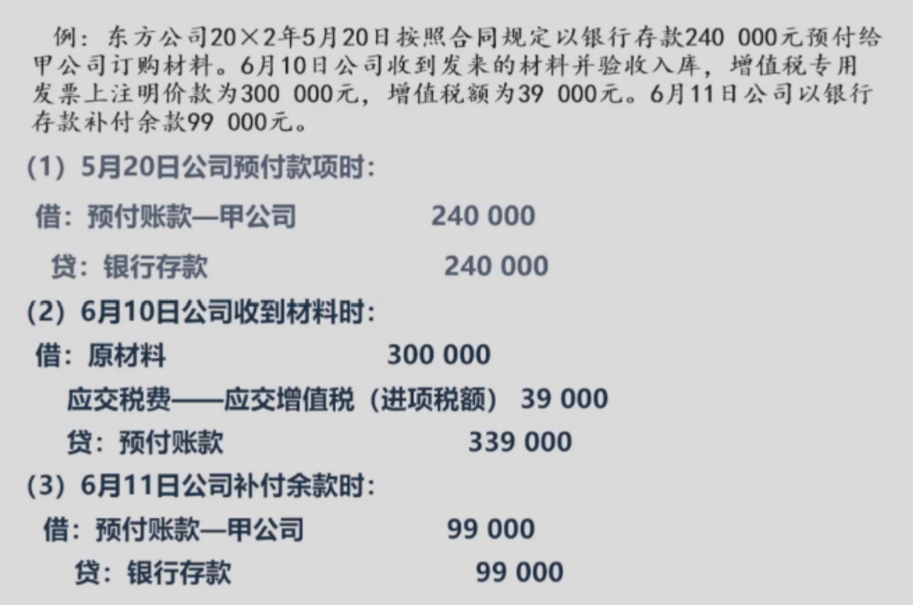

## 第四节 其他应收款
- 其他应收款核算应收的各种赔款罚金，出租包装物的租金，应向职工收取的各种垫付款项，备用金、存储保证金的业务

!!! example
    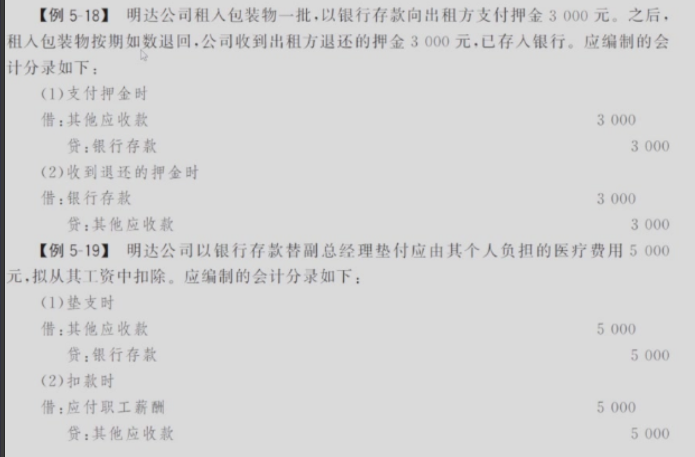
    !!! warning
        其他应收款也应该在期末计提坏账准备
