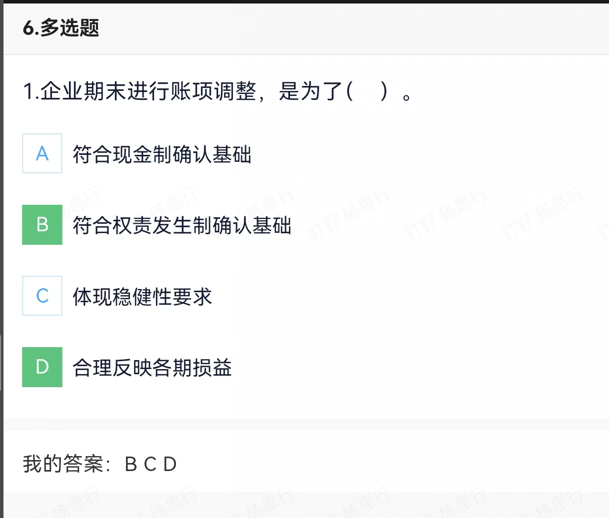
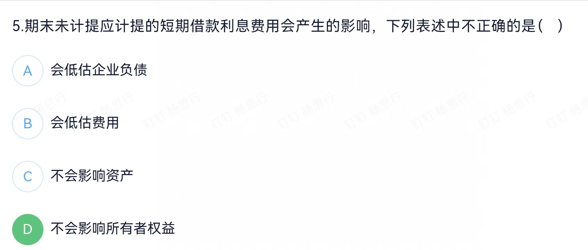
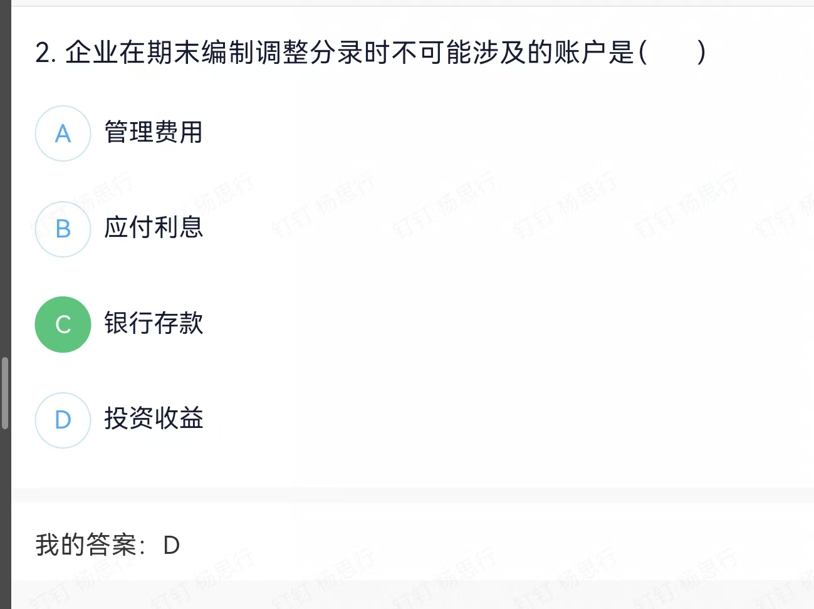
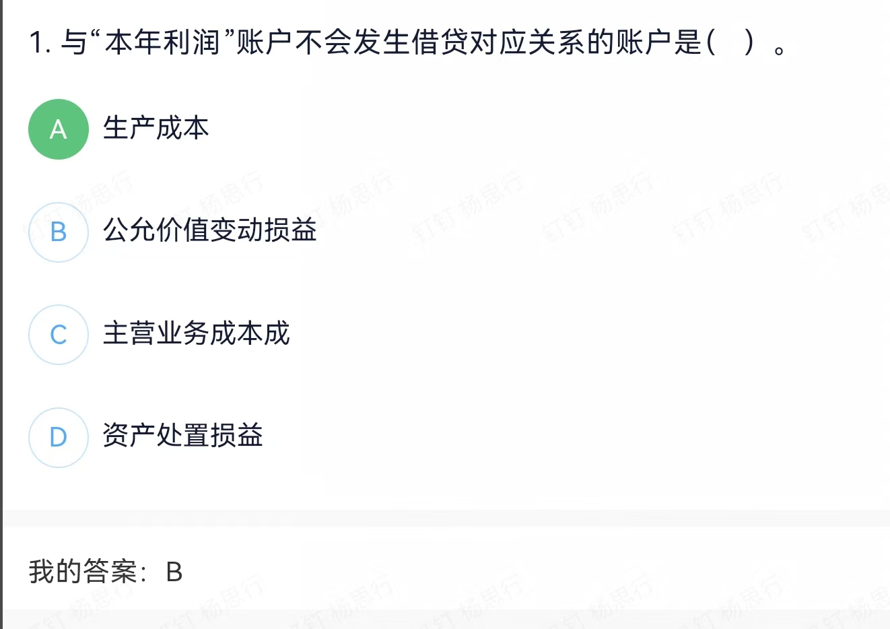
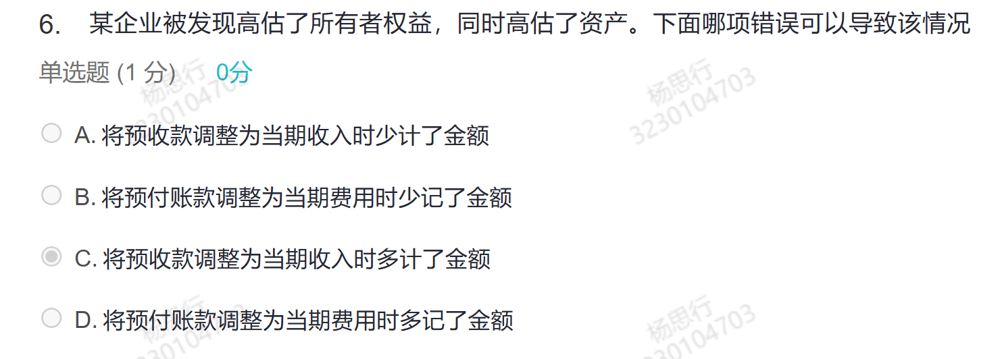
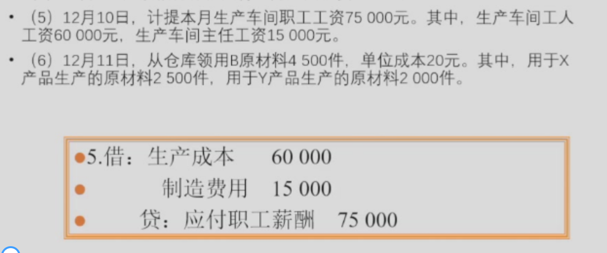
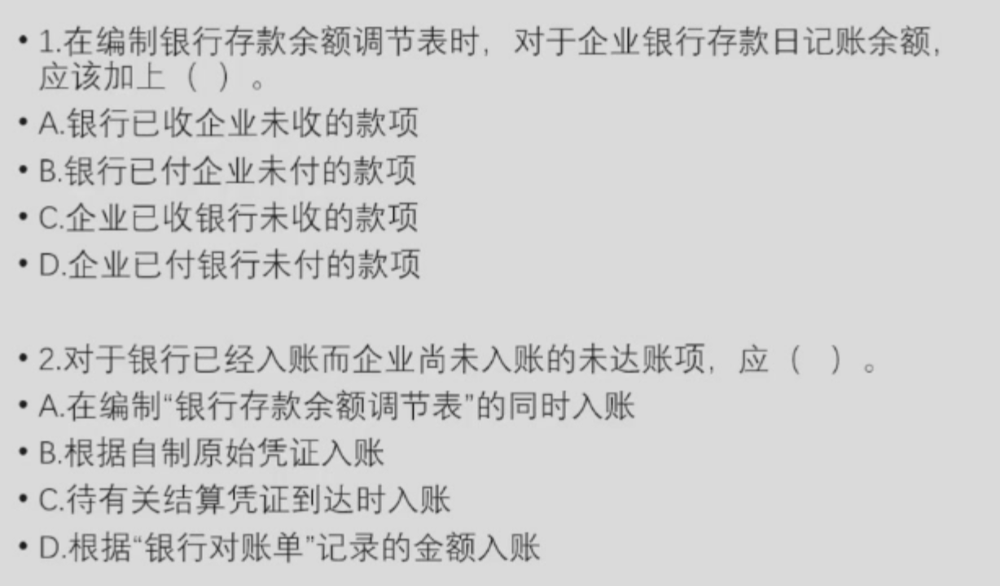

- 通过账项调整，企业能够更准确地反映本期的收入、费用和利润。例如，计提未支付的费用或确认未收到的收入，可以避免损益的扭曲，确保财务报表真实反映企业的经营成果。
- 稳健性原则要求会计处理应谨慎，避免高估资产或收益、低估负债或费用。虽然账项调整可能涉及稳健性原则（如计提坏账准备），但其主要目的还是为了符合权责发生制和合理反映损益。

- 会高估净利润从而影响所有者权益

- 银行存款是现金类账户，通常不涉及期末调整分录。调整分录主要是为了确认尚未实际收付的收入或费用，而银行存款反映的是实际的现金流动，因此不会在调整分录中涉及。
- 投资收益可能在期末调整分录中涉及。例如，企业持有的投资已产生收益但尚未收到，需要在期末确认投资收益。

- 生产成本是用于归集生产过程中发生的各项费用，最终会结转到“库存商品”或“在产品”账户，而不是直接与“本年利润”账户发生借贷对应关系。因此，生产成本不会与“本年利润”账户直接对应。

- 将预付款多计会使负债减少而不会使资产增加。费用类的错计会影响资产，收入类的错计会影响负债。

- 生产计划无法知晓计划是否履行，采购合同无法证明合同是否履行，转账凭证属于记账凭证

- 生产成本和管理费用采用多栏式，应收账款三栏式，原材料采用数量金额式

- ABCD

- 车间主任工资属于制造费用

销售部么小王因公出差，预支现金3000元

- 小王尚未出差，相当于向企业借款，借其他应收款，贷库存现金 

- 1. A，对于银行存款日记账余额，要在银行已经收付的账项中选择；如果是银行对账单余额则在CD中选择
- C 

甲公司2021年7月1日购入乙公司2021年1月1日发行的债券，支付价款为2100万元（含已到付息期但尚未领取的债券利息40万元），另支付交易费用15万元（不考虑增值税）。该债券面值为2000万元。票面年利率为4%（票面利率等于实际利率），每半年付息一次，甲公司将其划分为交易性金融资产。甲公司2021年度该项交易性金融资产应确认的投资收益为（）万元。
单选题 (1 分) 0分

A
.
25

B
.
40

C
.
65

D
.
80

> A 应收利息最终属于投资收益的贷方