# 第十三章 失业、通货膨胀和经济周期
## 第一节 失业
### 一、劳动力的构成
!!! example 
    美国人口被划分为：劳动年龄人口和非劳动年龄人口。
    劳动年龄人口可划分为劳动力和非劳动力(学生、行动受限、老年人等)

- 就业者：只要被调查者在调查前在调查前一周内复合以下任意一种情况，救人位该被调查者属于就业人口
    - 至少有偿劳动一个小时，或者为期家族企业无偿劳动多于十五个小时
    - 虽然不工作，但只是临时离开工作岗位或企业
- 失业者：在调查前一周内，被调查者没有工作但是有工作能力，在调查前四周曾经努力寻找工作或正在等待重新获得曾经被解雇的工作岗位
- 非劳动力：不符合以上标准的劳动年龄人口既不属于就业也不属于失业

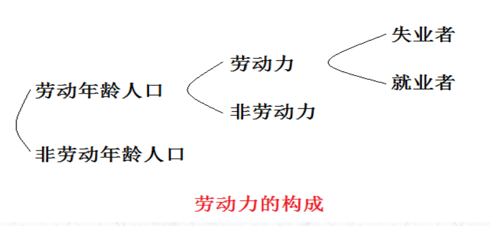
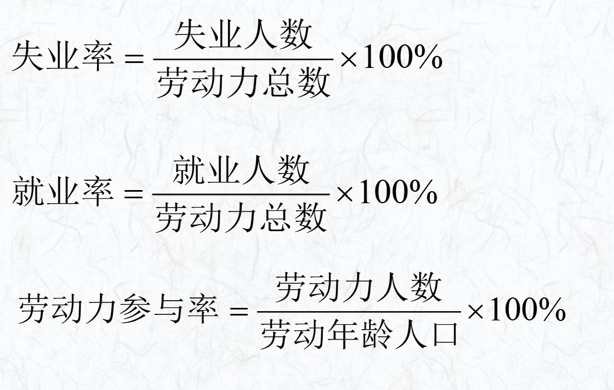

- 失业率是衡量**经济健康程度**的一个指示器。失业率过高，意味着该国将有许多人不能养活自己，并且许多劳动者不能为国家产出作贡献。
- 失业率指标还可以用来衡量**企业雇用劳动者时面临的困难程度**。这一程度被称为**劳动力市场紧张程度**。

### 二、失业的简单分类
- 摩擦性失业：工人和工作之间的匹配过程所引起的失业。
    - 产生原因：在一个经济体中信息是不完全的，失业人员和职位空缺的雇主之间的信息在相互搜寻过程中需要花费一些时间。
!!! warning 
    摩擦性失业在一个经济体中总是存在的

- 结构性失业：指源于工人的   技能和特征与工作要的持续不匹配所引起的失业。
    - 一是在某一特定地区，劳动力市场上所需要的技能与劳动者实际供给的技能之间出现了不匹配的现象（职业不平衡）。
    - 二是劳动力供给和劳动力需求在不同地区之间出现了不平衡的现象（地区不平衡）。
!!! warning 
    结构性失业在某一地区中总是存在的
- 季节性失业：指由于季节性的气候变化所导致的失业。
    - 通常，季节性失业在冬季时增加，而在春夏时期减少。
!!! warning
    季节性失业在某一地区中总是存在的
!!! example 
    北方冬季寒冷建筑工人可能会失业
- 周期性失业：周期性失业又称需求不足性失业，是指一个经济周期内随经济衰退而上 升，随经济 扩张而下 降的波动性失业。
    - 当一个经济体中的总需求下降，进而引起劳动力需求下降时，周期性失业就出现了
    - 周期性失业是政府最为关注的失业，也是宏观经济学研究的主要失业类型。
!!! tips
    这是政府真正关注的失业

### 三、充分就业和自然失业率

#### 1. 当一个经济体中不存在周期性失业，所有失业都是摩擦性、结构性和季节性的，则该经济体达到了充分就业。
!!! warning
    充分就业状态下依然存在失业现象
#### 2. 充分就业情况下的失业率被称为自然失业率。
#### 3. 潜在GDP是指在  现有资本和 技术水平条件下，一个经济体在充分就业状态 下所能生产的GDP。反映 的是经济   处于充分就业时的实际GDP水平 。

### 四、失业的宏观经济学解释 
#### （一）古典经济学对失业的解释 
- 萨伊定理充分就业是一个始终存在的倾向
    - 只要有供给一定有需求
#### （二）凯恩斯对失业原因的解释
- 凯恩斯认为有效需求是不足的

1. **"有效需求理论"**：
    - 摩擦失业
    - 自愿失业：家庭条件优良，高福利国家失业会得到高救济金
    - 非自愿失业：努力找工作，但是就是找不到
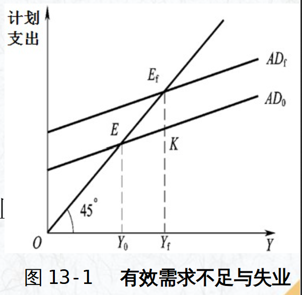
2. **三大基本心理定律** 

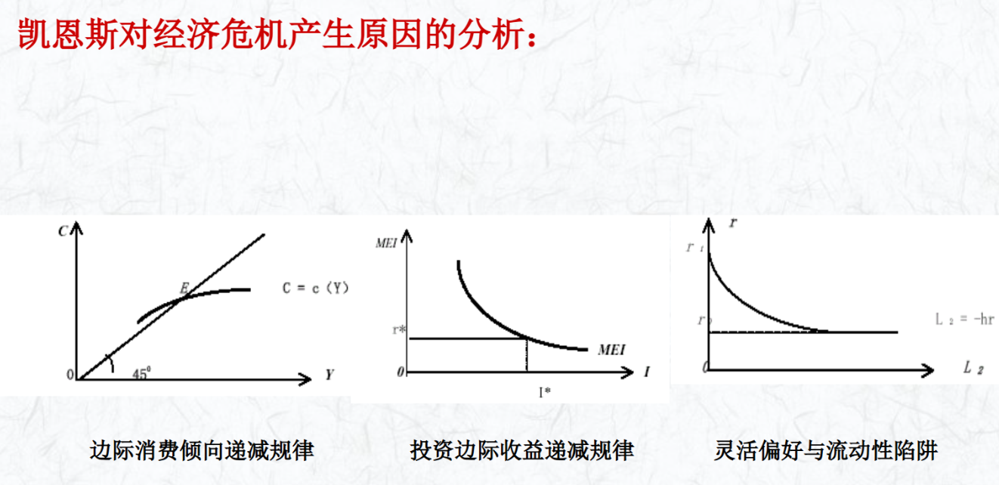
#### （三）新凯恩斯注意经济学对失业原因的解释
- 凯恩斯主义→工资和价格刚性假设
- 新凯恩斯主义→工资和价格黏性（U变动大，w变动小）

1. 劳动工资合同论

2. 隐含合同论：趋向于稳定的工资合同

3. “局内人-局外人”理论：已经在企业内的人和尚未进入企业的人，新员工工资不能超过老员工

4. 效率工资理论：适当开出高于市场价格的工资，以提高劳动力质量

#### （四）现代货币主义对失业原因的解释

“自然失业率”假说：在没有货币因素干扰的情况下,劳动力市场和商品市场的自发供求力量发挥作用时应有的、处于均衡状态下的失业率。

### 五、失业的影响和奥肯定律
#### （一）失业的影响
- 给个人和家庭带来物质和精神的负面影响
- 影响社会稳定
- 对经济带来负面影响
    - 增加经济运行成本：干活的人少、交税的人少，拿失业救济金的人多
    - 产出损失：劳动力与产出成正相关
    - 影响社会信心， 家中社会经济的不景气

#### （二）奥肯定律
- 该经验定律认为，在美国，如果失业率每高于自然失业率1个百分点，实际产出将会低于潜在产出的2%。
- 奥肯定律的表达式

$$
\frac {Y-Y_f}{Y_f}=-\alpha(u-u^*)
$$

其中Y为实际产出，$Y_f$为潜在产出，u为失业率，u*为自然失业率，$\alpha$为大于0的参数。

- 奥肯定律的另一种公式表达
$$
\frac{\Delta Y}{Y}=3\%-2\Delta u
$$

- 奥肯定律的结论
    - 在GDP没有达到充分就业水平时,实际GDP必须保持与潜在GDP同样快的增长速  度, 以防止失业率的上升。
    - 如果政府想让失业率下降, 那么, 该经济社会的实际GDP的增长必须快于潜在GDP的增长速度。

## 第二节 通货膨胀
### 一、一组物品价格的衡量问题
一个经济体所涉及的产品和服务数量众多，各种产品和服务的价格变化也千差万别 ，如何从总体上描述经济体中各种产品和服务的价格走向和趋势？

- 价格水平：是经济中特定范围 内的产  品和服务价格的总体水平，它是衡量货   币购买  力或货  币所能购买 的产品和服务数量的指标

### 二、衡量价格水平的主要指标

价格 指数是同一组产品和服务 在某一年的费用额同它在某一设定的基准年度（基年）的费用额的比率。

- 基年的指数通常定为100，如果以后该组产品和服务的价格上涨，则指数相应地上升。
!!! warning
    基年不是一成不变的
- 常用的价格指数有两个：GDP平减指数和消费价格指数

#### （一）GDP的平键指数公式

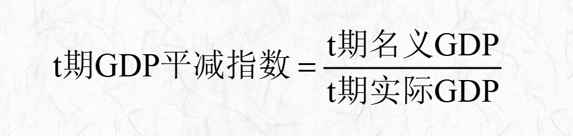

#### （二）消费价格指数(CPI) 

是对消费者购买一组固定的消费性性产品与服务所支付平均价格的度量指标

- CPI在某一时期被定义为100，这一时期称为基期
- 编制CPI包括以下三个步骤
    - 选定CPI商品篮子
    - 对商品篮子价格调查
    - 计算CPI
        - 计算在基期价格下“商品篮子”的费用额；
        - 计算在现期价格下“商品篮子”的费用额；
        - 计算基期和现期的CPI。

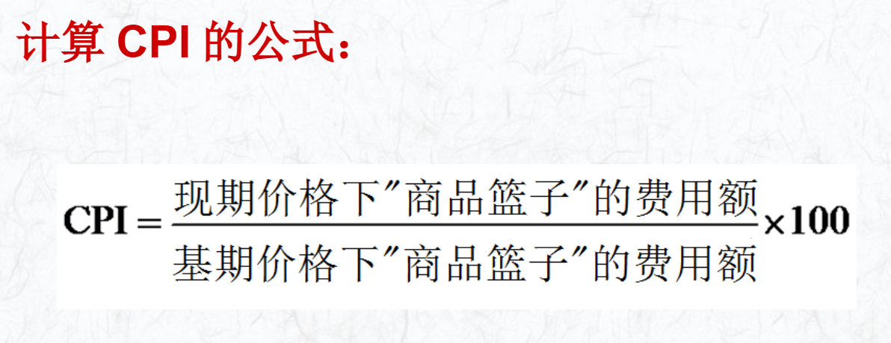

GDP平减指数和CPI的区别：

①GDP平减 指数衡量所生产的所有产品与服务 的价格，而CPI只衡量 消费者购买 的产品与服务的价格 。因此，企业或 政府购买的产品价格上升将反映 在GDP平减指数上，但并不反映在CPI上。

②GDP平减指数只包括国内生产的产品，CPI则包括在国 外生产，但在国内销售的产品。因此，日本制造并在美国 销售的丰田汽车的价格上升会影响美国的CPI，但并不影响美国GDP平减指数。

③CPI的权重固定(某个样本所占的比例)，GDP平减指数权重变动

#### （三）其他指数

消费物价指数(居民消费价格指数)：CPI

零售物价指数(商品零售价格指数)：RPI

> 不包括水、电、高速公路等费用，因为发达国家该费用变化相对较小，指数变化不敏感

个人消费支出平减指数：PCE

批发物价指数(工业品出厂价格指数)：WPI/PPI

- 同比=报告期数据/去年同期数据
> 反映大的变化方向
- 环比=报告期数据/上期数据
> 看出小的变化因素
### 三、通货膨胀的含义

在信用货币制度下，流通中的货币超过经济增长所需要的数量而引起的货币贬值和价格水平全面、持续上涨的经济现象

- 通货膨胀(物价指数)的度量
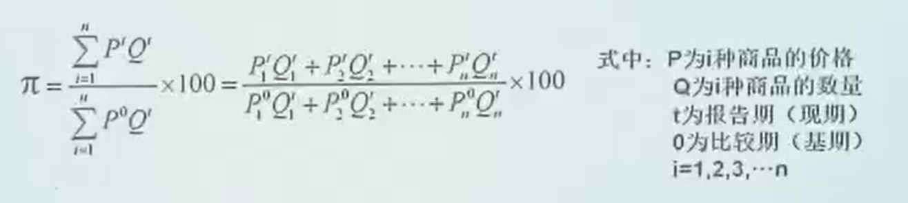

> 统计部门很难操作，只是理论值

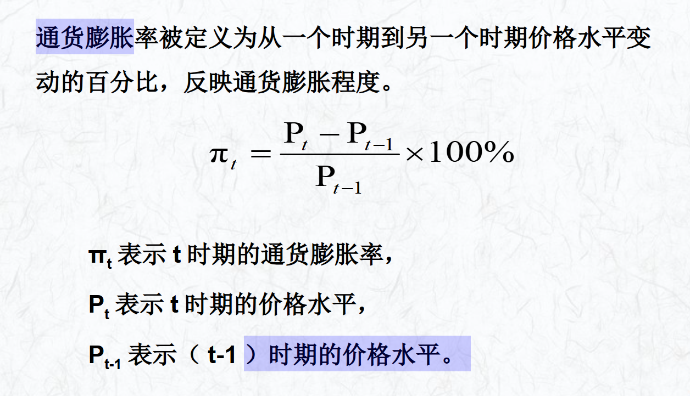

### 四、通货膨胀的类型和原因
#### （一）通货膨胀的类型
##### 1. 按价格上升的速度区分
- 温和的通货膨胀，年物价水平上升速率在6%以内
- 严厉的通货膨胀，年物价水平上升速率在6%~10%
- 奔腾的通货膨胀，年物价水平上升速率在10%~100%
- 恶性通货膨胀，年物价水平上升速率在100%以上(并不是严格定义)
##### 2. 按通货膨胀是否被(公众)预期区分
- 未预期性通货膨胀（低于6%）
- 预期型通货膨胀（高于6%）
##### 3. 按对价格的不同影响区分
- 平衡型通货膨胀，即每种商品的价格都按相同比例上升。
- 非平衡型通货膨胀，即各种商品价格上升的比例不完全相同。
##### 4. 按表现形式不同区分
- 公开型通货膨胀，指通过物价水平统计反映出来的通货膨胀。
- 隐蔽型通货膨胀，指没有通过物价水平统计反映出来的通货膨胀。
- 抑制型通货膨胀，指价格管制条件下，通过排队、搜寻、寻租等途径体现的通货膨胀
> 计划经济经常出现
##### 5. 按产生原因不同区分
- 需求拉上型通货膨胀
- 成本推动型通货膨胀
- 混合型通货膨胀
- 结构型通货膨胀

#### （二）通货膨胀的原因
##### 1. 需求拉上型通货膨胀

认为通货膨胀是总需求超过总供给所引起的一般价格水平的持续显著的上涨, 是“过多的货币追求过少的商品”的现象。

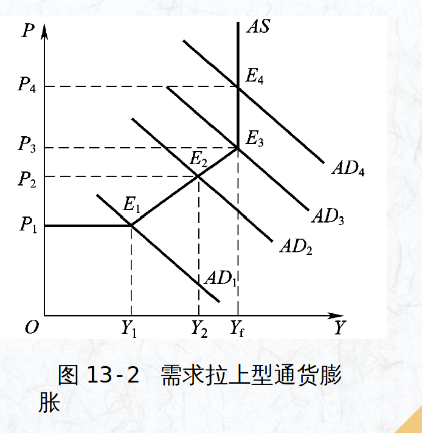

!!! note
    这种通货膨胀是不持续的

##### 2. 成本推动型通货膨胀

从供给方面来解释通货膨胀成因，认为在没有超额需求的情况下, 由于供给方面成本的提高也会引起一般价格水平持续和显著的上涨。

- 工资推动型通货膨胀
- 利润推动型通货膨胀
- 进口型通货膨胀：国外原材料大幅上涨

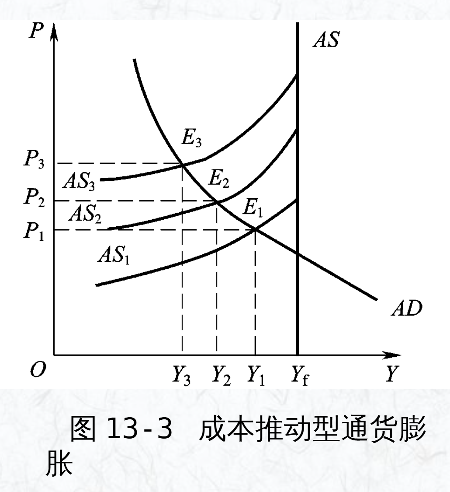

!!! note
    这种通货膨胀是不持续的

##### 3. 混合推进型通货膨胀
指需求拉动与成本推动相互作用形成的价格水平螺旋式（交替）上涨。下图常被用来说明混合型通货膨胀。

!!! example
    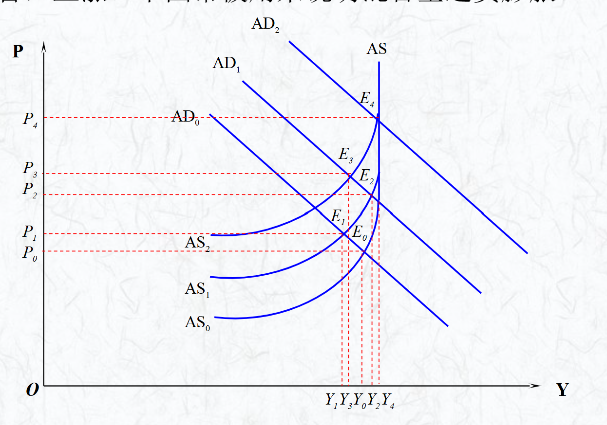

    - 工资需求增加，AS曲线上扬，价格水平增加
    - 工资增加导致总需求增加，AD曲线右移，价格水平继续上扬
    - 价格水平的上扬导致工资的进一步提升，AS继续上扬，价格水平也继续增加
    - 这形成了通货膨胀的内部动力

!!! note
    有惯性，内部存在通货膨胀的推动力，政府应该及早调控
##### 4. 结构性通货膨胀

结构性通货膨胀是指在总需求与总供给平衡状态下，由于经济结构因素变动导致的物价普遍持续上涨现象

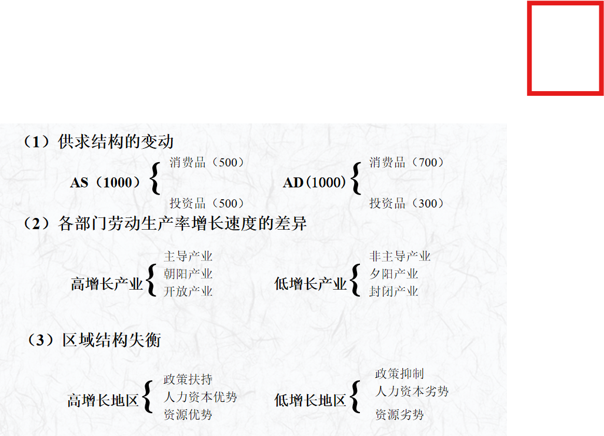

!!! note
    工资增长超过产出增长的部分一定会造成通货膨胀
    !!! example 
        假设存在两个生产率提高速度不同的部门：部门A和部门B,两部门的初始产量相等

        部门A情况

        - **生产增长率**：$\left( \frac{\Delta Y}{Y} \right)_A = 3.5\%$
        - **工资增长率**：$\left( \frac{\Delta W}{W} \right)_A = 3.5\%$
        
        **结果**：部门A的工资增长与生产率增长同步，不会导致一般价格水平上涨。

        部门B情况

        - **生产增长率**：$\left( \frac{\Delta Y}{Y} \right)_B = 0.5\%$
        - **工资增长率**（向部门A看齐）：$\left( \frac{\Delta W}{W} \right)_B = 3.5\%$

        全社会影响分析

        ### 全社会工资增长率
        $$
        \frac{\Delta W}{W} = \left[ \left( \frac{\Delta W}{W} \right)_A + \left( \frac{\Delta W}{W} \right)_B \right] \div 2 = 3.5\%
        $$

        全社会生产增长率
        $$
        \frac{\Delta Y}{Y} = \left[ \left( \frac{\Delta Y}{Y} \right)_A + \left( \frac{\Delta Y}{Y} \right)_B \right] \div 2 = (3.5\% + 0.5\%) \div 2 = 2\%
        $$

        通货膨胀率计算
        - **工资增长率超过生产增长率的幅度**：$3.5\% - 2\% = 1.5\%$
        - **结论**：这1.5%的差距即为价格上涨率或通货膨胀率

