# 第九章 宏观经济的基本指标及其衡量
## 第一节 国内生产总值及衡量
### 一、GDP的含义
1. 总产出核算的标准
- 两种不同的核算体系：
    - 物质产品平衡表体系，简称MPS。计划经济国家使用
        - 容易出现重复计算问题
    - 国民经济核算体系，简称SNA。
2. GDP的含义：指一定时期内在一国(或地区)境内生产的所有最终产品与服务的市场价值总和
> 越发达的地区，服务总产值所占比例越高
- GDP是一个市场价值概念
- GDP衡量的是最终产品和服务的价值，中间产品和服务价值不计入GDP
    - 最终产品直接供人们直接使用和消费，不在转卖
    - 中间产品作为生产投入品，不能直接使用和消费的产品的服务
    > 当我们买车时，轮胎就作为中间产品；而当爆胎需要补胎时，轮胎就是最终产品
- GDP是一国(或地区)范围内生产的最终产品和服务的市场价值
    - GDP强调国土原则，而不是按照过敏原则计算
- GDP衡量的是一定时间内的产品和服务的价值
    - GDP是***流量***而非存量
    -  流量是指一定时期内发生或产生的变量
    - 存量是指某一时点上存在的量
### 二、GDP的衡量
1. 增值法：是从生产角度衡量GDP的一种方法
    - 基本思想：通过加总经济中各个产业的产品和服务的价值来求得GDP核算值
    - $企业的增值=企业产出价值-企业购买中间产品价值$
    > 例如:假设一家麦当劳店以0.5美元的价格从一个牧场主手里购买了1/4磅的牛肉,然后以1.5美元的价格卖出一个汉堡包。在这个例子中,麦当劳店的增值是多少?
    >
    >> 1.5-0.5=1
    - GDP=该国境内所有企业的增值之和
2. 收入法：用要素收入即企业生产成本核算GDP的一种方法
- 以要素成本衡量的国内生成净值
    - 工资收入（存在雇主）：包括净工资和雇主支付的额外福利
    - 利息、租金和利润收入
        - 家庭所收到的对其资本支付的利息
        - 租金：对使用土地和其他可租用的生产要素的支付
        - 利润：企业利润以及自己经营企业的企业家收入
- 得到GDP需要做出的调整
    - 从要素成本到生产价格：间接税和补助金造成了支出法（市场价格核算）和收入法（以要素成本来核算）计算结果的差异
    - 从净产值到总产值：国内生产净值和总产值之间的差别在于折旧。收入法GDP核算中的企业利润是扣除资本折旧后的净值，以收入法得到GDP必须在总收入加上折旧
> 例如:根据增值法,汽车零售商的增值就是汽车销售收入和批发成本的差额,这些差额必定会成为某些人的收入。包括:汽车零售商支付给销售人员和技工的***工资、租金、贷款利息、利润***。这样,全部增值以***工资、租金、利息和利润***的形式出现在收入流中。严格来讲,以收入法核算GDP还应包括: ***间接税、折旧、公司未分配利润***等。
$$
GDP = 工资+利息+利润+租金+折旧+间接税-补助
$$
$$
GDP = C(消费)+S(储蓄)+T(税)
$$
$$
Y(收入) = C+S+T
$$
3. 支出法:通过衡量在一定时期内整个社会购买最终产品和服务的总支出来核算GDP的一种方法
- 在实际情况下，支出法与收入法核算产生的差额被称为统计误差
    - 一国经济对产品和服务需求的角度可以划分为四个部门：家庭部门、企业部门、政府部门、国际部门
        - 开放经济-四部门经济：家庭、企业、政府、国际
        - 封闭经济
            - 三部门经济：家庭、企业、政府
            - 二部门经济：家庭、企业

- 企业部门的支出称为投资支出，简称投资(I)：是一定时期增加到资本存量上的新的资本流量。资本流量是指在经济中生产性资本的物质总量（厂房、设备、存货和住宅等），是***企业在厂房、设备和存货上的支出与家庭在住宅上的支出之和***。
    - 资本存量的增加是投资的结果
    - 折旧：资本品的损耗造成的资本存量（指在经济中生产性资本的物质总量，包括所有的厂房、设备和住宅等）的减少，为了补偿或重新置换已消耗掉的资本。
    - 为补偿或重新置换已消耗的资本进行的投资称为重置投资
    - 重置投资=折旧
    - 使资本存量出现净增加的投资被定义为净投资
        - 净投资=当年年终资本存量-上年年终资本存量
        - 总投资=净投资+折旧
    - 固定投资：对新厂房、机器设备和住宅的购买
    - 存货投资：指企业持有的存货价值的变化。也就是企业为了未来销售或生产而持有的原材料、半成品和成品的库存。属于流动资产***当年存货投资=当年年终存货价值-上年年终存货价值***
- 家庭部门对最终产品和服务的支出被称为消费支出，简称消费(C)
    - 耐用品消费支出：汽车、电视等
    - 非耐用品消费支出：食品、服装等
    - 劳务消费支出：医疗、教育、旅游等
- 政府部门购买产品和服务的支出定义为政府购买(G)
    - 包括政府提供国防、修建道路、开班学校等
    - 政府支出包括政府购买和政府转移支付。但政府转移支付是对收入的再分配，并不直接用于交换产品和服务，所以不构成GDP的一部分
- 净出口：为衡量国际部门对一国产品和服务的支出引入的概念
    - 出口额(X)：是指本国向国际部门提供的产品和服务的总价值
    - 进口额(M)：是指从国际部门输入到本国的产品和服务的总价值。
    - ***对国际部门来说。只有净出口应计入总支出***
    - 净出口=出口额-进口额(NX=X-M)
        - 当NX>0时，一国经济存在贸易盈余或贸易顺差
        - 当NX=0时，一国经济达到贸易平衡
        - 当NX<0时，一国经济存在贸易赤字或贸易逆差
        $$
        GDP=C+I+G+NX
        $$
        $$
        Y=C+I+G+NX
        $$
    - 从广义角度看，宏观经济中的产出、收入与支出是完全等值的，即：总产出=总收入=总支出
## 三、名义GDP与实际GDP
1. 名义GDP：用生产产品和服务的当年价格计算的全部最终产品和服务的市场价值
    - 用于反映当年经济规模
2. 实际GDP：选定某一时期作为基期，然后以基期价格核算出的某年所生产的全部最终产品和服务的市场价值
    - 反映实际经济增长
> 2023 年：生产了 100 个苹果，每个苹果的价格是 1 元。名义 GDP = 100 元，实际 GDP = 100 元。2024 年：生产了 110 个苹果，每个苹果的价格是 1.2 元。
- 将一国某一年的实际GDP除以该国人口数，可得到该国该年的人均GDP。
    - 人均实际GDP既可以被用来纵向比较一国经济在不同时期的发展状况，又可以用来横向比较不用国家的生活水平差异

$$
实际GDP=\frac{名义GDP}{GDP折算指数}
$$
3. 购买力平价(Purchasing Power Parity)
- 以实际购买力计算的两个国家不同货币之间的比例，简称PPP
- 计算方法：选取典型的商品与劳务作为比较样本，再用两个国家不同的货币与市场价格分别加权计算样本的价格总额，价格总额的比例就是体现两国货币实际购买力的换算率，即购买力平价
> 如果中国市场上用人民币购头大米为每吨2000元、猪肉
为每吨10000元、29英寸彩色电视机为每台8000元、2.8立升排、气量的轿车为每辆100000元、购买价格总额为120000元;美国市场上用美元购买大米为每吨4000元、猪肉为每吨20000元、29英寸彩色电视机为每台1000元、2.8立升排气量的轿车为每辆5000元,购买价格总额为30000元。那么按购买力平价计算的美元与人民币的换算比例应为1美元=4元人民币。
### 四、与GDP相关的其他指标
- 国民生产总值(GNP)，是经济社会(一国或地区)***成员***在一定时期运用生产要素所生产的全部最终产品和服务的市场价值
> GNP强调人的属性，而GDP强调属地原则
> 一名中国公民在美国有一处房产，每年收缴的租金属于中国的GNP而不属于美国的GNP
- 使用GDP不使用GNP的原因：
    - GNP提供的产品和服务对象，解决就业问题是所在地的，而对成员所属的经济社会没有实际意义
- GNP=GDP+来自国外的要素报酬-支付给国外的要素报酬
- GNP或GDP
    - 减折旧（存量）等于国民净产值(Net National Product(NNP))或国内净产值(Net Domestic Product(NDP))：$NNP=GNP-折旧$
    - 减间接税(不是成员本身交的税)等于：国民收入（National Income（NI））$NI=NNP-统计误差$
    > 统计误差的产生是由于不同数据来源可能并不是完全一致的
    - 减公司未分配的利润、公司所得税、社会保险税；加转移支付(政府按照一定用途给予的)，等于：个人收入Personal Income（PI）
    - 减个人所得税等于：个人可支配收入Diposable Personal Income（DPI）

## 第二节 消费、储蓄、投资、政府购买与净出口
### 一、消费和储存
#### （一）消费函数和消费倾向

消费是总需求中主要的和的最大的部分

消费需求也是决定均衡国民收入的所有因素中最重要的因素

1. 消费和消费函数
- 消费：一个国家或地区一定时期内居民个人或家庭为满足消费欲望而用于购买消费品和劳务的所有支出
- 消费函数：指消费支出与决定消费的各种因素之间的依存关系,收入与消费之间的这种数量关系就是消费函数，即凯恩斯认为，在收入和消费的关系方面，存在着一条基本的心理规律，即，随着人们收入的增加，他们二等消费也会增加，但是消费不如收入增加得多$\frac{dC}{dY}>0,\frac{d^2C}{d^2Y}<0$

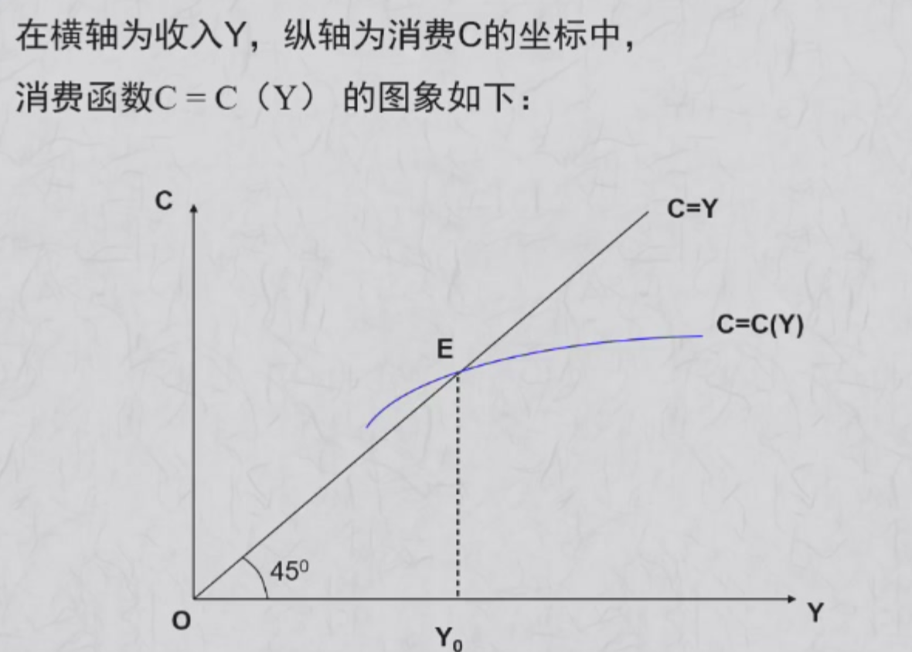

> 影响居民个人或家庭消费的因素很多，如收入水平、消费品的价格水平、消费者个人的偏好、消费者对其未来收入的预期。甚至消费信贷以及利率水平等等，但其中最重要的无疑是居民个人或家庭的收入水平。因此，宏观经济学假定消费支出与人们收入水平存在着稳定的函数关系：$C=C(Y)$

如果消费与收入之间存在线性关系，可以表示为$C=\alpha +\beta Y$
- $\alpha$作为一个常数，在宏观经济学被称为自发消费，其含义是，居民个人或家庭的消费中有一个相对稳定的部分，其变化是不受收入水平的影响。即使可支配收入为0时，消费者举债或者使用先前的储蓄也必须有的基本生活消费
- $\beta Y$在宏观经济学中被称为引致消费(也就是可支配收入引起的消费)，是居民个人或家庭的消费中受收入水平影响的部分，其中$\beta$作为该函数的斜率，被称为边际消费倾向，其含义是增加单位可支配收入由于消费的比例

- 长期消费函数
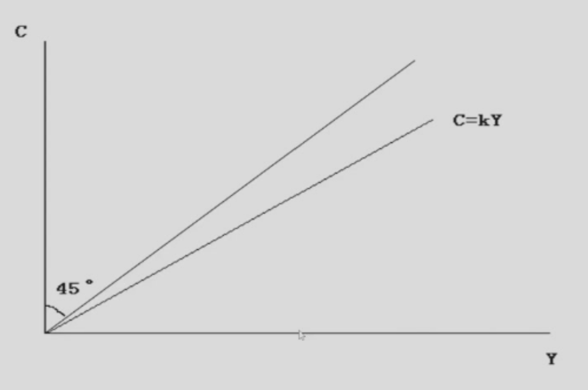

2. 平均消费倾向(APC)
- 任意一个收入水平消费支出占可支配收入的比例叫做平均消费倾向，其公式为$APC=\frac{C}{Y}$
- 平均消费倾向也可以理解为某一时期内总消费支出与总收入之比。一般来说，平均消费倾向是随收入增长而趋于下降的
- 其几何表示为消费函数曲线上相应点与原点连线的斜率
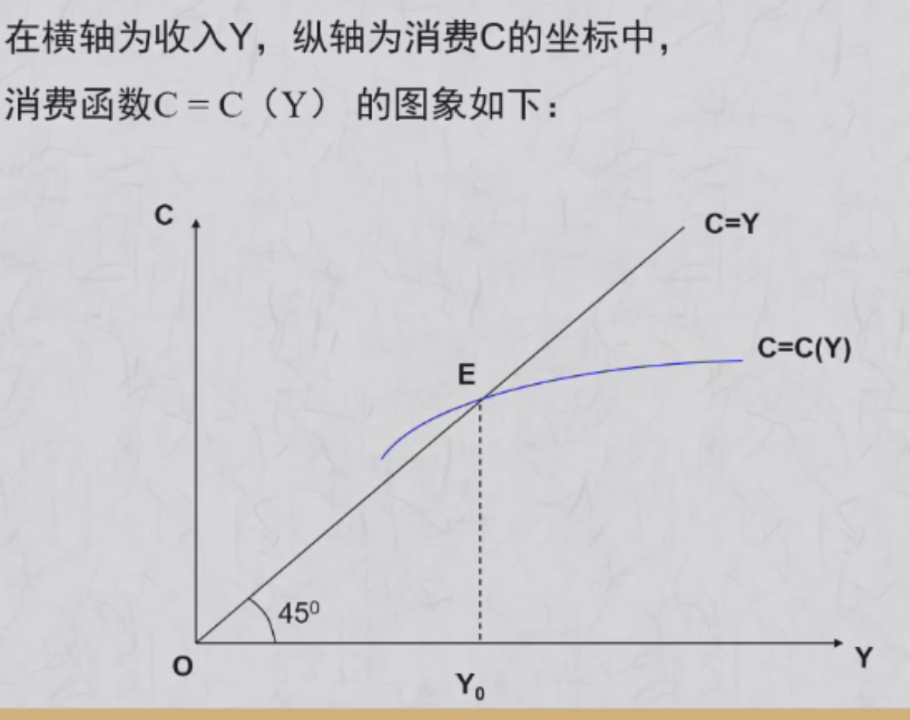
- 交点表示可支配收入全部用于消费

3. 边际消费倾向(MPC)

每增加一个单位收入中用于消费部分所占比例为边际消费倾向。其公式是
$$MPC=\frac{dC}{dY}$$

其几何表示为，消费函数曲线上相应点切线的斜率。一般来说，边际消费倾向也是随收入增长而趋于下降的。其含义与上面提到的$\beta$含义是相同的

#### （二）储蓄函数和储蓄倾向
1. 储蓄和储蓄函数
- 储蓄：收入中没有被消费的函数。储蓄的大小不仅可以反映消费量的大小，也可以在可支配收入既定情况下影响消费量
- 储蓄函数：指储蓄与决定储蓄的各种因素之间的依存关系
- 影响因素：收入水平、财富分配状况、消费习惯、社会保障体系的结构、利率水平等，但其中最重要的是居民个人或家庭的收入水平。因此，宏观经济学假定储蓄与人们收入水平存在着稳定的函数关系 。以S代表储蓄，Y代表收入，可以用公式表示为：$S=S(Y)$(满足条件：$\frac{dS}{dY}>0,\frac{d^2S}{d^2Y}>0$)

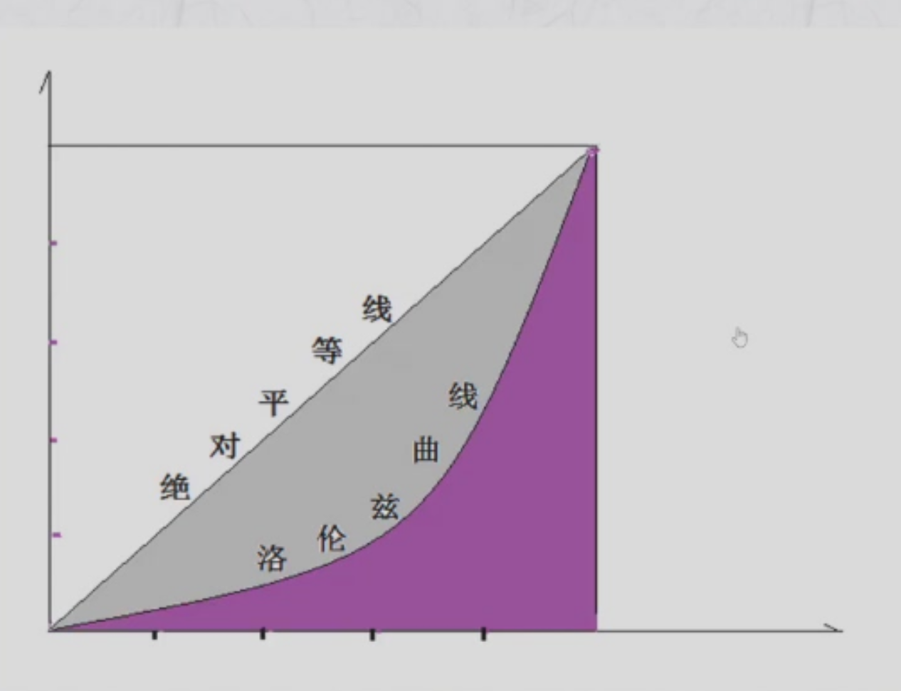

- Gini系数：灰色面积所占比例，在0和1之间。等于1时绝对不公平，等于0时绝对公平

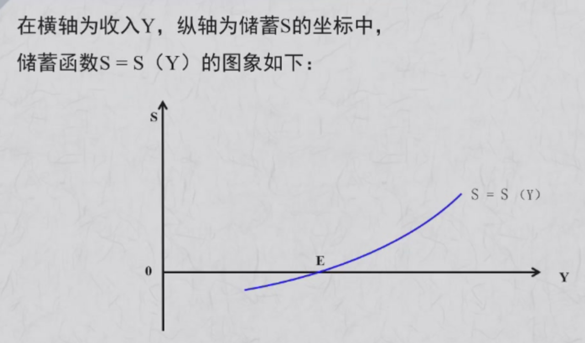

2. 平均储蓄倾向

平均储蓄倾向：任一收入水平储蓄所占的比率，其公式为：$APS=\frac{S}{Y}$

储蓄曲线上任意一点与原点连线的斜率，就是平均储蓄倾向

3. 边际储蓄倾向

边际储蓄倾向：储蓄增量对相应的可支配收入增量的比率。其公式为：$MPS=\frac{dS}{dY}$

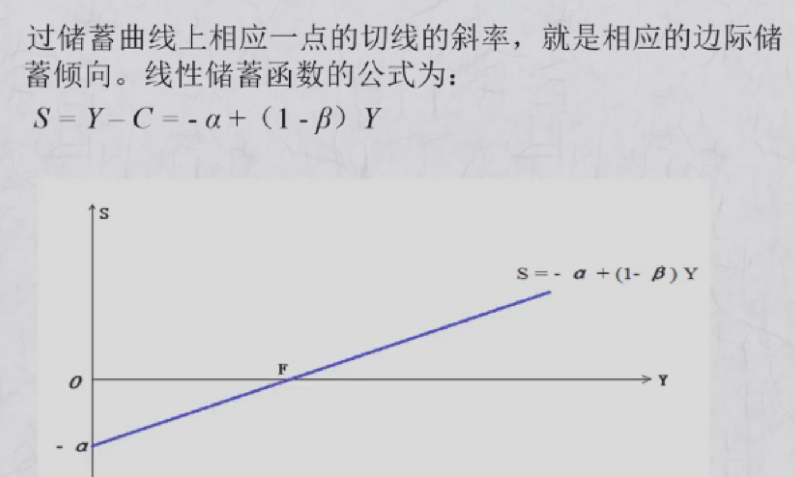

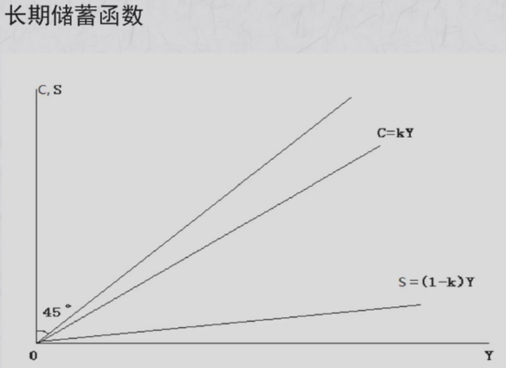

#### （三）消费函数和储蓄函数的关系

储蓄函数和消费函数、储蓄倾向和消费倾向是两组对偶的变量和概念

在收入既定的条件下，二者互为对放在总收入中的余量；或者说二者是互补的

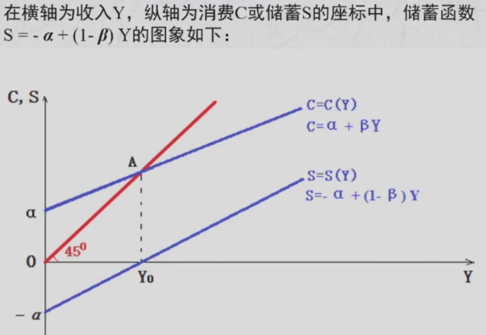

- 消费函数和储蓄函数互补，即二者之和与其相应的收入相等(在不考虑政府情况下)
- 当APC和MPC都随收入增加而递减时，APC>MPC；当APS和MPS都随收入增加而递增时，APS< MPS
- APC和APS之和，MPC和MPS之和都恒等于1。也就是说消费甘薯和储蓄函数只要有一个被确定，那么另一个也会随之被确定

#### （五）影响消费的其他因素及其对相关政策效果的影响

可支配收入是影响消费的最重要的因素，但是可支配收入变动并非是影响消费的全部因素。

1. 影响消费的其他因素

（1）利率

- r增加S增加 替代效应，低收入群体
- r减少S增加 收入效应，高收入群体(固定S)
    - 储蓄较多，选择将资金取出进行消费
> 多数情况下替代效应影响较明显
（2）价格水平（价格水平的变动）

- P增加Y减少 如果C不变 $\beta$增加(APC增加)
- P减少Y增加 如果C不变 $\beta$减少(APC减少)

（3）收入分配的平均程度

- 国民收入分配越平均，全国性平均消费倾向就越大
- 收入分配越不平均，全国性平均消费就会越小

（4）预期
- 人们可以运用所有可以得到的信息做出对未来消费的适当预期

2. 影响消费的其他因素对相关政策效果的影响
- 实际资本存量
- 名义基础货币
- 公债数量

#### (六)其他消费理论
1. 现期收入假定下的消费函数理论
 
（1）绝对收入假说：

（2）相对收入假说

消费者会根据自己过去的消费习惯以及周围人们消费水准 的影响来决定 自己的现期消费水平

- 示范效应：消费者的消费行为会受周围人们消费水准的影响
- 攀比效应：低收入者消费向高收入者看齐
- 棘轮效应：顾及社会上的相对地位还有“爱面子的考虑”，导致消费水平的降低比较有限

> 不仅会受到收入影响，还会受到身边群体的影响

2. 恒久收入假定下的消费函数理论 

弗里德曼的消费函数理论：（一种前向预期的消费理论，不同于凯恩斯只着眼于当前可支配收入）

- 恒久收入的含义：恒久收入是消费者可以预计到的长期可支配收入。与暂时性收入不同，恒久收入反映了消费者对未来收入的长期预期，而不是短期或者一次性的收入波动

- 消费者的消费支出主要由恒久可支配收入水平决定
$$
Y_t^P=θ⋅Y_t+(1−θ)⋅Y_{t−1}^P
$$
- $Y_t$是当前可支配收入
- $Y_{t-1}^p$是上一期可支配收入
- $\theta$是一个权重系数，表示当前收入对恒久收入的影响程度 

> 当期收入增加并不一定会引起恒久收入的增加

- 根据这种理论，如果政府想通过增减税收来影响总需求，那么将是不可能完全奏效的，因为人们由于减税而增加的可支配收入并不会立即被全部用于增加消费。

3. 生命周期假说的消费函数理论

$$
C=\alpha W_R+\beta Y_L
$$
- $W_R$代表实际财富，$Y_L$是可支配工作收入
- $\alpha$代表财富的边际消费倾向，即每年消费掉的财富比例；$\beta$代表可支配工作收入的边际消费倾向

- 生命周期消费函数理论与恒久收入消费函数理论的不同:侧重点不同，前者侧重于储蓄动机以及财富的作用，后者侧重个人的预测与计划
- 相同点：
    - 消费函数不仅限于与现期收入相联系
    - 暂时和偶然的收入变化对消费倾向影响小
    - 临时性税收政策对消费影响小 

### 二、投资
#### （一）投资和资本边际效率
1. 投资的经济学含义：实业投资与金融投资的区别(购买证券、土地在宏观经济学角度下不属于投资)：社会资本的形成(厂房、机器设备与存货、新住宅建设)
- 宏观经济学意义上的投资是实体经济层面上的投资，也就是社会资本的获得
> 购买上市公司上市的第一支股票属于投资，因为企业会利用其购买社会资本
- 投资的利益权衡：投资收益$\ge$投资成本

- 由于资本品的损耗造成的资本存量的减少称为折旧，为补偿或重置已消耗掉的资本进行的投资，称为重置投资
- 使资本存量出现增加的投资被定义为净投资

> 一个国家固定资产一千亿，一年折旧掉80亿，政府投资200亿。年终资本存量为1120亿，净投资是120亿，总投资是200亿

2. 资本边际效率：是一种贴现率，它能够正好使一项资本品在其使用期内各个预期收益的现值之和等于这项资本品的供给价格或重置成本

> 贴现：将未来的资金或收益折算为当前价值的过程，核心思想是未来的钱不如现在的钱值钱，因为现在的钱可以用于投资或消费从而产生额外的收益
- 贴现率=资本边际效率=预期收益率

- 包含资本边际效率（这里就是利率），的资本现值的公式:

$$
R_0=\frac{R_1}{1+r}+\frac{R_2}{(1+r)^2}+...+\frac{R_n}{(1+r)^n}+\frac{J}{(1+r)^n}
$$
- $R_0$代表资本品的供给价格，也就是资本在不同时期预期收益的贴现值
- $R_1...R_n$代表不同年份(或时期)的预期收益
- J代表该项资本品在n年年末的报废价值
- r代表利率，也就是贴现率，也就是资本边际效率 
如果按照投资的原则，边际收益等于边际成本：资本边际效率=利率

资本边际效率的曲线

- 含义：一笔投资可选择的所有项目的集合
> 预期收益率越高，投资量越小

- MEC曲线：表示在不同资本存量水平下，资本的边际效率如何变化。
    - MEC：指 新增一单位资本 的预期收益率。它反映了企业对现有资本存量的预期回报率。

例如，一家工厂增加一台新机器，MEC 就是这台机器未来带来的预期收益与成本的比率。
- MEI曲线：表示在不同投资水平下，投资的边际效率如何变化。
    - MEI：新增一单位投资 的预期收益率。它反映了企业对新增投资的预期回报率。

例如，企业决定增加投资购买新设备，MEI 就是这笔投资未来带来的预期收益与成本的比率。

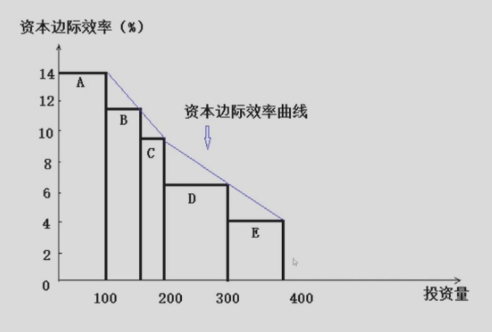

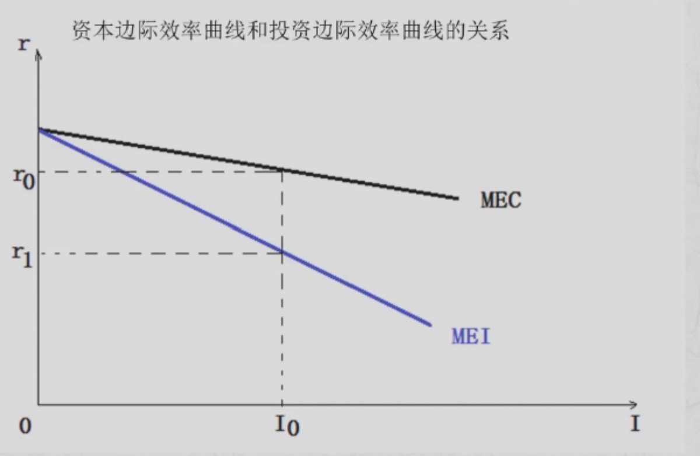
- 投资是存在竞争的，预期收益率会降低
- MEI会低于MEC的原因：投资是存在竞争的，投资会在竞争中增加。比如原有资本价值300万美元的机器需投资高于300万
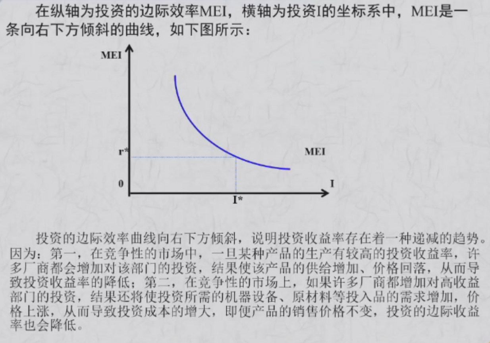
- 向同一个领域追加投资会导致产品同质化，产品利润被压缩

- 利率成为了投资的天然屏障

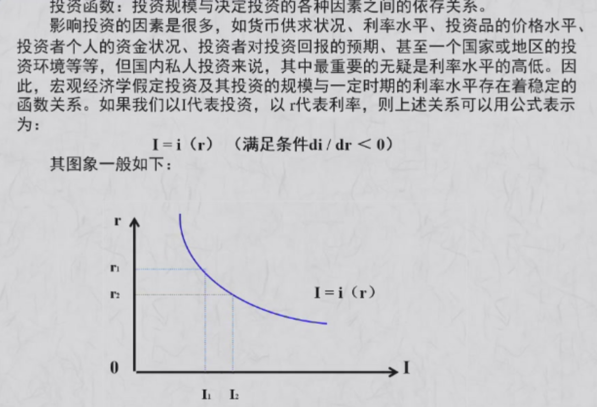
- 投资函数的二阶导数是不确定的
- 坐标系中利率为纵坐标，投资为横坐标。
- 遇到利率、价格水平、汇率水平时，横纵坐标的方向是反的

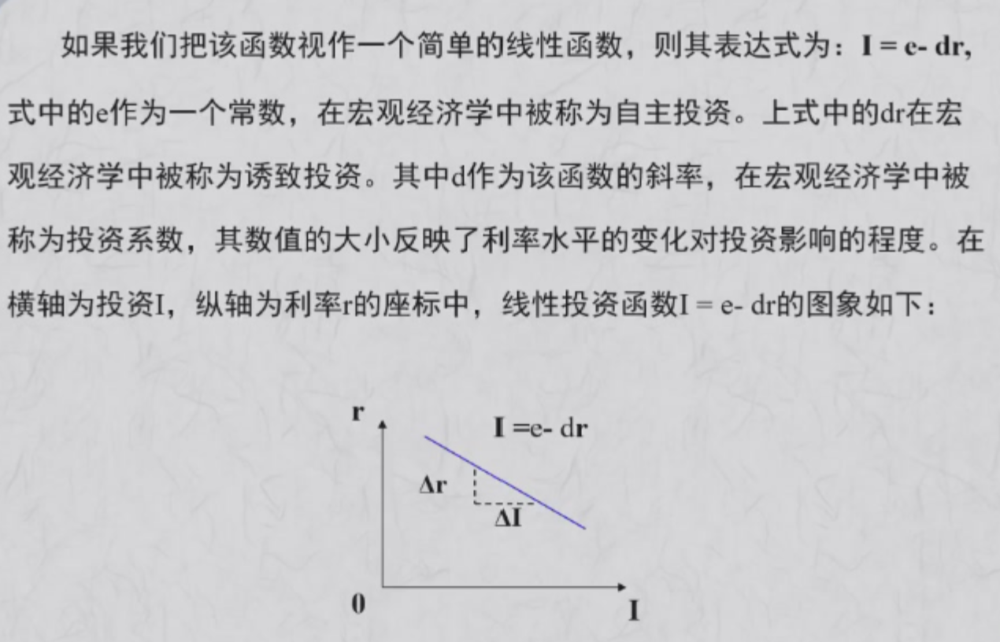
- 投资系数一定是大于0的

- 比较静态分析：慢慢逼近显示的方法，保持自变量不变，参数发生变动

- 经济衰退降低利率可以使投资增加从而增加收入
- 两部门经济中政府投资是不会考虑利率的，对利率不敏感；国外部门进入也属于自主投资

- 延伸拓展：曲线的平移与旋转(比较静态分析)：投资函数常数项的变动，逐渐向现实情况逼近

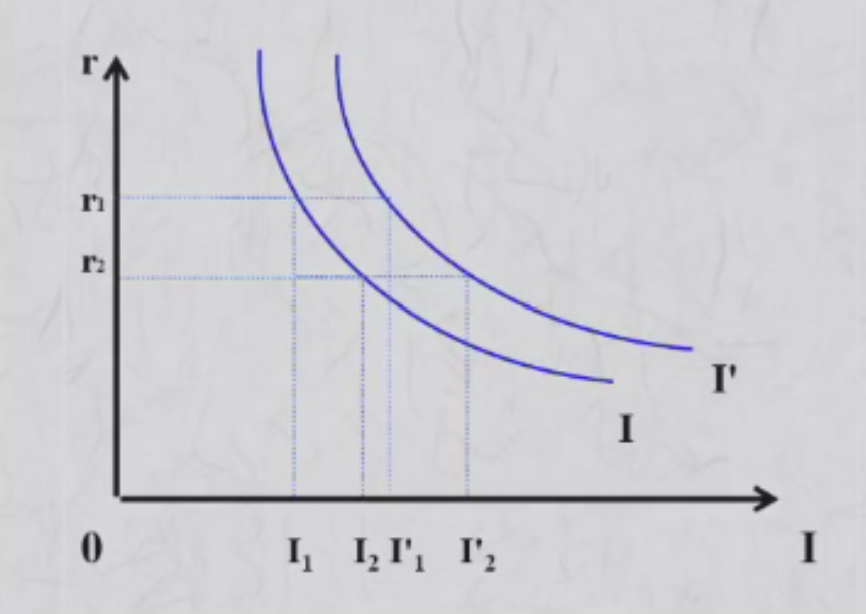
> 自主投资变化
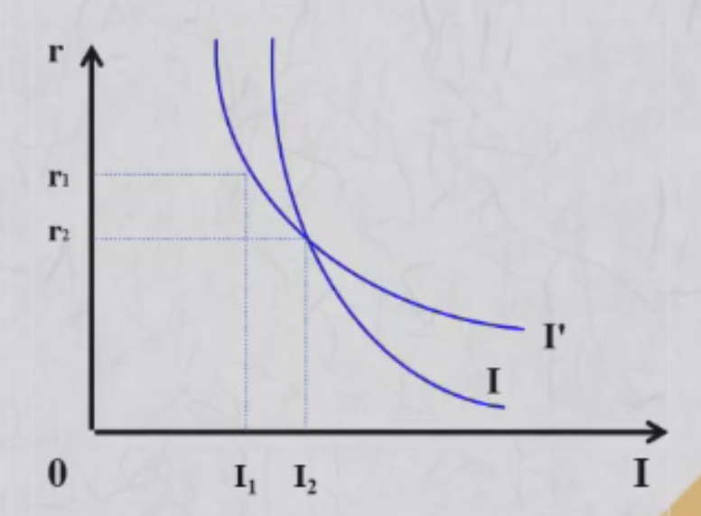
> 投资系数变化。改革开放前计划经济，对利率极其不敏感，图像更陡

- 利率越低，投资越高，促进消费

#### (四)托宾的q理论
1. 公式：
$$
q=\frac{企业的股票市场价值}{新建造企业的成本(或重置成本)}
$$
2. q小于1时，买旧企业比新建企业便宜，这时就不会有新投资。q大于1时，新建企业比购买旧企业更合算，所以会有新投资

- 优点：避免了投资的当前成本与未来收益的时间不一致问题
- 缺点：回避了股票市场价值的不正常和未来收益的不确定性
    - 只能说明个别企业的投资方式的选择，不能说明宏观投资问题
### 三、政府购买

1.  政府需求的构成（政府购买的内容）
    - 政府维持正常生活的消费需求
    - 政府公共投资和专项投资的投资需求

2. 政府对社会总需求的影响
- 直接购买支出的影响：直接影响社会总需求
- 税收的影响：增加或减少企业和个人的收入，从而影响他们的投资需求和消费需求
- 转移支付的影响：同样通过增加企业或个人的收入，从而增加消费需求
- 制度和政策的影响：具体经济制度和经济政策(如农产品补贴制度、鼓励出口的关税政策)都会影响到社会的总需求
### 四、净出口
#### （一）国外需求的决定因素

基本是外生决定的因素

1. 国外需求的大小取决于决定的因素

2. 国外需求的大小取决于消费倾向高低

3. 国外需求的大小取决于国外的消费结构

4. 国外需求的大小取决于本国出口商品的价格水平高低和产品的类型结构

5. 汇率：本国货币贬值会导致出口的增加，价格便宜更具有竞争力

6. 本国对外实际投资

7. 国际贸易中的竞争程度

8. 外国的贸易保护主义强弱

#### （二）净出口的决定
在开放经济中，本国对于国外的产出也有需求，所以，真正对本国总需求起作用的是本国的净出口

1. 净出口是本国出口额减去进口额之后的余额：NX=X-M(国外需求会被本国对外国产品和服务的需求抵消一部分升=甚至全部)

2. 宏观经济分析往往以国内需求为内生变量，本国对外国产品的需求越大，净出口相应地会减小，除非国外需求非常大

3. 进口倾向M/Y与边际进口倾向$\Delta M/Y$(进口倾向取决于国民收入与消费倾向，边际进口取向一定在0和\beta之间)

## 第三节 货币需求和货币供给

### 一、货币需求（83~87）

凯恩斯认为，由于货币对于不确定的经济环境具有最大的适应性和灵活性，所以人们对货币具有需求

货币需求是指人们出于各种目的而愿意持有的货币数量(包含已经持有的货币数量)

#### （一）货币需求的动机
- 交易动机的货币需求：企业或个人为了进行正常的交易活动而持有货币的动机
- 预防动机的货币需求：为预防意外支出而持有一部分货币的动机，与收入成正比
    - 第一类货币需求：交易动机的货币需求+预防动机的货币需求，主要取决于收入水平
    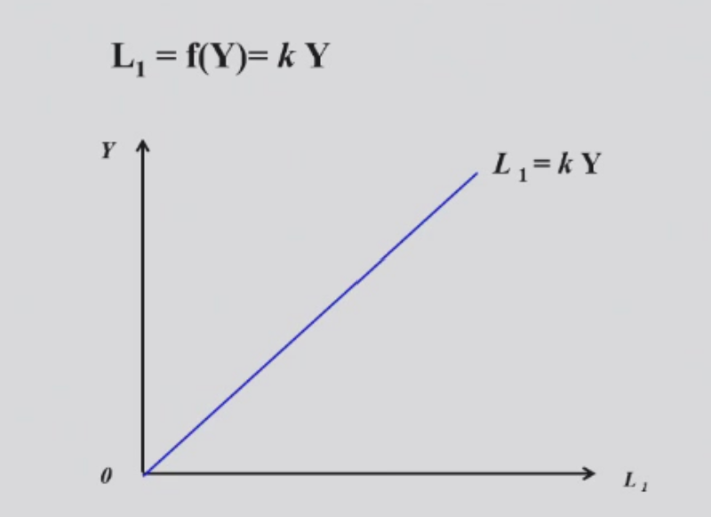
- 投机动机的货币需求：指人们为了抓住有利的购买有价证券的机会而持有一部分货币的动机，等待合适的购买时机。投机动机的货币需求与利率成反比
    - 利率下降到一定程度变为水平线，对货币的需求趋近于无穷大，主要取决于利率
> 投机动机的货币需求是符合低买高卖的需求
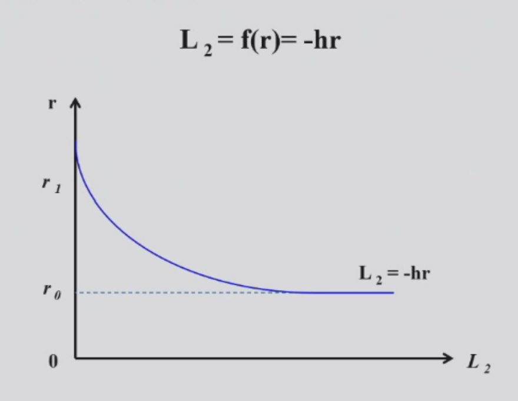
#### （二）流动性陷阱(凯恩斯陷阱)

- 流动性偏好：人们宁肯以牺牲利息收入二储存不生息的货币来保持财富的心理倾向

当利率下降到**社会公认的最低点时**，人们认为债券价格将会达到最高，于是全部抛出手中的债券而持有货币。这时**无论有多少货币，人们都愿意拿在手里，货币的需求变得极大**。
这种情况就是流动性陷阱

- 流动性通常用来指代现金货币
    - $M_0$=现金
    - $M_1=M_0+企业短期存款$
    - $M_2=M_1+企业长期存款+居民的储蓄存款$
    - $M_3=M_2+短期债券$
    - $M_4=M_3+长期债券$
    - $M_5=M_4+股票等金融资产$
    > 流动性逐渐减小
- 经济衰退越严重，越容易出现流动性陷阱
- 货币政策是有局限的，因为调整利率不一定会使投资有效增加，利率政策是有极限的，需要用财政政策解决
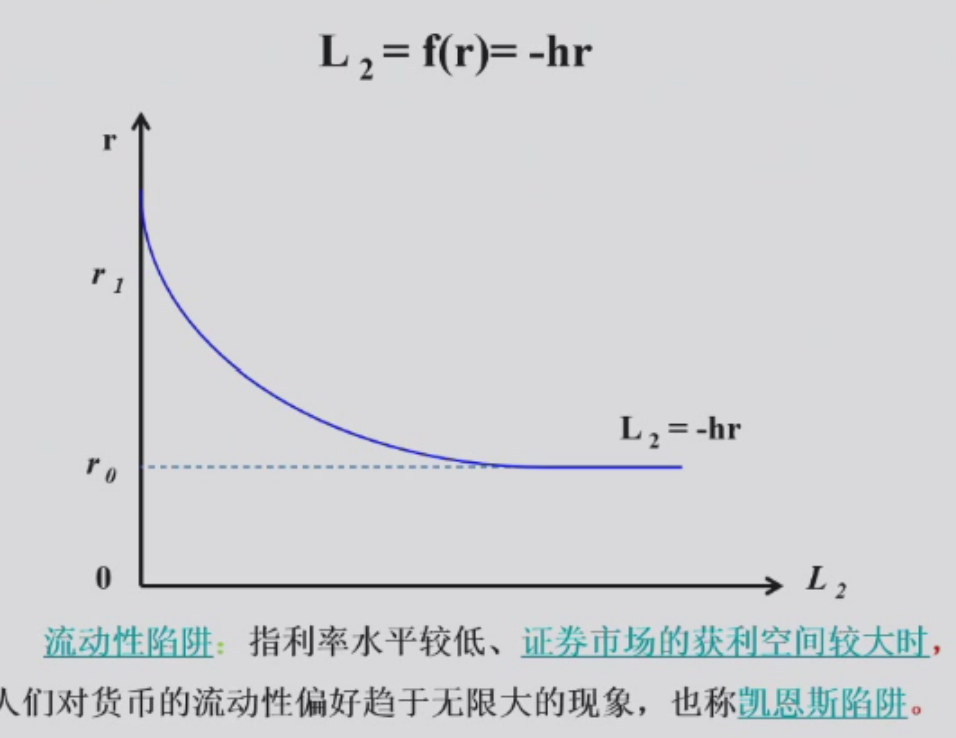

#### （三）货币需求函数

对货币的总需求是交易性需求、预防性需求和投机性需求的总和。

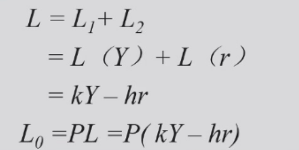
- 第一类货币需求为常数(不会随着利率的变化而变化)

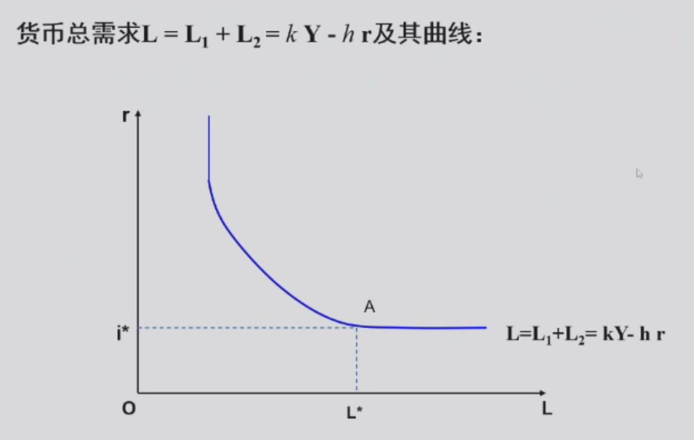

- L1,L2都是实际货币需求(衡量实际购买力)，即具有不变购买力的实际货币需求
> 名义货币是不管货币购买力如何而仅计算其票面值的货币量。把名义货币量折算成具有不变购买力的实际货币量，必须用价格指数加以调整，如用M,m,P依次代表名义货币量、实际货币量和价格指数，则实际货币量=名义货币量/价格指数
>
> 10年前3000元与3000元的名义货币量不变，实际货币量产生变化
### 二、货币供给（224~225）

- 货币供给是一个存量概念，它是一个国家在某一时点上所保持的不属于政府和银行的所有的硬币、纸币和银行存款的总和

1. 现金货币：由一个国家中央银行发行的货币

2. 存款货币：由一个国家商业银行经营活动创造的货币

> 本身是一个外生变量，与利率大小无关，受国家调控

3. 货币乘数

如果用M表示货币供给，H表示中央银行发行的现金，R表示准备金率，则
$$
M=\frac{H}{R}
$$

完整的货币(政策)乘数的计算公式是：
$$
k=\frac{R_c+1}{R_d+R_e+R_c}
$$

其中$R_d,R_e,R_c$分别代表法定准备金率，超额准备金率和现金在存款中的比率。而货币(政策)乘数的基本计算公式是货币供给/基础货币。货币供给等于通货(即流通中的现金)和活期存款的总和；而基础货币等于通货和准备金的总和

### 三、货币市场均衡（87~89）
#### （一）古典货币市场：古典经济学的利率决定观点
1. 古典的利率由资金借款市场上的供求均衡决定，而且资金的供给(储蓄)和需求(投资)都是内生的

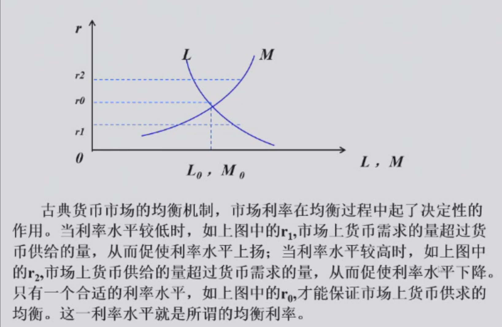

2. 此外，利率也会对资金的供给(储蓄)和需求(投资)进行调节

#### （二）现代货币市场：凯恩斯经济学的利率
1. 利率由货币市场的均衡来决定，当货币供给等于货币需求的时候，货币市场达到均衡

2. 只有货币需求是内生的
- 由经济体系内部的的因素决定，如收入、利率等

3. 货币供给是外生的（央行供给货币与利率无关），其大小与利率无关
- 由中央银行决定，不受利率或者其他经济变量的影响

> 在现代货币市场中货币供求的均衡完全是由政府控制的。政府可以根据自己的目的确定货币供应量的多少，并根据货币供应量的多少来调控市场的利率水平

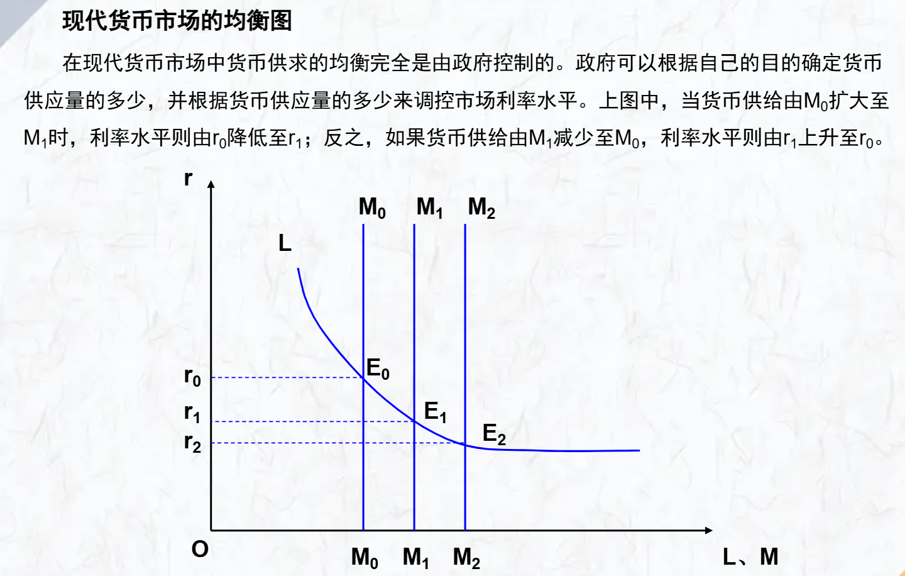

# 第十章
## 第一节 均衡国民收入的决定
### （一）一般所指的国民收入

国民收入在宏观经济学中是个泛指的概念：GDP、GNP、NNP、NI、PI都可以看作不同条件下的国民收入

但在通常情况下，国民收入一般指GDP

### （二）国民收入和国民财富的生产

国民收入和国民财富的含义既有一致性，也有区别。其区别主要在于

- 国民财富涉及**存量**角度，即涉及特定**时点**上的(已有商品和服务价值)数量
- 国民收入涉及**流量**角度，即涉及特定**时期**内的(发生价值)数量

### （三）国民收入和国民财富的分配

基本经济制度的作用：决定**国民收入和财富分配**的**基本立场和倾向**

**1. 初次分配和再分配制度的作用:**国民收入和财富初次分配按**要素**分配，再分配则服从于政府的**利益倾向和政治需要**
**2.相应政策的影响：**这是国民收入和财富再分配的一种具体形式

### (四)市场经济条件下均衡国民收入的决定原理：供给决定

**均衡国民收入**：是指总需求和总供给处于相等(均衡)状态时的国民收入

宏观经济学就是要研究和解决怎样使总需求适应总供给，或者怎样使总供给得到与总需求相适应的增长

宏观经济能否顺利达到均衡，不仅取决于总供给的数量匹配，也取决于宏观经济在各个环节上是否能够顺利进行。为此，就应该了解宏观经济的循环流程

- 封闭经济下宏观经济运行的循环流程图：简略表明三个市场(产品与服务市场、货币市场、劳动市场)和三个部门(企业家庭和政府)间的关系
    - 事前的均衡国民收入是意愿的(或计划的)和未实现的
    - 事后的均衡国民收入是已经实现的

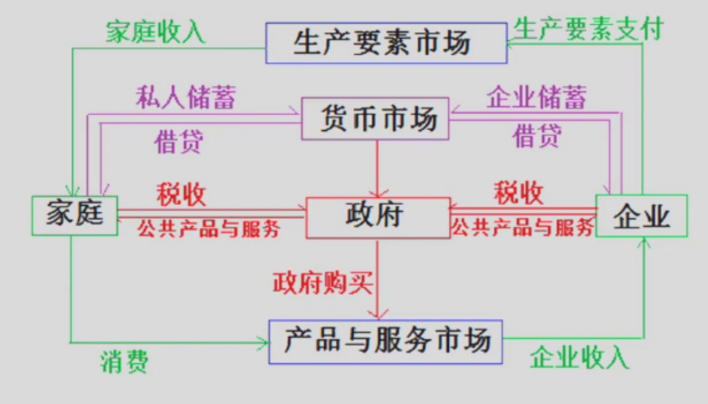

### 二、均衡国民收入决定的基本方向
#### （一）需求充分条件下的基本方向：均衡国民收入决定于供给

- 供给决定需求："萨伊定理"

1. 成立条件：市场上的供给普遍不足

2. 含义：**供给总是会创造出它自身的需求**。这意味着只要努力增加供给，需求自然就会增加，均衡国民收入也会增加，经济不会出现问题

3. 萨伊定律是信奉经济自由主义的古典经济学关于均衡国民收入决定的核心观点

- 萨伊定律的合理性和局限性，取决于其适应条件及其有限性
- 如果不讲条件地普遍运用，就会发生错误
#### （二）共计充分条件下的基本方向：均衡国民收入决定于需求
1. 经济萧条时失衡的特征：供给相对过剩，需求相对不足

2. 关键在于有效总需求的水平

3. 凯恩斯的观点：强调短期(短期均衡国民收入决定理论)
#### （三）一般观点：均衡国民收入由总需求和总供给共同决定
1. 新凯恩斯主义的观点是折中的，兼顾长期

2. 短期内主要由**有效需求水平**决定均衡国民收入水平

3. 长期内主要由**供给水平**决定均衡国民收入水平(强调萨伊定律在长期内的有效性)

### 三、两部门经济：有效需求的原理和框架
- 总需求(支出)：家庭的消费和企业的投资(向市场需求)
- 总供给(收入)：家庭的储蓄和企业的生产(给市场供给)

> 总需求/总供给属于事前概念：家庭和企业对市场有需求或需要向市场供给；支出和收入属于事后概念：为了向市场需求或供给需要进行存在支出和收入

#### （一）有效需求的原理
1. 在总供给均衡决定均衡国民收入原理基础上，强调短期内的供给过剩和需求不足(外生条件，也就是不受模型本身影响)

2. 强调总需求(有效需求)的决定性作用

3. 总需求(有效需求)由四个部分组成：消费需求，投资需求，国外需求，政府需求

#### （二）基本假设(两个部门一个市场)
1. 经济中只有居民和企业两个部门

2. 社会总能够以不变的价格提供适应需求的产品与服务；**凯恩斯定律**：有效需求总能得到相应的供给，而且社会需求的变动只会引起产量和收入的变动，不会引起价格变动

3. 社会上没有折旧和公司未分配利润

4. 只考虑短期--强调总需求的决定性作用

#### （三）凯恩斯主义交叉图

两部门经济中，均衡国民收入的决定原理可以表示为公式：Y=C+I

- 这个公式可以表明均衡国民收入的决定原理，也可以表明期望(计划)取得的均衡国民收入条件

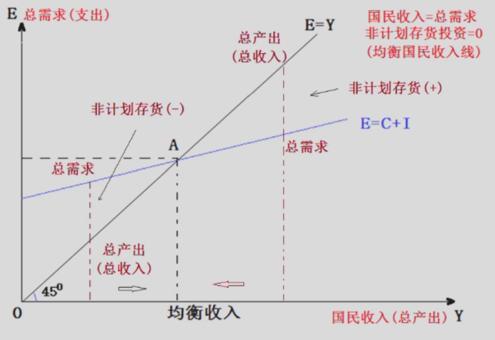
- I是常数，总需求的函数相当于消费函数的平移
- 实际产出=计划需求(支出)+非计划存货投资（可正可负）

> 宏观经济学中，提到Y，既表示总产出也表示总收入
#### （四）投资等于储蓄
- 根据两部门均衡国民收入决定条件(公式)可以推导出其另一种表达形式，即投资等于储蓄的均衡条件(公式)

$$
\because E=C+I,Y=C+S
$$

$$
\ S=I
$$
- 这里需要注意：计划的均衡条件与已经实现的均衡结果(恒等式)的区别

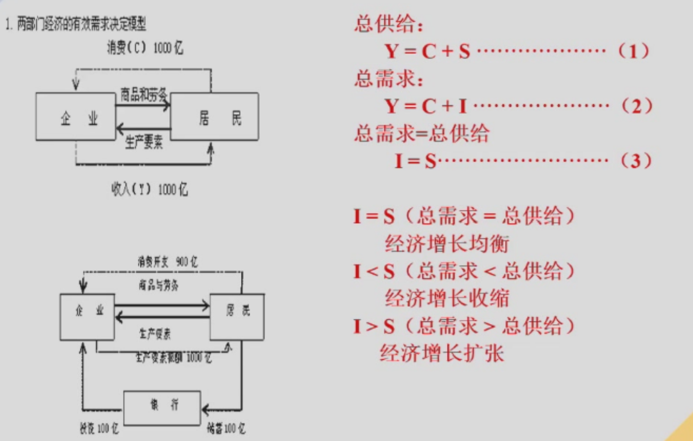
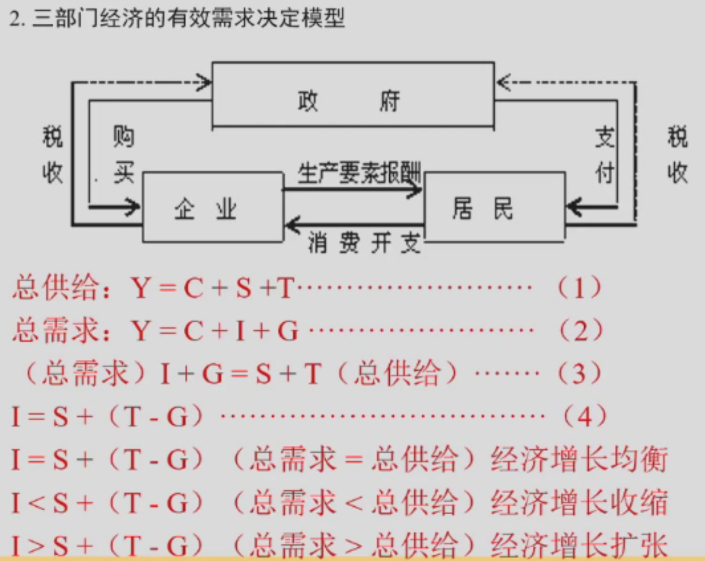
> I+G=S+T 经济学含义不明确，进行移项。增加政府财政赤字可以缓解经济衰退

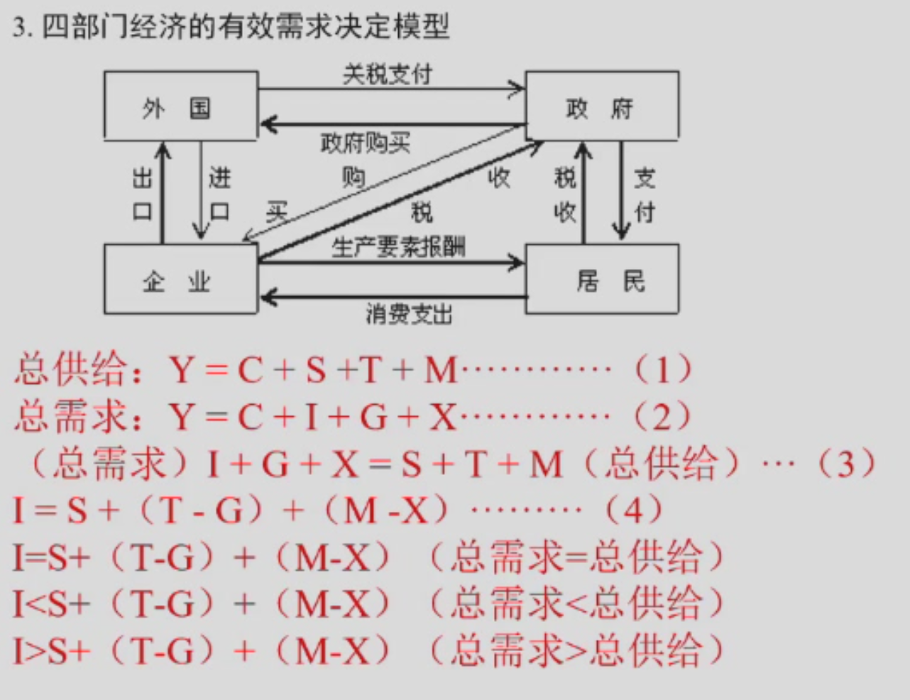
> 贸易顺差可以有效解决经济衰退的问题

## 第二节 影响需求的重要机制:乘数
### 一、支出乘数
1. 乘数是凯恩斯主义经济学的重要内容

2. 乘数是影响需求的重要机制(投资乘数+政府相关的乘数)

3. 乘数是凯恩斯主义有效需求理论的有力支撑点之一

### 二、投资乘数和乘数原理

投资乘数：投资乘数就是收入变化量与带来这个变化的投资支出变化量的比率$\frac{\Delta Y}{\Delta I}$

根据两部门经济的决定条件(假定有关函数是线性的)：Y=C+I($Y=\alpha + \beta Y$)

均衡国民收入决定的条件就是：$Y=\frac{\alpha + I}{1-\beta}$

推导出的投资乘数是$k_i=\frac1{1-\beta}$
- 单位投资变化引起的总产出水平的变化

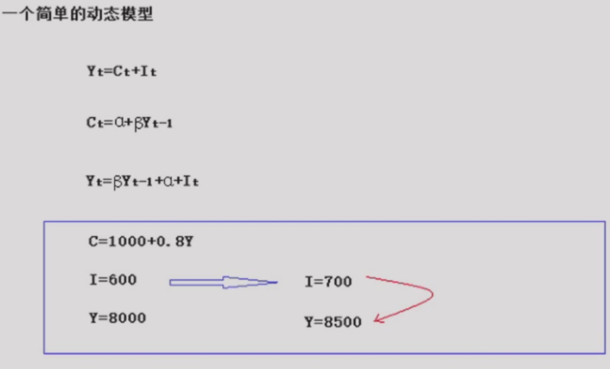

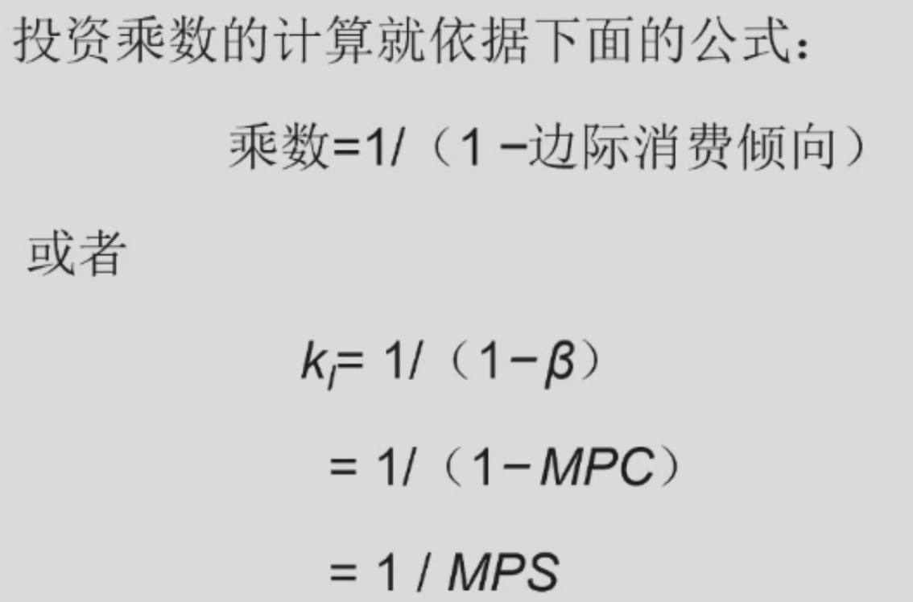

#### 三、政府相关的乘数

涉及三部门和四部门经济中的乘数，主要是Y=C+I+G 

其中$C=\alpha + \beta Y_d=\alpha+\beta (Y-T)$

则$Y=\alpha + \beta (Y-T)+I+G$

$$
Y=(\alpha + I +G-\beta T)/(1-\beta)
$$

$k_c=k_I=1/(1-\beta)$

##### (一)政府购买乘数
政府购买成熟的含义与推导
$$
k_G=\frac{\Delta Y}{\Delta G}=\frac{\Delta Y}{\Delta G}=\frac{1}{1-\beta}
$$

##### （二）税收乘数
税收乘数的含义与推导
$$
k_T=\frac{\Delta Y}{\Delta T}=\frac{-\beta}{1-\beta}
$$

##### （三）政府转移乘数
政府转移支付乘数的含义与推导

Y=C+I+G 其中$C=\alpha + \beta(Y-T+T_{tr})$

$$
Y=(\alpha +I- \beta T+\beta T_{tr})/(1-\beta)
$$

$$
k_{tr}=\frac{\Delta Y}{\Delta T_{tr}}=\frac{\beta}{1-\beta}
$$

##### (四)平衡预算乘数

- 含义：指正度支出和税后同时增加或减少相同金额时，国民收入的变化量与政府支出(或税收)变化量的比值

**平衡预算乘数**（Balanced Budget Multiplier）是宏观经济学中的一个概念，用于描述在政府预算保持平衡（即政府支出和税收同时增加或减少相同金额）的情况下，国民收入的变化情况。理解平衡预算乘数的关键在于分析政府支出和税收对经济的综合影响。

### 平衡预算乘数的定义：
平衡预算乘数是指政府支出和税收同时增加（或减少）相同金额时，国民收入的变化量与政府支出（或税收）变化量的比值。在简单凯恩斯模型中，平衡预算乘数通常等于1。

### 平衡预算乘数的推导：
1. **政府支出乘数**：
   - 政府支出增加会直接增加总需求，进而通过乘数效应放大对国民收入的影响。政府支出乘数$ k_G $通常大于1，具体取决于边际消费倾向（MPC）。
   - 公式：$ k_G = \frac{1}{1 - MPC} $

2. **税收乘数**：
   - 税收增加会减少居民的可支配收入，从而减少消费和总需求。税收乘数（\( k_T \)）通常为负，且绝对值小于政府支出乘数。
   - 公式：$ k_T = -\frac{MPC}{1 - MPC} $

3. **平衡预算乘数**：
   - 当政府支出和税收同时增加相同金额时，国民收入的变化是政府支出乘数和税收乘数的综合效果。
   - 公式：$ k_{BB} = k_G + k_T = \frac{1}{1 - MPC} - \frac{MPC}{1 - MPC} = 1 $

### 平衡预算乘数的经济意义：
- **乘数为1**：意味着政府支出和税收同时增加1元，国民收入也会增加1元。这是因为政府支出的增加直接刺激了总需求，而税收的增加虽然抑制了部分消费，但整体效果仍然是正向的。
- **预算平衡**：政府支出和税收的变化不会改变财政赤字或盈余，但会对经济产生扩张或收缩的影响。

### 举例说明：
假设政府增加支出100亿元，同时增加税收100亿元（保持预算平衡），且边际消费倾向（MPC）为0.8。

1. **政府支出增加100亿元**：
   - 通过乘数效应，国民收入增加：$100 \times \frac{1}{1 - 0.8} = 500 $亿元。

2. **税收增加100亿元**：
   - 通过税收乘数，国民收入减少：$100 \times \frac{0.8}{1 - 0.8} = 400 $ 亿元。

3. **净效应**：
   - 国民收入净增加：$ 500 - 400 = 100 $ 亿元。
   - 平衡预算乘数为1。

##### (五)对外贸易乘数

对外贸易乘数的含义与推导

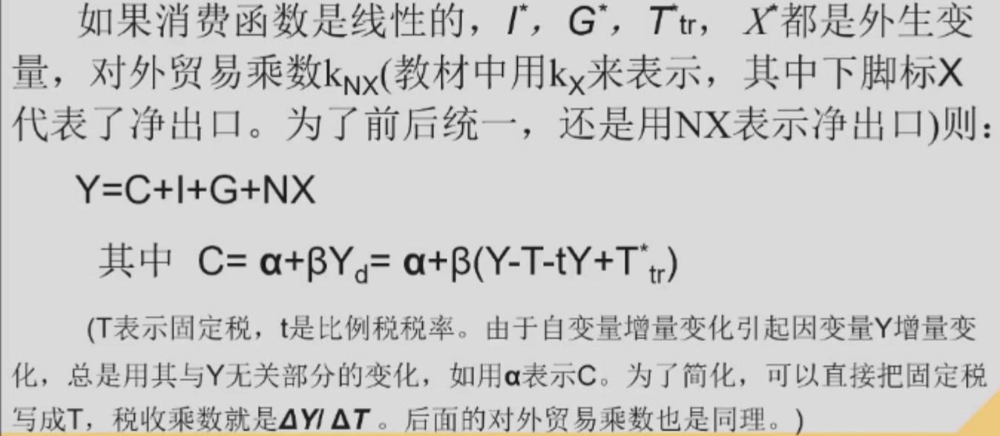
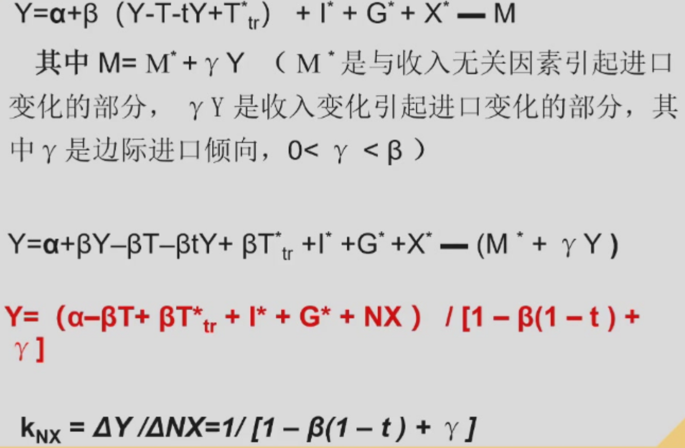

# 第十一章 国民收入的决定 IS-LM模型
## 第一节 产品市场的均衡：IS曲线
- IS-LM模型强调**短期**，假定物价水平既定不变
- IS-LM模型体现了凯恩斯强调总需求决定均衡国民收入的思想，长期以来它都被经济学界看作是凯恩斯有效需求理论的典型代表
- IS-LM模型涉及产品市场与货币市场

### 一、IS曲线的前提条件：产品市场的均衡

- 含义：当产品市场达到均衡的时候国民收入(y)和利率(r)之间的关系曲线 

IS曲线是以产品市场的均衡为前提的

价格对于经济的作用被忽略(这是符合凯恩斯理论原意的)

> IS曲线不再是投资是常数的理想情况
### 二、IS曲线的含义和推导
#### （一）IS曲线的推导：两种方法

1. 两部门IS曲线的数理推导
$$
I=S 
$$
$$
I=e-dr
$$

$S=-\alpha + (1-\beta)Y$

$$
r=\frac{\alpha+e}{d}-\frac{1-\beta}{d}Y
$$

$$
A=\frac{\alpha+e}{d},B=\frac{1-\beta}{d}
$$

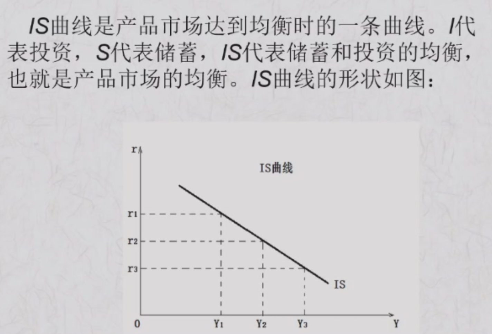

2. IS曲线的几何推导

- 利率-投资->投资-储蓄->储蓄-收入->利率-收入
- r->I->s->Y

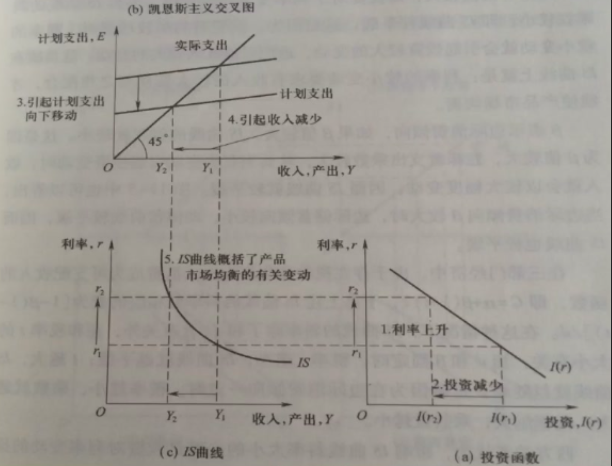

#### （二）IS曲线的经济含义

1. IS曲线是一条描述**产品市场**达到宏观均衡即I=S时，**总产出与利率**之间关系的曲线

2. 在产品市场上，总产出与利率之间存在着反向变化的关系，即利率提高时总产出水平趋于减少，利率降低时总产出水平趋于增加
>改变中间变量会使预期变化受到影响

3. 处于IS曲线上的任何点位表示$I = S$,即产品市场实现了宏观均衡。反之，偏离IS曲线的任何点位都表示$I \neq S$,即产品市场没有实现宏观均衡。如果某一点位处于IS曲线右边，表示$ I < S $,即现行的利率水平过高，从而导致投资规模小于储蓄规模。如果某一点位处于IS曲线左边，表示$ I > S $,即现行的利率水平过低，从而导致投资规模大于储蓄规模。

### 三、IS曲线的斜率及其变动
#### （一）IS曲线的斜率
$$
r=\frac{\alpha+e}{d}-\frac{1-\beta}{d}Y
$$

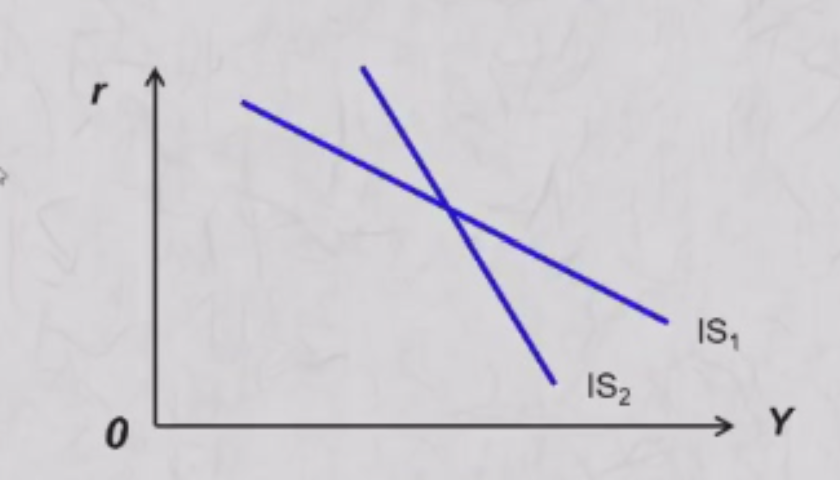

- 如果d发生变动，旋转和平移会同时发生，旋转效果更加明显
- d越大，表示投资对利率越敏感，当投资对利率较为敏感的时候，利率较小的变动就会引起较大的投资变动，从而引起收入较大的变动，IS曲线越平缓
#### （二）IS曲线的变动

1. 投资变化引起的IS曲线变动(图解)

投资函数I=1250-250r变动I=1500-250r

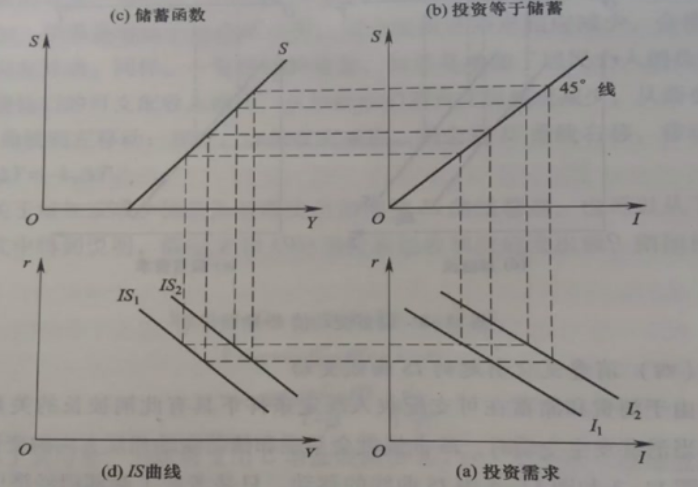

2. 储蓄变化引起的IS曲线变动(图解)

储蓄函数S=-500-100r变动S=-250-100r

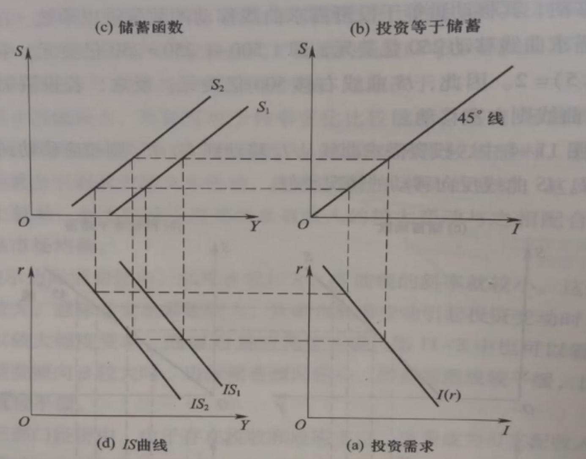

3. 消费变化引起的IS曲线变动

4. 政府支出引起的IS曲线变动

$$
\Delta Y=K_G\Delta G
$$

- G,T变化属于财政政策。
- 政府支出增加属于扩张性财政政策

5. 税收变动引起的IS曲线变动
$$
\Delta Y=-K_T\Delta T
$$

- 政府税收增加时，属于紧缩性财政政策

6. 政府转移支付变动引起的IS曲线变动

7. 国外需求引起的IS曲线变动

## 第二节 货币市场的均衡：LM曲线
### 一、LM曲线的含义和推导

- LM曲线表示满足货币市场均衡条件下(**货币需求=货币供给**)的收入y与利率r的关系
#### （一）LM曲线的推导

L=M

L=kY-hr

用P代表价格总水平则实际货币供应量M与名义货币供应量m为M=m/P或m=PM

如果P=1，则有

M=m

整理得到

$$
r=-\frac{M}{h}+\frac{k}{h}Y
$$

若令$-\frac{M}{h}=E,\frac{k}{h}=F$，则有r=E+FY

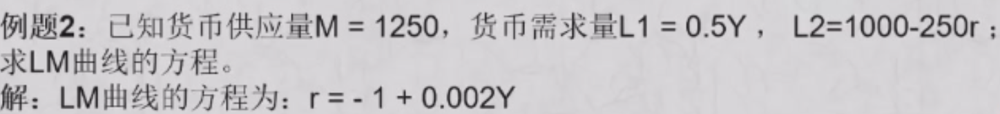

#### (二)从货币市场均衡角度推导LM曲线

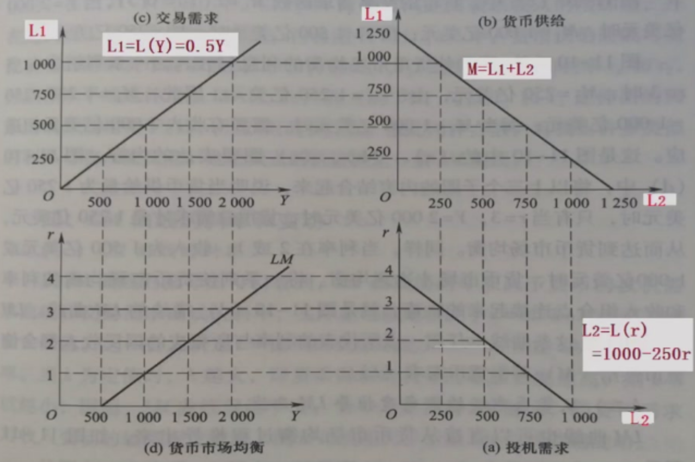

#### （三）LM曲线的经济含义
1. LM曲线是一条描述**货币市场**达到宏观均衡即L=M时，总产出与利率之间关系的曲线

2. 在货币市场上，总产出与利率之间存在着正向变化的关系，即利率提高时总产出水平趋于增加，利率降低时总产出水平趋于减少 

3. 处于LM曲线上的任何点位都表示L=M,即货币市场实现了宏观均衡。反之,偏离LM曲线的任何点位都表示L≠M,即货币市场没有实现宏观均衡。如果某一点位处于LM曲线的右边,表示L>M,即现行的利率水平过低,从而导致货币需求大于货币供应。如果某一点位处于LM曲线的左边,表示L<M,即现行的利率水平过高,从而导致货币需求小于货币供应。

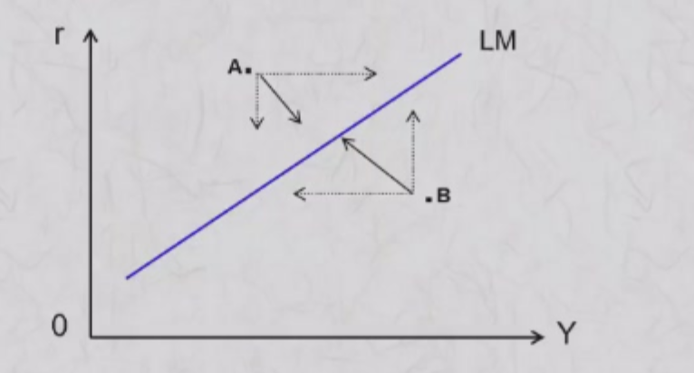

### 二、LM曲线的斜率和变动

#### （一）LM曲线的斜率

$$
r=-\frac{M}{h}+\frac{k}{h}Y
$$

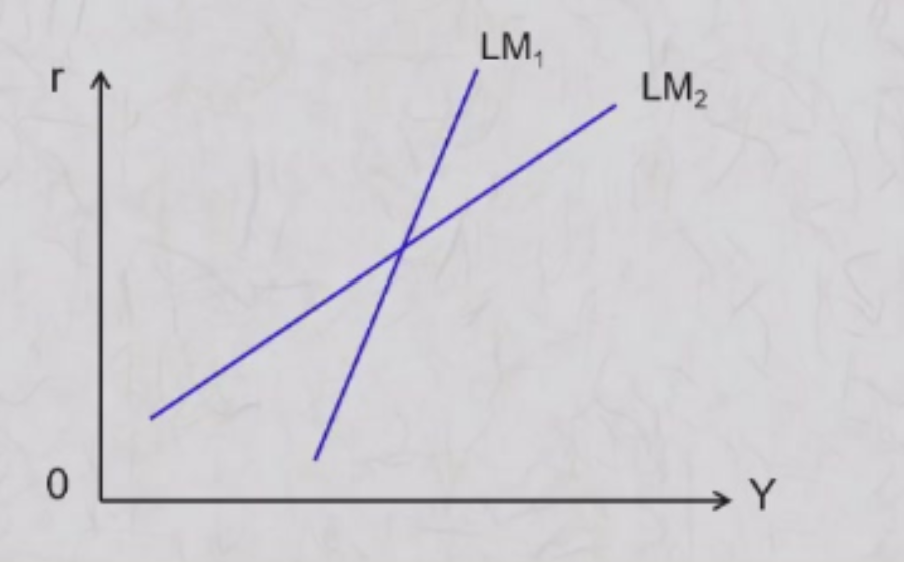
### （二）LM曲线上的三个区域
- 水平的“凯恩斯区域”代表流动性陷阱
- 垂直的古典区域代表完全没有货币投机需求的状况
- 正斜率的中间区域代表经济的正常情况

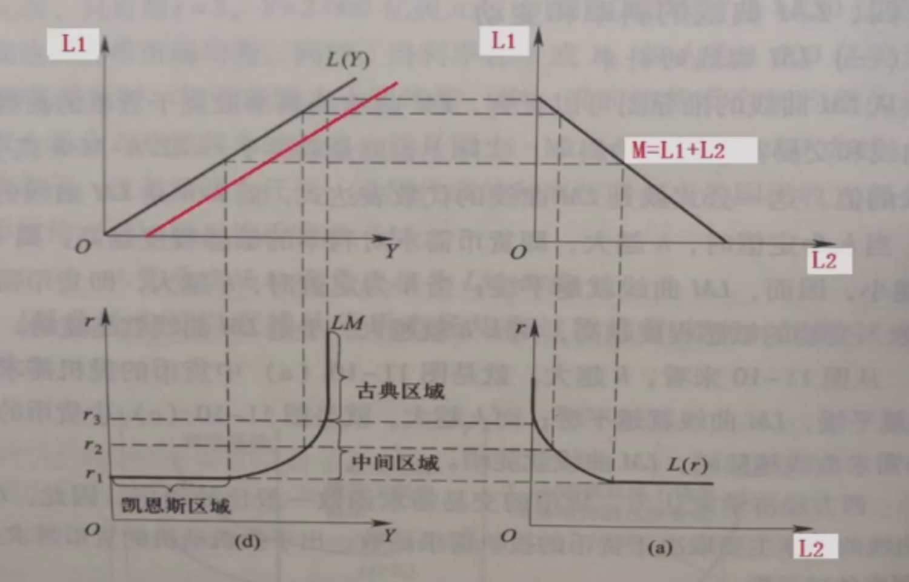

### （三）投机需求变动引起的LM曲线变动：反方向移动

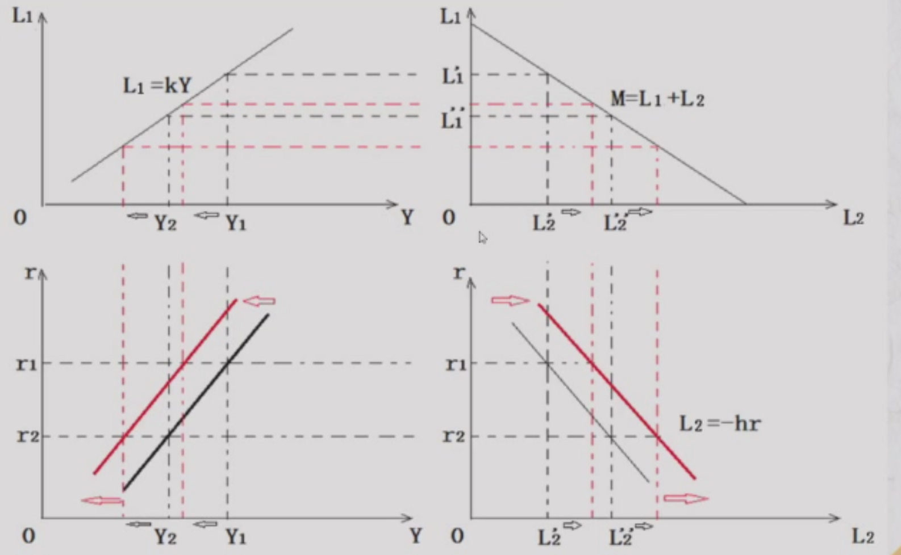

### （四）交易需求变动引起的LM曲线变动：同方向移动

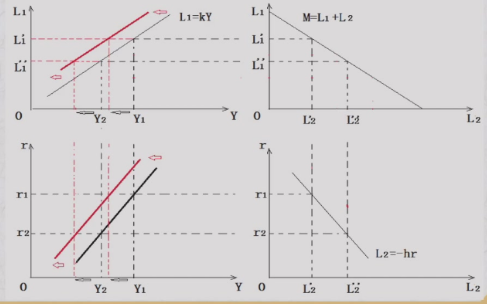

### （五）实际货币供给量变动引起的LM曲线变动

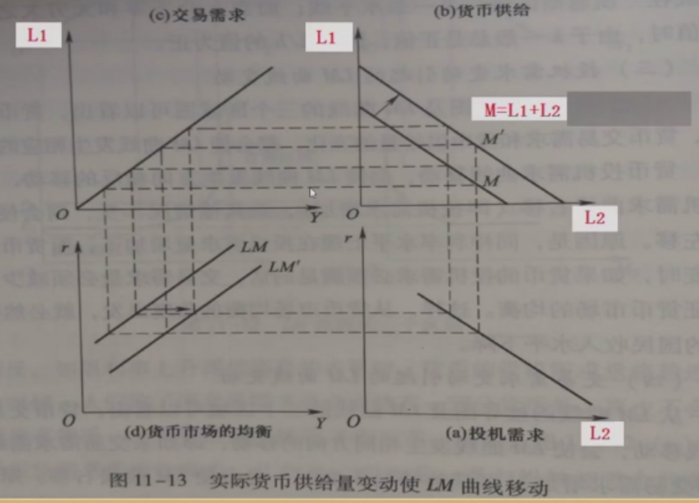

## 第三节 产品市场和货币市场的共同均衡：IS-LM模型
### 一、产品市场和货币市场共同均衡 
#### （一）均衡的决定 

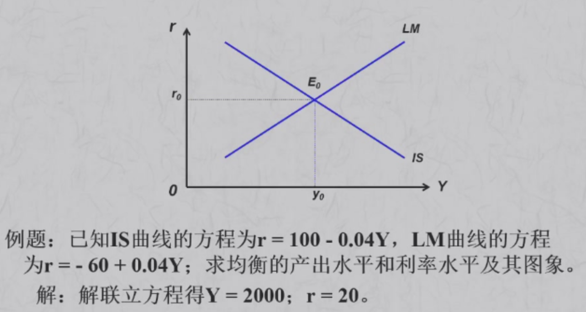

#### （二）均衡的变动

LM曲线不变，IS曲线水平方向向左右移动，均衡状态随之改变

IS曲线不变，LM曲线水平向左右移动，均衡状态也将随之变动

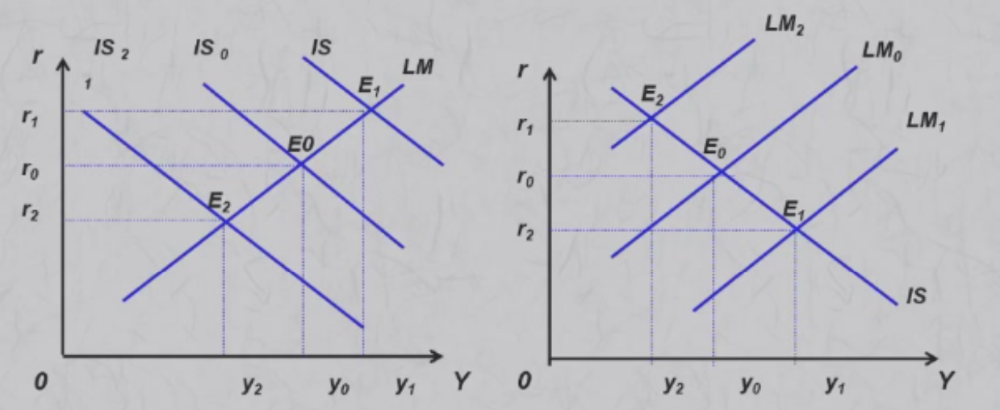

### 二、产品市场和货币市场失衡

#### （一）一个市场失衡，另一个市场不失衡

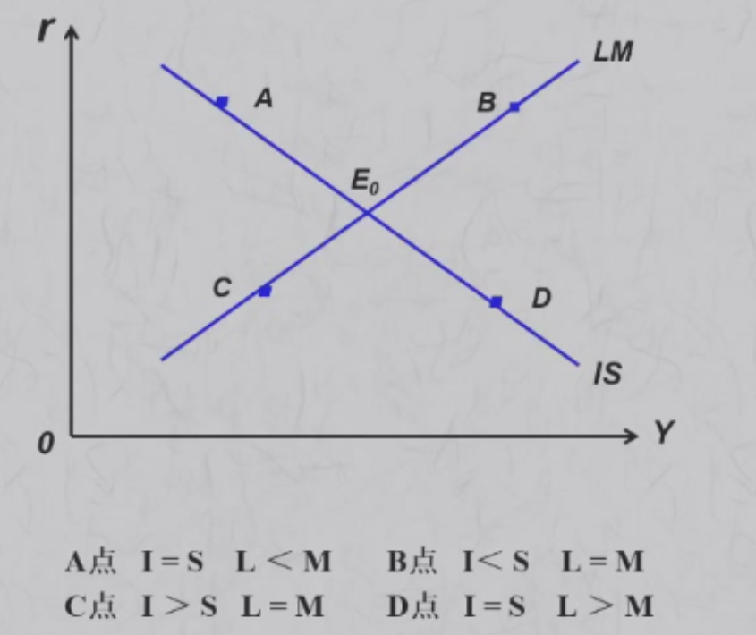

#### （二）两个市场的不均衡

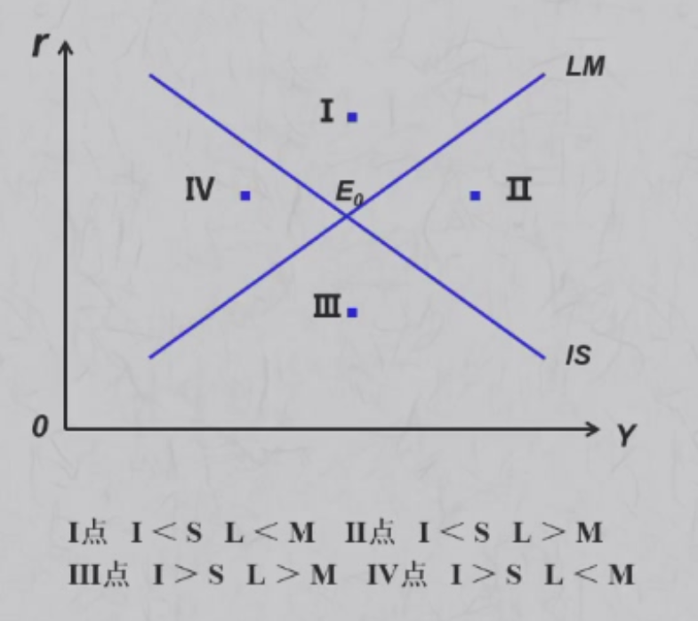

### 三、产品市场和货币市场失衡的自我调整

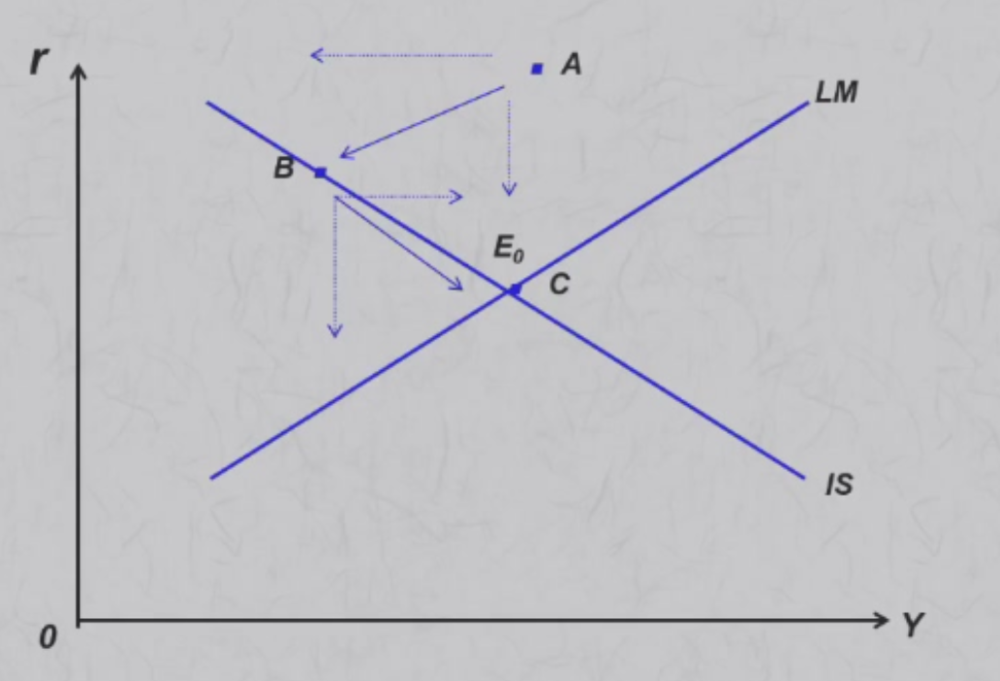

### 四、产品市场和货币市场失衡的政府调控

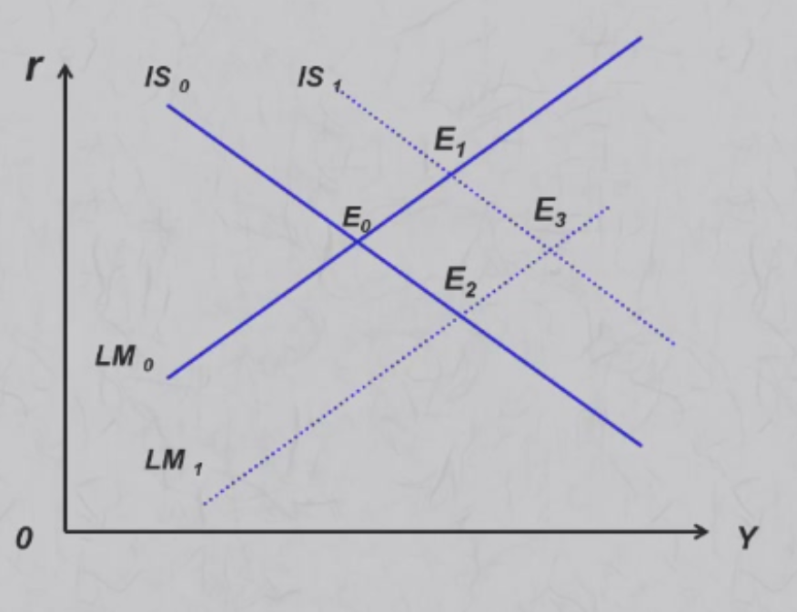

# 第十二章 国民收入的决定：AD-AS模型

凯恩斯理论涉及的是经济萧条，而在经济萧条时价格一般不会变动，所以凯恩斯的理论尽管分析的重点是需求，但是却不涉及价格的变动

本章实际上是凯恩斯主义经济学后来的发展，即将凯恩斯理论运用于非萧条但未实现充分就业的情况，也就是相对正常的情况

- 有效需求决定模型：P=1 考虑产品市场的均衡
- IS-LM模型：P=1 考虑产品市场、货币市场的均衡
- AD-AS模型：P≠1 考虑产品市场、货币市场和劳动市场的均衡

## 第一节 AD曲线及其变动
### 一、价格变动的效应

1. 财富效应(针对消费的变化)

价格变动导致人们持有货币的实际购买力下降或消费水平相应减少的效应，叫做财富效应或实际余额效应("庇古效应")

物价水平下降提高了货币的真实价值，并使消费者变得相对富有，股利他们更多地支出。消费者支出增加意味着物品与劳务需求量更大

> 工资的上涨与物价的上涨往往不是同步的。即使工资的上涨达到相应水平，应交税款也会随之上涨，实际可支配收入是减少的，消费随之会减少

2. 利率效应(针对投资)

货币供给不变时，价格上升会引起利率上升，总需求和收入水平下降。价格水平变动会引起利率同方向变动，进而使投资和产出水平反方向变动的情况叫做利率效应

物价水平是货币需求量的一个决定因素。物价水平降低，家庭为了购买他们想要的物品与劳务需要持有的货币就越少。因此，当物价水平下降时，家庭会通过把一些钱借出去来试图减少货币持有量(货币需求减少)，即将货币换为有利息的资产，会导致利率的下降，反过来又影响对物品与劳务的支出。同时利率的下降会导致投资的增加

> 利率可以看做货币的价格，货币供给给定，需求的增加会导致利率上扬

财富效应实际上与微观经济学部分所讲的价格变动会导致收入效应相对应。二利率效应确实宏观经济学谈到的特有效应，与微观不同

### 二、AD曲线的推导

总需求曲线(AD曲线)的推导：以IS-LM曲线推导

1. AD曲线的梳理推导(总需求函数)


> 货币市场均衡是指货币需求与名义货币供给量相等

（5）式就是AD函数，该式表明总产出与总价格水平成反向变化关系。所以在纵轴代表价格水平P，横轴代表总产出水平Y的坐标中 ，AD曲线是一条向右下方倾斜的曲线


如果IS曲线和LM曲线已知，则我们可以求出某一经济状态AD曲线的方程：如果AD曲线已知，则我们可以根据一定的价格水平推测该经济状态的总收入水平或总产出水平


2. AD曲线的几何推导


### 三、AD曲线的经济含义

1. AD曲线一条描述总需求达到宏观均衡即IS=LM时，一个国家总产出水平与价格水平之间关系的曲线
> 总需求是指经济社会对产品和劳务(**不包括货币**)的需求总量，这一需求总量通常以产出水平来表示，总需求由消费需求、投资需求、政府需求和国外需求构成

2. AD曲线表明总产出Y与价格水平P之间存在着反向变化的关系

3. AD曲线反映了价格回评影响实际货币供给，实际货币供给影响利率水平，利率水平影响投资水平，投资水平影响产出水平或收入水平这样一个复杂而迂回的传导机制(P上升，M减少，r增加，I减少，Y减少)

### 四、AD曲线的变动和影响因素

- 在价格不变时
- 扩张性政策：AD曲线右移
- 紧缩性政策：AD曲线左移


### 五、AD曲线的斜率及其经济含义


## 第二节 AS曲线及其变动

总供给是经济社会所提供的总产量(或国民收入)

### 一、AS曲线的推导
#### （一）推导凯恩斯主义的AS曲线(短期)

依据微观经济学方法推导

1. 凯恩斯主义AS曲线的一般形式(工资向下刚性，即货币工资不会轻易变动)
- 大萧条背景下对工作的需求高，极少工资下也可以获得较高产出

2. 凯恩斯主义AS曲线的特殊形式：水平线

#### （二）推导古典AS曲线(长期)：垂直线(强调市场这一看不见的手)

按照西方古典学派的说法，在长期，价格和货币工资具有伸缩性(因为在长期，时间足够长，价格和货币工资都有足够长的时间去调整)，因此劳动供给和劳动需求也有足够长的时间去实现均衡，当劳动供给与劳动需求实现均衡时，所形成的就业水平就在充分就业的状态下，此时的产量为潜在产量。

对于AS曲线的集中类型要注意加以区分

- 古典学派认为，增加需求的政策并不能改变产量，而只能造成物价上涨，甚至通货膨胀

#### 推导

### 二、AS曲线的含义
1. AS曲线是一条描述总供给达到宏观均衡时，一个国家总产出水平与价格水平之间关系的曲线

2. AS曲线表明总产出Y与价格水平P之间存在着正向变化的关系

3. AS曲线反映了价格水平影响实际工资，实际工资影响就业水平，就业水平影响投资水平，投资水平影响产出水平或收入回评这样一个复杂而迂回的传导机制(P上升，W下降，N上升，Y上升)

> 短期内，总供给主要由总就业水平决定

### 三、AS曲线的变动和影响因素
#### （一）AS曲线的平移

物价水平的变化使总供给量在总供给曲线上滑动。如果物价水平不变,其他因素变化导致总供给的增加或减少,可以用AS曲线的水平移动来表示。总供给增加,AS曲线向右边平移;总供给减少,则AS曲线向左边平移:


影响总供给曲线的因素主要有生产函数(技术水平、劳动生产率)，劳动就业量(劳动需求、劳动供给)

1. 技术进步导致的AS曲线变动(中性技术进步假设)
> 不会带来劳动就业量的变化的技术进步


2. 劳动需求变动导致的AS曲线变动(图解)


3. 劳动供给变动导致的AS曲线变动(劳动意愿与偏好)


### 四、特殊的AS曲线及其变动：凯恩斯和古典

凯恩斯的水平AS曲线：只有总需求有极大增长才会发生变化，一般在短期内不会变化


古典的垂直AS曲线：生产力有大的提高或破坏，劳动力有大的变化时才会移动


### 五、AS曲线不同特征的经济含义

- 古典的AS曲线：充分就业，潜在产出水平，价格可变
- 价格不变的凯恩斯AS曲线：经济萧条时的状态
- 价格可变的凯恩斯主义AS曲线：未达充分就业，但不处于经济萧条的状态


## 第三节 AD-AS模型


## 第四节 AD-AS模型对外来冲击的反应
- 失业、衰退：总产出减少
- 通货膨胀：物价水平增加
- 滞胀：P增加的同时Y减少

### 一、对总需求方面扰动和冲击的反应


### 二、对AS方面扰动和冲击的反应


#### 短期影响（只有一条线发生变化）

|序号|曲线的变动|宏观经济问题|
|---|---|---|
|1|AD曲线向左移动|失业|
|2|AD曲线向右方移动|通货膨胀|
|3|AS曲线向左移动|滞胀|

#### 长期影响（两条线都发生变化，市场这一看不见的手发挥了自我调节作用）

- 在古典AS曲线附近波动

 
