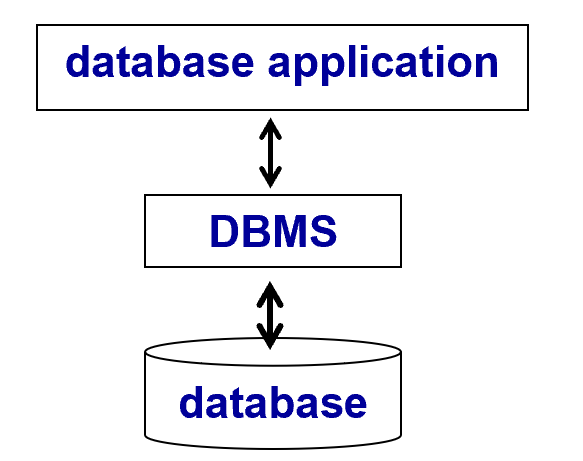
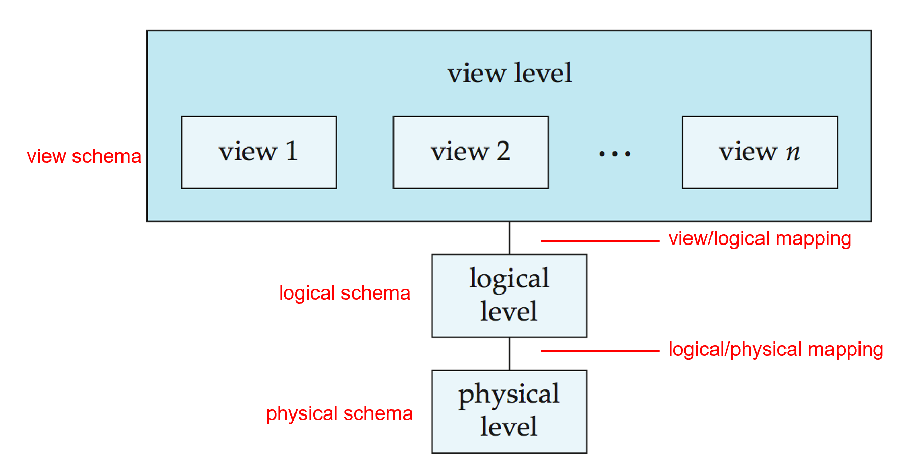
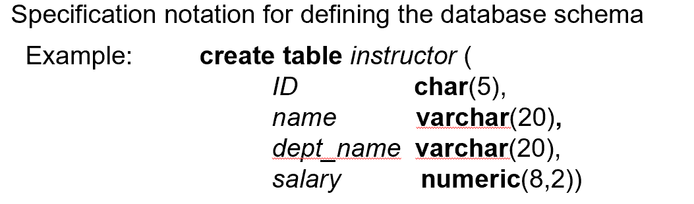
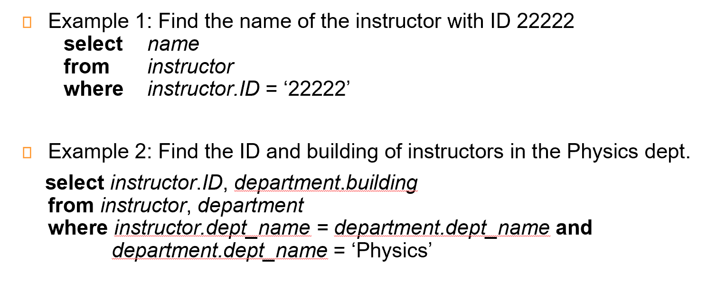
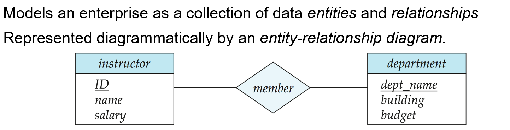
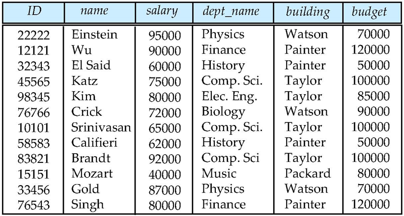
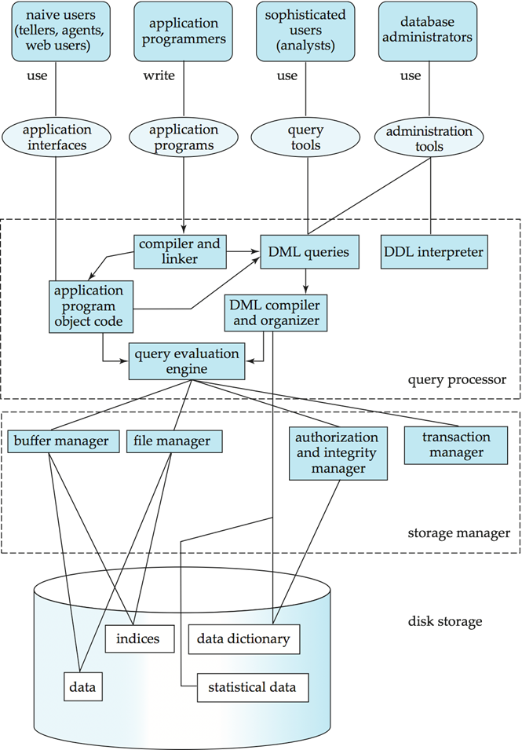
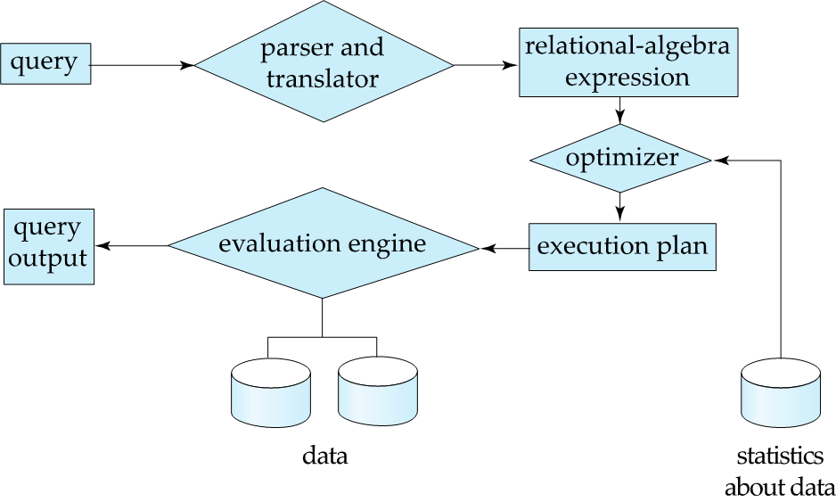
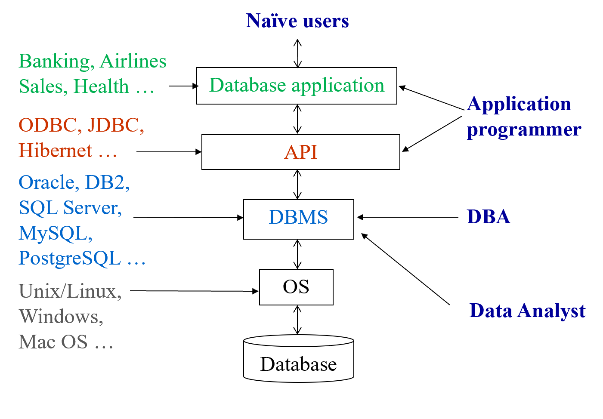

# Chapter 1: Introduction
## 1. Database Systems
DBMS(Database Management System)
- 数据库定义
- 数据组织、存储和管理
- 数据操作
- 数据库的事务管理和运行管理
- 数据库的建立和维护
- 不同数据库之间的交互

- 数据库系统是一些管理互相关联的数据以及一组使得用户可以访问和修改这些数据的程序的集合
## 2. 数据库系统的目标
相比于File-Processing System，数据库系统可以解决下面的问题

***两者一个巨大的区别是文件系统是操作系统的重要组成部分，DBMS是独立于操作系统的软件。DBMS的实现与操作系统中的文件系统是紧密相关的***
- 数据冗余(rebundancy)和不一致性(inconsistency):相同的信息可能在不同的文件中重复存储；不同文件中的信息在修改后可能会出现不一致的现象
- 数据访问困难：对于有特定要求的数据，传统的文件管理系统需要写大量的访问应用程序保证能够按照要求访问数据。
- 数据孤立：数据分散在不同文件中，文件可能不具有相同的文件格式，编写应用程序来检索适当数据是很困难的
- 完整性问题(integrity problems):数据库中存储的数据值需要满足一些特定的约束条件(constraint)，比如银行账户余额必须非负，学生ID的位数必须相同等等。
- 原子性问题(atomicity problems):一个原子的操作要么全部发生要么根本不发生
- 并发访问异常(Concurrent access anomalies):并发的更新操作可能相互影响，有可能导致数据的不一致。eg.学生选课，教学班容量差一人，两名学生同事抢课就会存在计数异常的情况导致两名同学都可以选到这门课
- 安全性问题：数据库系统有明确的访问权限，并非每一个用户都可以访问所有数据
## 3. 数据库的特征
- 数据持久性
- 数据访问便利
- 数据完整性
- 多用户并发控制
- 故障恢复
- 安全控制
## 4. 数据视图
数据库的主要目的是给用户提供数据的抽象视图，我们对数据库进行三级的抽象。

- Physical Level:描述数据实际上是怎样存储的。物理层详细描述复杂的底层数据结构。
- Logical Level:比物理层层次稍高的抽象，描述数据库中存储什么数据以及这些数据间存在什么联系。
    - 物理数据独立性：虽然逻辑层的简单数据结构的实现可能涉及复杂的物理层结构，但是逻辑层的用户不比意识到这样的复杂性。
- View Level:最高层次的抽象。只描述数据库的某个部分。尽管在逻辑层使用了相对简单的结构，但是由于一个大型数据库中所存储的信息的多样性仍存在一定程度的复杂性。但是用户不需要所有的这些信息，而只需要访问数据库的一部分。视图层抽象的存在正是为了使这些用户与系统之间的交互更加简单。
    - ***系统可以为统一数据库提供多个视图***

**Advantages**
- 隐藏了复杂性
- 对变化的适应得到增强
    - 硬件变化(physical level)，可以通过调整逻辑关系和映射来适应新的硬件环境。
    - 逻辑环境变化(logical level),可以通过视图层和logic的映射使得view尽量少变化。
### 4.1 模式(schema)与实例(Instance)
与编程语言中的类型和变量概念相似：
- 模式(schema)-数据库的逻辑结构(physical/logical)
- 实例(instance)-在***某一个特定的时间点***数据库中的真实内容
### 4.2 数据独立性(指数据和程序相互不依赖，把数据的定义从程序中分离出来)

DBMS负责数据的存储，从而简化应用程序

- **物理数据独立性**：the ability to modify the physical schema without changing the logical schema，需要修改内模式与概念模式之间的映射关系
- **逻辑数据独立性**：the ability to modify the logical schema without changing the user view schema，需要修改外模式与概念模式之间的映射关系

映射修改，但不用修改schema
## 5. Data Models
Data models is a collection of tools for describing data, data relationships, data semantics(数据的语义), data constraints.
- 三要素
    - 数据结构 
    - 数据操作 
    - 数据约束条件
> 模型就是对现实世界特征的抽象，数据模型是对现实世界数据特征的抽象

- Relational model(关系模型)：（表格）数据库系统层面
- Entity-Relationship(实体-联系) data model：需求分析层面
- Object-based data models
    - Object-oriented (面向对象数据模型)
    - Object-relational (对象-关系模型模型)
- Semistructured data model (XML)(半结构化数据模型)
- Other older models:
    - Network model (网状模型)
    - Hierarchical model(层次模型)

- 概念数据模型：按照用户的观点对数据和信息建模，是现实世界到信息世界的第一层抽象
    - ER模型：接近于人类的思考方式，容易理解并且与计算机无关。只能说明实体之间的语义练习，不能进一步地详细说明数据结构
- 基本数据模型：按计算机系统的关键对数据建模，，是现实数据特征的抽象
    - 层次模型
    - 网状模型
    - 关系模型：用二维表格结构表达实体集以及实体集之间的联系。最大的特征就是**描述的一致性**
    - 面向对象数据模型
## 6. 数据库语言
### 6.1 数据定义语言（Data Definition Language,DDL）

数据字典包含元数据(metadata)
- 描述数据属性、结构、关系等的数据
- DDL编译器生成一系列table templates并存储在数据字典（数据字典是一系列表，包含一系列元数据）
- Authorization(权限)
- Integrity constraints (完整性约束) Primary key (ID uniquely identifies instructors, 主键) Referential integrity (references constraint in SQL, 参照完整性) e.g. dept_name value in any instructor tuple must appear in department relational
### 6.2 Data Manipulation Language (DML, 数据操作语言)
- Procedural(过程式):用户确定需要什么数据和如何获取这些数据eg.C
- Declarative(声明式):用户只描述需要什么数据(陈述式，非过程式nonprocedural):用户确定需要什么数据但是不需要确定如何获取这些数据eg.SQL

### 6.3 SQL Query Language

### 6.4 Database Access from Application Program
- 数据库必须由过程式语言编写
- Application programs generally access databases through one of **Language extensions to allow embedded SQL e.g. 通过预处理器，将 select 语句识别出来，翻译成 C 语言的函数调用。** API (Application program interface) e.g. ODBC/JDBC which allow SQL queries to be sent to a database.
## 7. 数据库设计
- 解决的问题：如何组织这些属性到各个表中
- 实体-联系模型：Entity Relationship Model一对一/一对多/多对一/多对多

- Normalization Theory (规范化理论):Formalize what designs are bad, and test for them。将所有的属性集作为输入，生成一组关系表
> 
>
>> 这个表存在冗余, department 有重复，应该拆分为两个表（前四列和后三列）然后通过外键进行表的关联
## 8. 数据库引擎

- 存储管理器
- 查询处理器
- 事务管理
> 数据库系统的功能部件
### 8.1 存储管理器
- 权限及完整性管理器
- 事务管理器：保证一旦发生故障，数据库的一致性状态
- 文件管理器：管理用于表示磁盘所有信息的数据结构
- 缓冲管理器：负责将数据从磁盘放入内存，并决定哪些数据应被缓冲放入内存

负责数据库中数据的**存储、检索和更新**
- 在数据库中存储的**底层数据与应用程序**以及向系统提交的查询之间提供接口的部件。
- 与文件管理器进行交互，原始数据通过系统提供的文件系统存储在磁盘上
- 将各种DML语句翻译为底层文件系统命令

- 作为数据库系统物理实现的一部分，存储管理器实现了以下几种数据结构
    - 数据文件：存储数据库自身
    - 数据字典：存储关于数据库结构的元数据，特别是数据库模式
    - 索引：存储关于数据库中数据的索引，提供对数据项的快速访问
### 8.2 查询处理器
查询处理器组件包括：
- DDL解释器：解释DDL语句并将这些定义记录在数据字典中
- DML解释器：将查询语言中的**DML语句**翻译成**查询执行引擎能够理解的低级指令的执行方案**
    - 查询优化：从几个有相同结果的候选执行计划中选出代价最小的那个执行计划。（执行计划会根据统计数据的改变而改变）
- 查询执行引擎(query evaluation engine)：执行由DML编译器产生的低级指令

### 8.3 事务管理(Transaction Management)
银行转账，A 转账到 B, A 余额减掉 B 余额加上。 要有隔离性，延迟写回
- 事务:数据库应用中完成单一逻辑功能的操作集合。每一个事务既具有原子性又具有一致性
- 恢复管理器(Recover Manager)：当故障发生时，为保证原子性，数据库必须被恢复到该事务开始执行以前的状态。
- 并发控制器(Concurrency-control manager):控制并发事务间的相互影响，保证数据库的一致性
## 9. Database Users

