# Chapter 2:Introduction to Relational Model

> 你和你的宠物狗属于relationship的概念；足球队所有的成员属于relation的概念
## 1. Structure of Relational Databases
### 1.1 Concepts
Formally, given set $D_1,D_2,...,D_n$(一系列单元素的集合).
- A relation r is a subset of $D_1\times D_2 \times D_n$.Thus a relation is a set of n-tuple $(a_1,a_2,...a_n)$ where each $a_i\in D_i$

- $A_1,A_2,...,A_n$都是attributes(属性)。$R=(A_1,A_2,...,A_n)$是一个关系模型
- 关系实例r根据关系实例定义为r(R)
- 因为关系是一个集合，所以关系都是无序的
- 关系中的元组不存在重复的情况
- 属性的值是原子的
### 1.2 Attributes
- The set of allowed values for each attribute is called the domain (域)of the attribute
- Attribute values are (normally) required to be atomic (原子的); that is, indivisible
    - Strictly indivisible example:存储姓名时将姓和名分开。如果不需要查询姓和名可以将姓名作为一个属性，名字这个属性就是不可拆分的整体
    - Non-atomic example:两个电话号码存储在了一个属性中；一本书的所有信息存储在一个属性中
- The special value null (空值) is a member of every domain.
    - 不存在的信息
    - 存在但是未知的信息

## 2. Database Schema
- Bad design:把所有信息储存在一个属性中
    - 信息的重复(如两名同学有相同的导师)导致了不一致和信息冗余
    - 空值的需求(一个学生没有导师)，需要额外处理
- Database schema:is the logical structure of the database.-抽象的定义，database中所有的schema
- Database instance:is a snapshot of the data in the database at a given instant in time.-具体的实例，database中所有的instance
> 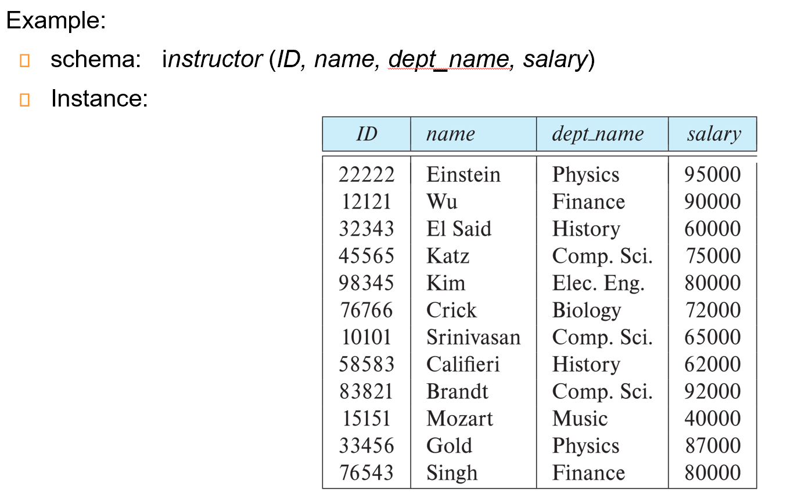
## 3. Keys
Let $K \subseteq R$
- K is a superkey (超键) of R if values for K are sufficient to identify (唯一确定) a unique tuple of each possible relation r(R)
    - 可以唯一确定一行，但是可能会存在冗余的属性
    - e.g.{ID}和{ID,name}都是superkey
- Superkey K is a candidate key (候选键) if K is minimal.
    - K可以确定唯一一行且没有冗余属性.也就是K没有子集可以是超键
    - 候选键可以由多个元素组成
- 侯选建中的一个可以给选作primary key（主键）
    - 选择的主键往往是相对稳定的
    - 往往手动确定
- Foreign key（外键）限制：关系r1引用的主键必须在关系r2中出现。类似于指针
    - 引入的意义：实现完整性约束
    - Referenced Relation是被引用的表（被引用的属性往往都是primary key），Referencing是外键所在的表
    - 为什么需要外键限制：数据库是支持由完整约束条件定义出来的，并维护完整性约束条件。则当我们定义外键后，上述例子中黄色条目是不会出现的。
    - 外码的值可以是空值：避免在数据不完整时插入无效的外码值
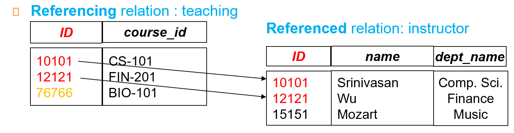
    
    Referential Integrity(参照完整性)：类似于外键限制，但是不限制于主键

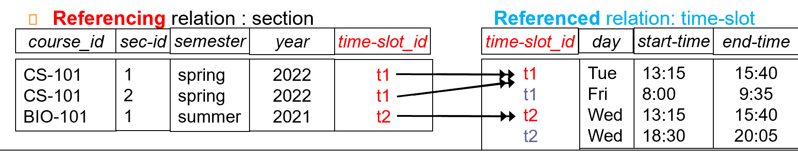

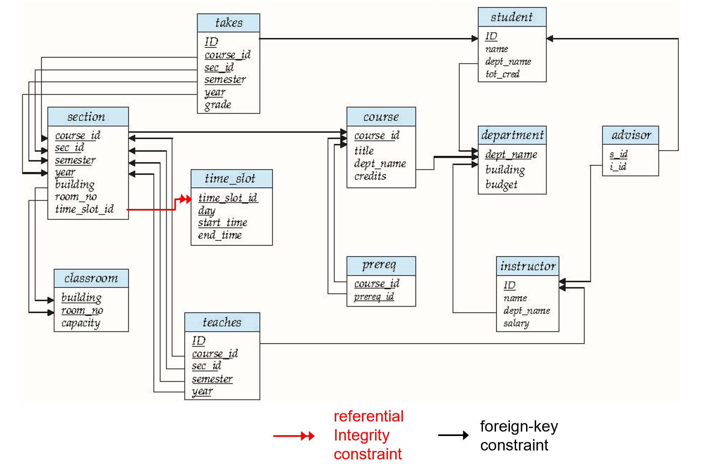
- course 指课程信息，无论是否开课，都会有其定义。
- section 表示教学班，真正开课时就有相应的实例。（类比于高铁的列车号，和每天对应的班次）
- teachers 具体教哪个教学班的老师
- takes 表示学生注册课程
- time_slot 表示一门课的具体上课时间段，如数据库在周一 3, 4, 5 节; 周一 7, 8 节。
- 上图中红线表示引用完整性的约束；黑线表示外键约束。
## 4. Relational Algebra

> 关系运算最基本的特点就是操作的对象和操作结果都是集合

是一种过程语言，但不是编程语言

Input and output are all relations

Six basic operators
- For one relation:
    - select:$\sigma$
    - project:$\Pi$
    - rename:$\rho$
- For two relations:
    - union:$\cup$
    - Cartesian product:$\times$
    - difference:$-$

### 4.1 Select
- 在表中找符合条件的tuple然后返回一张表
$σ_p(r)= \{t∣t∈r and p(t)\}$,p被称为selection predicate
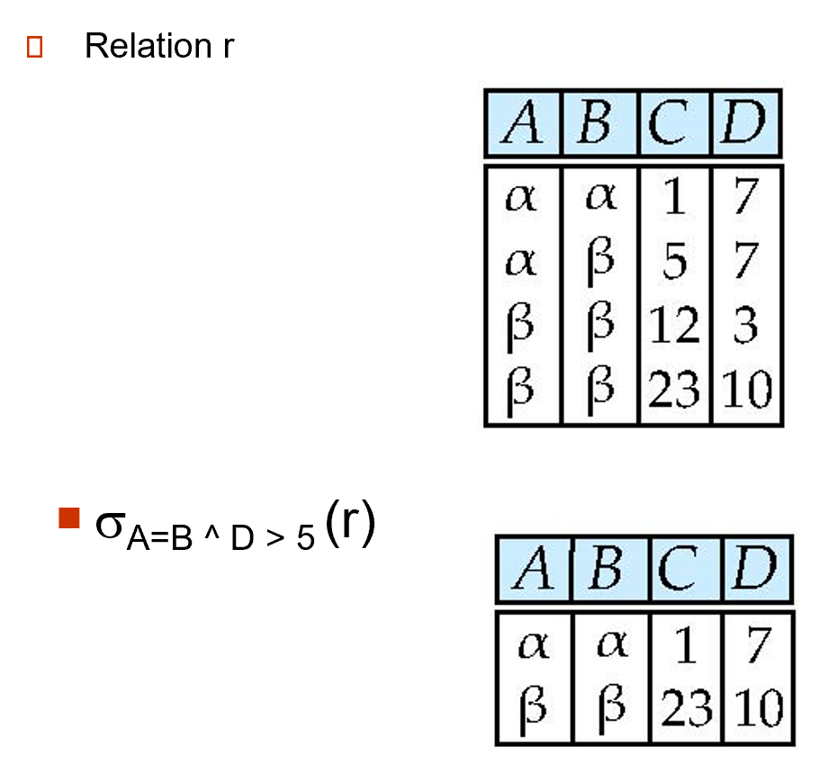

### 4.2 Project
The project operation is a unary operation that returns its argument relation, with certain attributes left out.

- 目的：隐藏某些属性
$∏_{A_1,A_2,…,A_ k}(r)$ 其中$A_i$是属性的名称，r是关系的名字

The result is defined as the relation of k columns obtained by erasing the columns that are not listed. 会对结果进行去重。
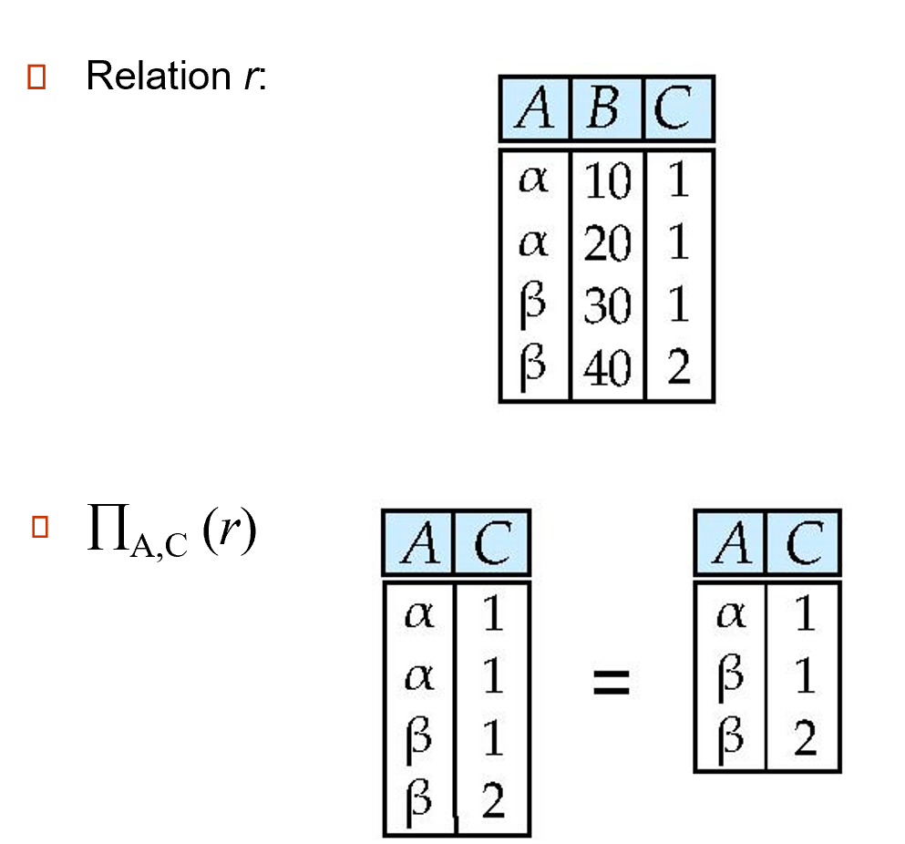
### 4.3 Union
The union operation allows us to combine two relations.

$r \cup s= \{ t|t\in r or t \in s \}$
- r and s must have the same arity (元数) (same number f attributes)
- The attribute domains must be compatible
- 使用条件：等目（拥有的attribute数量一致）同源（attribute的值域相同）
> eg.Find all customers with either an account or a loan:两张表中的属性不可能完全相同，所以要先进行投影操作
当属性有关联类型时，对于每个输入i, 两个输入关系的第i个属性的类型必须相同。
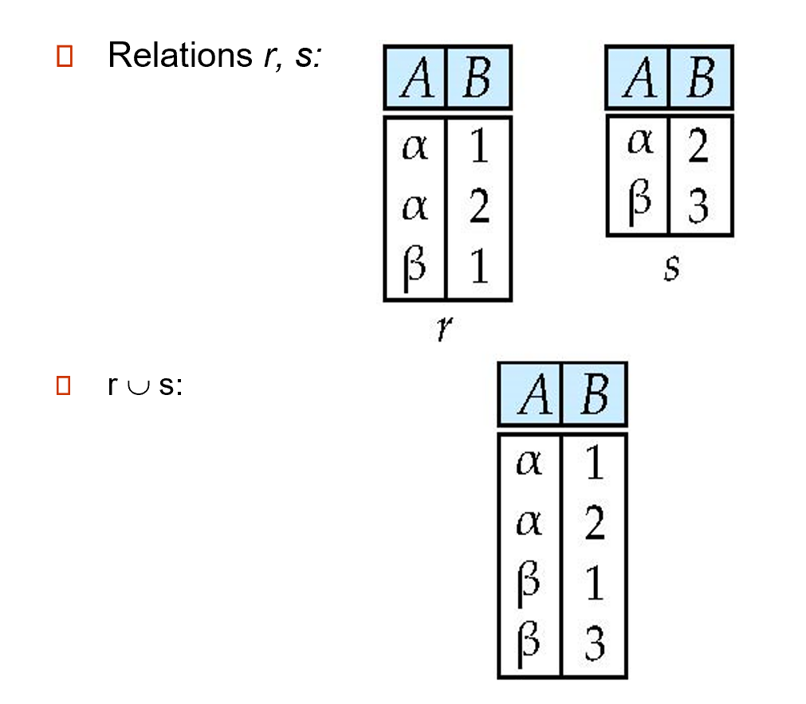

### 4.4 Set Difference
The set-difference operation allows us to find tuples that are in one relation but are not in another.
$r-s=\{t|t\in r and t\notin s\}$

Set differences must be taken between compatible relations.

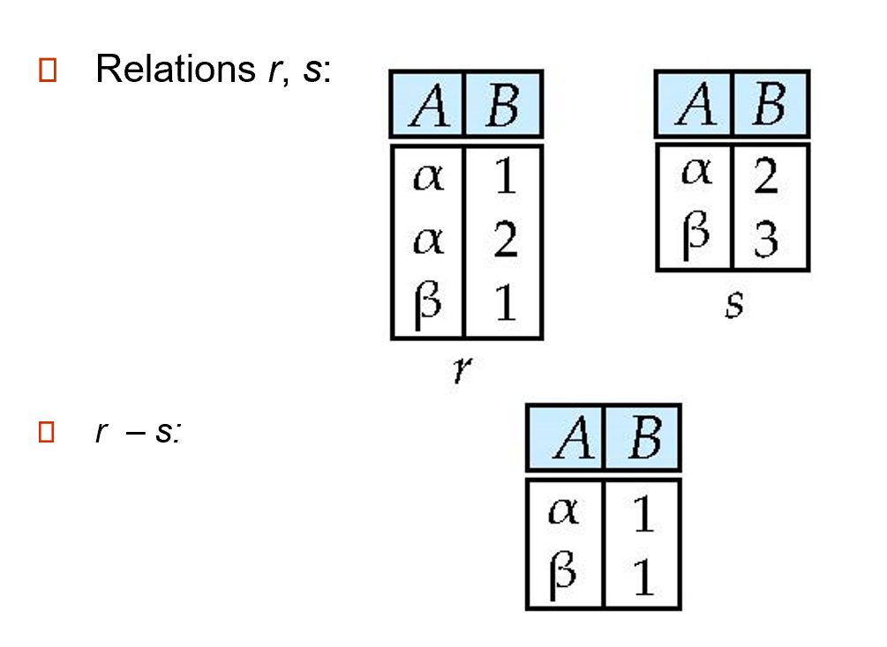
### 4.5 Cartesian Product
The Cartesian-product operation (denoted by ×) allows us to combine information from any two relations.
$r \times s= \{ (t,u)|t\in r and u\in s \}$

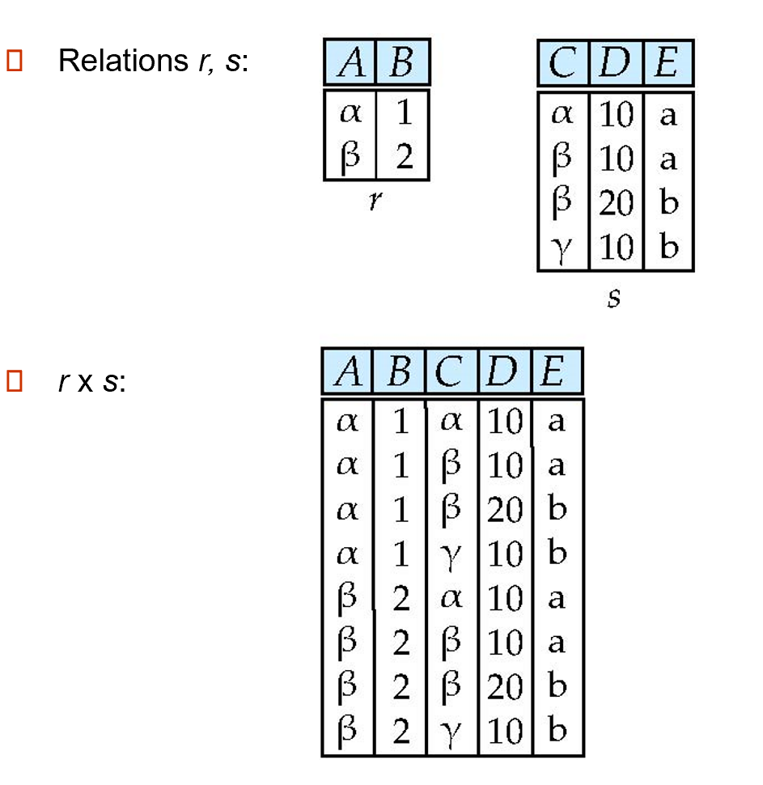

- 笛卡尔积操作没有任何限制
- 如果进行笛卡尔积的两个relation中有名字相同的属性，我们也要将他们视为不同的属性进行操作。
### 4.6 Rename
Allows us to refer to a relation by more than one name.
- 往往是在产生临时表的过程中产生的操作
$\rho_x (E)$ 表达式E的名称为x
$\rho_{x(A_1,A_2,...,A_n)} (E)$返回表达式E的名称为x，同时将属性重新命名为$A_1,A_2,...,A_n$

- Composition of Operations 1:Find the names of all instructors in the Physics department, along with the course_id of all courses they have taught.
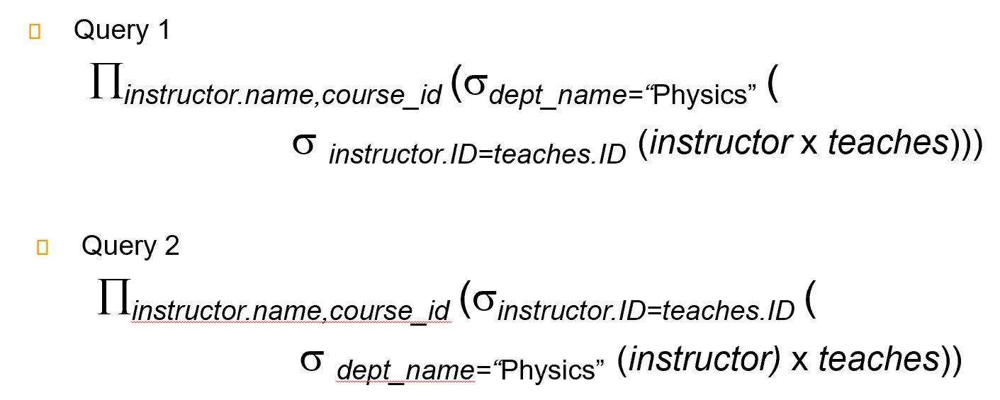
> 两条语句语义是相同的，但第二种先select，笛卡尔积操作代价小，更高效
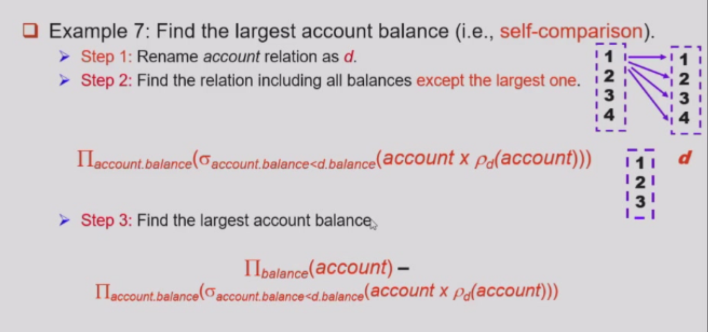
### 4.7 Additional Operators
- set intersection:$r \cap s$
- natural join:$r \bowtie s$
- assignment:$r \leftarrow s$
- outer join:$r \rtimes s$,$r \ltimes s$,$r⟗s$
- division operator:$r \div s$
#### 4.7.1 set-intersection operation
- Notation:$r \cap s$
- Defined as:$r \cap s= \{ t|t\in r and t\in s \}$
- r和s有相同的arity
- r和s的属性是兼容的，也就是值域是相同的
- 等目同源-与union操作的限制条件是相同的

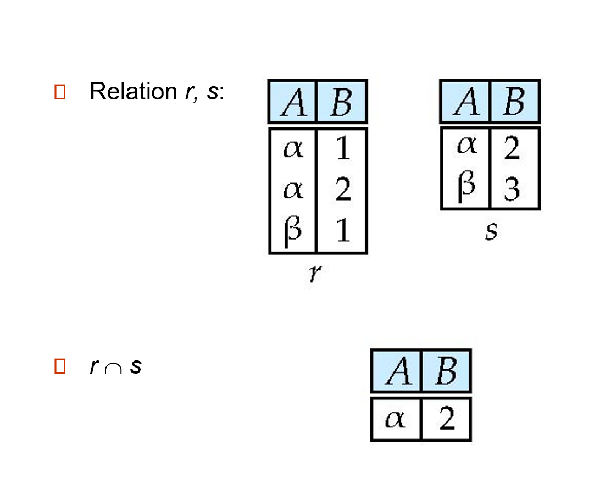
#### 4.7.2 Natural Join Operation
- Notation:$r \bowtie s$
- Example:R=(A,B,C,D),S=(B,D,E)
    - natural join 得到的 result schema是(A,B,C,D,E)
    - $r \bowtie s= \Pi_{r.A,r.B,r.C,r.D,s.E}(\sigma_{r.B=s.B ∧ r.D=s.D}(r \times s))$

Let r and s be relations on schemas R and S respectively. Then, $r \bowtie s$ 
 is a relation on schema $R \cup S$
 obtained as follows:
 - Consider each pair of tuples $t_r$ from r and $t_s$ from s
 - 如果$t_r$和$t_s$在$R \cap S$中每一个相同的属性都有相同的值，在结果relation中加上这样的元组
    - t有与r中的$t_r$相同的值
    - t有与s中的$t_s$相同的值
> 对乘法的扩展，相当于先做笛卡尔积
 再 select, 最后 project.
- 使用条件：
    - r，s必须有共同属性(名和域都对应相同)
    - 连接两个关系中同名属性值相等的元组
    - 结果属性是二者属性集的并集，但**消去重名属性**

#### Theta Join Operation Formalization
- Notation:$r \bowtie_{\theta} s$
    - $\theta$是模式中对于属性的predicate
    - Theta Join:$r \bowtie_{\theta}(r \times s)$
- Theta Join is the extension to the Natural Join

#### 4.7.3 Division Operation
题目中要找`all`就要使用division operation
- Notation:$r \div s$
- 认为r和s分别是模式R和S下的关系，其中$R=(A_1,...,A_m,B_1,...,B_n),S=(B_1,...B_n)$
    - result relation的模式是$R-S=(A_1,A_2,...,A_n)$
    - $r \div s = \{t|t \in \Pi_{R-S}(r)∧ \forall u \in s(t \times u \in r)\}$
- 商来自于$\Pi_{R-S}$，并且其元组t与s所有元组的拼接被r覆盖（是r的一个子集）
$$
\begin{align*}
    temp1 & \leftarrow \Pi_{R-S}(r)\\
    temp2 & \leftarrow \Pi_{R-S}((temp1 \times s)- \Pi_{R-S,S}(r))\\
    result & = temp1 - temp2
\end{align*}
$$

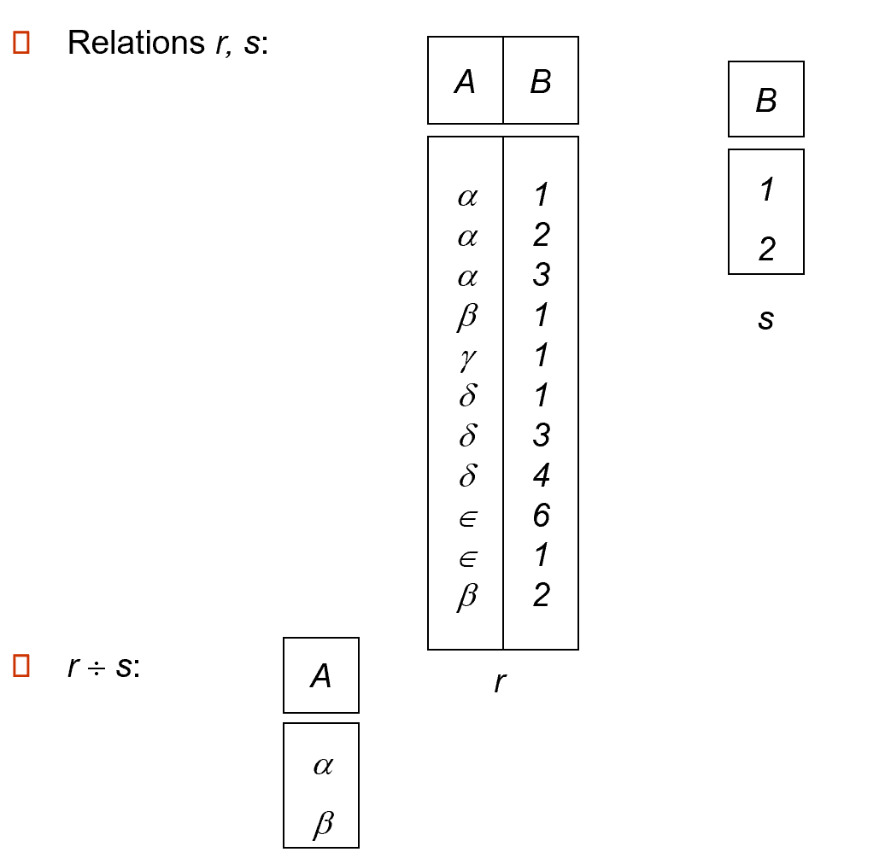

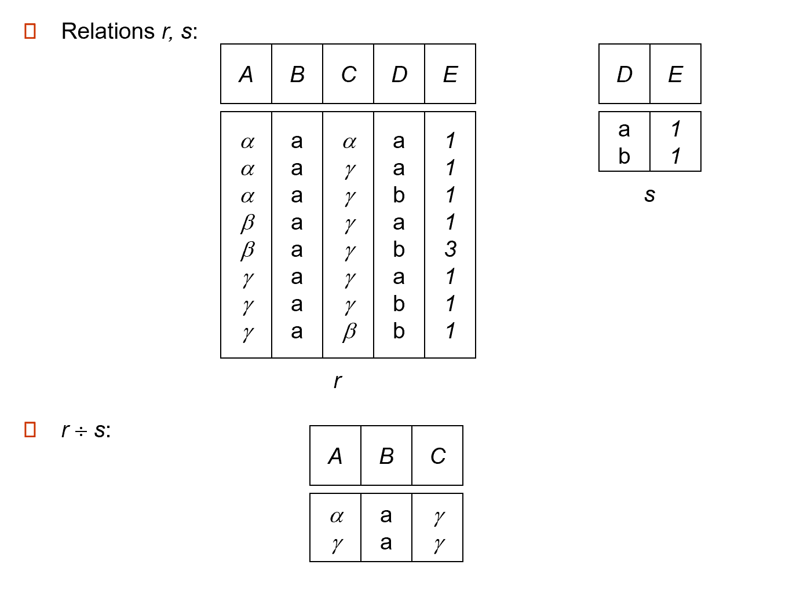

#### 4.7.4 Assignment Operation
The assignment operation <- provides a convenient way to express complex queries.
- 将查询表达式写成一系列包含下列内容的程序
    - A series of assignments
    - Followed by an expression whose value is displayed as a result of the query
- assignment的结果是一个临时表
### 4.8 操作符的优先级
- Project
- Select
- Cartesian product
- Join,division
- Intersection
- Union,difference
### 4.9 Extended Relational-Algebra Operations
- Generalized Projection
- Aggregate Functions
- Outer Join
#### 4.9.1 Aggregate Functions
Aggregation function（聚合函数）takes a collection of values and returns a single value as a result.
- avg: average value
- min: minimum value
- max: maximum value
- sum: sum of values
- count: number of values

- 聚合函数会接受一组值，返回单个值

Aggregate operation in relational algebra: $G_1,G_2,\ldots,G_n \mathcal{G}_{F_1(A_1),\ldots F_n(A_n)}(E)$
- E是任意一个关系代数表达式
- $G_1,...$是分组的属性清单，对同一组是具有相同value的tuple，对每一组进行对应的聚合函数操作
- $F_i$是聚合函数
- $A_i$是属性的名称

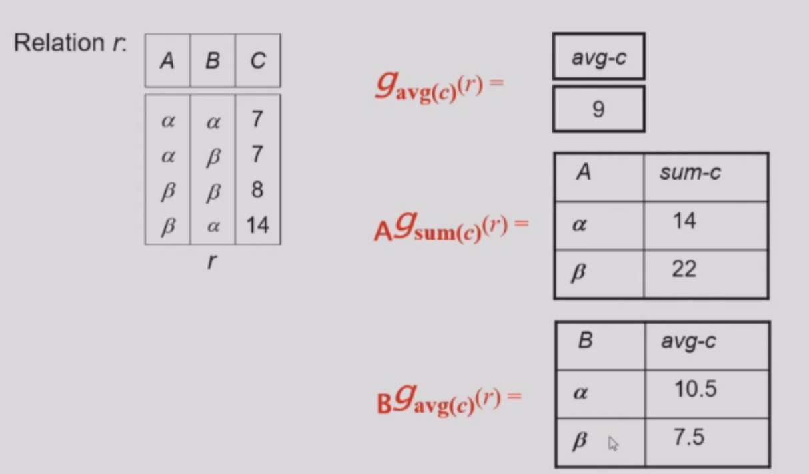

- 聚合的结果是没有名称的
    - 可以使用重命名操作进行命名
    - 为了方便我们提供了`as`语句作为聚合操作的一部分从而进行重命名
$$
 branch-name \mathcal{G}_{sum(balance) as sum-balance}(account)
$$
#### 4.9.2 Outer Join
Natural Join操作会造成一部分数据的丢失，这时我们对natural join进行扩展操作可以有效避免信息的丢失

- 计算出自然连接，然后加上某一个关系中没有在另一个关系中匹配的元组加入自然连接的结果
    - 一些属性存在空值情况，我们使用`null`作为value的值
- $r\rtimes s$ 保留r关系中的元组
- $r\ltimes s$ 保留s关系中的元组
- $r⟗s$ 

#### 4.9.3 Null values
- null值可以是一个未知的值或者是不存在的值
- 一切包含null的算数表达式的结果一定是null
- 聚合函数计算时忽略null值(除了count以外，count时null被视为一个正常值)
- 对于去重删除和分组操作时，null被视作与正常值一样的值，两个null被看做相等的值
- 比较时引入除了`true`和`false`以外的第三个值`unknown`

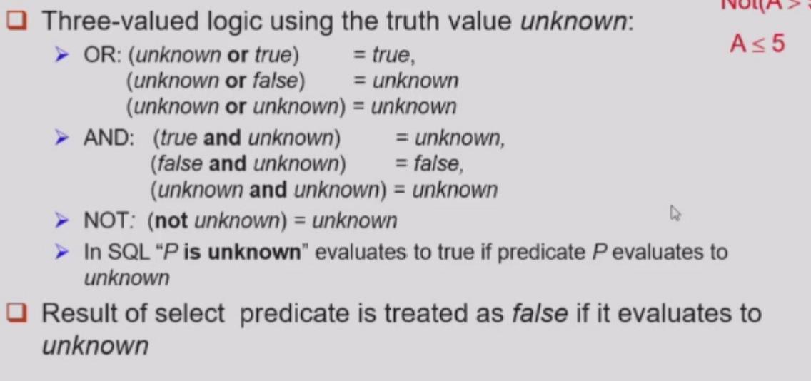
- P is unknown可以作为谓词，对应值上是unknown时返回true

- 完整性约束
    - 实体完整性（Entity Integrity）：数据库中的每个表都必须有一个主键且主键不能为NULL
    - 参照完整性(Referential Integrity)：外键的值必须是空值或者被引用表中主键的有效值
    - 用户定义完整性（User defined Integrity）：根据具体业务需求定义的约束条件,由应用的环境决定