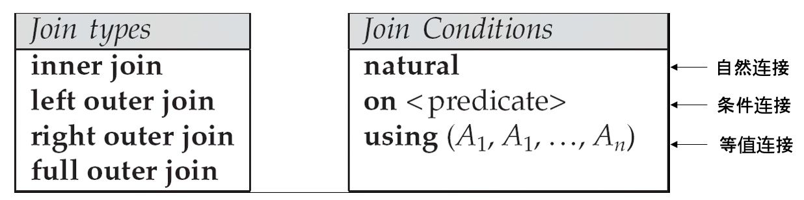
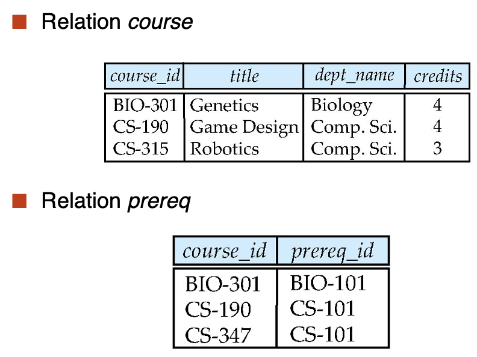
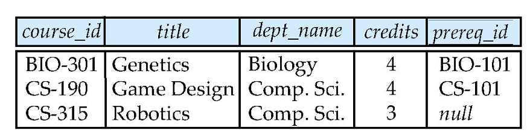
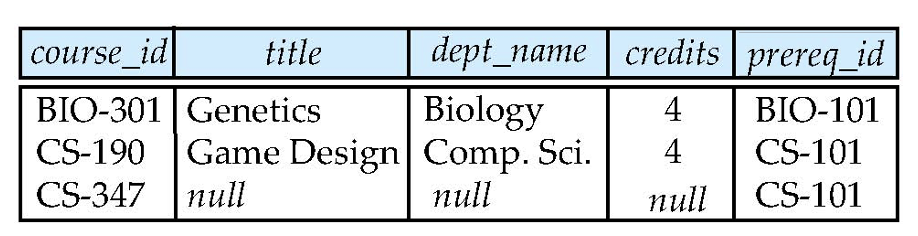
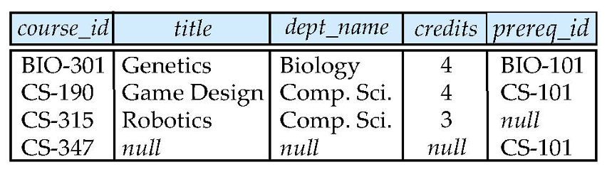

# Chapter 4 Intermediate SQL
## 4.1 Joined Relations
- 连接操作输入两个关系，并返回另一个关系
- 连接操作通常用作from子句中的子查询表达式
- 连接条件(Join Condition):定义两个关系中的哪些元组匹配，以及链接结果中存在哪些属性
- 连接类型(Join Type):定义如何处理另一个关系中的任何元组不匹配的元组(基于连接条件)



### 4.1.1 Natural Join
- from子句获得的是求解好后的新关系，因此有些实现不支持再用原来的关系名访问原属性
- 可以用多个`natural join`来连接多个关系

```SQL
select A1, A2, ..., An
from r1 natural join r2 natural join ... natural join rm
where P;
```
- 另外，使用`join...using`子句可以从两个关系的同名属性中选择指定的属性作为连接的依据，更加灵活
```SQL
select name, title
from (student natural join takes) join course using (course_id);
```

### 4.1.2 Join Conditions
- 除了`joing using`以外，还有更加通用的`join...on`运算。只要`where`支持的谓词，`on`条件均支持，因此能够表达更为丰富的连接条件
```SQL
select *
from student join takes on student.ID = takes.ID;
```
### 4.1.3 Outer Join
>自然连接仅仅保留那些同名属性值相等的元组，那些不相等的元组都会被抛弃，但是有时我们需要保留这些不相等的元组。这个时候，就需要用到外连接(Outer Join)

外连接的作用类似于自然连接，区别在于**外连接会保留那些两个关系中同名属性值不相等的属性，设为null**。SQL提供了三种不同形式的外连接：

- 左外连接(Left Outer Join):使用 `left outer join` 运算符，仅保留第一个关系的所有元组
- 右外连接(Right Outer Join):使用 `right outer join` 运算符，仅保留第二个关系的所有元组
- 全外连接(Full Outer Join):使用 `full outer join` 运算符，保留两个关系的所有元组
    - 可以将其结果看作左外连接与右外连接结果的并集
    - 有些数据库系统不支持全外连接

对应地，前面介绍的哪些没有保留不匹配元组的连接方式称为**内连接(Inner Join)**
- 在 SQL 语法中可以显式指出 inner join，但可以省略 inner，因为 join 子句默认是内连接的

在外连接中，`on`和`where`子句的区别在于:
- `on`子句会保留那些不符合条件的元组
- `where`子句会丢掉那些不符合条件的元组

eg.现在有两张表`student`和`score`

- student表

|StudentID|Name|
|---|---|
|1|Alice|
|2|Bob|
|3|Carol|

- Scores表

|StudentID|Score|
|---|---|
|1|90|
|2|85|
|4|95|

```SQL
SELECT Students.StudentID, Students.Name, Scores.Score
FROM Students
LEFT JOIN Scores
ON Students.StudentID = Scores.StudentID;
```

- 结果为

|StudentID|Name|Score|
|---|---|---|
|1|Alice|90|
|2|Bob|85|
|3|Carol|NULL|
- 结果表明`on`只是按照条件将两张表进行连接但不会去除未能连接的表



可以发现课程CS-315对应的prereq不存在，以及CS-437的课程信息不存在

- 如果我们使用`course natural left outer join prereq`,这将`prereq`的结果保存下来，没有信息的课程CS-315结果设为NULL


- 如果我们使用 `course natural right outer join prereq`，这将 course 的结果保存下来，没有信息的课程 CS-437 结果设为 NULL：


- 如果我们使用`course natural full outer join prereq`,这将 course 和 prereq 的结果保存下来，没有信息的课程 CS-315 和 CS-437 结果设为 NULL：


## 4.2 SQL Data Types and Schemas
### 4.2.1 User-Defined Types
- SQL支持两种形式的用户定义数据类型(User-Defined Data Types):
    - 区分类型 （Distinct Types）：基于现有类型创建的新类型
    ```sql
    CREATE TYPE MONEY AS DECIMAL(10, 2);
    CREATE TYPE PERCENTAGE AS DECIMAL(5, 2);
    ```
    - 结构化数据类型（Structured Data Types）：复杂的数据类型，包括嵌套记录结构、数组、多重集
    ```sql
    CREATE TYPE Address AS (
        street VARCHAR(100),
        city VARCHAR(50),
        zipcode VARCHAR(10)
    );
    -- 创建表
    CREATE TABLE Customers (
        id INTEGER,
        name VARCHAR(100),
        address Address
    );
    ```
- 不同的属性可能有相同的类型，但有时我们希望将这些属性的类型区分开来，我们使用 create type 语句来定义用户定义数据类型中的区分类型
```SQL
create type Dollars as numeric(12, 2) final;
create type Pounds as numeric(12, 2) final;
```

定义了`dollars`和`pounds`类型后，就可以把它们作为元类使用：
```SQL
create table department  
(dept_name varchar (20),  
building varchar (15),  
budget Dollars);
```
- 用户定义的这两个类型 Dollars 和 Pounds，虽然底层类型相同，但会被视为不同的类型。因此这两种类型不能直接进行运算，甚至不能与 numeric 类型运算，这时就需要用 cast 子句进行强制类型转换
```SQL
-- 错误：不能直接对 Dollars 和 Pounds 进行运算
SELECT US_Sales.amount + UK_Sales.amount
FROM US_Sales, UK_Sales;
-- 将 Pounds 转换为 Dollars 进行运算
SELECT US_Sales.amount + CAST(UK_Sales.amount AS Dollars)
FROM US_Sales, UK_Sales;
```
### 4.2.2 Domains
- SQL的`domain`关键字提供了与`type`类似的功能，用于为底层类型添加完整性约束
```SQL
create domain person_name char(20) not null
```
- 我们还可以使用`check`子句来添加额外的约束条件
```SQL
create domain degree_level varchar(10)  
--- degree_level_test是约束条件的名称
constraint degree_level_test  
check (value in (’Bachelors’, ’Masters’, ’Doctorate’));
```

**`type`和`domain`之间的区别**
- 域可以有约束，并且可以使用域类型的默认值
- 域并没有强制的类型要求。因此，只要底层类型是可兼容的，在某个域的值就可以被赋予另一个域类型的值
    - 例如，如果两个域都是基于字符串类型定义的，即使它们的约束不同，也可以相互赋值。

### 4.2.3 Large-Object Types
> 很多数据库系统需要存储包含大数据项的属性，比如照片、高分辨率的图像或视频等。因此 SQL 为字符数据（CLOB）和二进制数据（BLOB）提供了大对象数据类型（Large-Object Data Types）
- BLOB：二进制大对象（Binary Large Object）——对象是未解释的二进制数据的大型集合（其解释由数据库系统之外的应用程序定义）
    - 在 MySQL 中，BLOB 数据类型有：
        - TinyBlob：0～255 字节
        - Blob：0～64K 字节
        - MediumBlob：0～16M 字节
        - LargeBlob：0～4G 字节
- CLOB：字符大对象（Character Large Object）——对象是大型字符数据的集合
- 当查询返回大型对象时，将返回指针，而不是大型对象本身。

## 4.3 Integrity Constraints
- 完整性约束通过确保对数据库的授权更改不会导致数据一致性的丢失，来访时数据库的以外损坏。对于一个关系来说，有以下几种
    - `not null`:定义键值不允许为空
    - `primary key`
    - `unique`
        - `unique(A1, A2, ..., Am)` 指出属性 A1、A2、...Am 形成一个超级键（不一定是一个候选键）
        - **候选键允许为null**
    - `check(P)`其中P是一个谓词
        - 也可以有复杂查询，但许多数据库不支持
        - eg. e.g. `check ((course_id, sec_id, semester, year) in (select course_id, sec_id, semester, year from teaches))`
    - foreign key

确保每个课程的学期为春夏秋冬其中之一
```sql
create table section (
    course_id varchar (8),
    sec_id varchar (8),
    semester varchar (6),
    year numeric (4,0),
    building varchar (15),
    room_number varchar (7),
    time slot id varchar (4),
    primary key (course_id, sec_id, semester, year),
    check (semester in (’Fall’, ’Winter’, ’Spring’, ’Summer’))  
);
```

### 4.3.1 Referential Integrity
- 参照完整性(Referential Integrity)确保在给定属性集的一个关系中出现的值，也出现在另一个关系中的特定属性集中
    - 例如，如果 “Biology” 是出现在关系 instructor 的某个元组中的部门名称，则 “Biology” 的关系 department 中存在一个元组
- 在SQL中，参照完整性约束由**外键**实现，语法为`FOREIGN KEY (dept_name) REFERENCES department`
    - 设 A 为一组属性。 设 R 和 S 是包含属性 A 的两个关系，其中 A 是 S 的主键。如果 A 的任何值出现在 R 中，这些值也出现在 S 中，则称 A 是 R 的外键
- 执行违反参照完整性约束的语句时会被拒绝。然而，对于在被参照关系上的更新和删除行为，如果违反约束，系统必须采取行动来改变参照关系的元组，以恢复约束。对于以下语句:
```SQL
create table course (
    foreign key (dept_name) references department
    on delete cascade
    on update cascade
    ...
);
```

以删除操作为例，如果要删除 department 里的元组，那么就会违背参照完整性约束，不过系统不会拒绝这个操作，而是通过级联（Cascade）删除的方式删除在 course 中参照在 department 中被删除元组的元组。更新操作与之同理 - 除了 cascade 关键字外，还可以设置 set null 或 set default，当违反约束时会触发这些操作