# Chapter 6:Entity-Relationship Model

## Database Design Process
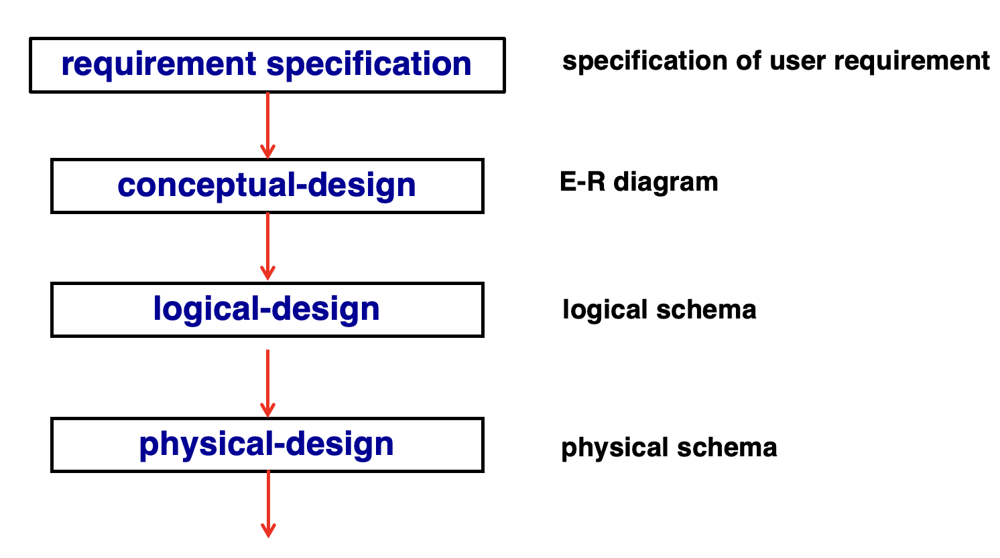

## 1. Design phases
- 初始阶段(需求规范)：充分描述潜在数据库用户的数据需求
- 第二阶段(概念设计)：选择数据模型
    - 应用所选数据模型的概念
    - 将这些需求转换为数据库的概念模式
    - 完全开发的概念模式代表了企业的功能要求：描述对数据执行的操作(或事务)类型
- 最后阶段(数据库设计)：从抽象数据模型转向数据库的实现
    - 逻辑设计(Logical Design)：决定书苦苦模式
        - 数据库设计要求我们找到一个"好的"关系模式集合
        - 业务决策——我们应该在数据库中记录哪些属性
        - 计算机科学决策——我们应该拥有哪些关系模式，以及属性应该如何在各种关系模式之间分配
    - 物理设计——决定数据库的物理布局

## 2. Design Alternatives
- 在设计数据库架构时，我们必须确保避免两个主要陷阱
    - 冗余：糟糕的设计可能会导致重复的信息
        - 信息的冗余表示可能会导致各种信息副本之间的数据不一致
    - 不完整：糟糕的设计可能会使企业
- 避免糟糕的设计是不够的。可能有很多好的设计让我们必须从中进行选择
- 数据库设计可能是一个具有挑战性的问题
    - 巨大的设计空间
## 3. Design Approaches
- 实体关系模型
    - 将企业建模为实体和关系的集合
    - 实体：可以与其他对象区别开来的事物或对象
        - 由一组属性描述
    - 关系：多个实体之间的关联
    - 用实体关系图以图示方式表示
- 归一化理论
    - 正式确定哪些设计是坏的，并对其进行测试

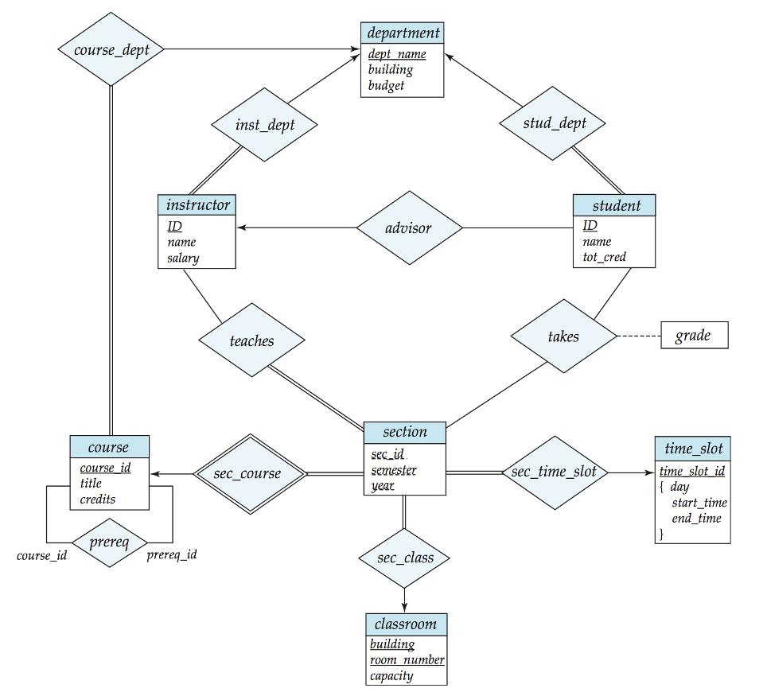  
- 一个方形款就是一个实体的集合
- 实体与实体之间有关系，一个菱形框表示关系
    - 一对一(↔)
    - 多对一(→)
    - 一对多(←)
    - 这里`instructor`属性不需要`dept`属性，因为在`department`实体里有了，否则会冗余
- 每个实体直接转换为关系模式。关系转换为元组，元素为两个表的`foreign key`.对于一对多的情况(如`instructor`和`department`)转换后primary key仍为ID
- 为了减少表的数量可以把主键相同的表合并
- 双横线与单横线
    - 双横线表示每个对象都必须参与关系，而单横线则表示对象可以不参与关系。
    - 如`course_dept`和`course`为双横线，则表示每一个课程都要对应一个开课部门，而`department`和`course_dept`为单横线，说明有的院系可以不开设课程
- 有些联系是隐含的，如授课老师和听课的同学
- `section`不足以唯一确定元组，称为弱实体(weak entity)，依赖于另一个实体，因为`course_id`放在`section`会有冗余，因此没有这个属性，导致形成一个弱实体(对应的relation要加上双框)，`section`不能离开`course`存在
- `relationship`上也可以带属性，如`takes`上的`grade`
- 关系双方可以是相同的实体集合，`course`这里的`preeq`是多对多，表示一门课可以有多门预修课，一门课也可以是多门课的预修课。{}里面是多个值，表示复合属性。这里表示`time_slot_id`实际上可以由这三个属性复合而成

## 4. Database Modeling
### 4.1 Entities

- 数据库可以建模为：
    - 实体的集合
    - 实体之间的关系
- 实体是存在且可以与其他对象区分开来的对象，如特定人员、公司、事件、工厂
- 实体具有属性，如对于一个人来说，有地址、姓名、性别等
- 实体集是一组共享相同属性的相同类型的实体，如所有人员、公司、树、假日的集合
- 实体集可以按如下方式以图形方式表示
    - 实体集以矩形框表示
    - 实体矩形内列出的属性
    - 下划线表示主键属性
    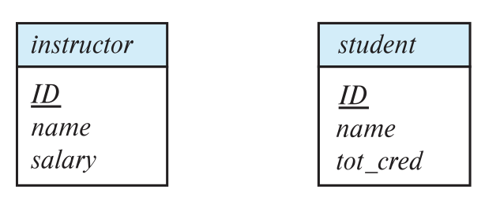

### 4.2 Relationship Sets
- 关系是多个实体之间的关联

- 关系集是$n \geq 2$个实体之间的数学关系，每个实体都取自实体集，即${e_1,e_2,...,e_n|e_1 \in E_1,e_2 \in E_2,...,e_n \in E_n}$,其中$(e_1,e_2,...,e_n)$是一个关系
    - 按照上面的例子，$(44553,22222) \in advisor$

 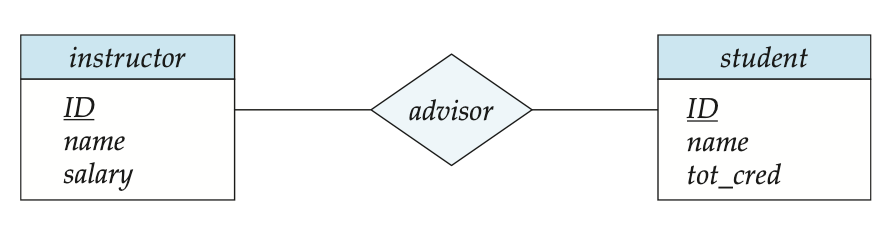

 ### 4.3 Relationship Set with Attributes

 关系集也可以有属性，例如实体集instructor和student之间的advisor关系集就可能具有属性date,该属性跟踪student开始与advisor关联的时间

 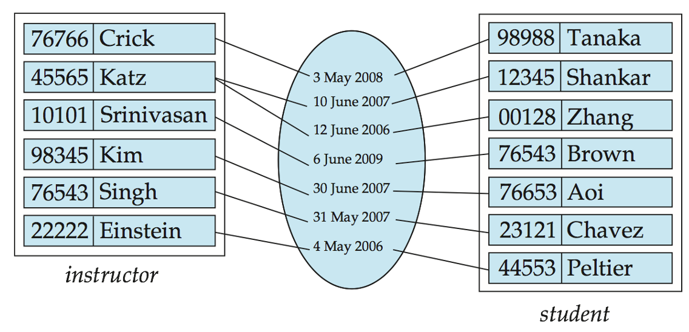
 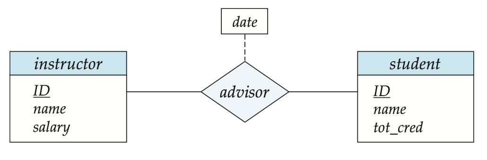

 ### 4.4 Role
 - 关系的实体集不需要是不同的
    - 实体集的每次出现都在关系中扮演一个`Role`
- 标签`course_id`和`prereq_id`都被称为`Role`

### 4.5 Degree of a Relationship Set
- 二元联系(Binary Relationship)
    - 涉及两个实体集(或称为degree=2)
    - 数据库系统中的大多数关系都是二元的
- 在某些情况下，将关系表示为非二元关系会更方便

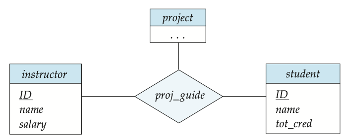

### 4.6 Attributes
- 实体由一组属性表示，这些属性是实体集的所有成员都拥有的属性
    - `instructor = (ID, name, street, city, salary)`,`course = (course_id, title, credits)`
- 域(domain)---每个属性的允许值集
- 属性类型
    - Simple和Composite属性
    - 单值(Single-valued)和多值(Multi-valued)属性 eg.phone_numbers,可以同时拥有多个电话号码，所以电话号码这一属性不一定只有一个值
- 派生(Derived)属性
    - 可以从其他属性计算
    - eg.给定date_of_birth，可以计算出年龄

    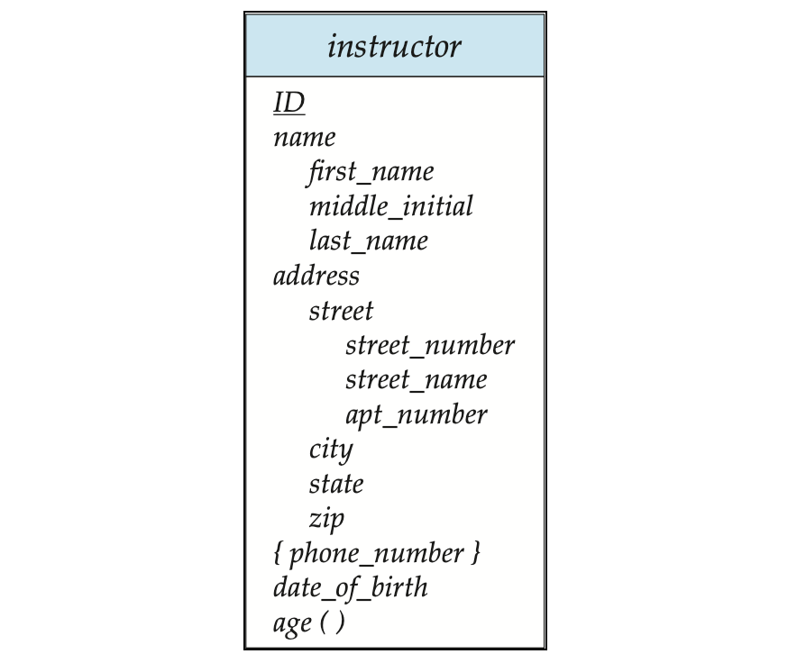

### 4.7 Mapping Cardinality Constraints
- 二元关系集的映射基数约束表示另一个实体可以通过关系集关联到实体数
- 在描述二元关系时最有用
- 对于二元关系集，映射基数必须是一对一、一对多、多对一、多对多类型之一
- 我们通过在关系集和实体集之间绘制一条有向线（→）表示“一”，用一条无向线（-）表示“多”

#### 4.7.1 One-to-One Relationships
- 教师和学生之间的一对一关系：
    - 一个学生通过advisor**最多**与一名教师关联，可以没有
    - 一名教师通过advisor**最多**与一名学生关联，可以没有

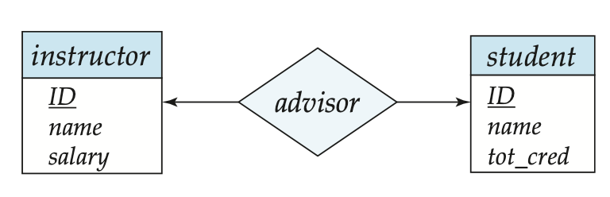

#### 4.7.2 One-to-Many Relationships
- 教师和学生之间的一对多关系：
    - 一名教师通过advisor与多个(包括0个)学生关联
    - 一个学生通过advisor最多与一名教师关联

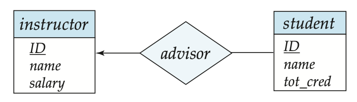

#### 4.7.3 Many-to-One Relationships
- 教师和学生之间的多对一关系
    - 一名教师通过advisor最多与一名学生关联
    - 一名学生通过advisor与多个(包括0个)教师关联

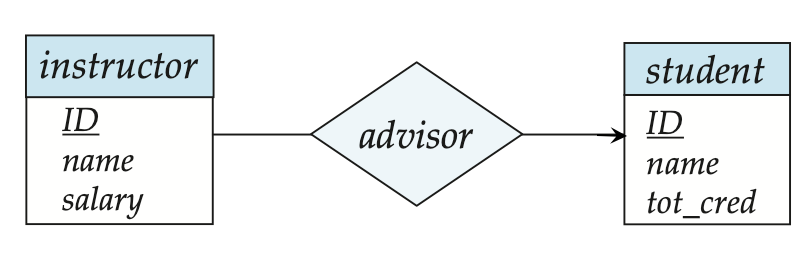

#### 4.7.4 Many-to-Many Relationships
- 教师和学生之间的多对多关系
    - 一名教师通过advisor与多个(包括0个)学生关联
    - 一名学生通过advisor与多个(包括0个)教师关联

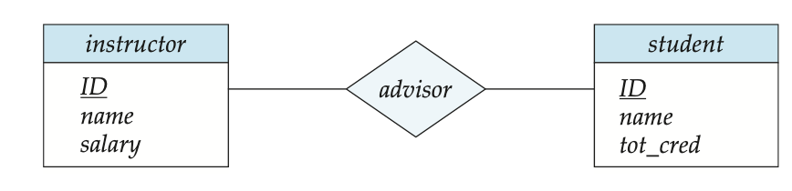

### 4.8 Total and Partial Participation
- 完全参与(Total Participation)通常使用双线表示，表示实体集中的每个实体都至少参与关系集中的一个关系
    - 例如每一个学生都应当至少有一个相关的advisor
    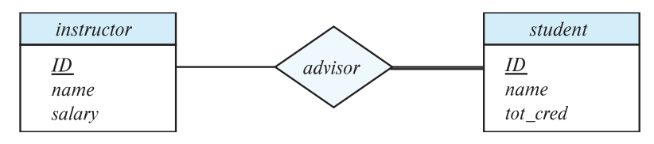
- 部分参与(Partial Participation)通常使用单线表示，表示某些实体可能不参与关系集中的任何关系
    - 例如一个教师可能没有相关的advisor
- 一条线可能具有关联的最小和最大的基数，以l..h的形式表示关系，其中l是最小基数，h是最大基数
    - 最小值是1表示完全参与
    - 最大值是1表示实体最多参与一个
    - 最大值*表示无限制
    - 例如，教师可以为0个或更多学生提供建议。学生必须有一名advisor,不能有多个advisor
    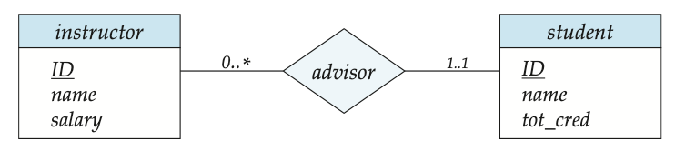
- 我们最多允许三元(或更高度数)关系中的一个箭头 来表示基数约束
- 例如，proj_guide到instructor的箭头表示每个学生最多有一个项目的instructor
    - 原因：这与主键的解释有关。假设有如下关系图，那么对该关系图的主键解释有两种
    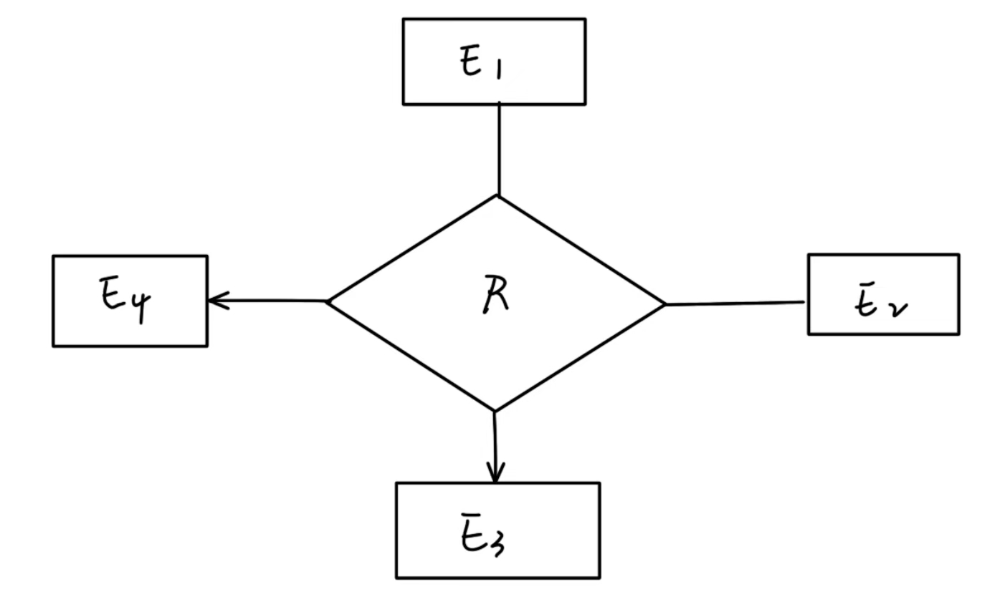
    - 来自$E_1,E_2$的一个特定实体组合可以和至多一个来自$E_3,E_4$的实体组合相关联。因此，联系R的主键可以用主键$E_1,E_2$的并集来构造
    - 来自$E_1,E_2,E_3$的一个特定实体组合至多可与来自$E_4$的一个实体组合相关联，那么，可以用$E_1,E_2,E_3$主键的并集构成R的主键。$E_1,E_2,E_4$的主码的并集也是如此
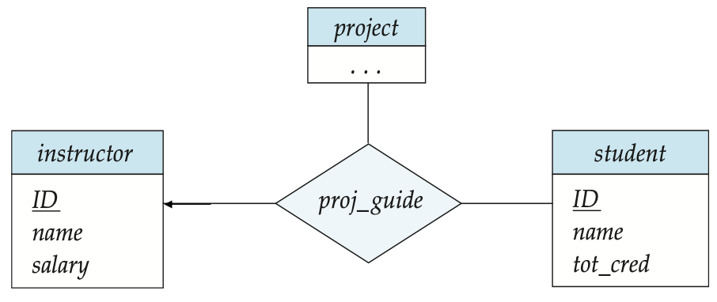

### 4.9 Primary Key
- 主键提供了一种指定如何区分实体和关系的方法，我们将考虑实体集、关系集、弱实体集
- 根据定义 各个实体是不同的
- 从数据库的角度来看，它们之间的差异必须用它们的属性来表示
- 实体的属性值必须使其能够唯一标识实体
    - 实体集中的任何两个实体集都不允许所有属性具有完全相同的值
- 实体的键就是一组足以将实体区分开来的属性
- 为了区分关系集的各种关系，我们使用关系集中实体的各个主键
    - 设R为涉及实体集$E_1,E_2,...,E_n$的关系集
    - R的主键由$E_1,E_2,...,E_n$的各个主键组成
    - 如果关系集R具有与其关联的属性$a_1,a_2,...,a_m$，则R的主键还包括属性$a_1,a_2,...,a_m$
    - eg.advisor关系集的主键是instructor.ID和student.ID:
    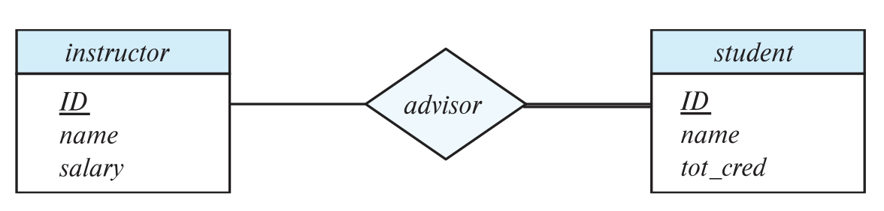
- 关系集的主键选择取决于关系集的映射基数
    - 如果二元关系为一对一关系，任一参与实体集的主键都可以构成一个最小超级键(Minimal Superkey),并且可以选择其中任意一个作为主键
    - 如果二元关系为一对多关系或多对一，“多“关系一端的主键是最小超级键，作为主键
    - 如果二元关系为多对多关系，两个实体集的主键的并集是最小超级键

### 4.10 Weak Entity Sets
- 没有主键的实体集称为弱实体集
- 弱实体集的存在取决于表示性实体集(Identifying Entity Set)的存在
    - 它必须通过从表示到弱实体集的一对多关系集与标识实体集相关
    - 我们使用双菱形来描绘的标识性联系(Identifying Relationship)
- 弱实体集的分辨符(Discriminator，或称为部分键)是指当弱实体集所依赖的标识实体已知时区分实体集的所有实体的属性集
- 我们用虚线为弱实体集的分辨符画下划线
- 我们将弱实体的识别关系放在双菱形中

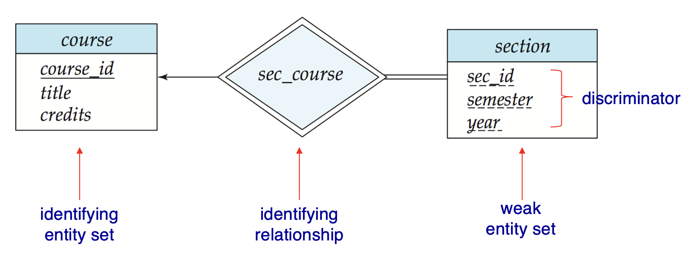

注意：强实体集的主键不会与弱实体集一起显式存储，因为它隐含在标识关系中

如果显式存储`course_id`则section可以成为强实体，但section和course之间的关系将由course和section通用属性定义的隐式关系course_id复制

### 4.11 Rebundant Attributes
- 假设我们有实体集
    - student，属性为：ID, name, tot_cred, dept_name
    - department，属性为：dept_name, building, budget
- 我们使用关系集stu_dept对每个学生都有一个关联部门这一事实进行建模
- 下面student中的属性dept_name复制了关系中存在的信息，因此是多余的，并且需要被删除
- 但是，当转换回表时，在某些情况下，该属性会重新引入

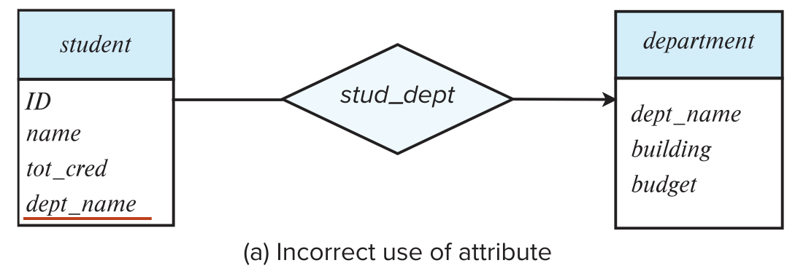

## 5. Reduction to Relational Schemas
- 实体集和关系集可以统一表示为表示数据库内容的关系架构
- 符合E-R图的数据库可以由架构集合表示
- 对于每个实体集和关系集，都有一个唯一的架构，该架构分配有相应的实体集或关系集的名称
- 每个架构都有许多列(通常对应于属性)，这些列具有唯一的名称

### 5.1 Representing Entity Sets with Simple Attributes
- 强实体集简化为具有相同属性的架构
- 弱实体集将变成一个表，该表包含标识强实体集的主键
    - 表的主键是弱实体集的分辨符与标识强实体集的主键的并集

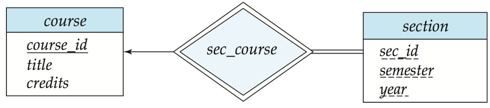
- section表的主键是`(course_id,sec_id,semester,year)`

### 5.2 Representing Relational Sets

一个多对多关系表示为一个架构，其中包含两个参与实体集的主键的属性

- e.g.对于一个关系集advisor的模式：advisor=(<u>s_id,i_id</u>)

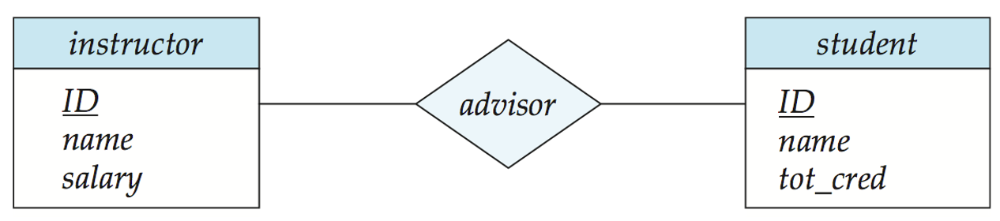

### 5.3 Rebundancy of Schemas
在多段总计的多对一和一对多关系集可以通过向"多"的一段添加一个额外的属性来表示，该属性包含“一”一端的主键

- e.g. 将关系集inst_dept创建模式稀释到两个实体集中

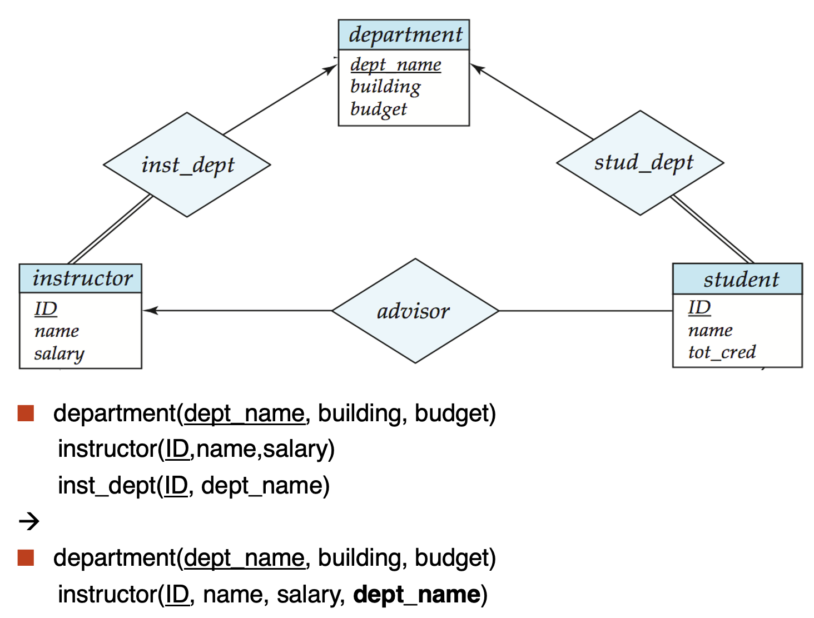

- 对于一对一关系集，可以选择任何一方作为“多”的一端
    - 也就是说，可以将更多的属性添加到与两个实体集对应的任意表中

- 如果参与在“多”的一端是部分参与，则在与“多”的一端对应的模式中用额外的属性替换模式可能会导致null值
- 与将弱实体集链接到其标识的强实体集的关系集对应的模式是多余的
    - e.g.section模式已包含将显示在sec_course模式中的属性

### 5.4 Composite and Multivalued Attributes
- 通过为每个组件属性创建单独的属性来扁平化复合属性
    - 就像在C语言里定义了一个结构，但是关系数据库里每个属性都必须是简单数据类型，就必须把这些复合属性铺平
    - e.g.给定的实体集instructor,first_name, last_name 与实体集对应的模式具有两个属性 name_first_name 和 name_last_name
    - 如果没有歧义，则省略前缀
    - 忽略多值属性，扩展instructor模式为：instructor(ID, first_name, middle_initial,  last_name, street_number, street_name, apt_number, city, state, zip_code,     date_of_birth, age)
        - phone_number属性被省略
- 实体E的多值属性M由单独的模式EM表示
    - 模式EM具有对应于E的主键的属性和对应域多值属性M的属性
        - e.g.instructor的多值属性phone_number由模式inst_phone表示：inst_phone(<u>ID,phone_number</u>)
    - 多值属性的每个值都映射到模式EM上关系的单独元祖
        - e.g.主键为222222，456-7890 和 123-4567 的 instructor 实体映射到两个元组：(22222,456-7890)和(22222,123-4567)
- 特殊情况：实体time_slot只有一个除主键属性之外的属性，并且该属性是多值的
    - time_slot(<u>time_slot_id</u>,{day,start_time,end_time})可以被拆分为
        - time_slot(<u>time_slot_id</u>)
        - time_slot_details(<u>time_slot_id,day,start_time</u>.end_time)
    - 优化：不创建实体对应的关系，time_slot_details(<u>time_slot_id,day,start_time</u>.end_time)
- 但是因为这个优化使得time_slot属性不能是外键，可能需要用trigger来实现

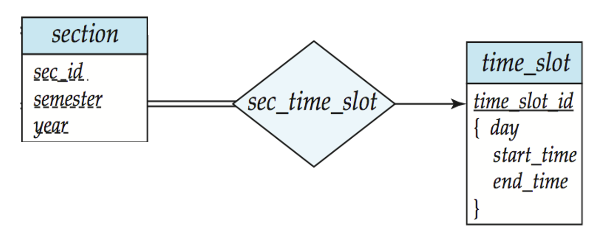

## 6. Design Issues

### 6.1 Common Mistakes in E-R Diagrams
- 信息冗余 

> student的dept_name应该去掉

- 关系属性使用不当

> 这是一门课，可能会有很多次作业，不能只用一个实体
>
> 

### 6.2 Placement of Relationship Attributes

- 第一种方法：可以记录每次访问日期
- 第二种方法：只能记录用户最近一次访问日期，不完整

### 6.3 Binary VS Non-Binary Relationships
- 尽管可以用多个不同的二元关系集替换任何非二元关系集，但n元关系集可以更清楚地显示多个实体参与单个关系
- 一些看起来非二元的关系可能更适合使用二元关系来表示
    - 例如，将孩子与他的父亲和母亲联系起来的三元关系父母最好用两种二元关系来代替
    - 使用两个二元关系允许出现部分信息(例如，只有母亲知道的信息)
- 但是有些关系天生就是非二元的

### 6.4 Converting Non-Binary Relationships to Binary Form
通常，任何非二元关系都可以通过创建人工实体集来使用二元关系来表示

- 将实体集 A、B 和 C 之间的 R 替换为实体集 E 和三个关系集：

- 为E创建特殊标识属性
- 将R的所有属性添加到E
- 对于每一个R中的关系$(a_i,b_i,c_i)$
    - 在实体集E这种建立新实体$c_i$
    - 将$(e_i,a_i)$添加到$R_A$;将$(e_i,b_i)$添加到$R_B$;将$(e_i,c_i)$添加到$R_C$
- 我们还需要转换所有的约束
    - 可能无法转换所有约束
    - 已翻译的模式中可能不存在不能对应于R的任何实例
    - 我们可以通过使 E 成为由三个关系集标识的弱实体集来避免创建标识属性

### 6.5 E-R Desogn Decisions
- 使用属性或实体集来表示对象
- 实际概念是用实体集还是关系集最好地表达
- 使用三元关系或二元关系
- 使用强实体集或弱实体集

### 6.6 Extended ER Features
- 特化(Specialization)
    - 自上而下的设计过程：我们再实体集中指定与几何中的其他实体不同的子分组
    - 属性继承：较低级别的实体集继承其链接到的较高级别实体集的所有属性和关系参与
- 概化(Generalization)
    - 自下而上的设计过程：相同特征的多个实体集合并到更高级别的实体集中
- 特化和概化是彼此的简单倒置，它们在E-R图中以相同的方式表示
- 术语特化和概化可以互相使用

- 特化和概化的设计约束
    - 对实体是否可以属于单个概化中的多个较低级别实体集的约束
        - 不相交(Disjoint)
            - 一个实体只能属于一个较低级别的实体集
            - 在E-R图中，通过让多个较低级别的实体集链接到同一个三角形来表示
        - 重叠(Overlapping)
            - 一个实体可以属于多个较低级别的实体集
    - 完全性约束(Completeness Constraint)
        - 指较高级别实体集中的实体是否必须至少属于概化中的至少一个较低级别实体集
            - 全部(Total):实体必须属于较低级别的实体集之一
            - 部分(Partial):实体不必属于较低级别的实体集之一