# Chapter 7: Relational Database Design

## 7.1 Introduction

!!! Example
    我们有如下关系模式
    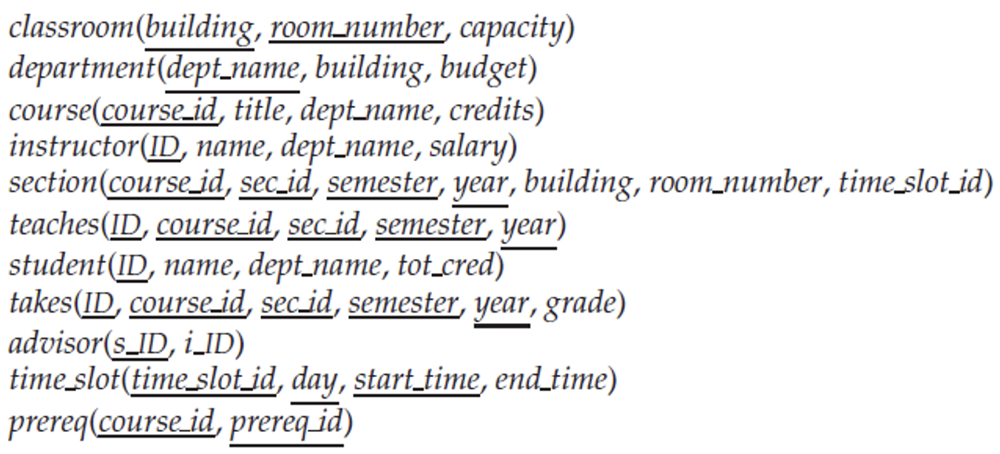

    如果我们想合并instructor和department，将会得到如下的信息

    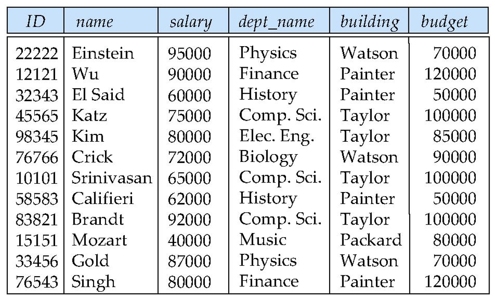

    这导致了数据冗余和重复的问题，因为ID和dept_name同样都能决定buildning和budget，而dept_name并非主键。这样合并而成的关系是不好的，因为重复信息有可能会造成冲突不一致的问题

    非侯选建最好不能决定其它属性

一个不好的关系模式有如下特征：
- 信息重复(Information Repetition)
- 插入困难(Insertion Anomalies)
- 更新困难(Update Dfficulties)

## 7.2 Decomposition

### 7.2.1 Decomposition
分解(Decomposition)就是将一个(往往包含冗余信息的)模式拆分成几个更小的模式。我们希望通过这样的分解，将一个包含冗余信息的模式分为几个没有冗余信息的小模式。

- 有时分解得到的模式都是不冗余的，但是通过自然连接将它们拼好得到的模式包含了更多冗余的，甚至是没有意义的信息。我们成这样的分解为有损分解(Lossy Decomposition),相对应的就是无损分解(Lossless Decomposition)

!!!Example
    !!! example "Lossy Decomposition"
        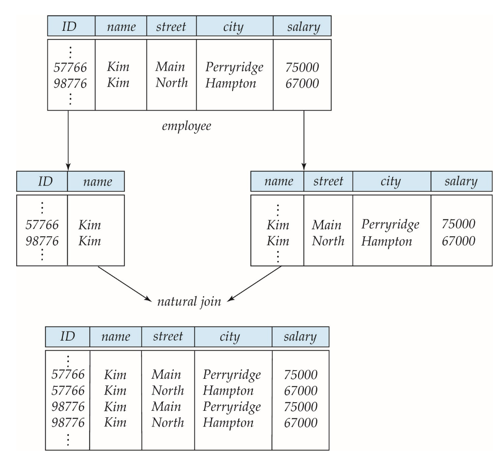
        分解过后的结果自然连接得到了非常多冗余甚至是错误的信息
    !!! example "Lossless-Join Decomposition"
        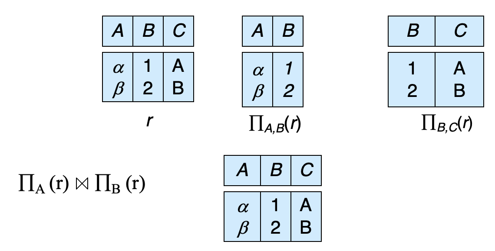
        我们可以用形式化的语言来描述无损分解：令R为一个关系模式，$R_1,R_2$是R分解得到的模式，也就是说$R=R_1\cup R_2$。如果用$R_1,R_2$替代R后没有出现信息损失，即$\prod_{R_1}(r)\Join\prod_{R_2}(r)=r$那么这种分解称为无损分解

### 7.2.2 Devise a Theory for the Following

> 这个准则能帮助我们判断什么样的关系是好的

- 如果关系R不是好的形式，则将其分解为一组关系${R_1,R_2,...R_n}$,满足：
    - 每一个关系$R_i$都是好的形式
    - 分解为无损分解
- 这个理论的基础是
    - 函数依赖关系
    - 多值依赖关系
- 范式(Normal Form)
    - 1NF->2NF->3NF->BCNF->4NF

## 7.3 Functional Dependencies

函数依赖(Functional Dependencies)是用于识别关系中唯一特定属性值的一组约束。对于关系模式r(R)机器属性$\alpha , \beta \subseteq R$:

- 对于r(R)的一个实例，如果对于其所有的元组对$t_1,t_2$,当$t_1[\alpha]=t_2[\alpha]$时，$t_1[\beta]=t_2[\beta]$，那么称该实例满足函数依赖$\alpha\rightarrow\beta$
- 若r(R)上所有的实例均满足函数依赖$\alpha\rightarrow\beta$,则称$\alpha\rightarrow\beta$在r(R)上有效(Hold)
    - 所以可能会存在某个实例满足一些不在整个关系模式中有效的函数依赖的情况

!!! example
    存在一个学生表，学号相同的两个同学性别一定是相同的，这就是一种函数依赖

我们可以用函数依赖的概念重新定义Super Key:如果$K\rightarrow R$在r(R)上有效，那么K就是r(R)的超键

函数依赖的用途：
- 检验关系实例是否满足某个给定的函数依赖
- 为某组合法关系指明约束，这样我们仅考虑那些满足函数依赖的关系实例即可

对于某个函数依赖$\alpha\rightarrow\beta$，如果$\beta\subseteq\alpha$，那么这个函数是平凡的(Trivial)

!!! note
    
    - 主属性与非主属性
        - 包含在任何一个候选码中的属性称为主属性(Prime Attribute)
            - 即使最终没有成为主码，候选码中的属性也是主属性
        - 不包含在任何码中的属性称为非主属性(Non-Prime Attribute)
### 7.3.1 Closure

**closure of Functional Dependencies**:给定一组函数依赖F，F在逻辑上可能包含了其他的函数依赖项。例如，如果$A\rightarrow B,B\rightarrow C$，$A\rightarrow C$

我们定义F在逻辑上隐含的所有函数依赖关系的集合是F的闭包(Closure)，记作$F^+$是F的超集

### 7.3.2 Armstrong Axioms(阿姆斯特朗公里)

- 作用：获得一个集合的闭包
- 内容
    - 自反律(Reflexivity):如果$\beta\subseteq\alpha$,那么$\alpha\rightarrow\beta$
    - 增补率(Augmentation):如果$\alpha\rightarrow\beta$，那么$\gamma\alpha\rightarrow\gamma\beta$
    - 传递率(Transitivity):如果$\alpha\rightarrow\beta,\beta\rightarrow\gamma$,那么$\alpha\rightarrow\gamma$

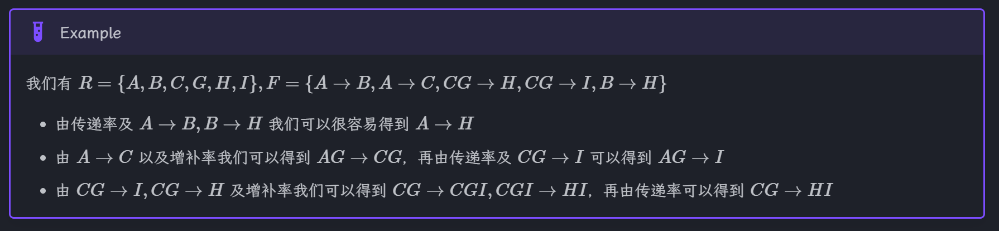

- 衍生定理
    - 合并(Union):如果$\alpha\rightarrow\beta,\alpha\rightarrow\gamma$,那么$\alpha\rightarrow\beta\gamma$
    - 分解(Decomposition):如果$\alpha\rightarrow\beta\delta$,那么$\alpha\rightarrow\beta,\alpha\rightarrow\delta$
    - 伪传递(Pseudo-Transitivity),如果$\alpha\rightarrow\beta,\beta\gamma\rightarrow\delta$,那么$\alpha\gamma\rightarrow\delta$

- 我们可以用如下思路来计算$F^+$

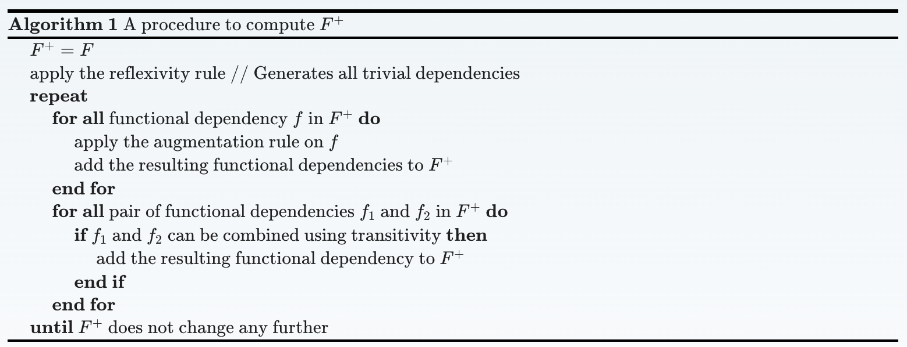

### 7.3.3 Closure of Attribute Sets

给定一组属性$\alpha$，将F下的$\alpha$的闭包(用$\alpha^+$表示)定义为由F下的$\alpha$在函数下确定的属性集

- 计算机算法：
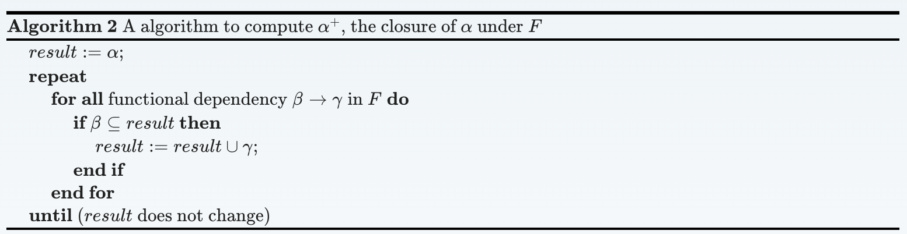

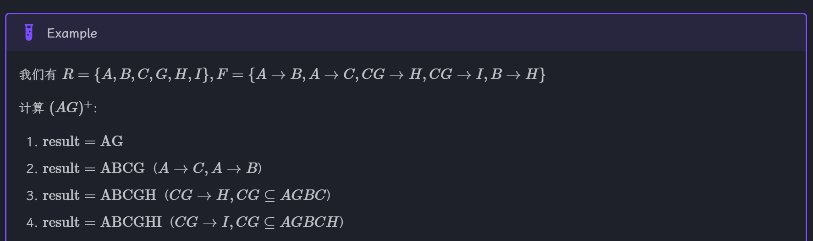

### 7.3.4 Uses of Attribute Closure

在最坏的情况下，属性闭包算法的时间复杂度是F大小的二次方，通常会比直接计算$F^+$更快。该算法有以下几种用途：

- 检验$\alpha$是否为超键：计算$\alpha^+$，如果$\alpha$包含了R的所有属性,那么$\alpha$是r(R)的超键
- 检验函数依赖$\alpha\rightarrow\beta$是否有效：通过检查$\beta\subseteq\alpha^+$实现
- 提供另一种计算$F^+$的方法:$\forall\gamma\subseteq R$，找到其闭包$\gamma^+$，然后$\forall S\subseteq\gamma^+$,得到函数依赖$\gamma\rightarrow S$

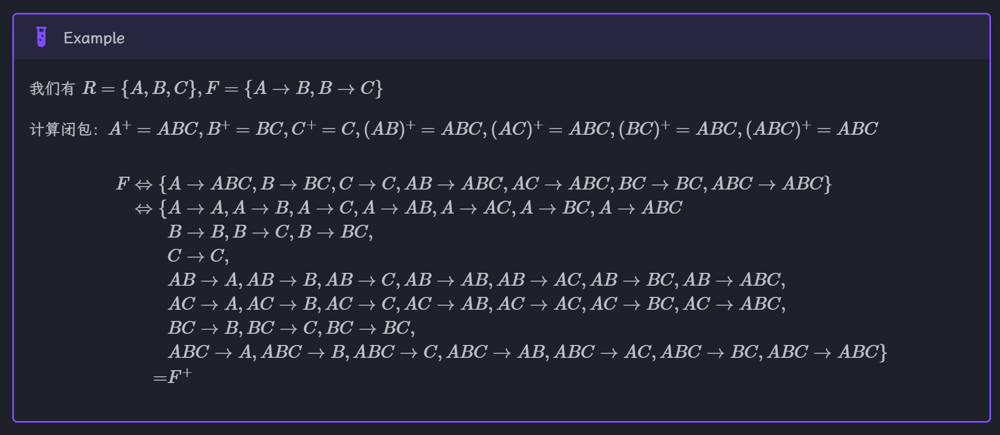

### 7.3.5 Canonical Cover

函数依赖集当中可能会有冗余的一下依赖关系，可以从其他依赖关系退出来，例如在$\{A\rightarrow B,B\rightarrow C,A\rightarrow C\}$中$A\rightarrow C$就是冗余的；也有可能某些依赖关系还可以进行进一步简化。例如在$\{A\rightarrow B,B\rightarrow C,A\rightarrow CD\}$中，$A\rightarrow CD$可以进一步简化为$A\rightarrow D$

我们定义F的**正则覆盖(Canonical Cover)**为F的"最小"功能依赖关系集，没有冗余的依赖关系或依赖关系的冗余部分

规范化来说，F的正则覆盖是一组依赖关系$F_c$，满足：

- F逻辑蕴含$F_c$中的所有依赖项
- $F_c$逻辑蕴含F中的所有依赖项
- $F_c$中没有函数依赖项包含多余属性(Extraneous Attributes)
- $F_c$中函数依赖关系的左侧都是唯一的

!!! Note "Extraneous Attributes"
    考虑函数依赖集合F以及其中的一个函数依赖$\alpha \rightarrow \beta$
    - 左侧属性的移除：对于属性$A\in \alpha$,当F逻辑蕴含$(F−\{\alpha\rightarrow\beta\})\cup\{(\alpha−A)\rightarrow\beta\}$时，A是$\alpha$内的多余属性
    !!! Example 
        给定$F=\{A\rightarrow C,AB\rightarrow C\}$，那么B在$AB\rightarrow C$中是多余的，因为$\{A\rightarrow C,AB\rightarrow C\}$逻辑蕴含$A\rightarrow C$
    - 右侧属性的移除：对于属性$A\in\beta$,当$(F−\{\alpha\rightarrow\beta\})\cup\{(\alpha\rightarrow(\beta−A))\}$逻辑蕴含F时，A是$\beta$内的多余属性
    !!! Example 
        给定$F=\{A\rightarrow C,AB\rightarrow CD\}$,那么C在$AB\rightarrow CD$中是多余的
    - 上述关于逻辑蕴含的语句到过来表述也是对的(因为有自反律)

- 计算F的曾泽覆盖的算法：

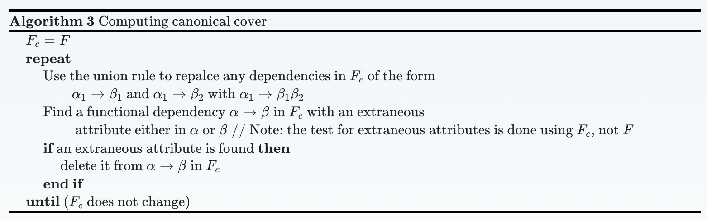

- 因为该算法允许选择任意的多余属性，因此可能会得到多种正则覆盖，而这些正则覆盖都是等价的

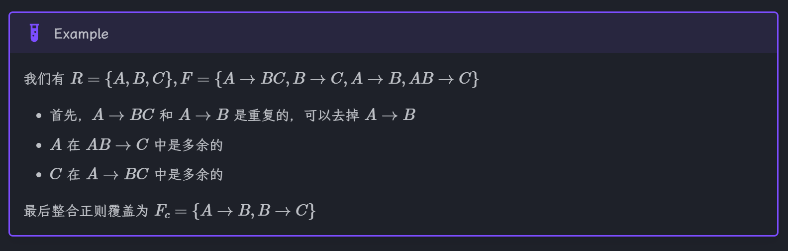

## 7.4 Normal Forms
### 7.4.1 Boyce-Codd Normal Form(BCNF)

Boyce-Codd范式，能够基于函数依赖消除全部的冗余。关于函数依赖集合F的关系R，对于所有的在$F^+$的函数依赖$\alpha\rightarrow\beta$，其中$\alpha\subseteq R,\beta\subseteq R$,至少满足一下条件之一时，称R遵循BCNF:

- $\alpha\rightarrow\beta$是一个平凡的函数依赖
- $\alpha$是模式R的超键

显然，人一直有两个属性的模式必然遵守BCNF，对于不遵守BCNF的模式(即至少有一个非平凡的函数依赖$\alpha\rightarrow\beta,\alpha$不是R的超键)，我们需要对其进行分解为：

- $\alpha\cup\beta$
- $R-(\beta-\alpha)$

当然可能只分解一次还是会出现不遵守BCNF的模式，那就对其再次分解，知道结果都遵循BCNF为止

我们使用如下思路来计算BCNF

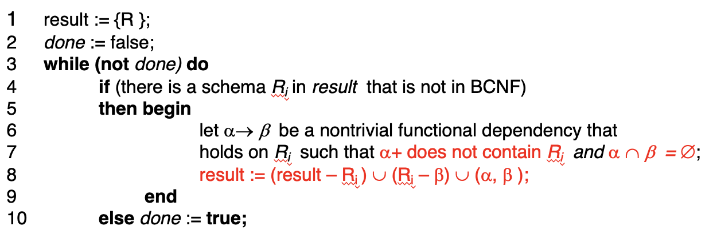

- 其中每一个$R_i$都是遵守BCNF的，且分解均为无损分解

!!! example
    对于关系$R={A,B,C,D}$有函数依赖集$F={A\rightarrow B,B\rightarrow CD}$

    (a) 列出所有关系的候选键

    (b) 将关系分解为一些 BCNF 关系的集合，且分解为无损分解

    ??? answer
        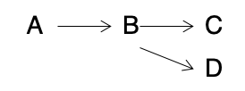

        (a) A

        (b) $R_1= \{B,C,D \}, R_2=\{A,B\}, F_1=\{B\rightarrow CD\}, F_2=\{A\rightarrow B\}$
    
### 7.4.2 Dependency Preservation

令F为模式R的一个函数以来集合，$R_1,R_2,...,R_n$为R的一个分解，那么针对$R_i$的F的**限制(Restriction)**，$F_i$是一个来自$F^+$的集合，但是仅包含$R_i$中出现的属性。检查这些限制集合$F_1,F_2,\cdots,F_n$ 相比检查F会更高效。令$F'=F_1\cup F_2\cup\cdots\cup F_n$,通常来说$F'\neq F$,但即便确实如此，也很有可能满足$F'^+=F^+$,那么此时在F中的每个依赖都被F'逻辑蕴含，所以验证F'就相当于验证了F。我们称具备这种性质的分解为依赖保留分解（Dependency-Preserving Decomposition）

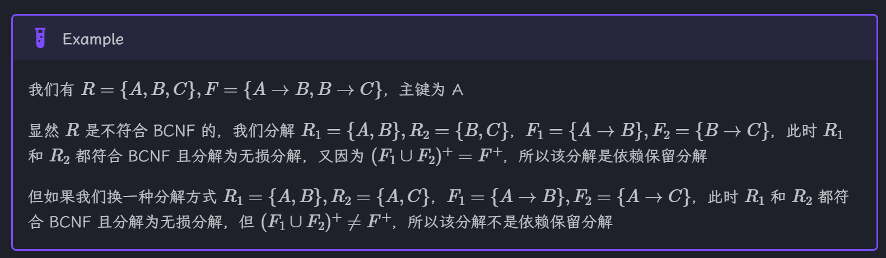

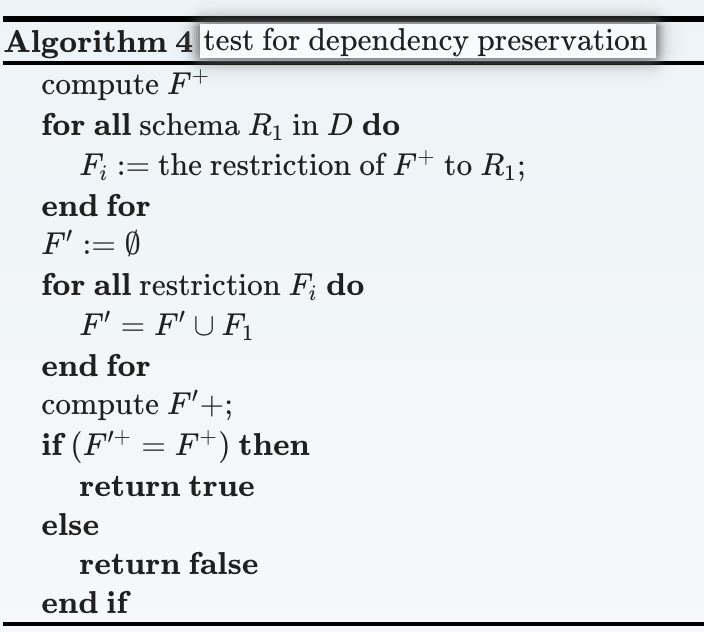

- 值得注意的是，我们并不总是能获得保留以来关系的BCNF分解

### 7.4.3 Third Normal Form

- 非主属性对主属性没有传递依赖的范式

关于函数依赖集合F的关系R，对于所有的$F^+$的函数依赖$\alpha\rightarrow\beta$,其中$\alpha\subseteq R,\beta\subseteq R$,至少满足以下条件之一时，称阿然遵循第三范式(Third Normal Form,简称3HF):

- $\alpha\rightarrow\beta$ 是一个平凡的函数依赖
- $\alpha$是模式R的超键
- 在$\beta-\alpha$内的每个属性A是R的(可能是不同)候选键的一个成员

可以看到，3NF的前两个条件和BCNF相同，只是新增了第三个条件，可以让那些左侧不是超键的非平凡函数依赖也有机会符合这个范式。这个更为松弛的条件使得3NF能够确保模式分解时仍然保留了原有的依赖

对比BCNF,3NF

- 优点：可以让关系模式在不牺牲无损或依赖保留的情况下遵循3NF
- 缺点：可能会带来null值，说明存在信息重复的问题

对3NF下的依赖保留的粘结算法如下

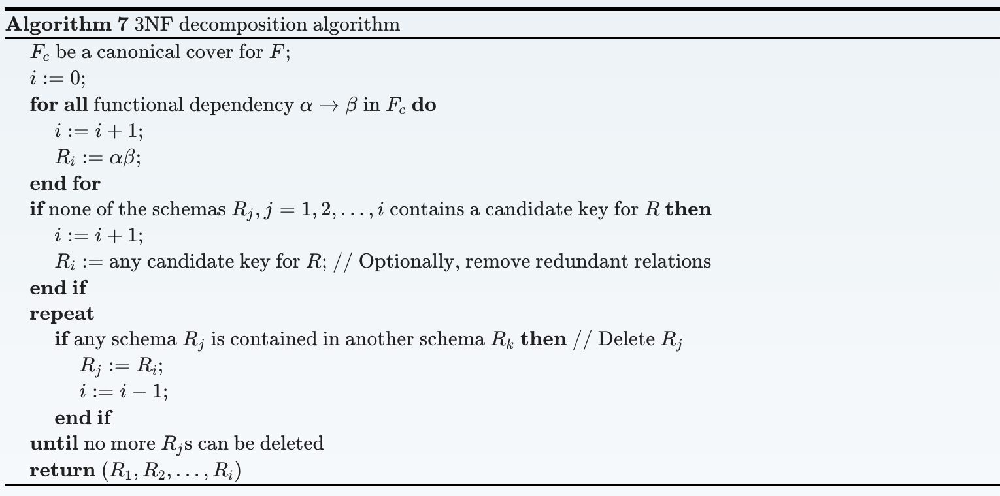

借助该算法，我们还可以重新设计BCNF算法：首先使用3NF算法，然后对于分解中不是BCNF的模式再次使用BCNF算法，如果得到的结果没能保留以来，那就回退到3NF的设计

3NF算法得到的结果是不唯一的，因为一个函数依赖集合里面可能包含多个正则覆盖。而且该算法可能会分解那些已经遵守3NF的关系，但是它们能够保证分解的结果还是遵守3NF的