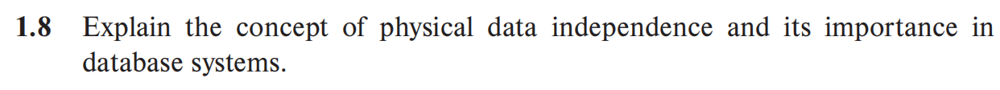
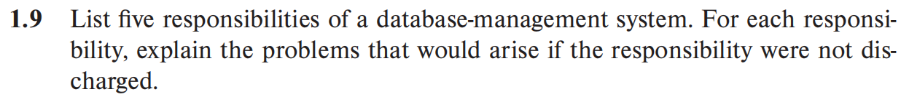

#  HW1

-  数据冗余与一致性：File-processing system 的数据会分散在多个文件中，会导致统一数据在不同文件中重复存储，导致数据冗余，数据的冗余会导致更新其中一个文件中的数据时，其他文件中的数据不能被及时更新，导致存在数据可能无法同步更新。DBMS通过集中管理数据可以最大限度地减少数据冗余，同时数据的集中管理可以确保数据更新的一致性
-  数据共享与并发控制：File-processing system 的文件彼此之间是独立的，难以实现多用户共享所有数据，同时在并发访问时，会导致数据冲突，数据可能会出现异常。DBMS可以通过有效的机制对并发访问进行管理，同时可以对多用户的共享权限进行开放。
-  数据安全性
File-processing system安全性较低，通常依赖操作系统的文件权限进行控制。DBMS有较强的安全机制，支持包括用户身份验证、权限管理和数据加密等一系列安全机制，充分确保了数据的安全性。
-  数据的孤立与抽象
File-processing system数据分散在不同文件中，这些文件可能具有不同的格式，因此编写新的应用程序来检索适当数据是很困难的。DBMS提供数据独立性，包括物理独立性和逻辑独立性，即存储方式和逻辑结构变化不会影响应用程序，DBMS通过数据抽象简化了数据的访问和管理


-  物理数据独立性是指应用程序与数据的物理存储方式之间的分离，说明数据库的物理存储结构发生变化时，不会影响到数据的Logical Level或者View Level。即指修改物理模式而不需要重写应用程序的能力。
-  物理数据独立性的重要性主要体现在
    - 简化应用程序的开发：应用程序只需要关注逻辑模式，而不需要关心数据的具体存储方式
    - 提高系统的可维护性：数据库管理员可以根据性能需求或硬件变化调整物理存储结构，不会影响应用程序的正常运行。
    - 支持性能优化：物理数据独立性允许数据库管理员在不改变应用程序的情况下优化存储结构。
    

- 与文件管理者进行交互，支持用户对数据进行操作：如果该职责不能履行，数据无法有效被储存或检索，影响数据的准确性和实时性
- 维护数据的完整性：DBMS通过完整性约束条件确保数据的完整性。如果不能维护，会导致数据的不一致性
- 并发控制：如果不能进行并发控制，当出现多个用户同时访问数据库时会导致数据竞争，从而破坏数据的一致性。
- 数据安全性：DBMS通过用户身份验证、权限管理和数据加密等一系列安全机制，充分确保了数据的安全性。如果不能保障数据安全性，会造成数据泄露、篡改或者丢失的问题。
- 备份与恢复：DBMS提供备份愈合恢复机制，如果该机制不能有效实施，那么当出现不可抗力因素时会造成数据的永久丢失造成巨大损失。


### 1. 用户表

```SQL
create table Users(
    UserID int primary key,
    Username varchar(20) not null,
    Password varchar(20) not null,
    Email varchar(50) not null
    First Name varchar(20),
    Last Name varchar(20),
    DateOfBirth date,
    ProfilePicture varchar(255), -- 存储图片的URL
    JoinDate datetime default current_timestamp
);
```
### 2. 好友关系表
```SQL
create table Friendships(
    DriendshipID int primary key,
    UserID int not null,
    Status enum('accepted','pending ') default 'pending', -- 好友的状态，已接收或未接收
    FriendshipDate datetime default current_timestamp,
    foreign key (UserID) references Users(UserID)
)
```

### 3. 帖子表
```SQL
create table Posts(
    PostID int primary key,
    UserID int not null,
    Content text not null,
    PostDate datetime default current_timestamp,
    LikeCount int default 0,
    CommentCount int default 0,
    foreign key (UserID) references Users(UserID)
)
```
