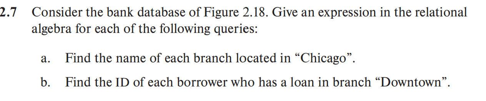
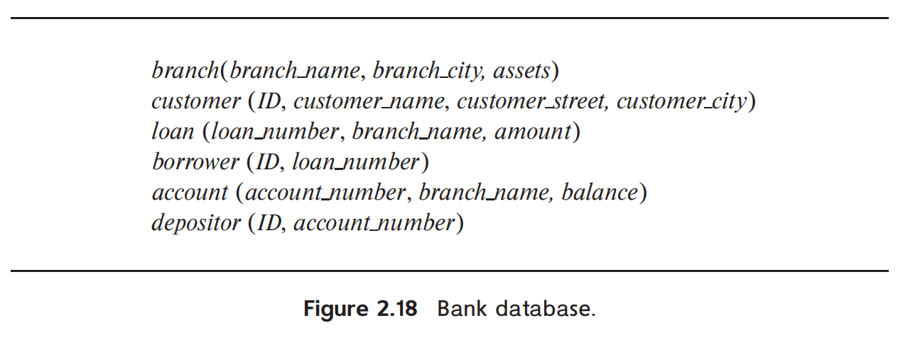
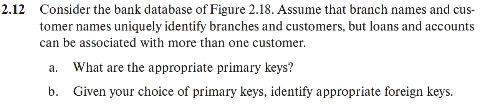
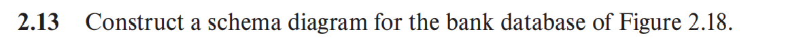
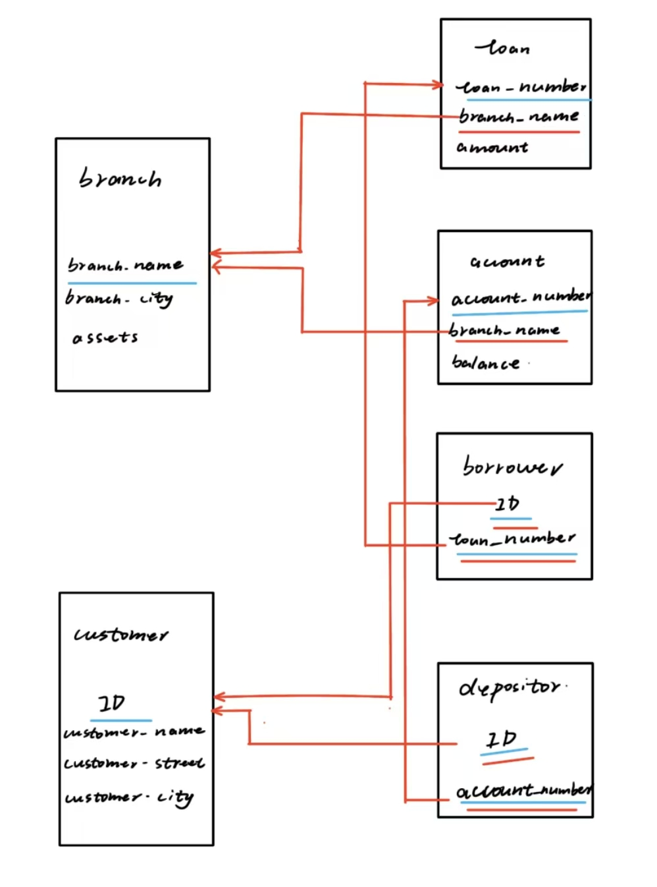
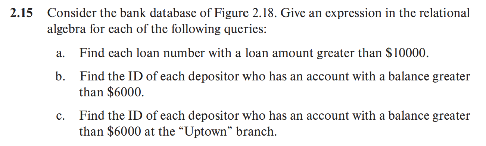

a. $\Pi_{branch.branch\_name}(\sigma_{branch\_city="Chicago"}(branch))$

b. $\Pi_{ID}(\sigma_{branch\_name = "Downtown"}(loan \bowtie_{loan.loan\_number = borrower.loan\_number} borrower))$

a.
---
branch($\underline{branch\_name}$, branch_city,assets)

customer($\underline{ID}$,customer_name,customer_street,customer_city)

loan($\underline{loan\_number}$,branch_name,amount)

borrower($\underline{ID}$,$\underline{loan\_number}$)

account($\underline{account\_number}$,branch_name,balance)

depositor($\underline{ID}$,$\underline{account\_number}$)

---

b.
---
- loan:branch_name -> branch
- borrower:loan_number -> loan,ID->customer
- account:branch_name -> branch
- depositor:account_number -> account,ID->customer
---

a. $\Pi_{loan\_number}(\sigma_{loan.amount>\$10000}(loan))$

b. $\Pi_{ID}(\sigma_{balance>\$6000}(depositor\bowtie_{depositor.ID=account.ID}account))$

c. $\Pi_{ID}(depositor\bowtie_{account.branch\_name=branch.branch\_name}(\sigma_{balance>6000∧
branch\_name="Uptown"}(account)))$