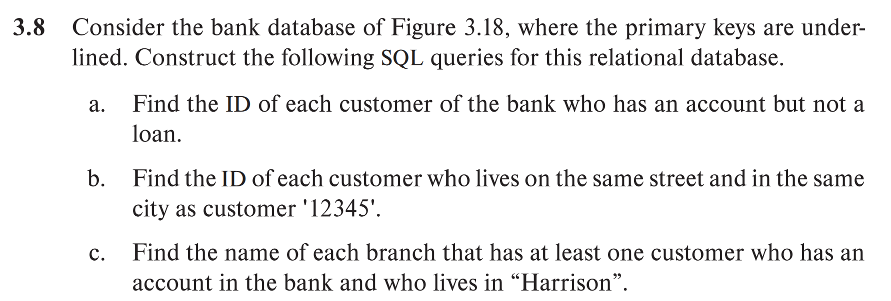
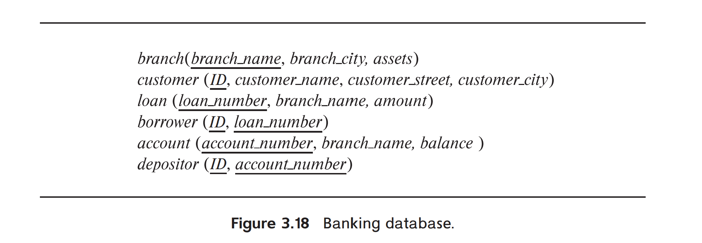
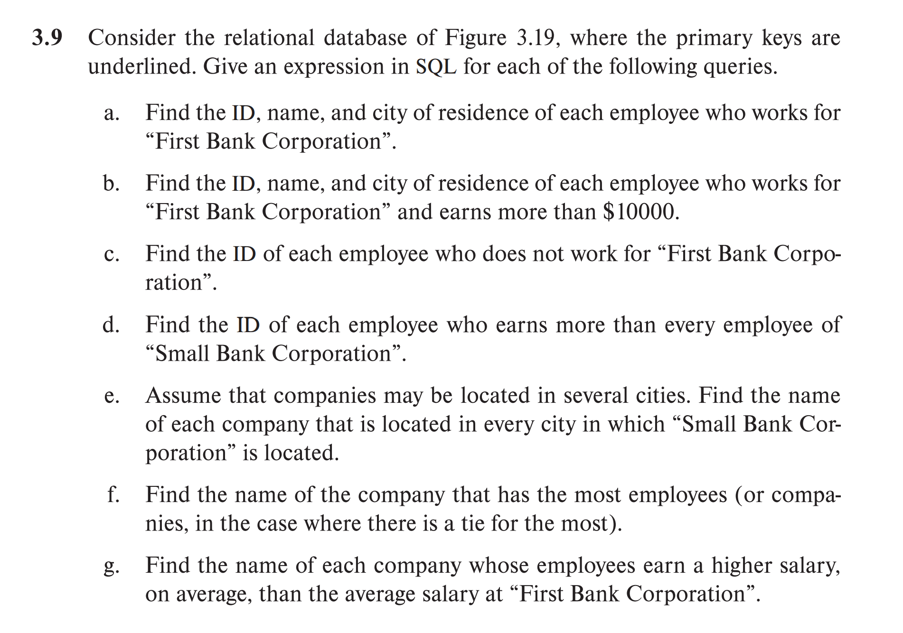
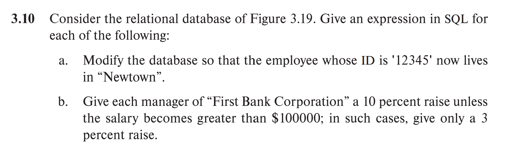
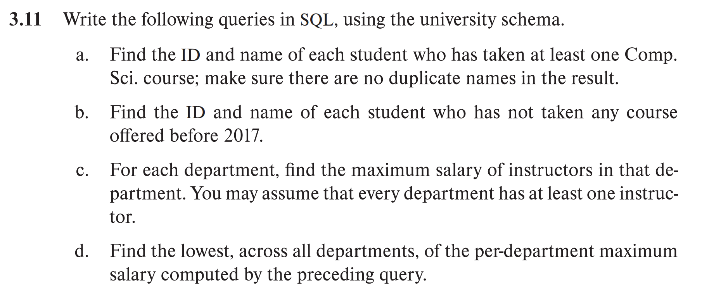
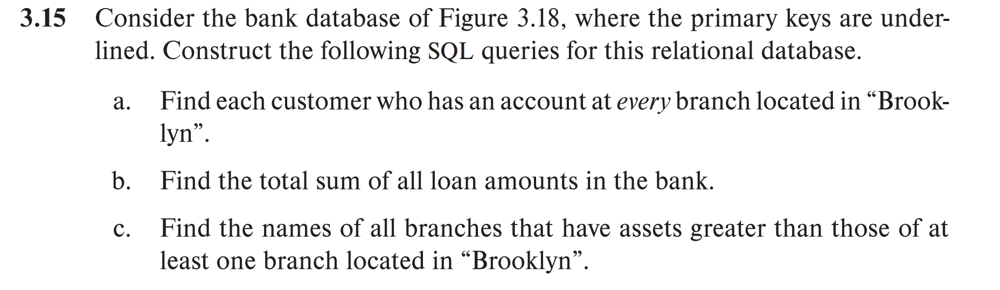

a. 
```SQL
SELECT DISTINCT d.ID
FROM depositor d
WHERE d.ID NOT IN (
    SELECT b.ID
    FROM borrower b
);
```

b.
```SQL
SELECT T.ID
FROM customer T, customer S
WHERE S.ID = '12345'
AND T.customer_street = S.customer_street
AND T.customer_city = S.customer_city
AND T.ID <> S.ID;
```

c.
```SQL
SELECT DISTINCT a.branch_name
FROM account a
WHERE exists(
    SELECT  *
    FROM depositer d
    JOIN customer c ON d.ID = c.ID
    WHERE c.customer_city = 'Harrison'
    AND d.account_number = a.account_number
)
```



a. 
```SQL
SELECT e.ID, e.person_name, e.city
FROM employee e
JOIN works w ON e.ID = w.ID
WHERE w.company_name = 'First Bank Corporation';
```

b.
```SQL
SELECT e.ID, e.person_name, e.city
FROM employee e
JOIN works w ON e.ID = w.ID
WHERE w.company_name = 'First Bank Corporation'
AND w.salary > 10000;
```

c.
```SQL
SELECT DISTINCT e.ID
FROM employee e
WHERE e.ID NOT IN(
    SELECT works.ID 
    FROM works
    WHERE works.company_name = 'First Bank Corporation'
)
```

d.
```SQL
SELECT w.ID
FROM works w
WHERE w.salary > ALL (
    SELECT w2.salary
    FROM works w2
    WHERE w2.company_name = 'Small Bank Corporation'
);
```

e.
```SQL
SELECT DISTINCT company.company_name
FROM company c
WHERE NOT EXISTS(
    SELECT c2.city
    FROM company c2
    WHERE c2.company_name = 'Small Bank Corporation'
    AND NOT EXISTS(
        SELECT *
        FROM company c3
        WHERE c3.city = c2.city
        AND c3.company_name = c.company_name
    )
)
```

f.
```SQL
WITH EmployeeCount AS (
    SELECT company_name, COUNT(ID) AS num_employees
    FROM works
    GROUP BY company_name
)
SELECT company_name
FROM EmployeeCount
WHERE num_employees = (
    SELECT MAX(num_employees)
    FROM EmployeeCount
);
```

g.
```SQL
WITH CompanyAvgSalary AS (
    SELECT company_name, AVG(salary) AS avg_salary
    FROM works
    GROUP BY company_name
),
FirstBankAvgSalary AS (
    SELECT AVG(salary) AS avg_salary
    FROM works
    WHERE company_name = 'First Bank Corporation'
)
SELECT c.company_name
FROM CompanyAvgSalary c, FirstBankAvgSalary f
WHERE c.avg_salary > f.avg_salary;
```



a.
```SQL
ALTER TABLE employee SET city = 'Newton' WHERE ID = '12345';
```

b.
```SQL
UPDATE works 
SET salary 
    CASE WHEN salary > 10000 THEN salary * 1.1
    ELSE salary <= 10000 THEN salary * 1.03
    END
```



We should define a university schema first

- student (ID, name, dept_name, tot_cred)
- takes (ID, course_id, sec_id, semester, year, grade)
- course (course_id, title, dept_name, credits)
- instructor (ID, name, dept_name, salary)

a.
```SQL
SELECT DISTINCT s.ID,S.name
FROM student s
JOIN takes t on s.ID = t.ID
JOIN course c on t.course_id = c.course_id
WHERE e.dept_name = 'Comp. Sci.';
```

b.
```SQL
SELECT s.ID, s.name
FROM student s
WHERE s.ID NOT IN (
    SELECT t.ID
    FROM takes t
    WHERE t.year < 2017
);
```

c.
```SQL
SELECT dept_name, MAX(salary) AS max_salary
FROM instructor
GROUP BY dept_name
```

d.
```SQL
With MaxSalary AS (
    SELECT dept_name, MAX(salary) AS max_salary
    FROM instructor
    GROUP BY dept_name
);
SELECT MIN(max_salary) AS min_max_salary
FROM MaxSalary;
```



a.
```SQL
SELECT c.customer_name
FROM customer c
WHERE NOT EXISTS (
    -- 查找所有位于“布鲁克林”的分行
    SELECT b.branch_name
    FROM branch b
    WHERE b.branch_city = 'Brooklyn'
    AND NOT EXISTS (
        -- 检查客户是否在该分行有账户
        SELECT 1
        FROM depositor d
        JOIN account a ON d.account_number = a.account_number
        WHERE d.ID = c.customer_ID
        AND a.branch_name = b.branch_name
    )
);
```

b. 
```SQL
SELECT SUM(loan.amount)
FROM loan;
```

c.
```SQL
SELECT b.branch_name
FROM branch b
WHERE b.assets > SOME (
    SELECT b1.assets
    FROM branch b1
    WHERE b1.branch_city = 'Brooklyn'
);
```
