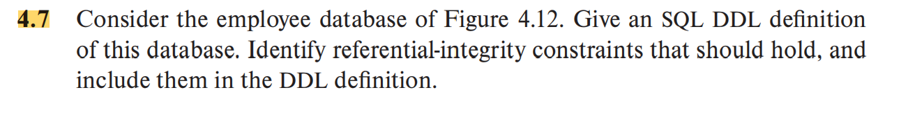
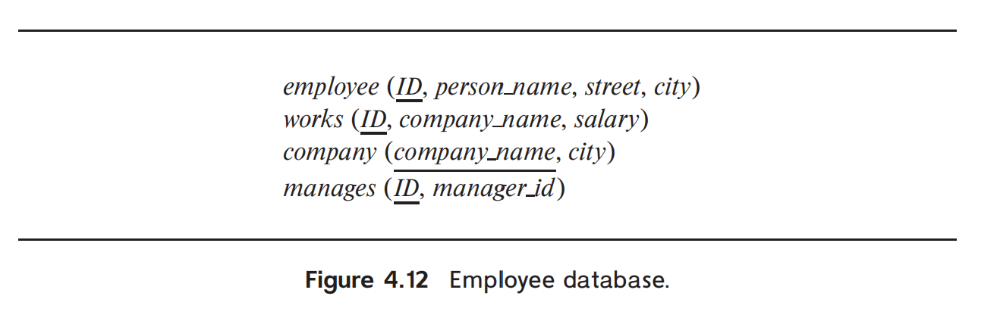
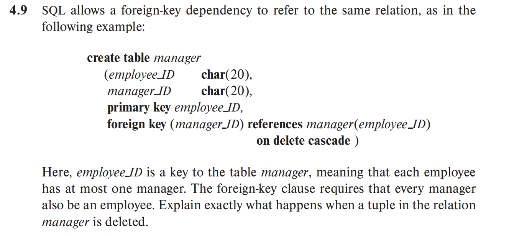
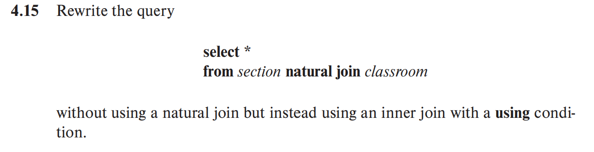
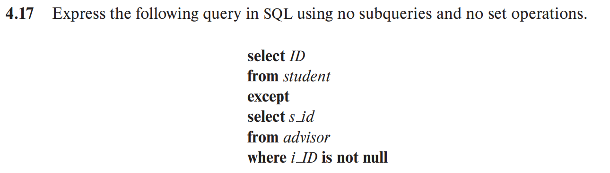

```SQL
create table employee(
    ID varchar(20) primary key,
    personal_name varchar(20),
    street varchar(20),
    city varchar(20)
);

create table works(
    ID varchar(20) primary key,
    company_name varchar(20),
    salary decimal(10,2),
    foreign key (ID) references employee(ID) on delete cascade,
    foreign key (company_name) references company(company_name) on delete cascade
);

create table company(
    company_name varchar(20) primary key,
    city varchar(20)
);

create table manages(
    ID varchar(20) primary key,
    manager_id varchar(20),
    foreign key (ID) references employee(ID) on delete cascade,
    foreign key (manager_id) references employee(ID) on delete cascade
)
```


When a tuple in the `manager` relation is deleted, the `ON DELETE CASCADE` clause ensures that any tuples in the same relation that have a `manager_ID` referencing the `employee_ID` of the deleted tuple are also deleted. This maintains referential integrity by automatically removing all dependent entries that would otherwise reference a non-existent employee. For example, if an employee who is a manager is deleted, all employees who had that manager will also be deleted from the table.



```SQL
select *
from section inner join classroom
using (building, room_number);
```

```SQL
SELECT s.ID
FROM student s
LEFT JOIN advisor a ON s.ID = a.s_id
WHERE a.i_ID IS NULL;
```

```SQL
CREATE VIEW tot_credit AS
SELECT year, SUM(credits) AS num_credits
FROM section
NATURAL JOIN course
GROUP BY year;
```
