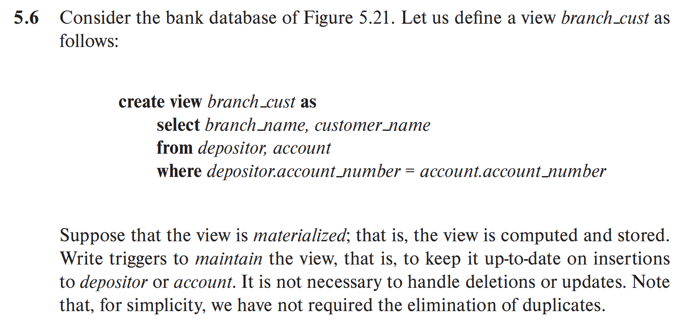
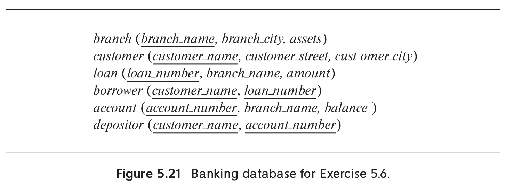
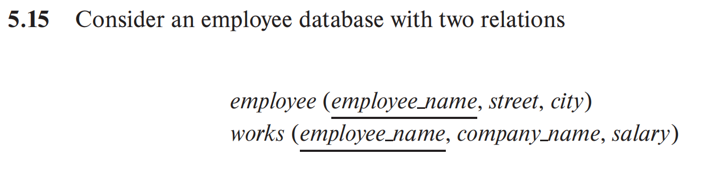
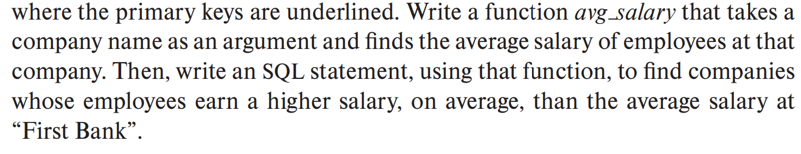

```sql
--depositor表上的触发器
create trigger insert_depositor after insert on depositor 
referencing new row as nrow
begin
    if exists (
        select 1
        from acount
        where acount.acount_number = nrow.acount_number
    )
    then
        insert into branch_cust(branch_name, customer_name)
        select branch_name, customer_name
        from acount
        where acount.acount_number = nrow.acount_number;
    end if;
end;

--acount表上的触发器
create trigger insert_acount after insert on acount 
referencing new row as nrow
for each row
begin
    if exists(
        select 1
        from depositor
        where depositor.acount_number = nrow.acount_number
    )
    then
        insert branch_cust(branch_name, customer_name)
        select branch_name, customer_name
        from depositor
        where depositor.acount_number = nrow.acount_number;
    end if;
end;
```




```SQL
create function avg_salary(company_name varchar(20))
returns numeric(7,2)
begin 
    declare avg_sal numeric(7,2);
    select avg(salary) into avg_sal
    from works
    where works.company_name = company_name;
    return avg_sal;
end;

select company_name
from works
where avg_salary(company_name) > avg_salary('First Bank');
```

- 保存一位同学的一门选课信息，需检查不能有冲突的上课时间；所有先修课必须通过；教室容量必须够。如果以上条件不满足则失败

```SQL
CREATE PROCEDURE conflict_detect(
    IN s_course_id VARCHAR(20),
    IN student_id VARCHAR(20),
    IN s_sec_id VARCHAR(20),
    IN s_semester VARCHAR(20),
    IN s_year INT,
    IN s_time_slot_id VARCHAR(20),
    IN s_day VARCHAR(20),
    IN s_start_time VARCHAR(20),
    IN s_prereq_id VARCHAR(20),
    OUT result VARCHAR(20)
)
BEGIN 
    DECLARE conflict_flag BOOLEAN DEFAULT FALSE;
    DECLARE v_conflict_count INT DEFAULT 0;
    DECLARE v_prereq_count INT DEFAULT 0;
    DECLARE v_capacity INT DEFAULT 0;
    DECLARE v_enrolled INT DEFAULT 0;
    DECLARE v_prereq_satisfied INT DEFAULT 0;

    -- 检查上课时间冲突
    SELECT COUNT(*) INTO v_conflict_count
    FROM takes t
    JOIN section s ON t.course_id = s.course_id AND t.sec_id = s.sec_id 
                   AND t.semester = s.semester AND t.year = s.year
    JOIN time_slot ts ON s.time_slot_id = ts.time_slot_id
    WHERE t.ID = student_id 
    AND ts.day = s_day
    AND ts.start_time = s_start_time
    
    IF v_conflict_count > 1 THEN
        SET conflict_flag = TRUE;
    END IF;

    -- 检查先修课是否满足
    SELECT COUNT(*) INTO v_prereq_satisfied
    FROM takes t
    JOIN course c ON t.course_id = c.course_id
    WHERE t.ID = student_id
    AND t.grade IS NOT NULL 
    AND t.grade != 'F'
    AND t.course_id = s_prereq_id;
    
    IF v_prereq_satisfied = 0 THEN
        SET conflict_flag = TRUE;
    END IF;

    -- 检查教室余量是否充足
    SELECT c.capacity, COUNT(t.ID) INTO v_capacity, v_enrolled
    FROM section s
    JOIN classroom c ON s.building = c.building AND s.room_number = c.room_number
    LEFT JOIN takes t ON s.course_id = t.course_id AND s.sec_id = t.sec_id
                     AND s.semester = t.semester AND s.year = t.year
    WHERE s.course_id = s_course_id
    AND s.sec_id = s_sec_id
    AND s.semester = s_semester
    AND s.year = s_year;
    
    IF v_capacity <= v_enrolled THEN
        SET conflict_flag = TRUE;
    END IF;

    IF conflict_flag THEN
        SET result = 'failed';
    ELSE
        SET result = 'success';
    END IF;
END 

```
