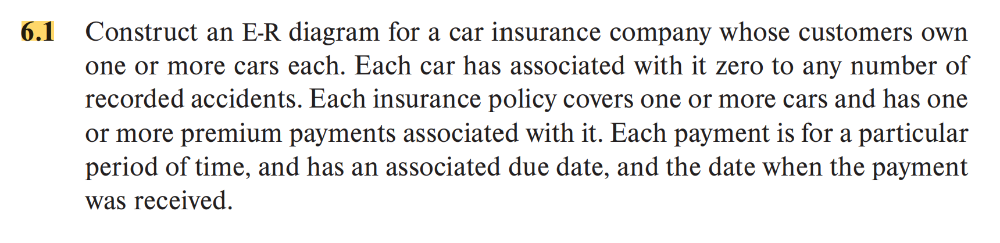
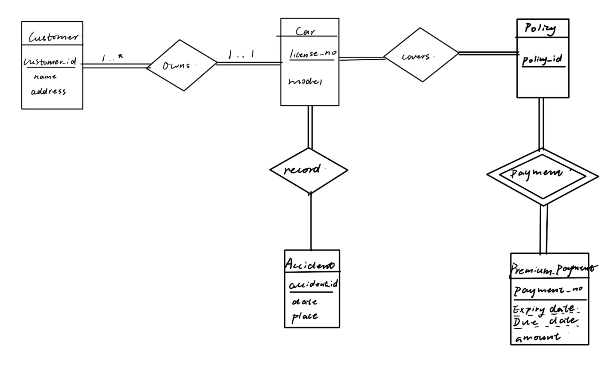
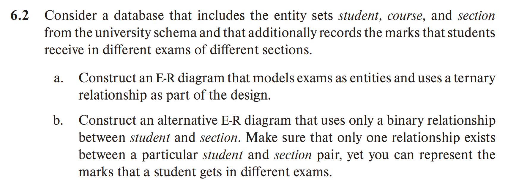
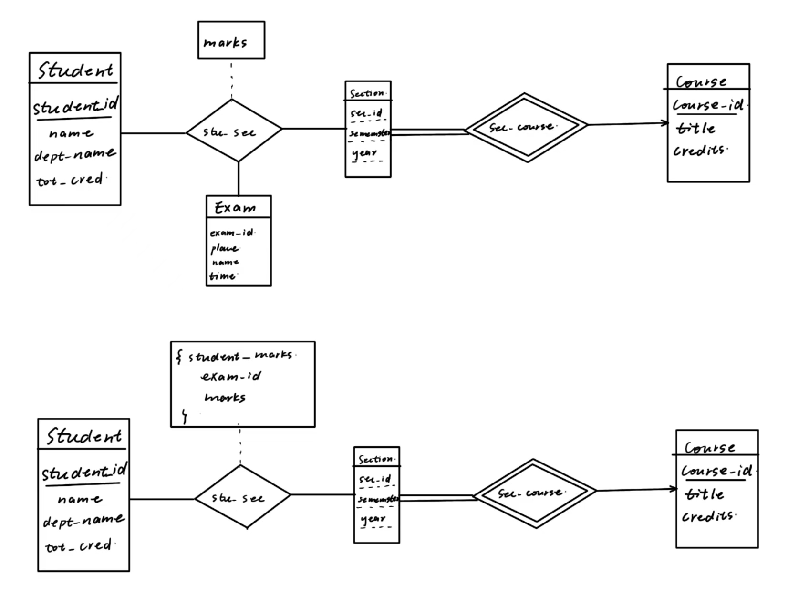
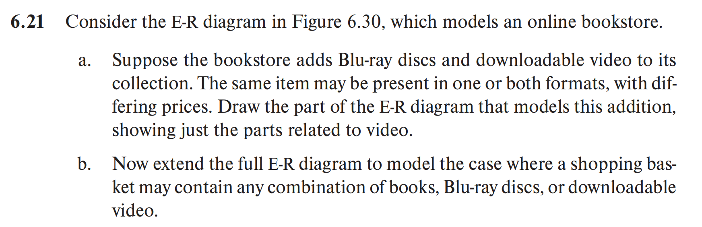
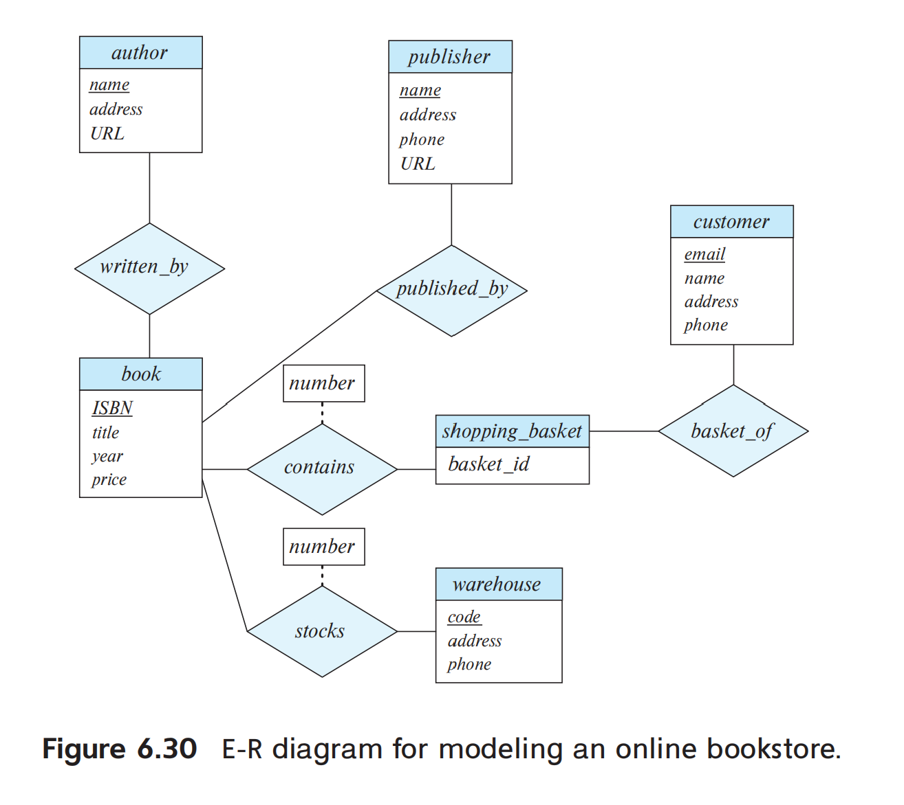
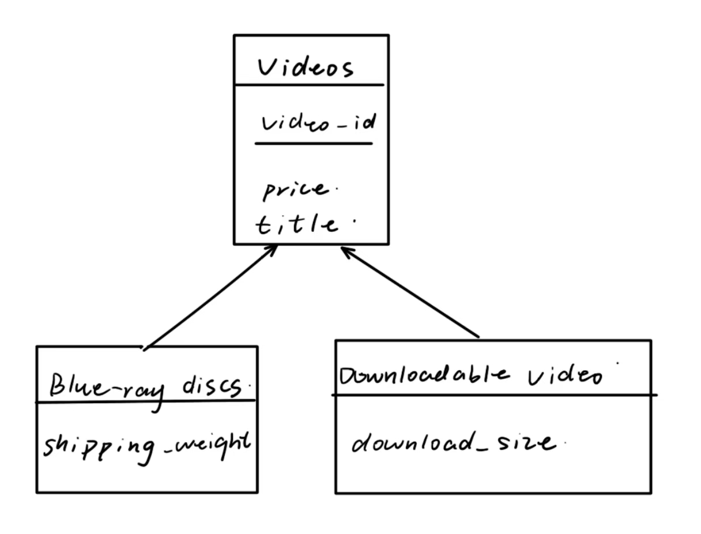
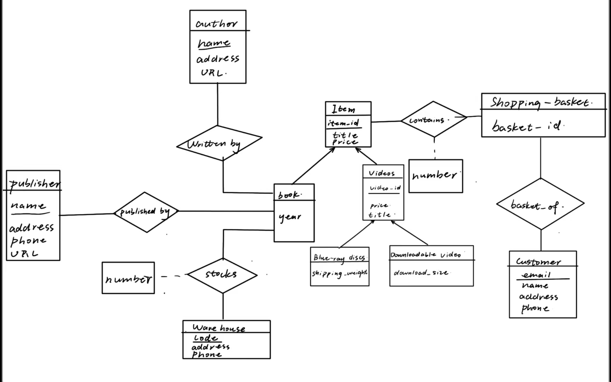
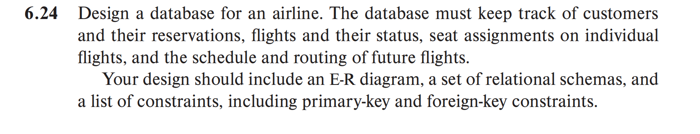
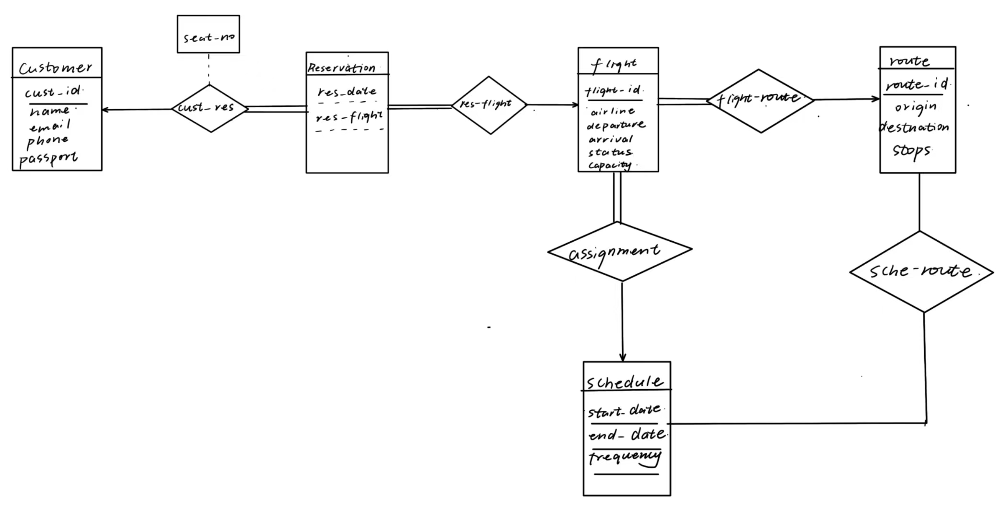

a.
b.

customer(
    <u>customer_id</u>,
    name,
    email,
    phone,
    passport
)

reservation(
    <u>customer_id,res_date,res_flight</u>,seat_no
)
- res_flight is the foreign key references flight

flight(
    <u>flight_id</u>,
    airline,
    departure
    arrival
    status
    capacity,
    start_date,
    end_date,
    frequency,
    route_id
)

- route_id is the foreign key references route

route(  <u>route_id</u>,
    origin,
    destination,
    stops
)