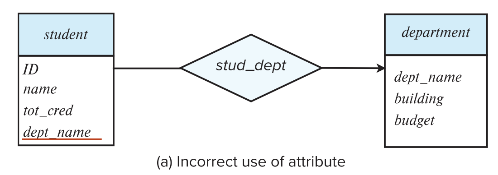
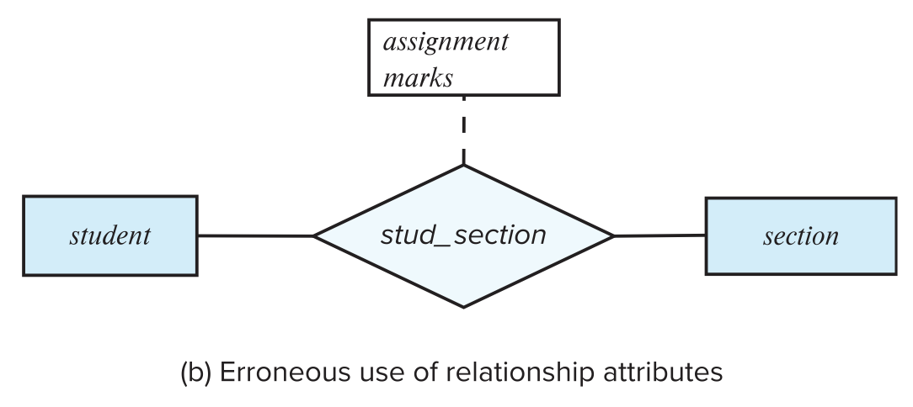
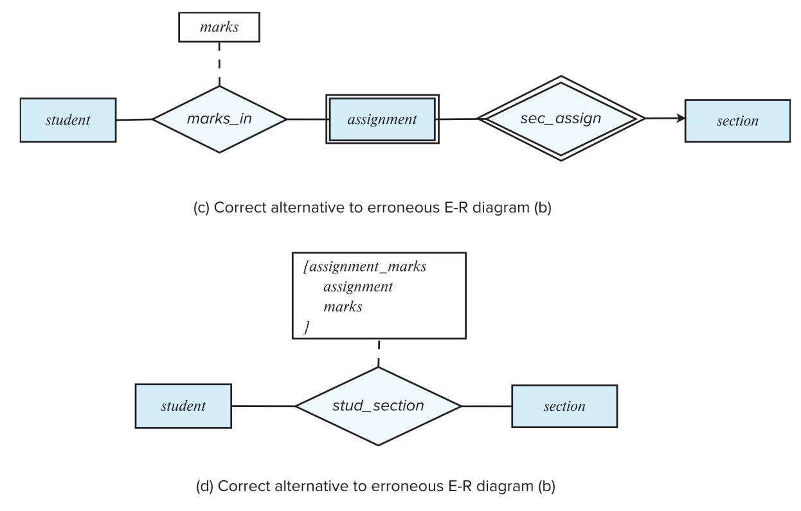
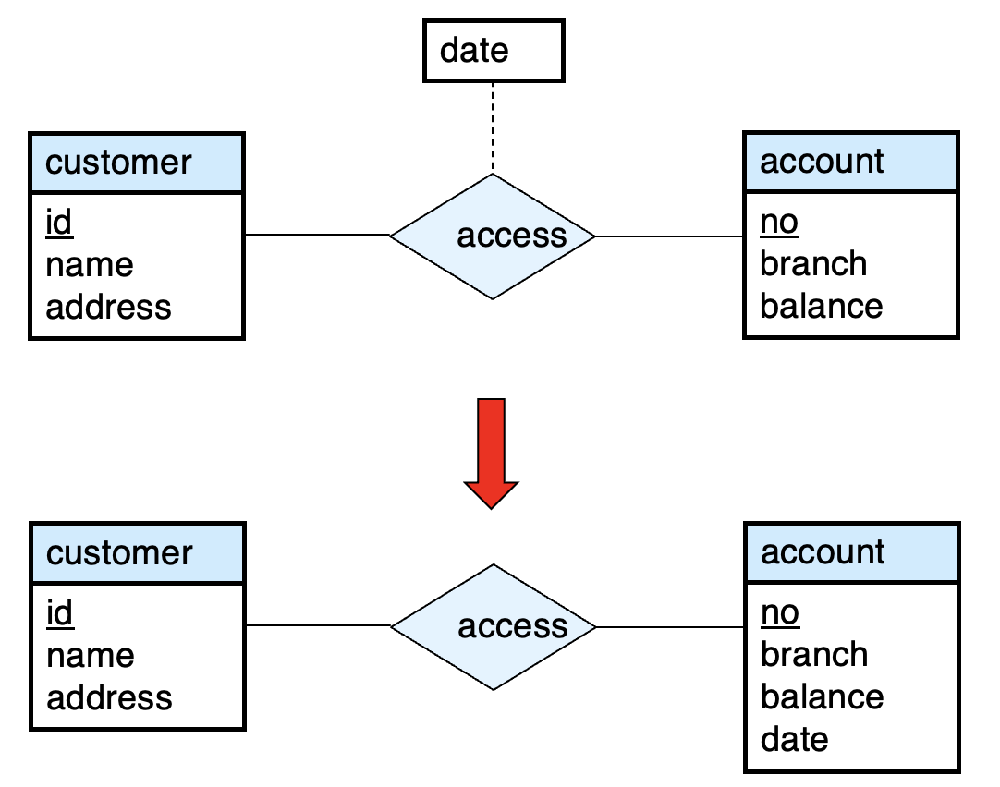
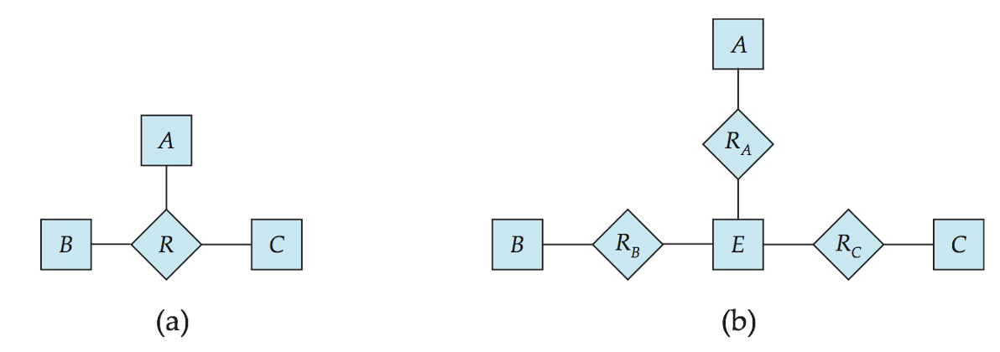
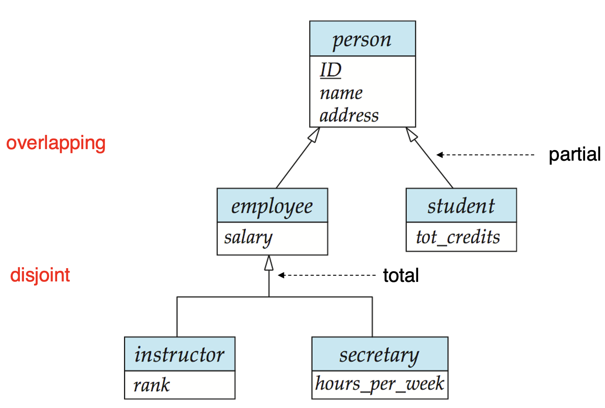

## 6. Design Issues

### 6.1 Common Mistakes in E-R Diagrams
- 信息冗余 

> student的dept_name应该去掉

- 关系属性使用不当

> 这是一门课，可能会有很多次作业，不能只用一个实体
>
> 

### 6.2 Placement of Relationship Attributes

- 第一种方法：可以记录每次访问日期
- 第二种方法：只能记录用户最近一次访问日期，不完整

### 6.3 Binary VS Non-Binary Relationships
- 尽管可以用多个不同的二元关系集替换任何非二元关系集，但n元关系集可以更清楚地显示多个实体参与单个关系
- 一些看起来非二元的关系可能更适合使用二元关系来表示
    - 例如，将孩子与他的父亲和母亲联系起来的三元关系父母最好用两种二元关系来代替
    - 使用两个二元关系允许出现部分信息(例如，只有母亲知道的信息)
- 但是有些关系天生就是非二元的

### 6.4 Converting Non-Binary Relationships to Binary Form
通常，任何非二元关系都可以通过创建人工实体集来使用二元关系来表示

- 将实体集 A、B 和 C 之间的 R 替换为实体集 E 和三个关系集：

- 为E创建特殊标识属性
- 将R的所有属性添加到E
- 对于每一个R中的关系$(a_i,b_i,c_i)$
    - 在实体集E这种建立新实体$c_i$
    - 将$(e_i,a_i)$添加到$R_A$;将$(e_i,b_i)$添加到$R_B$;将$(e_i,c_i)$添加到$R_C$
- 我们还需要转换所有的约束
    - 可能无法转换所有约束
    - 已翻译的模式中可能不存在不能对应于R的任何实例
    - 我们可以通过使 E 成为由三个关系集标识的弱实体集来避免创建标识属性

### 6.5 E-R Desogn Decisions
- 使用属性或实体集来表示对象
- 实际概念是用实体集还是关系集最好地表达
- 使用三元关系或二元关系
- 使用强实体集或弱实体集

### 6.6 Extended ER Features
- 特化(Specialization)
    - 自上而下的设计过程：我们再实体集中指定与几何中的其他实体不同的子分组
    - 属性继承：较低级别的实体集继承其链接到的较高级别实体集的所有属性和关系参与
- 概化(Generalization)
    - 自下而上的设计过程：相同特征的多个实体集合并到更高级别的实体集中
- 特化和概化是彼此的简单倒置，它们在E-R图中以相同的方式表示
- 术语特化和概化可以互相使用

- 特化和概化的设计约束
    - 对实体是否可以属于单个概化中的多个较低级别实体集的约束
        - 不相交(Disjoint)
            - 一个实体只能属于一个较低级别的实体集
            - 在E-R图中，通过让多个较低级别的实体集链接到同一个三角形来表示
        - 重叠(Overlapping)
            - 一个实体可以属于多个较低级别的实体集
    - 完全性约束(Completeness Constraint)
        - 指较高级别实体集中的实体是否必须至少属于概化中的至少一个较低级别实体集
            - 全部(Total):实体必须属于较低级别的实体集之一
            - 部分(Partial):实体不必属于较低级别的实体集之一

