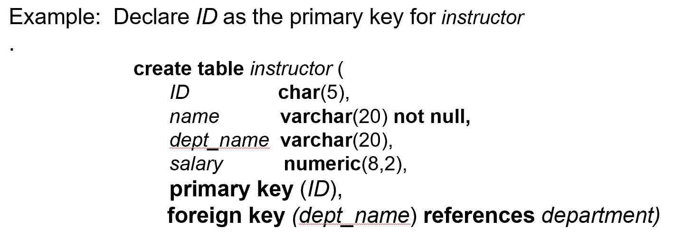
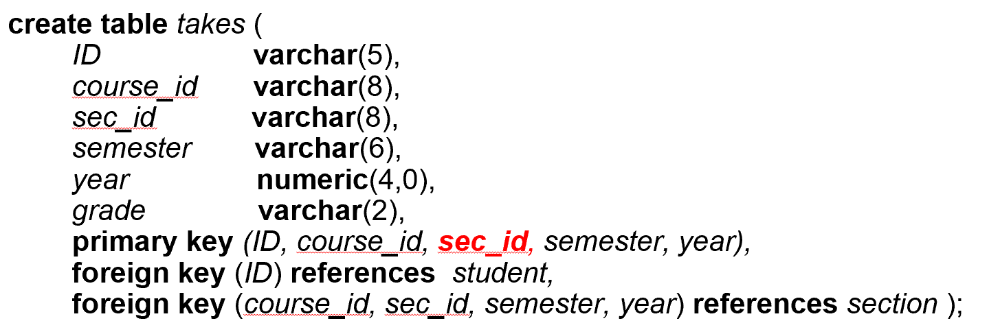
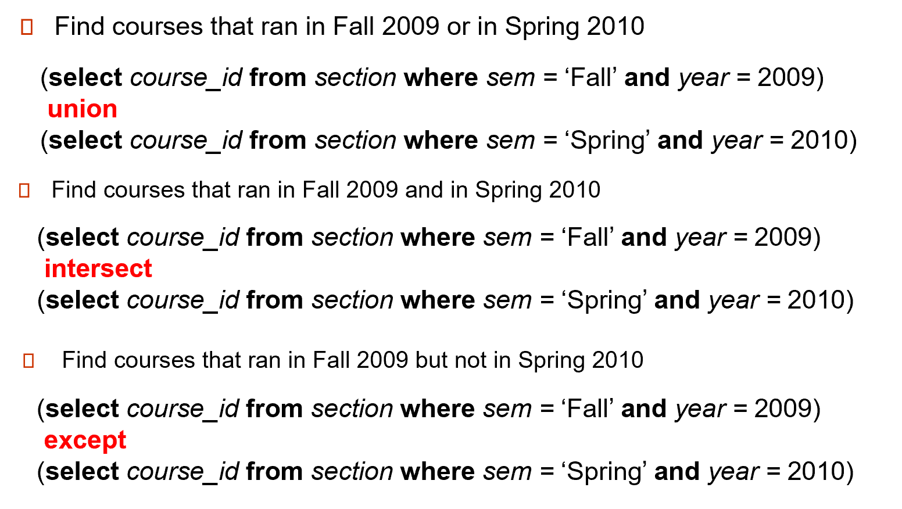
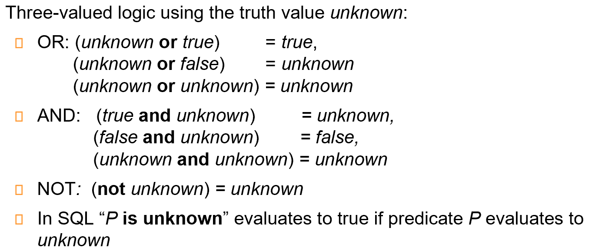
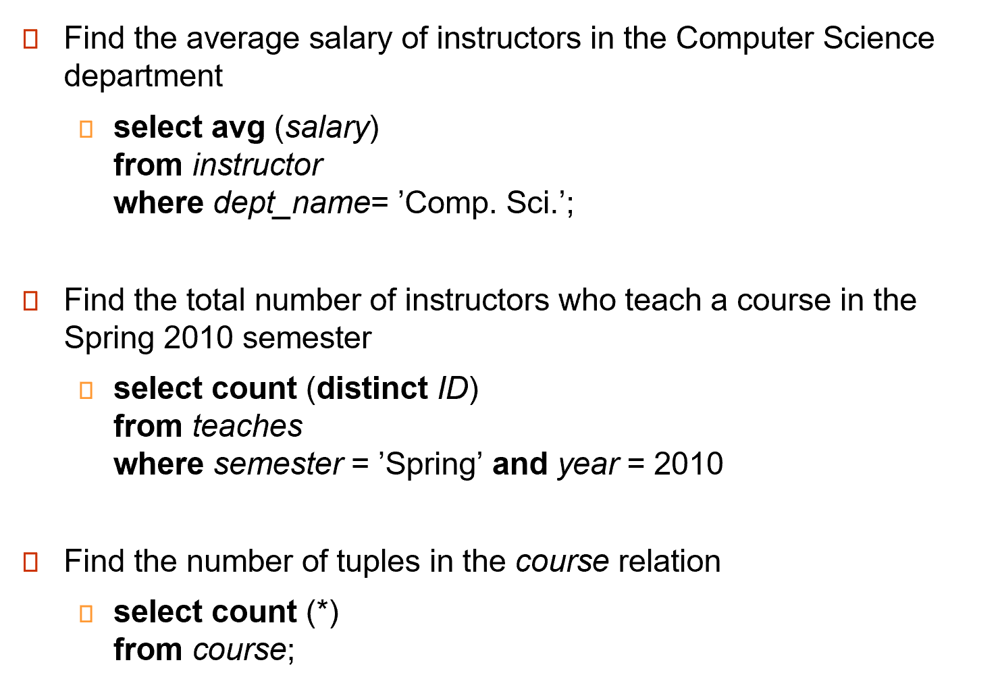
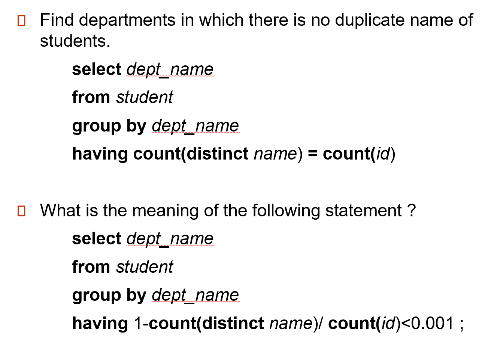
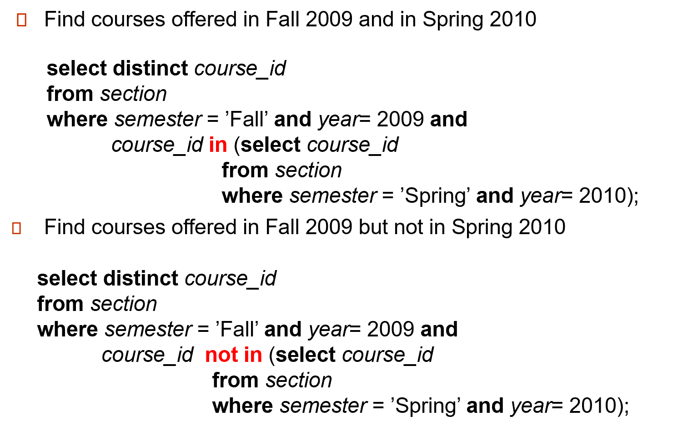
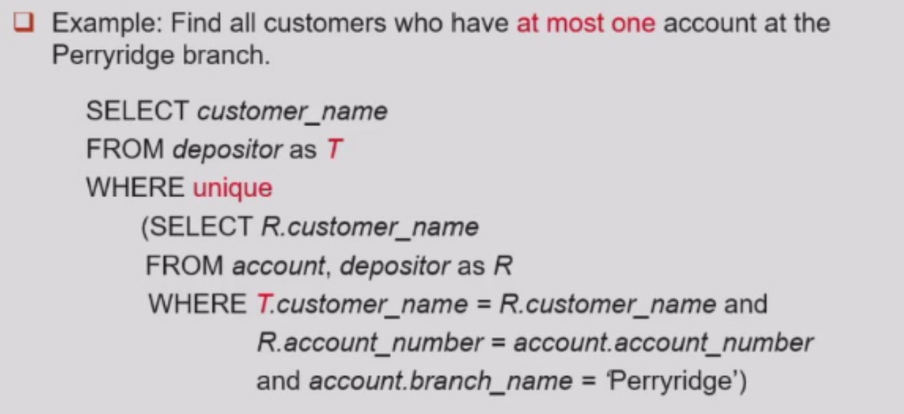
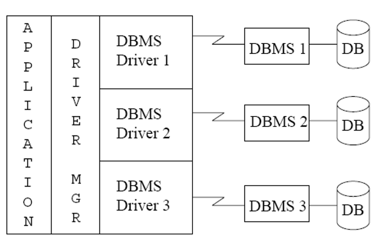

# Chapter 1: Introduction
## 1. Database Systems
DBMS(Database Management System)
- 数据库定义
- 数据组织、存储和管理
- 数据操作
- 数据库的事务管理和运行管理
- 数据库的建立和维护
- 不同数据库之间的交互


- 数据库系统是一些管理互相关联的数据以及一组使得用户可以访问和修改这些数据的程序的集合
## 2. 数据库系统的目标
相比于File-Processing System，数据库系统可以解决下面的问题

***两者一个巨大的区别是文件系统是操作系统的重要组成部分，DBMS是独立于操作系统的软件。DBMS的实现与操作系统中的文件系统是紧密相关的***
- 数据冗余(rebundancy)和不一致性(inconsistency):相同的信息可能在不同的文件中重复存储；不同文件中的信息在修改后可能会出现不一致的现象
- 数据访问困难：对于有特定要求的数据，传统的文件管理系统需要写大量的访问应用程序保证能够按照要求访问数据。
- 数据孤立：数据分散在不同文件中，文件可能不具有相同的文件格式，编写应用程序来检索适当数据是很困难的
- 完整性问题(integrity problems):数据库中存储的数据值需要满足一些特定的约束条件(constraint)，比如银行账户余额必须非负，学生ID的位数必须相同等等。
- 原子性问题(atomicity problems):一个原子的操作要么全部发生要么根本不发生
- 并发访问异常(Concurrent access anomalies):并发的更新操作可能相互影响，有可能导致数据的不一致。eg.学生选课，教学班容量差一人，两名学生同事抢课就会存在计数异常的情况导致两名同学都可以选到这门课
- 安全性问题：数据库系统有明确的访问权限，并非每一个用户都可以访问所有数据
## 3. 数据库的特征
- 数据持久性
- 数据访问便利
- 数据完整性
- 多用户并发控制
- 故障恢复
- 安全控制
## 4. 数据视图
数据库的主要目的是给用户提供数据的抽象视图，我们对数据库进行三级的抽象。


- Physical Level:描述数据实际上是怎样存储的。物理层详细描述复杂的底层数据结构。
- Logical Level:比物理层层次稍高的抽象，描述数据库中存储什么数据以及这些数据间存在什么联系。
    - 物理数据独立性：虽然逻辑层的简单数据结构的实现可能涉及复杂的物理层结构，但是逻辑层的用户不比意识到这样的复杂性。
- View Level:最高层次的抽象。只描述数据库的某个部分。尽管在逻辑层使用了相对简单的结构，但是由于一个大型数据库中所存储的信息的多样性仍存在一定程度的复杂性。但是用户不需要所有的这些信息，而只需要访问数据库的一部分。视图层抽象的存在正是为了使这些用户与系统之间的交互更加简单。
    - ***系统可以为统一数据库提供多个视图***

**Advantages**
- 隐藏了复杂性
- 对变化的适应得到增强
    - 硬件变化(physical level)，可以通过调整逻辑关系和映射来适应新的硬件环境。
    - 逻辑环境变化(logical level),可以通过视图层和logic的映射使得view尽量少变化。
### 4.1 模式(schema)与实例(Instance)
与编程语言中的类型和变量概念相似：
- 模式(schema)-数据库的逻辑结构(physical/logical)
- 实例(instance)-在***某一个特定的时间点***数据库中的真实内容
### 4.2 数据独立性(指数据和程序相互不依赖，把数据的定义从程序中分离出来)

DBMS负责数据的存储，从而简化应用程序

- **物理数据独立性**：the ability to modify the physical schema without changing the logical schema，需要修改内模式与概念模式之间的映射关系
- **逻辑数据独立性**：the ability to modify the logical schema without changing the user view schema，需要修改外模式与概念模式之间的映射关系

映射修改，但不用修改schema
## 5. Data Models
Data models is a collection of tools for describing data, data relationships, data semantics(数据的语义), data constraints.
- 三要素
    - 数据结构 
    - 数据操作 
    - 数据约束条件
> 模型就是对现实世界特征的抽象，数据模型是对现实世界数据特征的抽象

- Relational model(关系模型)：（表格）数据库系统层面
- Entity-Relationship(实体-联系) data model：需求分析层面
- Object-based data models
    - Object-oriented (面向对象数据模型)
    - Object-relational (对象-关系模型模型)
- Semistructured data model (XML)(半结构化数据模型)
- Other older models:
    - Network model (网状模型)
    - Hierarchical model(层次模型)


- 概念数据模型：按照用户的观点对数据和信息建模，是现实世界到信息世界的第一层抽象
    - ER模型：接近于人类的思考方式，容易理解并且与计算机无关。只能说明实体之间的语义练习，不能进一步地详细说明数据结构
- 基本数据模型：按计算机系统的关键对数据建模，，是现实数据特征的抽象
    - 层次模型
    - 网状模型
    - 关系模型：用二维表格结构表达实体集以及实体集之间的联系。最大的特征就是**描述的一致性**
    - 面向对象数据模型
## 6. 数据库语言
### 6.1 数据定义语言（Data Definition Language,DDL）

数据字典包含元数据(metadata)
- 描述数据属性、结构、关系等的数据
- DDL编译器生成一系列table templates并存储在数据字典（数据字典是一系列表，包含一系列元数据）
- Authorization(权限)
- Integrity constraints (完整性约束) Primary key (ID uniquely identifies instructors, 主键) Referential integrity (references constraint in SQL, 参照完整性) e.g. dept_name value in any instructor tuple must appear in department relational
### 6.2 Data Manipulation Language (DML, 数据操作语言)
- Procedural(过程式):用户确定需要什么数据和如何获取这些数据eg.C
- Declarative(声明式):用户只描述需要什么数据(陈述式，非过程式nonprocedural):用户确定需要什么数据但是不需要确定如何获取这些数据eg.SQL

### 6.3 SQL Query Language

### 6.4 Database Access from Application Program
- 数据库必须由过程式语言编写
- Application programs generally access databases through one of **Language extensions to allow embedded SQL e.g. 通过预处理器，将 select 语句识别出来，翻译成 C 语言的函数调用。** API (Application program interface) e.g. ODBC/JDBC which allow SQL queries to be sent to a database.
## 7. 数据库设计
- 解决的问题：如何组织这些属性到各个表中
- 实体-联系模型：Entity Relationship Model一对一/一对多/多对一/多对多


- Normalization Theory (规范化理论):Formalize what designs are bad, and test for them。将所有的属性集作为输入，生成一组关系表
> 
>
>> 这个表存在冗余, department 有重复，应该拆分为两个表（前四列和后三列）然后通过外键进行表的关联
## 8. 数据库引擎

- 存储管理器
- 查询处理器
- 事务管理
> 数据库系统的功能部件
### 8.1 存储管理器
- 权限及完整性管理器
- 事务管理器：保证一旦发生故障，数据库的一致性状态
- 文件管理器：管理用于表示磁盘所有信息的数据结构
- 缓冲管理器：负责将数据从磁盘放入内存，并决定哪些数据应被缓冲放入内存


负责数据库中数据的**存储、检索和更新**
- 在数据库中存储的**底层数据与应用程序**以及向系统提交的查询之间提供接口的部件。
- 与文件管理器进行交互，原始数据通过系统提供的文件系统存储在磁盘上
- 将各种DML语句翻译为底层文件系统命令

- 作为数据库系统物理实现的一部分，存储管理器实现了以下几种数据结构
    - 数据文件：存储数据库自身
    - 数据字典：存储关于数据库结构的元数据，特别是数据库模式
    - 索引：存储关于数据库中数据的索引，提供对数据项的快速访问
### 8.2 查询处理器
查询处理器组件包括：
- DDL解释器：解释DDL语句并将这些定义记录在数据字典中
- DML解释器：将查询语言中的**DML语句**翻译成**查询执行引擎能够理解的低级指令的执行方案**
    - 查询优化：从几个有相同结果的候选执行计划中选出代价最小的那个执行计划。（执行计划会根据统计数据的改变而改变）
- 查询执行引擎(query evaluation engine)：执行由DML编译器产生的低级指令


### 8.3 事务管理(Transaction Management)
银行转账，A 转账到 B, A 余额减掉 B 余额加上。 要有隔离性，延迟写回
- 事务:数据库应用中完成单一逻辑功能的操作集合。每一个事务既具有原子性又具有一致性
- 恢复管理器(Recover Manager)：当故障发生时，为保证原子性，数据库必须被恢复到该事务开始执行以前的状态。
- 并发控制器(Concurrency-control manager):控制并发事务间的相互影响，保证数据库的一致性
## 9. Database Users


# Chapter 2:Introduction to Relational Model

> 你和你的宠物狗属于relationship的概念；足球队所有的成员属于relation的概念
## 1. Structure of Relational Databases
### 1.1 Concepts
Formally, given set $D_1,D_2,...,D_n$(一系列单元素的集合).
- A relation r is a subset of $D_1\times D_2 \times D_n$.Thus a relation is a set of n-tuple $(a_1,a_2,...a_n)$ where each $a_i\in D_i$

- $A_1,A_2,...,A_n$都是attributes(属性)。$R=(A_1,A_2,...,A_n)$是一个关系模型
- 关系实例r根据关系实例定义为r(R)
- 因为关系是一个集合，所以关系都是无序的
- 关系中的元组不存在重复的情况
- 属性的值是原子的
### 1.2 Attributes
- The set of allowed values for each attribute is called the domain (域)of the attribute
- Attribute values are (normally) required to be atomic (原子的); that is, indivisible
    - Strictly indivisible example:存储姓名时将姓和名分开。如果不需要查询姓和名可以将姓名作为一个属性，名字这个属性就是不可拆分的整体
    - Non-atomic example:两个电话号码存储在了一个属性中；一本书的所有信息存储在一个属性中
- The special value null (空值) is a member of every domain.
    - 不存在的信息
    - 存在但是未知的信息

## 2. Database Schema
- Bad design:把所有信息储存在一个属性中
    - 信息的重复(如两名同学有相同的导师)导致了不一致和信息冗余
    - 空值的需求(一个学生没有导师)，需要额外处理
- Database schema:is the logical structure of the database.-抽象的定义，database中所有的schema
- Database instance:is a snapshot of the data in the database at a given instant in time.-具体的实例，database中所有的instance
> 
## 3. Keys
Let $K \subseteq R$
- K is a superkey (超键) of R if values for K are sufficient to identify (唯一确定) a unique tuple of each possible relation r(R)
    - 可以唯一确定一行，但是可能会存在冗余的属性
    - e.g.{ID}和{ID,name}都是superkey
- Superkey K is a candidate key (候选键) if K is minimal.
    - K可以确定唯一一行且没有冗余属性.也就是K没有子集可以是超键
    - 候选键可以由多个元素组成
- 侯选建中的一个可以给选作primary key（主键）
    - 选择的主键往往是相对稳定的
    - 往往手动确定
- Foreign key（外键）限制：关系r1引用的主键必须在关系r2中出现。类似于指针
    - 引入的意义：实现完整性约束
    - Referenced Relation是被引用的表（被引用的属性往往都是primary key），Referencing是外键所在的表
    - 为什么需要外键限制：数据库是支持由完整约束条件定义出来的，并维护完整性约束条件。则当我们定义外键后，上述例子中黄色条目是不会出现的。
    - 外码的值可以是空值：避免在数据不完整时插入无效的外码值

    
    Referential Integrity(参照完整性)：类似于外键限制，但是不限制于主键


- course 指课程信息，无论是否开课，都会有其定义。
- section 表示教学班，真正开课时就有相应的实例。（类比于高铁的列车号，和每天对应的班次）
- teachers 具体教哪个教学班的老师
- takes 表示学生注册课程
- time_slot 表示一门课的具体上课时间段，如数据库在周一 3, 4, 5 节; 周一 7, 8 节。
- 上图中红线表示引用完整性的约束；黑线表示外键约束。
## 4. Relational Algebra

> 关系运算最基本的特点就是操作的对象和操作结果都是集合

是一种过程语言，但不是编程语言

Input and output are all relations

Six basic operators
- For one relation:
    - select:$\sigma$
    - project:$\Pi$
    - rename:$\rho$
- For two relations:
    - union:$\cup$
    - Cartesian product:$\times$
    - difference:$-$

### 4.1 Select
- 在表中找符合条件的tuple然后返回一张表
$σ_p(r)= \{t∣t∈r and p(t)\}$,p被称为selection predicate


### 4.2 Project
The project operation is a unary operation that returns its argument relation, with certain attributes left out.

- 目的：隐藏某些属性
$∏_{A_1,A_2,…,A_ k}(r)$ 其中$A_i$是属性的名称，r是关系的名字

The result is defined as the relation of k columns obtained by erasing the columns that are not listed. 会对结果进行去重。

### 4.3 Union
The union operation allows us to combine two relations.

$r \cup s= \{ t|t\in r or t \in s \}$
- r and s must have the same arity (元数) (same number f attributes)
- The attribute domains must be compatible
- 使用条件：等目（拥有的attribute数量一致）同源（attribute的值域相同）
> eg.Find all customers with either an account or a loan:两张表中的属性不可能完全相同，所以要先进行投影操作
当属性有关联类型时，对于每个输入i, 两个输入关系的第i个属性的类型必须相同。


### 4.4 Set Difference
The set-difference operation allows us to find tuples that are in one relation but are not in another.
$r-s=\{t|t\in r and t\notin s\}$

Set differences must be taken between compatible relations.


### 4.5 Cartesian Product
The Cartesian-product operation (denoted by ×) allows us to combine information from any two relations.
$r \times s= \{ (t,u)|t\in r and u\in s \}$


- 笛卡尔积操作没有任何限制
- 如果进行笛卡尔积的两个relation中有名字相同的属性，我们也要将他们视为不同的属性进行操作。
### 4.6 Rename
Allows us to refer to a relation by more than one name.
- 往往是在产生临时表的过程中产生的操作
$\rho_x (E)$ 表达式E的名称为x
$\rho_{x(A_1,A_2,...,A_n)} (E)$返回表达式E的名称为x，同时将属性重新命名为$A_1,A_2,...,A_n$

- Composition of Operations 1:Find the names of all instructors in the Physics department, along with the course_id of all courses they have taught.

> 两条语句语义是相同的，但第二种先select，笛卡尔积操作代价小，更高效

### 4.7 Additional Operators
- set intersection:$r \cap s$
- natural join:$r \bowtie s$
- assignment:$r \leftarrow s$
- outer join:$r \rtimes s$,$r \ltimes s$,$r⟗s$
- division operator:$r \div s$
#### 4.7.1 set-intersection operation
- Notation:$r \cap s$
- Defined as:$r \cap s= \{ t|t\in r and t\in s \}$
- r和s有相同的arity
- r和s的属性是兼容的，也就是值域是相同的
- 等目同源-与union操作的限制条件是相同的


#### 4.7.2 Natural Join Operation
- Notation:$r \bowtie s$
- Example:R=(A,B,C,D),S=(B,D,E)
    - natural join 得到的 result schema是(A,B,C,D,E)
    - $r \bowtie s= \Pi_{r.A,r.B,r.C,r.D,s.E}(\sigma_{r.B=s.B ∧ r.D=s.D}(r \times s))$

Let r and s be relations on schemas R and S respectively. Then, $r \bowtie s$ 
 is a relation on schema $R \cup S$
 obtained as follows:
 - Consider each pair of tuples $t_r$ from r and $t_s$ from s
 - 如果$t_r$和$t_s$在$R \cap S$中每一个相同的属性都有相同的值，在结果relation中加上这样的元组
    - t有与r中的$t_r$相同的值
    - t有与s中的$t_s$相同的值
> 对乘法的扩展，相当于先做笛卡尔积
 再 select, 最后 project.
- 使用条件：
    - r，s必须有共同属性(名和域都对应相同)
    - 连接两个关系中同名属性值相等的元组
    - 结果属性是二者属性集的并集，但**消去重名属性**

#### Theta Join Operation Formalization
- Notation:$r \bowtie_{\theta} s$
    - $\theta$是模式中对于属性的predicate
    - Theta Join:$r \bowtie_{\theta}(r \times s)$
- Theta Join is the extension to the Natural Join

#### 4.7.3 Division Operation
题目中要找`all`就要使用division operation
- Notation:$r \div s$
- 认为r和s分别是模式R和S下的关系，其中$R=(A_1,...,A_m,B_1,...,B_n),S=(B_1,...B_n)$
    - result relation的模式是$R-S=(A_1,A_2,...,A_n)$
    - $r \div s = \{t|t \in \Pi_{R-S}(r)∧ \forall u \in s(t \times u \in r)\}$
- 商来自于$\Pi_{R-S}$，并且其元组t与s所有元组的拼接被r覆盖（是r的一个子集）
$$
\begin{align*}
    temp1 & \leftarrow \Pi_{R-S}(r)\\
    temp2 & \leftarrow \Pi_{R-S}((temp1 \times s)- \Pi_{R-S,S}(r))\\
    result & = temp1 - temp2
\end{align*}
$$


#### 4.7.4 Assignment Operation
The assignment operation <- provides a convenient way to express complex queries.
- 将查询表达式写成一系列包含下列内容的程序
    - A series of assignments
    - Followed by an expression whose value is displayed as a result of the query
- assignment的结果是一个临时表
### 4.8 操作符的优先级
- Project
- Select
- Cartesian product
- Join,division
- Intersection
- Union,difference
### 4.9 Extended Relational-Algebra Operations
- Generalized Projection
- Aggregate Functions
- Outer Join
#### 4.9.1 Aggregate Functions
Aggregation function（聚合函数）takes a collection of values and returns a single value as a result.
- avg: average value
- min: minimum value
- max: maximum value
- sum: sum of values
- count: number of values

- 聚合函数会接受一组值，返回单个值


Aggregate operation in relational algebra: $G_1,G_2,\ldots,G_n \mathcal{G}_{F_1(A_1),\ldots F_n(A_n)}(E)$
- E是任意一个关系代数表达式
- $G_1,...$是分组的属性清单，对同一组是具有相同value的tuple，对每一组进行对应的聚合函数操作
- $F_i$是聚合函数
- $A_i$是属性的名称


- 聚合的结果是没有名称的
    - 可以使用重命名操作进行命名
    - 为了方便我们提供了`as`语句作为聚合操作的一部分从而进行重命名
$$
 branch-name \mathcal{G}_{sum(balance) as sum-balance}(account)
$$
#### 4.9.2 Outer Join
Natural Join操作会造成一部分数据的丢失，这时我们对natural join进行扩展操作可以有效避免信息的丢失

- 计算出自然连接，然后加上某一个关系中没有在另一个关系中匹配的元组加入自然连接的结果
    - 一些属性存在空值情况，我们使用`null`作为value的值
- $r\rtimes s$ 保留r关系中的元组
- $r\ltimes s$ 保留s关系中的元组
- $r⟗s$ 

#### 4.9.3 Null values
- null值可以是一个未知的值或者是不存在的值
- 一切包含null的算数表达式的结果一定是null
- 聚合函数计算时忽略null值(除了count以外，count时null被视为一个正常值)
- 对于去重删除和分组操作时，null被视作与正常值一样的值，两个null被看做相等的值
- 比较时引入除了`true`和`false`以外的第三个值`unknown`


- P is unknown可以作为谓词，对应值上是unknown时返回true

- 完整性约束
    - 实体完整性（Entity Integrity）：数据库中的每个表都必须有一个主键且主键不能为NULL
    - 参照完整性(Referential Integrity)：外键的值必须是空值或者被引用表中主键的有效值
    - 用户定义完整性（User defined Integrity）：根据具体业务需求定义的约束条件,由应用的环境决定
    、
# Chapter 3 Introduction to SQL
## 1 Data Definition
### 1.1 Domain Types in SQL
- `char(n)`.Fixed length character string, with user-specified length n.

定长字符串，C语言里字符串结尾有`\0`，但是数据库中没有，长度由定义而得

- `varchar(n)`.Variable length character string, with user-specified `maximum` length n.

不定长字符串(可变长字符串)。不同的数据类型比较可能有问题(比如定长和不定长的字符串)

- `int`.Integer (a finite subset of the integers that is machine-dependent).

- `smallint`Small integer (a machine-dependent subset of the integer domain type).

往往是int长度的一半

- `numeric(p,d)`. Fixed point number, with user-specified precision of p digits, with d digits to the right of decimal point.
p 表示有效数字位数, d 表示小数点后多少位。 e.g. number(3,1) allows 44.5 to be store exactly, but neither 444.5 or 0.32
- `real`, double precision. Floating point and double-precision floating point numbers, with machine-dependent precision.
- `float(n)`. Floating point number, with user-specified precision of at least n digits.

### 1.2 Built-in Data Types in SQL

- date: Dates, containing a (4 digit) year, month and date

e.g. date ‘2005-7-27’

- time: Time of day, in hours, minutes and seconds. e.g. time ‘09:00:30’ time ‘09:00:30.75’
- timestamp: date plus time of day e.g. timestamp ‘2005-7-27 09:00:30.75’
- interval: period of time e.g. interval ‘1’ day
    - Subtracting a date/time/timestamp value from another gives an interval value.
    - Interval values can be added to date/time/timestamp values
    - built-in date, time functions: current_date(), current_time(), year(x), month(x), day(x), hour(x), minute(x), second(x)

### 1.3 Create Table Consrtuct

An SQL relation is defined using the create table command:

```sql
create table r (A1 D1, A2 D2, ..., An Dn,           (integrity-constraint1),            
..,         
(integrity-constraintk))

```
- r is the name of the relation
- each $A_i$ is an attribute name in the schema of relation r
- $D_i$ is the data type of values in the domain of attribute $D_i$

```sql
create table instructor(
    ID char(5),
    name varchar(20) not null,
    dept_name varchar(20),
    salary numeric(8,2) 
)
```

- `not null`
- primary key $(A_1,...,A_n)$

不能为空：表内不能有相同的

- foreign key $(A_1,...,A_n)$ references r

隐含：引用对应表的主键，外键是空值就是没有连接到任何值



可以给一个缺省值，比如`default 0`



`sec_id` can not be dropped from primary key above, to ensure a student cannot be registered for two sections of the same course in the same semester

如果引用的表中有条目被删除，可能会破坏完整性约束条件。有下面的方法：
- `restrict`:如果有条目是被引用的，那么不允许被删除
- `cascade`:引用的条目被删了之后，引用者也一并被删除
- `set null`:引用者的指针设为null
- `set default`:引用者的指针设为默认值

如果引用的表中有更新，也有类似上面的四种方法

### 1.4 Drop and Alter Table Constructs
- drop:将表和内容同时删除
- delete：删除表中的所有内容，但是始终保留表结构
- alter table：可以动态修改表的定义
    - `alter table r add A D`
        - A是被添加到表中的属性名
        - D是A的domain
        - 所有关系中的元组的新属性都被置为空值
        - 还可以增加外键的约束条件，也可以删掉
        ```SQL
        alter table Employees add Email varchar(50)
        ```
    - `alter table r drop A`
        - A是r表中的一个属性
        - drop操作在很多数据库系统中是被禁用的
    
## 2 Basic Query Structure

typical SQL query structure:

```SQL
select A1, A2, ..., An
from R1, ..., Rm
where P
```
- SQL查询的结果是一个relation
- SQL查询的结果是多重集，有重复的记录是允许的
### 2.1 The select Clause


The select clause list the attributes desired in the result of a query.

- 为了强制消除掉重复元素，在select的后面加上关键词`distinct`

> eg `select distinct dept_name from instructor`可以加all表示不去重，加不加无所谓

- An asterisk in the select clause denotes “all attributes”
e.g. select * from instructor

- The select clause can contain arithmetic expressions involving the operation,$+, -, \times 
, and \div$, and operating on constants or attributes of tuples.
可以有加减乘除运算 e.g. select ID, name, salary/12 from instructor
> 泛化投影,即可以在投影属性中引入运算

### 2.2 The where clause

The where clause specifies conditions that the result must satisfy.
Corresponds to the selection predicate of the relational algebra.

- SQL includes a between comparison operator e.g. select name from instructor where salary between 90000 and 100000
- tuple comparison 元组相等等价于各个元素相等

### 2.3 The from clause

The from clause lists the relations involved in the query.

Corresponds to the Cartesian product operation of the relational algebra.

### 2.4 Natural Join
- `select name, course_id from instructor, teaches where instructor.ID = teaches.ID;`
`select name, course_id from instructor natural join teaches;`
上面两条语句是等价的。

- 注意：自然连接的问题是如果两个表有相同的属性名但是有不同的含义不能使用自然连接，否则会造成内容的缺省

> Example:course(course_id,title, dept_name,credits）, teaches(ID, course_id,sec_id,semester, year), instructor(ID, name, dept_name,salary） 这里的 department 含义各有不同，不能直接自然连接。
> 教师所在的学院不一定与课程所在的学院相同
> 可以人为规定连接的属性，对应于$\sigma_{\theta}$
> Find students who takes courses across his/her department.

```sql
select distinct student.id
    from (student natural join takes) 
           join course using (course_id)
    where student.dept_name = course.dept_name
  ```

### 2.5 The Rename Operation

The SQL allows renaming relations and attributes using the `as` clause.

`old_name as new_name`

**eg**

```SQL
select distinct T.name
from instructor as T, instructor as S
where T.salary>S.salary and S.dept_name='Comp.Sci'
```
- Keyword as is optional and may be omitted
> eg.`instructor as T`与`instructor T`是完全等价的

- 使用aggregate function和表的自身比较时往往需要使用重命名操作
### 2.6 String Operations

SQL includes a string-matching operator for comparisons on character strings. The operator `like` uses patterns that are described using two special characters.

- 注意单引号表示字符串

- percent(%):The % character matches any substring.
> eg. `select name from instructor where name like '%dar%'`找名字里含有`dar`的字符串
- underscore(_):The _ character matches any character.
> eg. `select name from instructor where name like '_ar%'`找名字里第二个字母是`ar`的字符串

- '---'matches any string of exactly three characters
- '---%'matches any string of at least three characters.

- Match the string 
    - 匹配字符串`100%`但是`%`符号被我们作为了通配符，这里我们需要用到转义符`\`.`\%`即将`%`作为正常字符匹配
    - `\`也可以是一个基本符号，我们需要在后面写出`escape`表示其在这里作为转义符。类似地我们还可以将转义字符定义为`#`

```SQL
like `100 \%'  escape  '\' 
like `100 \%'  
like `100  #%'  escape  `#' 
```

SQL supports a variety of string operations such as

- concatenation(using ||)
```SQL
select '客户名='|| customer.name
```
> 原本name这个属性对应的值显示为客户名=name

- converting from upper to lower case(and vie versa)

- finding string length,extracting substrings

### 2.7 Ordering the Display of Tuples

关系是无序的，但是我们可以规定显示出来的顺序

- 对于某一个属性，我们定义降序为`desc`，升序为`asc`
> eg.`order by name desc`可以排序的类型，如字符串、数字
- 可以对多个属性进行排序
> eg. `order by dept_name,name`先按dept_name排序，如果该属性相同再按照name排序

### 2.8 The `limit` Clause

The `limit` clause can be used to constrain the number of rowa returned by the select statement.

limit clause takes one or two numeric arguments,which must both be nonnegative integer constants:

> eg. `select name from instructor limit 2`限制最多返回两行

### 2.9 Set Operations
- `union`,`intersect`,`except`是严格的集合操作，会对结果去重

- `union all`,`intersect all`,`except all`保持多重集可以存在重复的记录




### 2.10 Null Values

null提供的是一个存在但是未知的值或不存在的值

- The result of any arithmetic expression involving null is null.
e.g. 5 + null returns null

- The predicate is null can be used to check for null values.
e.g. Find all instructors whose salary is null.
select name from instructor where salary is null

- Comparisons with null values return the special truth value: unknown.



- 如果where子句中结果为unknown被当做false处理。理解UNKNOWN被当作FALSE处理有助于编写更精确的查询，避免意外地排除或包含某些数据。

### 2.11 Aggregate Functions



注意在`select`里出现的属性，除了统计函数以外，一定要是分组属性里面出现过的

#### 2.11.1 Having Clause

对分组后的组进行筛选

```SQL
select dept_name, count (*) as cnt
from instructor
where  salary >=100000
group by dept_name
having  count (*) > 10
order by cnt;
```

having clause中的谓词在分组完成之后应用，而where子句中的谓词在组形成前应用

- having子句是对aggregate function的约束
- 如果group语句中存在多个属性，则需要将多个属性按照出现的顺序形成一个组合值，然后进行分组。只有当所有属性的值完全相同时才可以作为同一组
- 执行顺序为:from->where->group by->having->select->order by 
#### 2.11.2 Null Values and Aggregates

`select sum(salary) from instructor`

- 上述语句中计算sum时会忽略掉null值
- 如果没有non-null值那么结果为null，只有count会返回0
- 所有aggregate操作除了`count(*)`都会忽略元组中的null值

 

第二个表示重名率小于千分之一

### 2.12 Nested Subqueries

A subquery is a select-from-where expression that is nested within another query.

#### 2.12.1 Set Membership

`in`,`not in`



除了单个元素外，元组也可以使用 in, not in

```SQL
SELECT *
FROM orders
WHERE (customer_id, product_id) IN (select customer_id,product_id from info where price > 100)
```

#### 2.12.2 Set Comparison
- `some` 某些成员
- `all` 所有成员

> eg 工资大于生物系中的某些老师的老师

```SQL
select name
from instructor
where salary > some (select salary
                                    from instructor
                                    where dept_name = 'Biology');
```
### 2.12.3 Scalar Subquery
**Scalar(标量) Subquery** is one which is used where a single value is expected.

```SQL
select name
from instructor
where  salary * 10 > 
    (select budget  from department 
    where department.dept_name = instructor.dept_name)
```
- 这里 dept_name 是这个表的主键，只返回一个元组，这种情况下是可以不用 some, all 的。

#### 2.12.4 Test for Empty Relations

The exists construct returns the value true if the argument subquery is nonempty.

- `exists r`<=> $r \neq \emptyset$
- `not exists r`<=> $r = \emptyset$

```SQL
select course_id
from section as S
where semester = 'Fall' and year= 2009 and                
    exists (select *                            
    from section as T                      
    where semester = 'Spring' and year= 2010 and S.course_id= T.course_id);
```

> Find all students who have taken all courses offered in the Biology department.
SQL 语句往往需要逆向考虑，即找到这样的学生，不存在他没选过的生物系的课。

```SQL
select distinct S.ID, S.name
from student as S
where not exists ( (select course_id
                        from course
                        where dept_name = ’Biology’)
                except
                    (select T.course_id
                        from takes as T
                        where S.ID = T.ID));
```

#### 2.12.5 Test for Absence of Duplicate Tuples

The unique construct tests whether a subquery has any duplicate tuples in its result.
验证一个集合是否是集合，而非多重集

- Evaluates to “true” on an empty set.可以将 unique 理解为 at most once.



- not unique一般题目中会描述为`at least two`

### 2.13 With Clause

The `with` clause提供了一个定义relation definition只对with子句发生的查询开放的临时表

- 只是一个临时表，随着查询的结束自动消除
> Find all departments with the maximum budget

- 一般可以在选择一个具有特定性质的值的时候使用


# Chapter 4 Intermediate SQL
## 4.1 Joined Relations
- 连接操作输入两个关系，并返回另一个关系
- 连接操作通常用作from子句中的子查询表达式
- 连接条件(Join Condition):定义两个关系中的哪些元组匹配，以及链接结果中存在哪些属性
- 连接类型(Join Type):定义如何处理另一个关系中的任何元组不匹配的元组(基于连接条件)


### 4.1.1 Natural Join
- from子句获得的是求解好后的新关系，因此有些实现不支持再用原来的关系名访问原属性
- 可以用多个`natural join`来连接多个关系

```SQL
select A1, A2, ..., An
from r1 natural join r2 natural join ... natural join rm
where P;
```
- 另外，使用`join...using`子句可以从两个关系的同名属性中选择指定的属性作为连接的依据，更加灵活
```SQL
select name, title
from (student natural join takes) join course using (course_id);
```

### 4.1.2 Join Conditions
- 除了`joing using`以外，还有更加通用的`join...on`运算。只要`where`支持的谓词，`on`条件均支持，因此能够表达更为丰富的连接条件
```SQL
select *
from student join takes on student.ID = takes.ID;
```
### 4.1.3 Outer Join
>自然连接仅仅保留那些同名属性值相等的元组，那些不相等的元组都会被抛弃，但是有时我们需要保留这些不相等的元组。这个时候，就需要用到外连接(Outer Join)

外连接的作用类似于自然连接，区别在于**外连接会保留那些两个关系中同名属性值不相等的属性，设为null**。SQL提供了三种不同形式的外连接：

- 左外连接(Left Outer Join):使用 `left outer join` 运算符，仅保留第一个关系的所有元组
- 右外连接(Right Outer Join):使用 `right outer join` 运算符，仅保留第二个关系的所有元组
- 全外连接(Full Outer Join):使用 `full outer join` 运算符，保留两个关系的所有元组
    - 可以将其结果看作左外连接与右外连接结果的并集
    - 有些数据库系统不支持全外连接

对应地，前面介绍的哪些没有保留不匹配元组的连接方式称为**内连接(Inner Join)**
- 在 SQL 语法中可以显式指出 inner join，但可以省略 inner，因为 join 子句默认是内连接的

在外连接中，`on`和`where`子句的区别在于:
- `on`子句会保留那些不符合条件的元组
- `where`子句会丢掉那些不符合条件的元组

eg.现在有两张表`student`和`score`

- student表

|StudentID|Name|
|---|---|
|1|Alice|
|2|Bob|
|3|Carol|

- Scores表

|StudentID|Score|
|---|---|
|1|90|
|2|85|
|4|95|

```SQL
SELECT Students.StudentID, Students.Name, Scores.Score
FROM Students
LEFT JOIN Scores
ON Students.StudentID = Scores.StudentID;
```

- 结果为

|StudentID|Name|Score|
|---|---|---|
|1|Alice|90|
|2|Bob|85|
|3|Carol|NULL|
- 结果表明`on`只是按照条件将两张表进行连接但不会去除未能连接的表


可以发现课程CS-315对应的prereq不存在，以及CS-437的课程信息不存在

- 如果我们使用`course natural left outer join prereq`,这将`prereq`的结果保存下来，没有信息的课程CS-315结果设为NULL


- 如果我们使用 `course natural right outer join prereq`，这将 course 的结果保存下来，没有信息的课程 CS-437 结果设为 NULL：


- 如果我们使用`course natural full outer join prereq`,这将 course 和 prereq 的结果保存下来，没有信息的课程 CS-315 和 CS-437 结果设为 NULL：


## 4.2 SQL Data Types and Schemas
### 4.2.1 User-Defined Types
- SQL支持两种形式的用户定义数据类型(User-Defined Data Types):
    - 区分类型 （Distinct Types）：基于现有类型创建的新类型
    ```sql
    CREATE TYPE MONEY AS DECIMAL(10, 2);
    CREATE TYPE PERCENTAGE AS DECIMAL(5, 2);
    ```
    - 结构化数据类型（Structured Data Types）：复杂的数据类型，包括嵌套记录结构、数组、多重集
    ```sql
    CREATE TYPE Address AS (
        street VARCHAR(100),
        city VARCHAR(50),
        zipcode VARCHAR(10)
    );
    -- 创建表
    CREATE TABLE Customers (
        id INTEGER,
        name VARCHAR(100),
        address Address
    );
    ```
- 不同的属性可能有相同的类型，但有时我们希望将这些属性的类型区分开来，我们使用 create type 语句来定义用户定义数据类型中的区分类型
```SQL
create type Dollars as numeric(12, 2) final;
create type Pounds as numeric(12, 2) final;
```

定义了`dollars`和`pounds`类型后，就可以把它们作为元类使用：
```SQL
create table department  
(dept_name varchar (20),  
building varchar (15),  
budget Dollars);
```
- 用户定义的这两个类型 Dollars 和 Pounds，虽然底层类型相同，但会被视为不同的类型。因此这两种类型不能直接进行运算，甚至不能与 numeric 类型运算，这时就需要用 cast 子句进行强制类型转换
```SQL
-- 错误：不能直接对 Dollars 和 Pounds 进行运算
SELECT US_Sales.amount + UK_Sales.amount
FROM US_Sales, UK_Sales;
-- 将 Pounds 转换为 Dollars 进行运算
SELECT US_Sales.amount + CAST(UK_Sales.amount AS Dollars)
FROM US_Sales, UK_Sales;
```
### 4.2.2 Domains
- SQL的`domain`关键字提供了与`type`类似的功能，用于为底层类型添加完整性约束
```SQL
create domain person_name char(20) not null
```
- 我们还可以使用`check`子句来添加额外的约束条件
```SQL
create domain degree_level varchar(10)  
--- degree_level_test是约束条件的名称
constraint degree_level_test  
check (value in (’Bachelors’, ’Masters’, ’Doctorate’));
```

**`type`和`domain`之间的区别**
- 域可以有约束，并且可以使用域类型的默认值
- 域并没有强制的类型要求。因此，只要底层类型是可兼容的，在某个域的值就可以被赋予另一个域类型的值
    - 例如，如果两个域都是基于字符串类型定义的，即使它们的约束不同，也可以相互赋值。

### 4.2.3 Large-Object Types
> 很多数据库系统需要存储包含大数据项的属性，比如照片、高分辨率的图像或视频等。因此 SQL 为字符数据（CLOB）和二进制数据（BLOB）提供了大对象数据类型（Large-Object Data Types）
- BLOB：二进制大对象（Binary Large Object）——对象是未解释的二进制数据的大型集合（其解释由数据库系统之外的应用程序定义）
    - 在 MySQL 中，BLOB 数据类型有：
        - TinyBlob：0～255 字节
        - Blob：0～64K 字节
        - MediumBlob：0～16M 字节
        - LargeBlob：0～4G 字节
- CLOB：字符大对象（Character Large Object）——对象是大型字符数据的集合
- 当查询返回大型对象时，将返回指针，而不是大型对象本身。

## 4.3 Integrity Constraints
- 完整性约束通过确保对数据库的授权更改不会导致数据一致性的丢失，来访时数据库的以外损坏。对于一个关系来说，有以下几种
    - `not null`:定义键值不允许为空
    - `primary key`
    - `unique`
        - `unique(A1, A2, ..., Am)` 指出属性 A1、A2、...Am 形成一个超级键（不一定是一个候选键）
        - **候选键允许为null**
    - `check(P)`其中P是一个谓词
        - 也可以有复杂查询，但许多数据库不支持
        - eg. e.g. `check ((course_id, sec_id, semester, year) in (select course_id, sec_id, semester, year from teaches))`
    - foreign key

确保每个课程的学期为春夏秋冬其中之一
```sql
create table section (
    course_id varchar (8),
    sec_id varchar (8),
    semester varchar (6),
    year numeric (4,0),
    building varchar (15),
    room_number varchar (7),
    time slot id varchar (4),
    primary key (course_id, sec_id, semester, year),
    check (semester in (’Fall’, ’Winter’, ’Spring’, ’Summer’))  
);
```

### 4.3.1 Referential Integrity
- 参照完整性(Referential Integrity)确保在给定属性集的一个关系中出现的值，也出现在另一个关系中的特定属性集中
    - 例如，如果 “Biology” 是出现在关系 instructor 的某个元组中的部门名称，则 “Biology” 的关系 department 中存在一个元组
- 在SQL中，参照完整性约束由**外键**实现，语法为`FOREIGN KEY (dept_name) REFERENCES department`
    - 设 A 为一组属性。 设 R 和 S 是包含属性 A 的两个关系，其中 A 是 S 的主键。如果 A 的任何值出现在 R 中，这些值也出现在 S 中，则称 A 是 R 的外键
- 执行违反参照完整性约束的语句时会被拒绝。然而，对于在被参照关系上的更新和删除行为，如果违反约束，系统必须采取行动来改变参照关系的元组，以恢复约束。对于以下语句:
```SQL
create table course (
    foreign key (dept_name) references department
    on delete cascade
    on update cascade
    ...
);
```

以删除操作为例，如果要删除 department 里的元组，那么就会违背参照完整性约束，不过系统不会拒绝这个操作，而是通过级联（Cascade）删除的方式删除在 course 中参照在 department 中被删除元组的元组。更新操作与之同理 - 除了 cascade 关键字外，还可以设置 set null 或 set default，当违反约束时会触发这些操作

# Chapter 5 Advanced SQL
## 5.1 Accessing SQL from Programming Languages

数据库程序员必须能够掌握通用编程语言，至少有两个原因

- 并非所有查询都可以用SQL表示，因为SQL不能提供通用语言的全部表达能力
- 非声明性操作(比如打印报告、与用户交互或将查询结果发送到图形用户界面)不能在SQL中完成

有两种方法可以从通用编程语言访问数据库：

- API(应用程序接口)：通用程序可以使用函数集合连接到数据库服务器并与之通信，程序可以在运行时(RunTime)用字符串构造SQL查询，提交查询，并且将检索的结果放到程序变量中(一次仅能存储一个元组)，动态SQL有以下标准
    - JDBC:JAVA用于连接数据库的API
    - ODBC:原来为C写的用于连接数据库的API，现在也适用于C++、C#、Ruby、Go等
- 嵌入式SQL(Embedded SQL)：提供程序与数据库服务器交互的方法
    - SQL语句在编译时转换为函数调用
    - 在运行时，这些函数调用使用提供动态SQL工具的API连接到数据库

### 5.1.1 JDBC
- JDBC是一个JAVA API，用于与支持SQL的数据库系统进行通信
- JDBC支持用于查询和更新数据以及检索查询结果的各种功能
- JDBC还支持元数据检索，例如查询数据库中存在的关系以及关系属性的名称和类型

**JDBC一般与数据库通信的模型**

1. 打开连接

2. 创建"statement"对象

3. 使用"statement"对象执行查询以发送查询并获取结果

4. 用于处理错误的异常机制

> 在下面的程序中，必须在开头出导入java.sql.*,里面包含了JDBC提供的功能借口定义

```java 
public static void JDBCexample(String dbid,String userid,String passwd)
{
    try{
        Connection conn=DriverManager.getConnection(
            "jdbc:oracle:thin:@db.yale.edu:2000:univdb",userid,passwd
        );
        Statement stmt=conn.createStatement();
        ...Do actual work here...
        stmt.close();
        conn.close();
    }
    catch(SQLException sqle){
        System.out.println("SQLException: "+sqle);
    }
}
```

- Database Connection:在Java程序访问数据库的第一步是建立与数据库的连接，连接好后才能执行SQL语句。具体来说，需要使用DriverManager类的getConnection()方法，它接受以下参数：
    - 数据库相关信息，包括URL/机器名，协议，端口号，数据库名
        - JDBC并没有规定协议，协议取决于数据库实现
        - JDBC支持多种协议，比如 jdbc:oracle:thin 是 Oracle 支持的协议，而 jdbc:mysql 是 MySQL 支持的协议等
    - 数据库用户名
    - 密码
    - 返回一个Connection对象，用于与数据库通信
- SQL Statements:建立连接后，就要将SQL语句发送到数据库系统，然后在里面执行语句，在java中通过Statement类的实例来做到这一点。Statement对象并非SQL语句本身，而是一种让Java程序里调用和传送SQL语句到数据库相关的方法的对象，而执行语句需要调用executeQuery()或executeUpdate()方法，它们分别对应查询语句和费查询语句(更新，插入，删除，创建)等的执行，并且后者会返回一个表示被插入/更新/删除的元组数(如果是创建语句的话则返回0)
- Exceptions
    - 执行任何的SQL语句都有可能抛出异常，所以编程时需要记得用try{...}catch{...}语句块捕获异常
    - 异常可以分为SQLException(与SQL相关的异常)和Exception(一般的异常，与Java相关，比如空指针，数组越界等)
    - 如果可以的话，最好编写一个完整的异常处理函数，以应对各种异常
- Resource Management
    - 建立连接、创建语句以及其他JDBC对象都会占用系统资源，所以需要确保程序能够关闭上述这些资源，以免产生资源池耗尽导致的故障
    - 一种方法是显式调用关闭语句(比如conn.close()、stmt.close()分别关闭连接和语句)，但一旦遇到异常，提前退出的话，这些关闭语句就来不及被调用，那么问题还是没解决
    - 更可靠的方法是使用try-with-resources构造块，就是在try关键字和语句块之间加上圆括号，里面包含连接、语句对象等资源，这样的话当离开try语句块时，这些资源会被自动关闭

#### update
```java
try{
    stmt.executeUpdate("insert into instructor values('77987','Kim','Physics','98000')")
}
catch(SQLException sqle)
{
    System.out.println("Could not insert tuple. "+sqle);
}
```

#### Query
```java
ResultSet rset = stmt.executeQuery(
    "select dept_name, avg(salary)
    from instructor
    group by dept_name"
);
while(rset.next())
{
    System.out.println(rset.getString("dept_name")+" "+rset.getFloat(2));
}
```
- 使用executeQuery()方法执行查询语句后，检索得到的元组会放在一个ResultSet对象上，但是一次只能取其中的一个元组
- 具体来说，该对象调用next()方法获取下一个元组（如果还有的话），返回值是
- 另外，该对象提供了一些以get开头的方法来获取元组中具体属性的值，它们接收单个参数，可以使属性名(字符串)，也可以是属性的位置(整数值从1开始，可以看成是属性的编号)，常见的get方法有
    - getString():可以检索**任意**SQL基本数据类型
    - getFloat():仅限于获取浮点数

#### Getting Result Fields

```java
rset.getString(“dept_name”)
rset.getString(1)
```
> 如果dept_name是select result的第一个参数，上面这两行语句是等价的

对于NULL值，可以使用wasNULL()方法来检查是否获取到了NULL值

```java
int a = rset.getInt("a");
if(rset.wasNULL())
    System.out.println("Got null value");
```

#### Prepared Statements

我们不必预先编写一条完整的SQL语句，而是先创建一条预备语句(Prepared Statements),其中语句中出现的值用`?`替代(占用符)，之后再将具体的值插入到对应位置上。数据库系统会编译好这种预备语句。在执行这种语句的时候，数据库系统复用先前编译好的预备语句，然后将具体指应用到语句中，构成一条完整的语句

- `Connection`类的`prepareStatement()`方法用于设置预备语句，该方法返回的是一个`PreparedStatement`对象，该对象具有`executeQuery()`和`executeUpdate()`方法
- 在 `prepareStatement()` 语句内的 SQL 语句具体值必须用 `?` 替代，之后可以用 set 开头的方法来设置具体值（比如 setInt()、setString()）。这类方法接收两个参数，第 1 个参数指明设置的是第几个 ?（从 1 开始），第 2 个参数是具体值

```java
PreparedStatement pStmt = conn.prepareStatement(
    "INSERT INTO instructor VALUES (?,?,?,?)"
);
pSmt.setString(1,"88877");
pStmt.setString(2,"Perry");
pStmt.setString(3, "Finance");
pStmt.setInt(4, 125000);
pStmt.executeUpdate();
pStmt.setString(1, "88878");
pStmt.executeUpdate();
```

- SQL语句等价为
```SQL
INSERT INTO instructor VALUES("88878", "Perry", "Finance", 125000);
```

> 在获取用户输入并将其添加到查询时，必须使用预备语句
>
>切勿通过连接作为输入获取的字符串来创建查询，例如`insert into instructor values('"+ID+" ','"+name+" ' dept_name+" ','"+salary+" ');`这时候，如果name字段为`D'Souza`,那么查询就会变成`insert into instructor values(’ 88879 ’, ’ D’Souza ’, ’ Finance ’, 125000);`这会导致SQL语法错误
>
> 事实上，这就是著名的SQL注入攻击，攻击者可以通过输入恶意字符串来执行SQL语句，比如删除表、插入数据等

#### SQL injection

> MetaData是描述数据库自身结构、组织、关系和特征的数据，而不是数据库中存储的实际业务数据。它提供了理解和管理数据所需的信息框架

加入在Java程序中执行这样一条SQL语句：

```SQL
"SELECT * FROM instructor WHERE name = '" + name + "'"
```

其中`name`是字符换变量

如果 name = "X' OR 'Y' = 'Y"，那么最终的语句就会变成

```SQL
"SELECT * FROM instructor WHERE name = '" + "X' OR 'Y' = 'Y" + "'"
```

整理得

```SQL
"SELECT * FROM instructor WHERE name = 'X' OR 'Y' = 'Y'
```

由于WHERE子句恒为true，因此查询语句就能被执行，表里的全部内容都能被查到

如果使用预备语句及其set方法时，上述问题就不会发生了，因为所有输入的引号都会被转化为转义字符，不会破坏原字符串的结构

#### Metadata Features

通常，Java程序会在运行时，从数据库系统中获取数据声明

用于存储执行查询语句的结果的ResultSet接口有一个方法`getMetaData()`，里面包含结果集的元数据(Metadata)。而这个`ResultSetMetaData`对象也有一些寻找元数据信息的方法，比如结果的列数、具体列的名称和类型等等，这样我们就能获取数据声明(即模式)了

执行Query获取ResultSet(重命名为rs后)

```java
ResultSetMetaData rsmd = rs.getMetaData();
for(int i=1;i<=rsmd.getColumnCount();i++)
{
    System.out.println(rsmd.getColumnName(i));
    System.out.println(rsmd.getColumnTypeName(i));
}
```
- `getColumnCount()`方法返回元数(Arity)即列数
- `getColumnName()`方法返回列名
- `getColumnTypeName()`方法返回数据类型名，它们都接收单个表示列位置的整型参数(从1开始)
`

`Connection` 接口有一个方法 `getMetaData()`，它返回一个 DatabaseMetaData 对象。而 DatabaseMetaData 接口则提供了寻找**数据库元数据**shen的途径，提供了更为丰富的方法，比如返回产品名、版本号等等

```java
DatabaseMetaData dbmd = conn.getMetaData();
ResultSet rs=dbmd.getColumns(null,"univdb","department","%");

while(rs.next())
{
    System.out.println(rs.getString("COLUMN_NAME"),rs.getSring("TYPE_NAME"));
}
```

- `getColumns`方法接收四个参数
    - 目录名：`null`表示忽略该值
    - 模式名
    - 表名
    - 列名：`%`表示返回所有列

DatabaseMetaData 还有其他方法：

- `getTables()`：列出数据库中的所有表。前三个参数和 getColumns() 一致，最后一个参数用于限制符合条件的表，如果设为 null 则返回所有表（包括系统内部的表）
- `getPrimaryKeys()`：获取主键
- `getCrossReference()`：获取外键参照

#### Transaction Control


- 默认情况下，每个 SQL 语句都被视为自动提交的单独事务，这对于具有多个更新的事务来说是个比较麻烦的事情
- 我们可以在 Connection 中关闭自动提交
    - `conn.setAutoCommit(false);`
- 然后，我们必须显式提交或回滚事务
    - `conn.commit();`或` conn.rollback();`
- `conn.setAutoCommit(true)` 表示开启自动提交

### 5.1.2 SQLJ

> JDBC有时过于动态，编译器无法很好地提供捕获错误

在Java中，也提供了嵌入式的SQL语句，这种语句称为SQLJ

```java
#sql iterator deptInfoIter(String dept name,int avgSal)
deptInfoIter iter = null;
#sql iter = {select dept_name,avg(salary) as avgSal from instructor group by dept_name};
while(iter.next())
{
    String deptName = iter.dept_name();
    int avgSal = iter.avgSal();
    System.out.println(deptName+" "+avgSal);
}
iter.close();
```

### 5.1.3 ODBC
- 开放数据库连接（Open Database Connectivity,ODBC）标准
    - 应用程序与数据库服务器通信的标准
    - 当客户端程序发起ODBC API的调用时，库代码便与服务器通信，执行需要执行的动作，并返回结果
- 应用于 GUI、电子表格等应用程序
- ODBC 最初为 Basic 和 C 定义，可用于多种语言
- 每个支持 ODBC 的数据库系统都提供了一个必须与客户端程序链接的“驱动程序”库



- 当客户端程序进行ODBC API调用时，库中的代码将与服务器通信以执行请求并获取结果
- ODBC程序首先分配一个SQL环境，然后分配一个数据库连接处理器
- 使用SQLConnect()打开数据库连接
    - SQLConnect()的参数：
        - 连接处理器
        - 要连接的服务器
        - 用户标识符
        - 密码
    - 还必须指定参数的类型:SQL_NTS,表示前一个参数是以NULL结尾的字符串

```C
INT odbcExample()
{
    RETCODE error;
    HENV env;//environment 
    HDBC conn;//database connection

    SQLAllocEnv(&env);
    SQLAllocConnect(env,&conn);
    SQLConnect(conn,"db.yale.edu",SQL_NTS,"avi",SQL_NTS,"avipasswd");
    {Do actua; work}

    SQLDisconnect(conn);
    SQLFreeConnect(conn);
    SQLFreeEnv(env);
}
```

- 程序使用`SQLExecDirect()`向数据库发送SQL命令
- 使用SQLFetch()获取结果元组
- SQLBindCol()将C语言变量绑定到查询结果的属性
    - 当获取Tuples时，其`attribute`值会自动存储在相应的C变量中
    - SQLBindCol()的参数：
        - ODBCstmt变量，查询结果中的属性位置
        - 从SQL到C的类型转换
        - 变量的地址
        - 对于字符数组等可变长度类型
            - 变量的最大长度
            - 用于在获取元组时存储实际长度的位置
            - 注：Length字段返回负值表示该字段为NULL值
    
```C
char deptname[80];
float salary;
int lenOut1,lenOut2;
HSTMT stmt;

char* sqlquery = "SELECT dept_name,SUM(salary)"
                "FROM instructor"
                " GROUP BY dept_name";
SQLAllocStmt(conn,&stmt);
error = SQLExecDirect(stmt,sqlquery,SQL_NTS);
if(error == SQL_SUCCESS){
    SQLBindCol(stmt, 1, SQL_C_CHAR, deptname, 80, &lenOut1);
    SQLBindCol(stmt, 2, SQL_C_FLOAT, &salary, 0, &lenOut2);
    while (SQLFetch(stmt) == SQL_SUCCESS) {
        printf(" %s %g\n", deptname, salary);
    }
}
SQLFreeStmt(stmt,SQL_DROP);
```

#### ODBC Prepared Statements
- 预备语句
    - SQL语句在数据库中已经编译好
    - 可以有占位符：例如`insert into account values(?,?,?)`
    - 使用占位符的实际值重复执行
- 使用SQLPrepare()准备预备语句
    - SQLPrepare(stmt,`<SQL String>`);
- 绑定参数
    - SQLBindParameter(stmt,`<parameter#>`,...type information and value omiitted for simplicity..)
- 执行语句 
    - retcode = SQLExecute(stmt);

#### More ODBC Features
- 元数据功能：
    - 查找数据库中的所有关系，并在数据库中查找查询结果或关系的列名称和类型
- 默认情况下，每个SQL语句都被视为自动提交的单独事务
    - 可以关闭连接上的自动提交`SQLSetConnectOption(conn,SQL_AUTOCOMMIT,0)`
    - 事务必须由SQLTransaction(conn,SQL_COMMIT)或SQLTransact(conn, SQL_ROLLBACK)进行处理

### 5.1.4 Embedded SQL
- SQL标准定义了SQL在各种编程语言中的嵌入
- 嵌入SQL查询的语言称为主机语言，主机语言中允许的SQL结构包括嵌入式SQL
- 这些语言的基本形式遵循在操作系统R将SQL嵌入到PL/1中的形式
- EXEC SQL语句在主机语言中用于标识对预处理器的嵌入式SQL请求：
    - EXEC SQL 嵌入式SQL语句
    - 这样的语句因语言而异
- 在某些语言中(如COBOL)中，分号被ED-EXEC替换
- 在 Java 中，嵌入使用 #SQL { .... }; ；在 C 中，使用 EXEC SQL `<embedded SQL statement>`;
- 在执行任何 SQL 语句之前，程序必须首先连接到数据库
- 这是通过以下方式完成的：
    - 使用密码的 EXEC-SQL 连接到服务器用户用户名;
    - 此处，server 标识要建立连接的服务器

#### Variables
- 主机语言的变量可以在嵌入式SQL语句中使用
    - 他们的前面有冒号以区别于SQL中的变量，eg.`credit_amount`
- 如上所述使用的主机变量必须在`DECLARE`部分声明，如下面所示。但是用于声明变量的语法尊村通常的主机语言语法
```C
EXEC SQL BEGIN DECLARE SECTION; 
    int account_number;
    float credit_amount;
EXEC SQL END DECLARE SECTION;   
```

#### Query 
- 要编写嵌入式SQL查询，我们使用`declare a cursor for <SQL query>语句`,其中变量c用于标识查询
- 在主机语言中，查找完成超过主机语言中变量credit_amount中存储的学分的学生的ID和姓名
- 在SQL中指定查询，如下所示：
```SQL
EXEC SQL 
declare c cursor for
select ID,name 
from student
where tot_cred > :credit_amount;
```

#### Open and Fetch 

open语句如下所示

```SQL
EXEC SQL OPEN c;
```

此语句使数据库系统执行查询并将结果保存在临时关系中，查询在执行open语句时使用主句语言变量credit-amount的值

fetch语句导致查询结果中的一个元组值放在主机语言变量上：

```SQL
EXEC SQL FETCH c INTO :si, :sn;
```

重复调用fetch可以获取查询结果中的连续元组

#### Close
SQL 通信区域 （SQL Communication Area, SQLCA）中名为 SQLSTATE 的变量设置为“02000”，以指示没有更多数据

我们可以用 close 语句会导致**数据库系统删除保存查询结果的临时关系**：

```SQL
EXEC SQL CLOSE c;
```

#### Update 
- 嵌入式SQL表达式也可以用于数据库修改(更新、插入和删除)
- 可以通过声明游标用于更新cursor获取的元组

```SQL
EXEC SQL 
declare c cursor for
select * from instructor
where dept_name = 'Music'
for update
```

- 然后我们通过在cursor上执行fetch操作来迭代元组，在获取每个元组之后，我们执行以下代码：
```SQL
update instructor 
set salary = salary+1000
where current of c;
```

## 5.2 Procedural Constructs in SQL 
### 5.2.1 Procedural Extensions and Stored Procedurals
- SQL提供模块语言
    - 允许在SQL中定义过程，使用if-then-else语句，for和while循环等
- 存储过程
    - 可以在数据库中存储过程
    - 然后使用call语句执行他们
    - 允许外部应用程序在不知道详细信息的情况下对数据库进行操作
### 5.2.2 Functions and Procedures
- 函数和过程允许将"业务逻辑(Business Logic)"存储在数据库中并根据SQL语句执行
- 这些可以由SQL的过程组件或外部编程语言定义
- 我们在这里介绍的语法由SQL标准定义
    - 大多数数据库都实现此语法的非标准版本

#### 1 SQL Functions
- 定义一个函数，该函数在给定部门名称的情况下，返回该部门中的老师人数总数

```SQL
// Declaration
create function dept_count(dept_name varchar(20))
    return integer--指定返回值类型
    begin
    declare d_count interger;--声明一个局部变量d_count
        select count(*) into d_count
        from instructor--结果存入d_count
        where instructor.dept_name = dept_name;
    return d_count;
    end

// Invocation
select dept_name, budget
from department
where dept_count(dept_name) > 12;
```

此外，SQL标准还支持将表作为返回结果的函数，这样的函数称为表函数(Tble Functions),也可以看作是带参数的实体化视图。具体的函数定义和调用如下所示

```sql
// Declaration
create function instructor_of(dept_name varchar(20))
    returns table(
        ID varchar(5),
        name varchar(20),
        dept_name varchar(20),
        salary numeric(8, 2)
    )
    return table(
        select ID, name, dept_name, salary
        from instructor
        where instructor.dept_name = instructor_of.dept_name
    );

// Invocation
select *
from table(instructor_of('Finance'));
```

- 在函数定义内使用参数时，如果参数名有重名的情况，那么需要加上`函数名.`前缀(这就是在第十一行改为`instructor_of`)

#### 2 SQL Procedures 
- 在上面的例子中，dept_count函数还可以改写为`procedure`:

```sql
// Declaration
create procedure dept_count_proc(
    in dept_name varchar(20),
    out d_count integer
)
begin
    select count(*) into d_count
    from instructor
    where instructor.dept_name = dept_count_proc.dept_name
end
```

- 关键字`in`和`out`分别表示接收进来的参数和存放返回结果的参数
- 我们可以使用call语句从SQL过程或嵌入式SQL调用过程

```sql
declare d_count integer;
call dept_count_proc('Physics',d_count);
```

SQL允许多个参数不同的函数或过程同名，因为SQL会同时根据函数/过程名以及参数来识别函数/过程 

### 5.2.3 Procedural Constructs
- 大多数数据库系统都实现了一下标准语法的变体
    - 所以用户必须阅读系统手册，了解哪些功能适用于用户的系统
- 复合语句：begin...end...
    - 我们可以再begin和end之间包含多个SQL语句
    - 局部变量可以再复合语句中声明
- 循环语句
```sql
--while statements
while boolean expression do 
    sequence of statements;
end while

--Repeat Statements 
repeat 
    sequence of statements;
until boolean expression

--for statements
declare n integer default 0;
for r as --r作为当前的一个游标，对关系中的每个元组进行遍历
    select budget from department 
    where dept_name = 'Music'
do 
    set n = n-r.budget
end for
```
- 循环体内使用`leave`关键字可提前退出循环，而`iterate`则忽略当前元组，处理下一个元组。它们类似于编程语言的`break`和`continue`
- 条件分之语句

```sql 
if boolean expression 
then statement or compound statement
else boolean expression
then statement or compound statement
else statement or compound statement
end if
```

### 5.2.4 External Language Functions/Procedures

上述介绍的构造块鲜有数据库支持，因此程序员转而使用外部的编程语言：先用其它编程语言定义函数后，再用SQL语句导入外部的过程或函数，比如 
```sql
create procedure dept_count_proc(
    in dept_name varchar(20),
    out count integer 
)
language C 
external name '/usr/avi/bin/dept_count_proc';

create function dept_count(
    dept_name varchar(20)
)
return integer 
language C 
external name '/usr/avi/bin/dept_count_func';
```
- 外部语言功能/过程的好处：许多操作更高效，表现力更强
- 缺点：
    - 实现功能的代码可能需要加载导数据库系统中并在数据库系统的地址空间中执行，可能会有
        - 数据库结构意外损坏的风险
        - 安全风险，允许用户访问未经授权的数据
    - 还有其它选择，它们可以提供良好的安全性，但代价是性能可能会变差
    - 当效率比安全性更重要时，更偏向在数据库系统空间中直接执行

对于外部语言造成的风险，数据库系统提供了一些安全机制，比如：

- 使用沙盒技术
    - 即使用像 Java 这样的安全语言，它不能用于访问/损坏数据库代码的其他部分
- 或者，在单独的进程中运行外部语言函数/过程，而不访问数据库进程的内存
    - 通过进程间通信传输参数和结果
- 两者都有性能开销
- 许多数据库系统同时支持上述方法以及在数据库系统地址空间中直接执行

## 5.3 Triggers
触发器(Trigger)是一种系统自动执行的语句，作为对数据库修改的“副作用”。要想定义一个触发器，需要：
- 指定触发器何时执行--这点可以分解为检查触发器的时间(Event)
    - 可以使插入、删除或者更新
    - 更新时的触发器可以限制为特定属性`after update of takes on grade`
- 可以引用更新之前和之后的属性值
    - `referencing old row as`:用于删除和更新
    - `referencing new row as`:用于插入和更新
- 执行触发器满足的条件(Condition)
- 指定触发器需要执行的动作(Actions)

要设计触发机制，我们必须：

- 指定要执行触发器的条件
- 指定触发器执行时要执行的操作

- 对于一个表格`account_log(account,amount,datetime)`
```SQL 
create trigger account_trigger after update of account on balance
referencing new row as new_row
referencing old row as old_row
for each row
when nrow.balance - orow.balance >= 200000 or 
    orow.balance - nrow.balance >= 50000
begin 
    insert into account_log values (nrow.account-number,nrow.balance - orow.balance,current_time);
```

- `time_slot_id`不是主键，因此我们无法创建从section到timeslot的外检约束，再删除操作中不会引起其他影响。但我们可以设计一个触发器，用来检查当前课程的`time_slot_id`是否在表内，在section和timeslot上使用触发器来实施完整性约束

- 检查新记录的`time_slot_id`是否存在于`timeslot`表中，从而保证section表中的`time_slot_id`都是有效的
```SQL
CREATE TRIGGER timeslot_check1 
AFTER INSERT ON section
REFERENCING NEW ROW AS nrow
FOR EACH ROW
WHEN (nrow.time_slot_id NOT IN (
    SELECT time_slot_id
    FROM time_slot /* time_slot_id not present in time_slot */
))
BEGIN
    ROLLBACK;
END;
```
- `for each row`字句能够显式迭代每一个被插入的行记录
- `referencing new row as nrow`子句创建了一个过渡变量(Transition Variable)，用于临时存储被插入的行记录
- `when`语句指明了触发器的触发条件

- time_slot_id 不是主键，所以当 time_slot_id 已经被删完了，但依然有课程在引用，就要 rollback

```sql
create trigger timeslot_check2 after delete on timeslot
referencing old row as orow
for each row
when (orow.time_slot_id not in (
        select time_slot_id
        from time_slot
    ) 
    and orow.time_slot_id in (
        select time_slot_id
        from section
    )
)
begin
    rollback
end;
```

- 触发器可以在事件之前激活，这可以用做额外的约束

- 将空白部分设置为NULL
```SQL
create trigger setnull_trigger before update of takes  
referencing new row as nrow  
for each row  
when (nrow.grade = ' ')
begin atomic  --作为一个原子操作执行
    set nrow.grade = null;  
end;
```

- 我们使用触发器来保持 credits_earned 的值，如果本来挂科，或者没有成绩，更新后不再挂科而且有成绩，就把学分加上去。

```SQL
CREATE TRIGGER credits_earned 
AFTER UPDATE OF grade ON takes
REFERENCING NEW ROW AS nrow
REFERENCING OLD ROW AS orow
FOR EACH ROW
WHEN nrow.grade <> 'F' AND nrow.grade IS NOT NULL
    AND (orow.grade = 'F' OR orow.grade IS NULL)
BEGIN ATOMIC
    UPDATE student
    SET tot_cred = tot_cred + 
        (SELECT credits
         FROM course
         WHERE course.course_id = nrow.course_id)
    WHERE student.id = nrow.id;
END;
```

很多数据库系统还支持其他触发事件，比如用户登录数据库、系统关机、修改系统设置等。

在上述例子中，可以看到触发器既可以在事件发生前执行，也可以在事件发生后执行。一般来说，前者作为一个额外的约束限制，不仅阻止非法行为引起的错误，还要采取补救措施，使语句变得合法。

除了将触发器的动作一行行地应用到表中的每个行记录上，也可以将触发器一次性作用于满足 SQL 的所有行记录上，只要：

- 将 for each row 改为 for each statement
- 并且使用 referencing old table as 和 referencing new table as 来创建过渡表
- 我们还可以决定启用或禁用触发器，相关语法为：alter trigger trigger_name disable

有些数据库采用另一种语法：disable trigger trigger_name。
此外，还可以删除触发器：drop trigger trigger_name。

与函数 / 过程的语法类似，由于很多数据库系统在 SQL 相关标准建立前就广泛使用触发器了，因此几乎每个数据库系统都有自己的触发器语法，它们是互不兼容的

### When not to use Triggers 
实际上，很多看似能够用触发器解决的问题， SQL 标准早已为我们提供了更方便的方法来解决这些问题，所以在以下场景中，没有必要使用触发器：

- 维护实体化视图：现在很多数据库系统都支持自动维护了，因此无需使用触发器手动维护
- 维护数据库的拷贝：理由同上
- 从备份拷贝上加载数据，或备份地点上复制数据库更新

编写触发器的时候需小心，因为在运行时，一个触发器的错误可能会触发下一个触发器，最严重的情况下会出现无限的连锁反应。解决方案有：

- 某些数据库系统规定了最大的触发器链的长度，超过限制就会报错
- 另外的数据库系统泽会根据触发器是否尝试引用更新后导致自身首先出发的关系来判断是否产生错误

# Chapter 6:Entity-Relationship Model

## Database Design Process


## 1. Design phases
- 初始阶段(需求规范)：充分描述潜在数据库用户的数据需求
- 第二阶段(概念设计)：选择数据模型
    - 应用所选数据模型的概念
    - 将这些需求转换为数据库的概念模式
    - 完全开发的概念模式代表了企业的功能要求：描述对数据执行的操作(或事务)类型
- 最后阶段(数据库设计)：从抽象数据模型转向数据库的实现
    - 逻辑设计(Logical Design)：决定书苦苦模式
        - 数据库设计要求我们找到一个"好的"关系模式集合
        - 业务决策——我们应该在数据库中记录哪些属性
        - 计算机科学决策——我们应该拥有哪些关系模式，以及属性应该如何在各种关系模式之间分配
    - 物理设计——决定数据库的物理布局

## 2. Design Alternatives
- 在设计数据库架构时，我们必须确保避免两个主要陷阱
    - 冗余：糟糕的设计可能会导致重复的信息
        - 信息的冗余表示可能会导致各种信息副本之间的数据不一致
    - 不完整：糟糕的设计可能会使企业
- 避免糟糕的设计是不够的。可能有很多好的设计让我们必须从中进行选择
- 数据库设计可能是一个具有挑战性的问题
    - 巨大的设计空间
## 3. Design Approaches
- 实体关系模型
    - 将企业建模为实体和关系的集合
    - 实体：可以与其他对象区别开来的事物或对象
        - 由一组属性描述
    - 关系：多个实体之间的关联
    - 用实体关系图以图示方式表示
- 归一化理论
    - 正式确定哪些设计是坏的，并对其进行测试

  
- 一个方形款就是一个实体的集合
- 实体与实体之间有关系，一个菱形框表示关系
    - 一对一(↔)
    - 多对一(→)
    - 一对多(←)
    - 这里`instructor`属性不需要`dept`属性，因为在`department`实体里有了，否则会冗余
- 每个实体直接转换为关系模式。关系转换为元组，元素为两个表的`foreign key`.对于一对多的情况(如`instructor`和`department`)转换后primary key仍为ID
- 为了减少表的数量可以把主键相同的表合并
- 双横线与单横线
    - 双横线表示每个对象都必须参与关系，而单横线则表示对象可以不参与关系。
    - 如`course_dept`和`course`为双横线，则表示每一个课程都要对应一个开课部门，而`department`和`course_dept`为单横线，说明有的院系可以不开设课程
- 有些联系是隐含的，如授课老师和听课的同学
- `section`不足以唯一确定元组，称为弱实体(weak entity)，依赖于另一个实体，因为`course_id`放在`section`会有冗余，因此没有这个属性，导致形成一个弱实体(对应的relation要加上双框)，`section`不能离开`course`存在
- `relationship`上也可以带属性，如`takes`上的`grade`
- 关系双方可以是相同的实体集合，`course`这里的`preeq`是多对多，表示一门课可以有多门预修课，一门课也可以是多门课的预修课。{}里面是多个值，表示复合属性。这里表示`time_slot_id`实际上可以由这三个属性复合而成

## 4. Database Modeling
### 4.1 Entities

- 数据库可以建模为：
    - 实体的集合
    - 实体之间的关系
- 实体是存在且可以与其他对象区分开来的对象，如特定人员、公司、事件、工厂
- 实体具有属性，如对于一个人来说，有地址、姓名、性别等
- 实体集是一组共享相同属性的相同类型的实体，如所有人员、公司、树、假日的集合
- 实体集可以按如下方式以图形方式表示
    - 实体集以矩形框表示
    - 实体矩形内列出的属性
    - 下划线表示主键属性
    

### 4.2 Relationship Sets
- 关系是多个实体之间的关联


- 关系集是$n \geq 2$个实体之间的数学关系，每个实体都取自实体集，即${e_1,e_2,...,e_n|e_1 \in E_1,e_2 \in E_2,...,e_n \in E_n}$,其中$(e_1,e_2,...,e_n)$是一个关系
    - 按照上面的例子，$(44553,22222) \in advisor$

 

 ### 4.3 Relationship Set with Attributes

 关系集也可以有属性，例如实体集instructor和student之间的advisor关系集就可能具有属性date,该属性跟踪student开始与advisor关联的时间

 
 

 ### 4.4 Role
 - 关系的实体集不需要是不同的
    - 实体集的每次出现都在关系中扮演一个`Role`
- 标签`course_id`和`prereq_id`都被称为`Role`

### 4.5 Degree of a Relationship Set
- 二元联系(Binary Relationship)
    - 涉及两个实体集(或称为degree=2)
    - 数据库系统中的大多数关系都是二元的
- 在某些情况下，将关系表示为非二元关系会更方便


### 4.6 Attributes
- 实体由一组属性表示，这些属性是实体集的所有成员都拥有的属性
    - `instructor = (ID, name, street, city, salary)`,`course = (course_id, title, credits)`
- 域(domain)---每个属性的允许值集
- 属性类型
    - Simple和Composite属性
    - 单值(Single-valued)和多值(Multi-valued)属性 eg.phone_numbers,可以同时拥有多个电话号码，所以电话号码这一属性不一定只有一个值
- 派生(Derived)属性
    - 可以从其他属性计算
    - eg.给定date_of_birth，可以计算出年龄

    

### 4.7 Mapping Cardinality Constraints
- 二元关系集的映射基数约束表示另一个实体可以通过关系集关联到实体数
- 在描述二元关系时最有用
- 对于二元关系集，映射基数必须是一对一、一对多、多对一、多对多类型之一
- 我们通过在关系集和实体集之间绘制一条有向线（→）表示“一”，用一条无向线（-）表示“多”

#### 4.7.1 One-to-One Relationships
- 教师和学生之间的一对一关系：
    - 一个学生通过advisor**最多**与一名教师关联，可以没有
    - 一名教师通过advisor**最多**与一名学生关联，可以没有


#### 4.7.2 One-to-Many Relationships
- 教师和学生之间的一对多关系：
    - 一名教师通过advisor与多个(包括0个)学生关联
    - 一个学生通过advisor最多与一名教师关联


#### 4.7.3 Many-to-One Relationships
- 教师和学生之间的多对一关系
    - 一名教师通过advisor最多与一名学生关联
    - 一名学生通过advisor与多个(包括0个)教师关联


#### 4.7.4 Many-to-Many Relationships
- 教师和学生之间的多对多关系
    - 一名教师通过advisor与多个(包括0个)学生关联
    - 一名学生通过advisor与多个(包括0个)教师关联


### 4.8 Total and Partial Participation
- 完全参与(Total Participation)通常使用双线表示，表示实体集中的每个实体都至少参与关系集中的一个关系
    - 例如每一个学生都应当至少有一个相关的advisor
    
- 部分参与(Partial Participation)通常使用单线表示，表示某些实体可能不参与关系集中的任何关系
    - 例如一个教师可能没有相关的advisor
- 一条线可能具有关联的最小和最大的基数，以l..h的形式表示关系，其中l是最小基数，h是最大基数
    - 最小值是1表示完全参与
    - 最大值是1表示实体最多参与一个
    - 最大值*表示无限制
    - 例如，教师可以为0个或更多学生提供建议。学生必须有一名advisor,不能有多个advisor
    
- 我们最多允许三元(或更高度数)关系中的一个箭头 来表示基数约束
- 例如，proj_guide到instructor的箭头表示每个学生最多有一个项目的instructor
    - 原因：这与主键的解释有关。假设有如下关系图，那么对该关系图的主键解释有两种
    
    - 来自$E_1,E_2$的一个特定实体组合可以和至多一个来自$E_3,E_4$的实体组合相关联。因此，联系R的主键可以用主键$E_1,E_2$的并集来构造
    - 来自$E_1,E_2,E_3$的一个特定实体组合至多可与来自$E_4$的一个实体组合相关联，那么，可以用$E_1,E_2,E_3$主键的并集构成R的主键。$E_1,E_2,E_4$的主码的并集也是如此


### 4.9 Primary Key
- 主键提供了一种指定如何区分实体和关系的方法，我们将考虑实体集、关系集、弱实体集
- 根据定义 各个实体是不同的
- 从数据库的角度来看，它们之间的差异必须用它们的属性来表示
- 实体的属性值必须使其能够唯一标识实体
    - 实体集中的任何两个实体集都不允许所有属性具有完全相同的值
- 实体的键就是一组足以将实体区分开来的属性
- 为了区分关系集的各种关系，我们使用关系集中实体的各个主键
    - 设R为涉及实体集$E_1,E_2,...,E_n$的关系集
    - R的主键由$E_1,E_2,...,E_n$的各个主键组成
    - 如果关系集R具有与其关联的属性$a_1,a_2,...,a_m$，则R的主键还包括属性$a_1,a_2,...,a_m$
    - eg.advisor关系集的主键是instructor.ID和student.ID:
    
- 关系集的主键选择取决于关系集的映射基数
    - 如果二元关系为一对一关系，任一参与实体集的主键都可以构成一个最小超级键(Minimal Superkey),并且可以选择其中任意一个作为主键
    - 如果二元关系为一对多关系或多对一，“多“关系一端的主键是最小超级键，作为主键
    - 如果二元关系为多对多关系，两个实体集的主键的并集是最小超级键

### 4.10 Weak Entity Sets
- 没有主键的实体集称为弱实体集
- 弱实体集的存在取决于表示性实体集(Identifying Entity Set)的存在
    - 它必须通过从表示到弱实体集的一对多关系集与标识实体集相关
    - 我们使用双菱形来描绘的标识性联系(Identifying Relationship)
- 弱实体集的分辨符(Discriminator，或称为部分键)是指当弱实体集所依赖的标识实体已知时区分实体集的所有实体的属性集
- 我们用虚线为弱实体集的分辨符画下划线
- 我们将弱实体的识别关系放在双菱形中


注意：强实体集的主键不会与弱实体集一起显式存储，因为它隐含在标识关系中

如果显式存储`course_id`则section可以成为强实体，但section和course之间的关系将由course和section通用属性定义的隐式关系course_id复制

### 4.11 Rebundant Attributes
- 假设我们有实体集
    - student，属性为：ID, name, tot_cred, dept_name
    - department，属性为：dept_name, building, budget
- 我们使用关系集stu_dept对每个学生都有一个关联部门这一事实进行建模
- 下面student中的属性dept_name复制了关系中存在的信息，因此是多余的，并且需要被删除
- 但是，当转换回表时，在某些情况下，该属性会重新引入


## 5. Reduction to Relational Schemas
- 实体集和关系集可以统一表示为表示数据库内容的关系架构
- 符合E-R图的数据库可以由架构集合表示
- 对于每个实体集和关系集，都有一个唯一的架构，该架构分配有相应的实体集或关系集的名称
- 每个架构都有许多列(通常对应于属性)，这些列具有唯一的名称

### 5.1 Representing Entity Sets with Simple Attributes
- 强实体集简化为具有相同属性的架构
- 弱实体集将变成一个表，该表包含标识强实体集的主键
    - 表的主键是弱实体集的分辨符与标识强实体集的主键的并集


- section表的主键是`(course_id,sec_id,semester,year)`

### 5.2 Representing Relational Sets

一个多对多关系表示为一个架构，其中包含两个参与实体集的主键的属性

- e.g.对于一个关系集advisor的模式：advisor=(<u>s_id,i_id</u>)


### 5.3 Rebundancy of Schemas
在多段总计的多对一和一对多关系集可以通过向"多"的一段添加一个额外的属性来表示，该属性包含“一”一端的主键

- e.g. 将关系集inst_dept创建模式稀释到两个实体集中


- 对于一对一关系集，可以选择任何一方作为“多”的一端
    - 也就是说，可以将更多的属性添加到与两个实体集对应的任意表中

- 如果参与在“多”的一端是部分参与，则在与“多”的一端对应的模式中用额外的属性替换模式可能会导致null值
- 与将弱实体集链接到其标识的强实体集的关系集对应的模式是多余的
    - e.g.section模式已包含将显示在sec_course模式中的属性

### 5.4 Composite and Multivalued Attributes
- 通过为每个组件属性创建单独的属性来扁平化复合属性
    - 就像在C语言里定义了一个结构，但是关系数据库里每个属性都必须是简单数据类型，就必须把这些复合属性铺平
    - e.g.给定的实体集instructor,first_name, last_name 与实体集对应的模式具有两个属性 name_first_name 和 name_last_name
    - 如果没有歧义，则省略前缀
    - 忽略多值属性，扩展instructor模式为：instructor(ID, first_name, middle_initial,  last_name, street_number, street_name, apt_number, city, state, zip_code,     date_of_birth, age)
        - phone_number属性被省略
- 实体E的多值属性M由单独的模式EM表示
    - 模式EM具有对应于E的主键的属性和对应域多值属性M的属性
        - e.g.instructor的多值属性phone_number由模式inst_phone表示：inst_phone(<u>ID,phone_number</u>)
    - 多值属性的每个值都映射到模式EM上关系的单独元祖
        - e.g.主键为222222，456-7890 和 123-4567 的 instructor 实体映射到两个元组：(22222,456-7890)和(22222,123-4567)
- 特殊情况：实体time_slot只有一个除主键属性之外的属性，并且该属性是多值的
    - time_slot(<u>time_slot_id</u>,{day,start_time,end_time})可以被拆分为
        - time_slot(<u>time_slot_id</u>)
        - time_slot_details(<u>time_slot_id,day,start_time</u>.end_time)
    - 优化：不创建实体对应的关系，time_slot_details(<u>time_slot_id,day,start_time</u>.end_time)
- 但是因为这个优化使得time_slot属性不能是外键，可能需要用trigger来实现


            