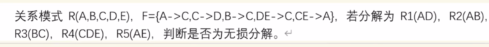

# 判断有损分解与无损分解
- 步骤
    - 建表：讲题目中R中分解出来的个数作为行的个数，R中给出的属性个数
    - 根据题目中分解出的每个R，根据R中属性，将出现的属性填为aj，未出现的属性填为bij(i是行号，j是列号)
    - 根据F中的关系，修改表，原则如下：
    !!! note
        $X\rightarrow Y$ 找对应的X那格是aj且Y那格是bij的，将Y那格改为aj
        !!! warning
            若X不是单属性是复合属性，那则必须满足符合属性中的单个属性全部是aj，否则不成立
        迭代上述这个过程，直到F中的函数依赖全部用完
    - 找出是否有一行全部是aj，若存在时无损分解，不存在是有损分解

- 建表

||A|B|C|D|E|
|---|---|---|---|---|---|
|AD|a1|b12|b13|a4|b14|
|AB|a1|a2|b23|b24|b25|
|BC|b31|a2|a3|b34|b35|
|CDE|b41|b42|a3|a4|a5|
|AE|a1|b52|b53|b54|a5|

- $A\rightarrow C$

||A|B|C|D|E|
|---|---|---|---|---|---|
|AD|a1|b12|a3|a4|b14|
|AB|a1|a2|a3|b24|b25|
|BC|b31|a2|a3|b34|b35|
|CDE|b41|b42|a3|a4|a5|
|AE|a1|b52|a3|b54|a5|

- $C\rightarrow D$

||A|B|C|D|E|
|---|---|---|---|---|---|
|AD|a1|b12|a3|a4|b14|
|AB|a1|a2|a3|a4|b25|
|BC|b31|a2|a3|a4|b35|
|CDE|b41|b42|a3|a4|a5|
|AE|a1|b52|a3|a4|a5|

- $B\rightarrow C$ 无需更改
- $DE\rightarrow C$ 无需更改
- $CE\rightarrow A$

||A|B|C|D|E|
|---|---|---|---|---|---|
|AD|a1|b12|a3|a4|b14|
|AB|a1|a2|a3|a4|b25|
|BC|b21|a2|a3|a4|b35|
|CDE|a1|b42|a3|a4|a5|
|AE|a1|b52|a3|a4|a5|

- 因为不存在一行全部是aj，所以该分解是有损分解