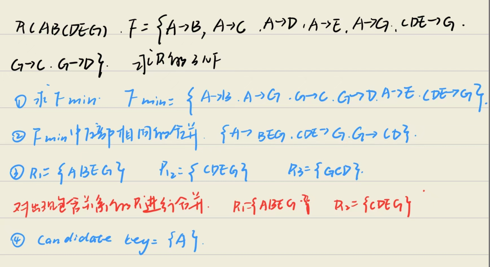

# 将关系模式分解为3NF
## 算法
- 对于关系模式R和R无损分解且保持依赖地分解为3NF
    - 对于关系模式R和R上成立的函数依赖集F，先求出F的最小依赖集，然后再把最小依赖集中那些左侧相同的函数依赖合并起来
    - 对最小依赖集中，每个函数依赖$X\rightarrow Y$ 构成一个模式XY
    - 对构成的模式及中，如果每个模式都不包含R的候选键，那么把后宣讲作为一个模式放入模式集中

    