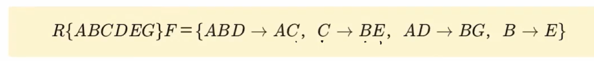
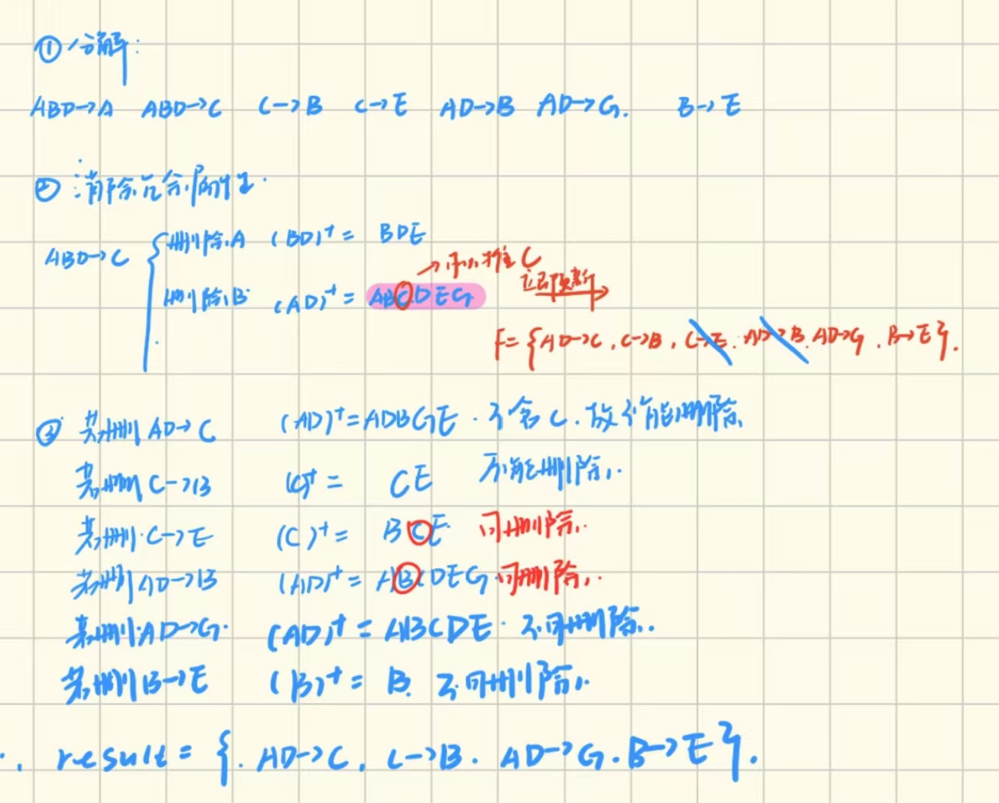

# 正则覆盖的做题技巧
## 算法
- 函数右部依赖分解成单属性
- 消除冗余的属性
    - 去掉各个依赖左侧多余的属性，具体做法是：一个一个地检查F中左边是非单属性的依赖，例如$XY\rightarrow A$。现在要判断Y是否为多余的，那也就是判断用$X\rightarrow A$替换$XY\rightarrow A$是否等价。
    !!! warning
        - 平凡函数依赖 直接去除即可
        - 要删除的属性所在的函数依赖在判断能否删除时可以在最后使用
- 消除冗余的函数依赖
    - 去掉多余的依赖。具体做法是：从第一个依赖开始，从F中去掉它后看闭包中是否还有该属性
!!! example 
    
    ??? answer
        
     