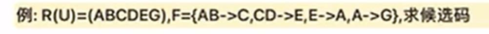
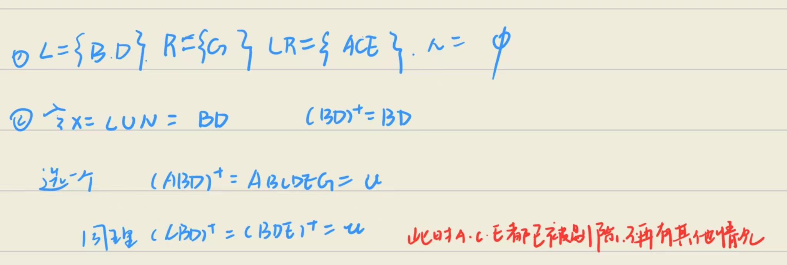

# 求候选键
## 方法
- 对于给定的关系$R(A_1,A_2,...A_n)$和函数依赖集F，可将其副属性分为4类：
    - L类：只出现在F的函数依赖左侧的属性
    - R类：只出现在F的函数依赖右侧的属性
    - LR类：在F的函数依赖左右两边均出现的属性
    - N类：在F的函数依赖左右两边均未出现的属性

- 步骤
    - 将属性进行分类
    !!! warning 
        属性类别一定不要分错
    - 令$X=L\cup N$,如果$X^+=U$则表明X是R的唯一候选键，算法终止
    - 从LR中选1个属性Y'，若$(XY')^+=u$则XY'是候选键。调换Y‘中所有属性为止
    - 从LR中选2,3....个属性Y，若$(XY)^+=U$则XY是候选键。知道调换Y中所有属性为止
    !!! warning
        第三步中XY'是候选键，那么第四部中的Y=Y-Y'
!!! example
    
    ??? answer
        