# Chapter 1:Fundamentals of Computer Design

## Part One: Introduction

- 冯诺依曼架构：存算分离

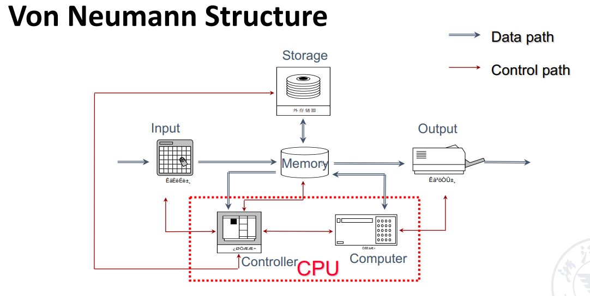

### 计算机的分类（及关键的系统特征）
- Personal Mobile Devices(个人移动设备)：成本、能耗、媒体性能、响应速度
- Desktop Computers(桌面计算机)：性价比、能耗、图形性能
- Servers Computers(服务器)：吞吐量、可用性、可扩展性（规模）、能耗
- Embedded Computers(物联网/嵌入式计算机):价格、能耗、应用的特有性能
- Supercomputers(超级计算机/集群、仓库计算机)：性价比、吞吐量、能耗均衡性

### 计算机并行
- 数据集并行(DLP)：使某些数据选项可以同时操作
- 任务机并行(TLP): 创建的工作任务可以单独执行 并且主要采用并行方式执行

- Flynn's Class(根据数据流与指令流)

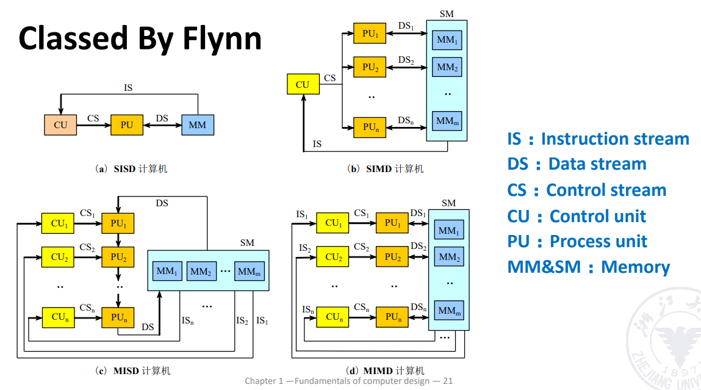

## Part Two: Performance
- 影响性能的因素：体系结构，硬件实现，编译器，OS等
- 衡量性能的方法
    - Single users on a PC->响应时间的最小值
    - Large Data->吞吐量的最大值
- 响应时间与吞吐量
    - 响应时间：response time或称为latency，一个事件开始到结束的时间，如一次访问需要多长时间
    - 吞吐量：throughput，也称作(bandwith带宽)：给定时间范围内完成了多少的工作量
- 体系结构的主要目标就是***提升系统的性能***，如每秒传输的字节数

## Part Three: Technology Trend

The improvement of computer architecture 
- 输入输出的进步
- 内存组织结构的发展
- 指令集的发展方向
    - CISC
    - RISC
- 并行执行技术（不同层次（系统程序算法等）、粒度（任务的大小或复杂度）的并行）

## Part Four:Quantitive Approaches
1. CPU Performance
- $CPU Time=IC \times CPI \times clock cycle time$
- $CPI=1+\sum_{i=1}^{n}P_i$
    - CPI由硬件决定
    - 不同的指令也会有不同的CPI，平均CPI取决于指令的组合方式
    - $CPU Cycles=IC \times CPI $
2. Amdahl's Law
- 使用某种快速执行模式获得的性能改进受限于可使用此种模式的时间比例。当提升系统性能时，可以计算出通过改进计算机某一部分而获得的性能增益
- $T_{improved}=\dfrac{T_{affected}}{\text{improvement factor}}+T_{unaffected}$
- 加速比(SP)：改进前后执行时间正比或性能反比
$$
\begin{align*}
\text{Speedup} & = \dfrac{\text{Performance for entire task}_\text{using Enhancement}}{\text{Performance for entire task}_\text{without Enhancement}} \\
& = \dfrac{\text{Total Execution Time}_\text{without Enhancement}}{\text{Total Execution Time}_\text{using Enhancement}}
\end{align*}
$$
- 执行时间(f指改进部分所占的比例)
$T_{new} = T_{old}\times \left((1-f)+\dfrac{f}{Sp}\right)$
- 改进系数(f)：改进部分的执行时间占整个任务时间的比例
    - 其中Sp为被优化部分的加速比，$Sp_{overall}$为整体加速比，f为被优化部分所占的运行时间比例。
## Part Five:Great Architecture Ideas
- 摩尔定律：每过 18-24 个月，集成电路的晶体管数量将增加一倍
- 使用抽象来简化设计
- 让最常见的情况更快
- 通过并行来提高性能
- 由很多级别的并行，比如指令集并行、进程并行等
- 通过流水线来提高性能
    - 将任务分为多段，让多个任务的不同阶段同时进行
    - 通常用来提高指令吞吐量
- 通过预测来提高性能
- 使用层次化的内存
    - 让最常访问的数据在更高层级，访问更快(Memory Hierarchy)
## Part Six:Ideas
- Instruction Set Architecture(ISA)
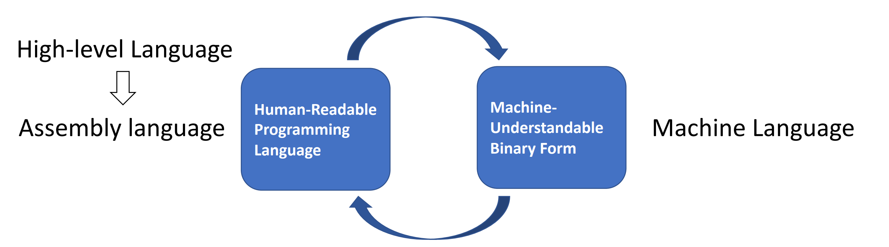

Instruction Set Design Issues
- ISA分类
- 存储器寻址
- 寻址模式
- 操作数的类型和大小
- 操作指令
- 控制流指令
- ISA的编码

## Part Seven:Trends in power and Energy  in Integrated circuits
1. Trends in power
- Challenges
    - distributing the power
    - removing the heat
    - preventing hot spot
- 节能的技术
    - 以逸待劳（Do nothing well）:关闭 非活动模块时钟
    - 动态电压--频率调整(DVFS):活跃程度较低的时期不需要以最高始终频率和电压运转
    - 针对典型情景的设计(Design for typical case):
        - Lower power modes(LPM)-save power
        - Can not access DRAM or DISK when in LPM
    - 超频(Overclocking)：在执行单线程代码时，微处理器可以仅留下一个核，并使其以更高时钟频率运行而其他所有核均被关闭
    - 竞相暂停(race-to-halt):由于处理器只是系统整体能耗的一部分，所以如果使用一个速度较快但能效较低的处理器，使系统其他部分能够进入睡眠模式，可能有助于降低整体能耗
2. 微处理器内部的能耗和功率
- 动态功率：开关晶体管的能耗
    - 逻辑转换脉冲0->1->0或者1->0->1的能耗：
    $$
    Energy_{dynamic}=Capacity\ load \times Voltage^2 
    $$
    - 一次转换的功率为
    $$
    Energy_{dynamic}=\frac12 \times Capacity\ load \times Voltage^2 \times Frequency\ switched
    $$
    - 对于一项固定任务，降级时钟频率可以降低功率，但不会降低能耗

- 静态功率：晶体管因漏电而关断时的功耗
$$
Power_{static}=current\ static \times Voltage
$$
3. Multiple core deliver more performance per watt

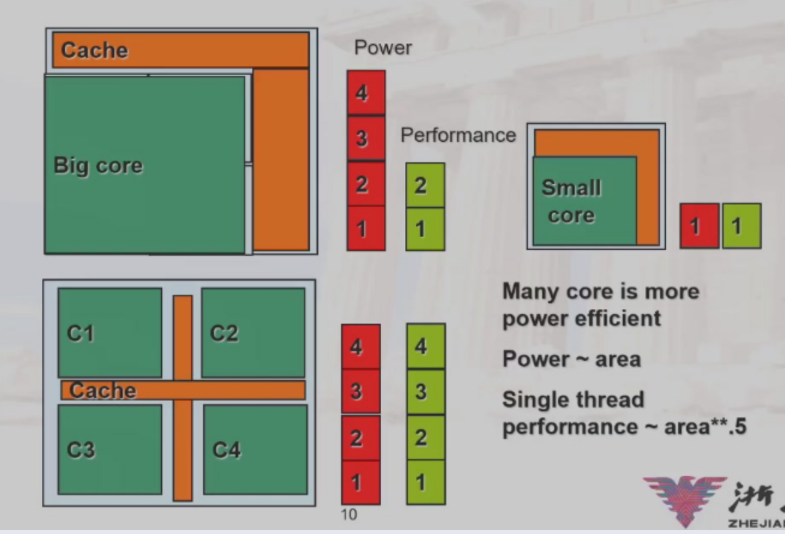

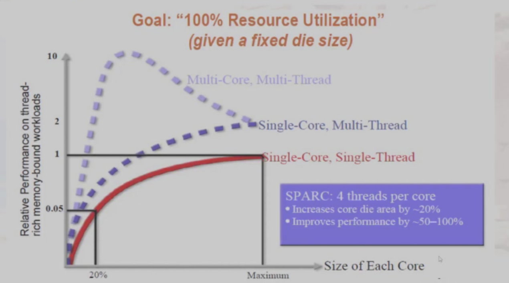
- 由于多核通讯，资源占用等问题，多核多线程会在达到峰值后回落
## Part Seven:Cost Trend
1. Time,Volume and Commodification(时间、产量和大众化)
- 时间：即使基本的实现技术没有取得任何重大进步，计算机组件的制造成本也会随着时间的推移而降低
    - 成本下降的背后基本原理是学习曲线：制造成本随时间的推移而降低。学习曲线本身根据良率的变化预测（良率：成功通过测试的器件占所生产器件总数占总件数的百分比），良率翻倍的设计就能使成本减半
- 产量：从两个方面影响成本
    - 产量的提高减少了完成学习曲线所需的时间，该时间在一定程度上与系统(或芯片)的制造数量成正比
    - 产量的增加会提高购买与制造效率，所以会降低成本。
    产量每增加一倍，成本会降低百分之十
2. 大众化：指多家供应商大量出售且基本相同的产品。市场的竞争会降低成本。
- 产量会提高，但是利润会被限制

- Learning Curve：

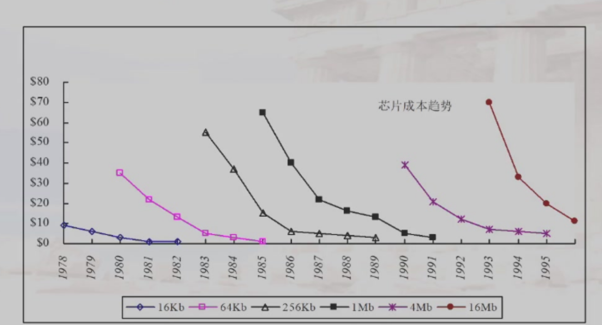

## Part Eight:Reliability(可信任度)

容错与系统可靠性领域

- Definition

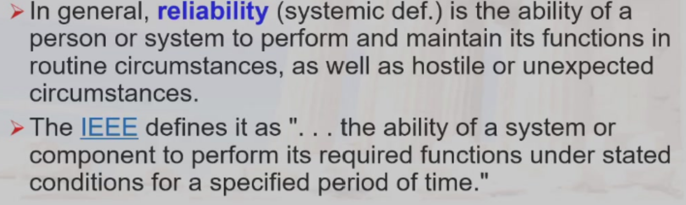

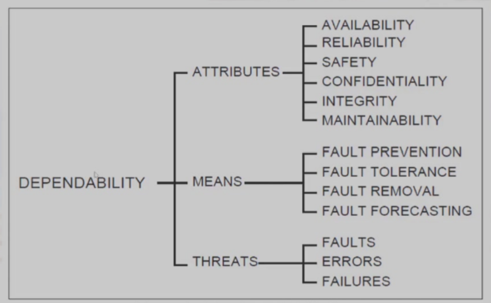

1. 如何判断一个系统的运行是否正常，基础供应商开始提供服务等级协议（service level agreement,SLA）或服务等级目标（service level subject,SLO）
- 服务完成（service agreement）:提供了SLA的指定服务
- 服务中断(service interrution)：即所提供的服务与SLA不一致
- 两种状态之间的转换由故障（Failure）或恢复（Restoration）导致
    - Failures:$S_{accomplishment}->S_{interruption}$
    - Restorations:$S_{interruption}->S_{accomplishment}$
2. 信任度的度量
- Module Reliability:从参考初始时刻开始的连续的服务完成情况的度量（对发生故障之前的时间的度量）
    - MTTF:平均无故障时间（Mean Time To Failure）
    - MTTR:平均故障恢复时间（Mean Time To Restoration）
    - FIT:故障发生频率（Failure Instance Time），MTTF的倒数以运行十亿小时发生的故障来表示
    - MTBF:平均故障间隔时间。MTBF=MTTF+MTTR
- Module availability:指在服务完成与服务中断两种状态之间切换时，对服务完成情况的度量
$$
Mobile\ availability=\frac{MTTF}{MTTF+MTTR}
$$

3. 解决故障的方法：冗余(Rebundancy)
- 时间冗余：重复操作，以查看是否仍然存在错误
- 资源冗余：当一个组件故障时，由其他组件接管
## Part Nine:Measuring,Reporting and summerizing Perf(性能的测量、报告和汇总)
1. 性能的测量
- 机器之间的比较
    - Execution Time(Latency)
    - Throughout
    - MIPS:millions of instructions per second
- 使用程序进行机器之间的比较
    - 选择程序来评估性能
        - Benchmark Suites
    - Different Means:Arithmetic,Harmonic,and Geometric Means
- 对于不同的使用者和设计者性能评估的标准是不同的

- 执行时间的定义方式（根据测量内容的不同）
    - 挂钟时间（Wall-clock time）,也叫做响应时间(response time)或者已用时间(elapsed time):完成一项任务的延迟时间，包括外存访问、输入输出活动、操作系统开销等所有相关时间。
    - 在多个程序同时运行多个程序的情况下，处理器等待I/O时处理另一个程序不一定使挂钟时间缩小至最短
    - CPU时间：处理器执行计算的时间而不包括等待I/O计算或运行其他程序的时间
        - User Time:用户模式下的执行时间
        - System Time:操作系统的执行时间
    - 用户观测到的响应时间是程序的挂钟时间而不是CPU Time
- 管理员衡量系统性能的视角：给定时间内完成的工作数量
- 我们通常使用吞吐量进行测量：单位时间内完成的工作数量
- 通常使用相对延迟来反映系统的性能

- 如果想要改进response time，通常使用改进吞吐率的方法
    - 使用速度更快版本的计算机的处理器
- 提升系统的吞吐率可以不改进response Time
    - 对于分立的任务在多核处理系统中增加额外的处理器

- MIPS：Millions of Instructions Per Second
$$
MIPS = \frac{\frac{\text{number of instructions}}{\text{benchmark}} \times \frac{\text{benchmark}}{\text{total run time}}}{1000000}
$$

- 不同视角使用的不同测量方法
    - Execution time
        - 用户视角
        - 系统性能
        - 唯一的不容置疑的
    - CPU Time
        - 设计者视角
        - CPU性能
    - 吞吐量
        - 管理者视角
    - MIPS
        - 供应商视角
2. 基准测试
使用远比实际应用程序简单的程序
- 程序内核(Kernal):即实际应用程序中短小、关键的部分
- 玩具程序：即为了完成编程入门作业而编写的小程序，通常不超过100行，比如快速排序
- 合成基准测试程序(Sythentic Benchmark):即为了匹配实际应用程序的特征和行为而编写的虚拟程序，比如Dhrystone

> 现在三种方法都受到了质疑，主要是因为编译器的编写人员和架构师可以串通起来使计算机在执行这些替代程序的时候显得比运行时及应用程序时更快。
- 为了避免太多鸡蛋放在同一个篮子里所带来的问题，一种流行的做法是基准测试应用程序集（称为基准测试套件）：套件的准确率不会超过组成该套件的各个基准测试。
    - 不过，这种套件的主要优势在于，任何一个基准测试的弱点都会因为其他基准测试的存在而淡化。基准测试套件的目的是描述两台计算机的实际相对性能，特别是对于客户可能会运行的不在该套件中的程序
3. Total Execution Time
- Arithmetic mean(算术平均)：$\frac1n \Sigma_{i=1}^n Time_i$ 
- 如果性能以rate的形式表达，那么平均总时间是harmonic mean(调和平均)：$\frac{n}{\Sigma_{i=1}^n \frac{1}{Rate_i}}$
- 当我们很那知道具体的比例时，我们可以进行以一个程序为标准进行转换

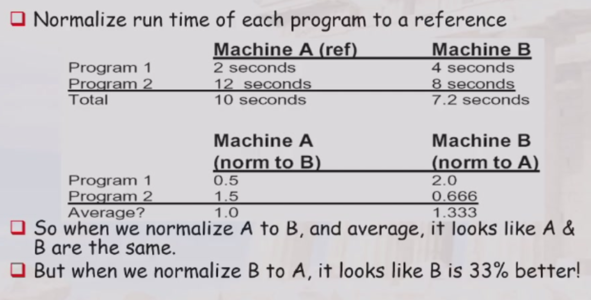

权重的计算

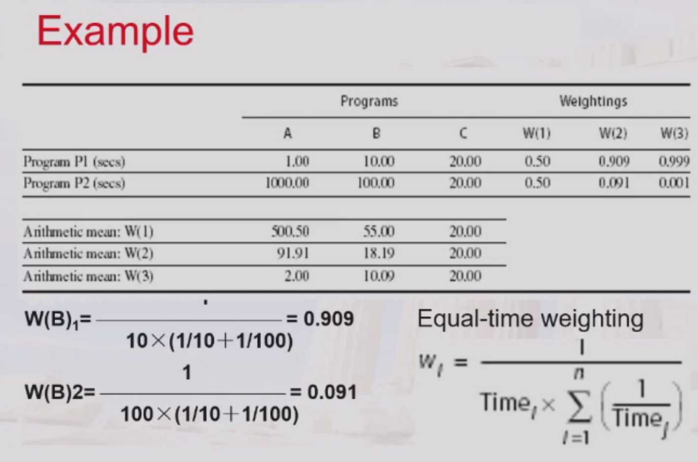
> 不同程序跑单位时间程序的执行次数作为权重
>
>> 这时不同参考基得到的权值是不同的

- Geometric mean(几何平均)：$\sqrt[n]{\prod_{i=1}^n Relative\_Rate_i}$=$\frac{\sqrt[n]{\prod_{i=1}^n Rate_i}}{Rate_{ref}}$
> 几何平均的=得到的权值与参考基的选择是无关的
>
>> 本身没有物理意义，不能预测运行时间
$$
\frac{Geometric\ mean(X_i)}{Geometric\ mean(Y_i)}=Geometric\ mean(\frac{X_i}{Y_i})
$$

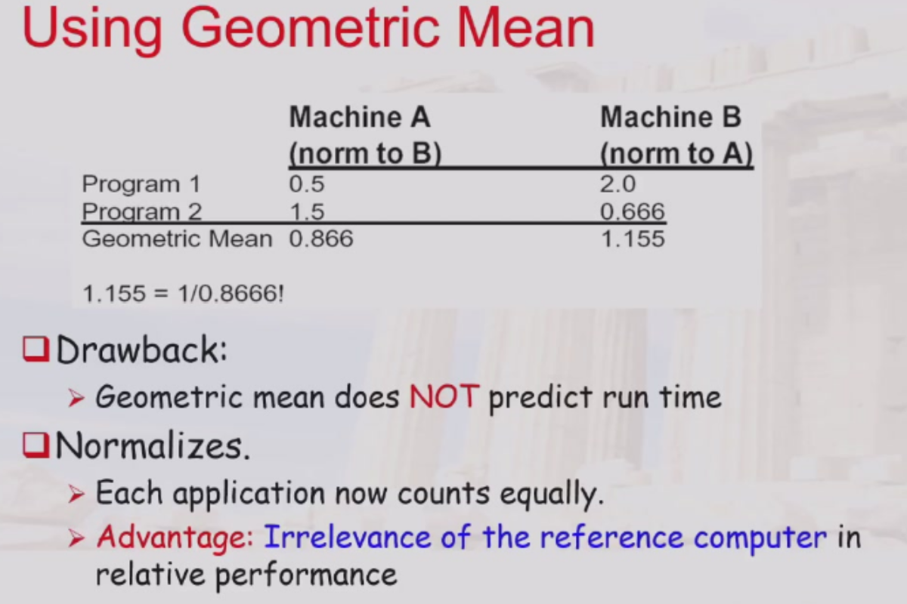

## Part Ten:Quantitive Principles(量化设计原理)
1. 充分利用并行
- 系统级并行(system)：使用多个处理器 
- 指令级并行(Instruction)：使用流水线技术
- 操作级并行(operation)：
    - 组相联cache
    - 流水线功能单元(如ALU等)
2. 局部性原理
- 程序原理：程序会趋向于再次使用最近使用过的数据和指令
- Rule of Thumb(经验法则):a program spends 90% of its execution time in only 10% of the code(程序的大部分时间都集中在少数关键代码段上，其余大部分代码对整体性能的影响较小)
- 时间局部性
- 空间局部性
3. 重点关注常见情形
4. Amdahl Law(阿姆达尔公式)
- 原计算机计算时间中可改进部分所占的比例
- 通过改进执行模式得到的改进，也就是说在为整个程序使用这一执行模式时，任务的运行速度会提高多少倍
- 部件的加速比的极限值是$\frac{1}{1-F}$

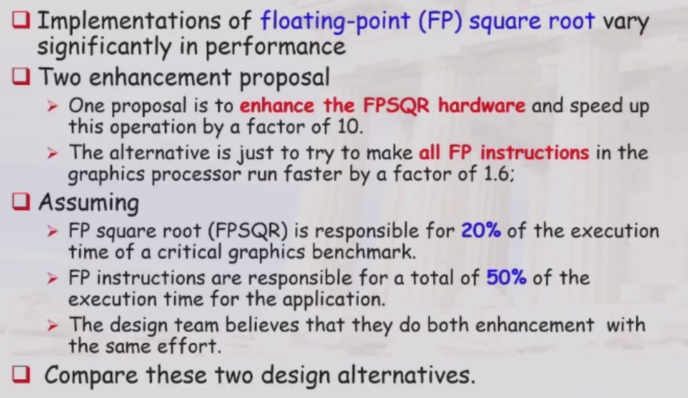
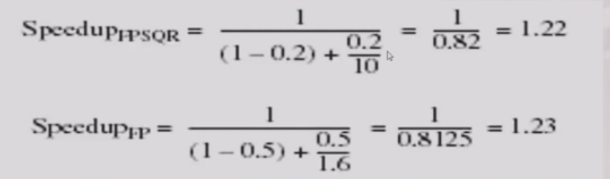
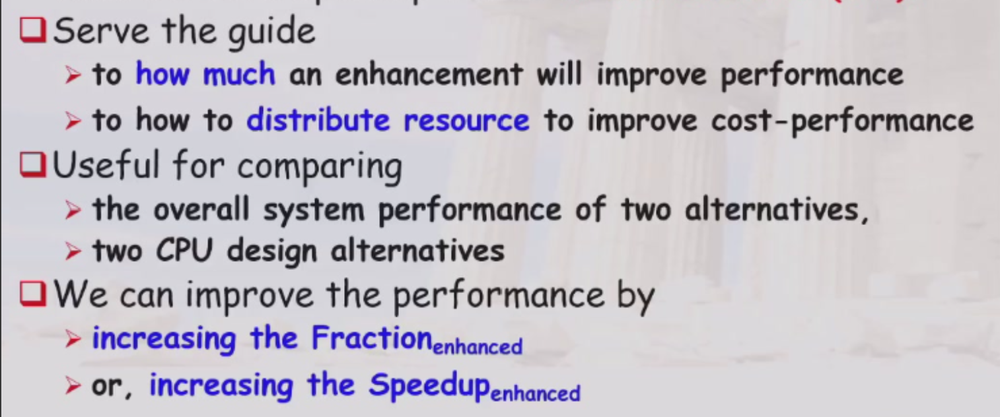

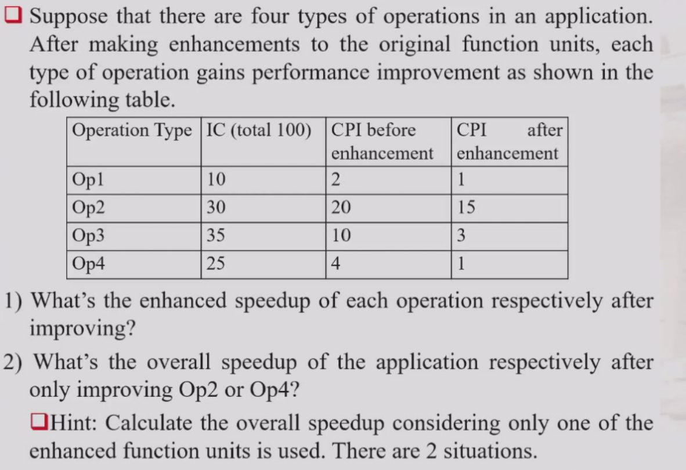
- 注意时间比(fraction)不能按照IC的比例，而是要按照时间的比例(CPU Time)