# Chapter 2:Pipeline
## 1. What is pipeline
从两个角度进行加速：对每一条指令进行加速；对一段程序的执行进行加速

机制上，先进行分段，每一段用不同的部件，就可以并行执行。我们用buffer存放各个阶段的中间结果

执行的模式有三种
- Sequential execution
- Single overlapping execution
- Twice overlapping execution

### 1.1 Sequential execution

没有流水线的时候每一条指令顺序执行，执行时间就是每一条指令的每个阶段时间求和

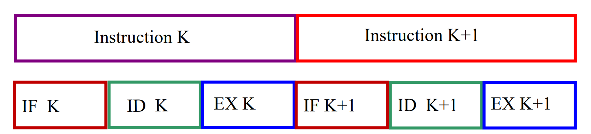

时间就是所有指令时间之和

### 1.2 Overlapping execution

重叠执行，如果不同阶段时间不一致，如ID阶段时间较长，那么需要等待浪费资源；如果EX阶段时间较长，那么产生冲突，执行部件不够。

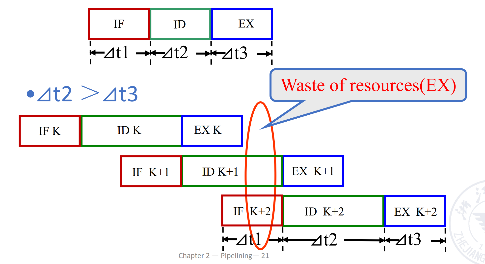
- ID阶段的时间较长，那么其他阶段的执行单元会等待，资源就会浪费

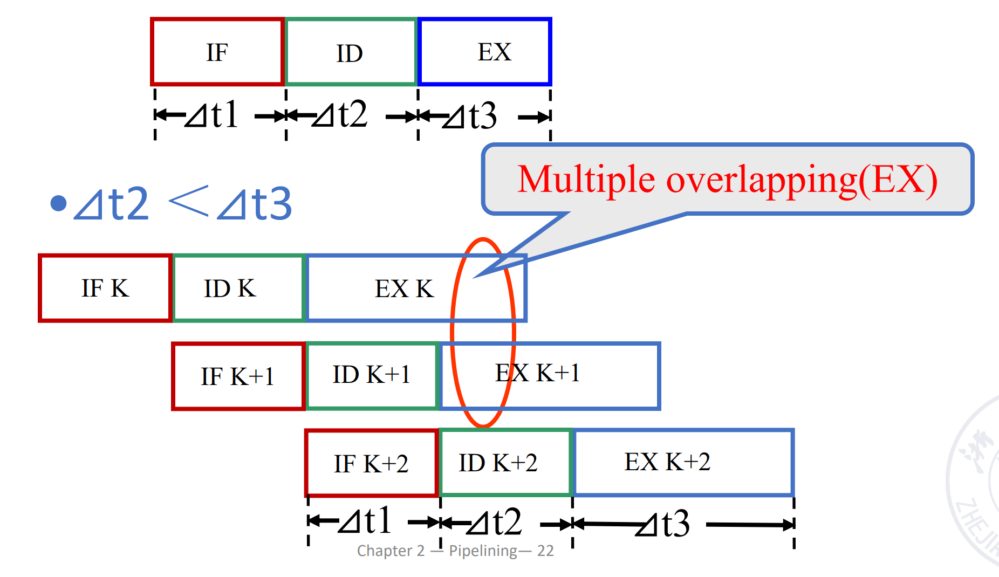
- EX阶段时间较长，可能会出现执行单元不够用的情况，导致流水线堵塞

理想情况下是让三个阶段的时间相等
- Single Overlapping

    - 相较于顺序执行，时间缩短$\frac13$，同时功能部件的利用率得到明显改善
    - 提高了硬件开销(增加功能单元以用来调度流水线)，而且有冒险(由于指令之间存在依赖关系可能产生冲突)

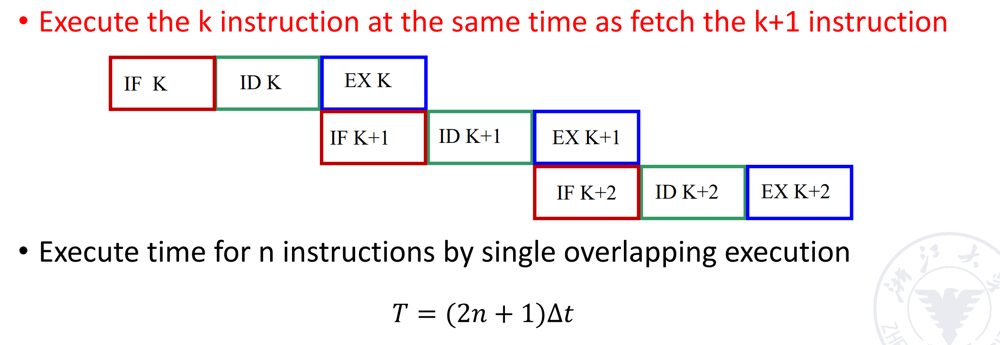

- Twice Overlapping

    - 时间可以减少近$\frac23$，部件利用率更高
    需要更复杂的硬件，而且需要单独的Fetch Decode EXE部件

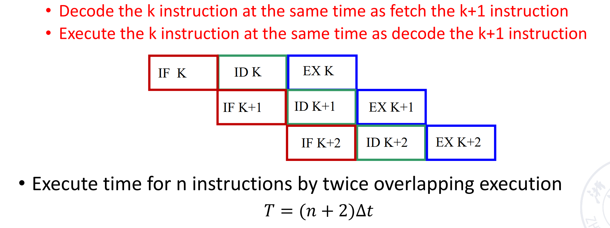

### 1.3 如何实现重叠？- buffer
Adding instruction buffer between memory and instruction decode unit.直接在buffer中取指，大大缩短取指时间。

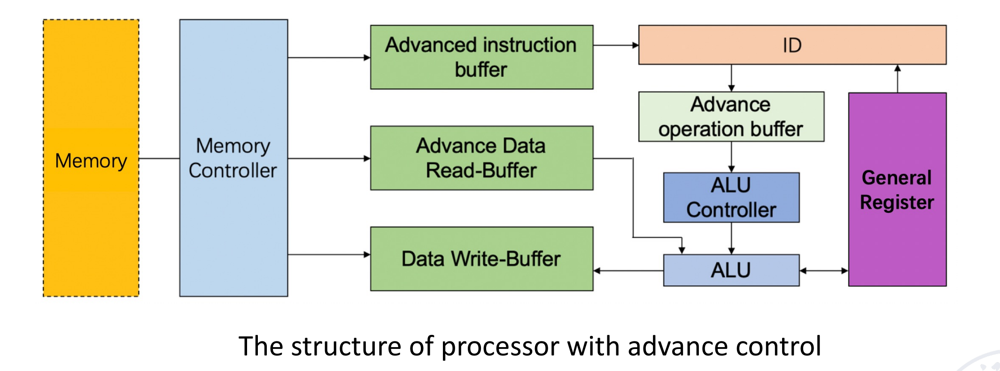
- 使取数、存数、传输等操作的时间大大缩短，使所有执行时间都集中在ALU无法缩短

The structure of processor with advanced control

添加 buffer 之后，IF 阶段时间变得很短，此时可以和 ID 阶段合并（把二次重叠变为了一次重叠）。
- 时间接近变为原来的一半

如果合并之后IFID和EX阶段时间不一致，也会有执行部件的浪费。
- 我们的目标是使ALU计算单元在较长时间内处于工作状态也就是EX阶段尽量不等待

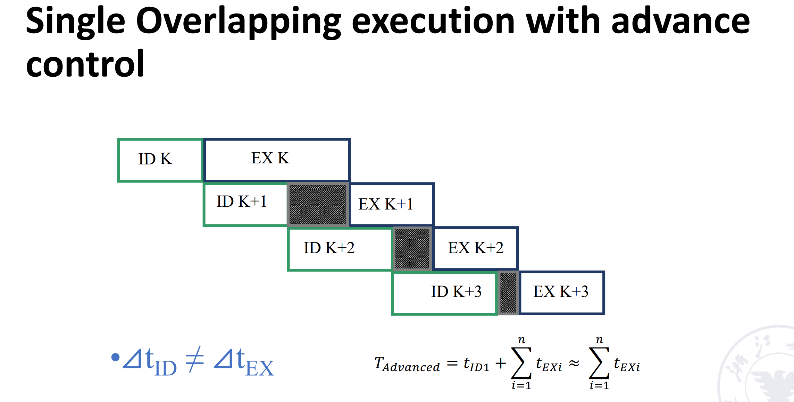

Common features: They work by FIFO, and are composed of a group of several storage units that can be accessed quickly and related control logic.

可以看到，添加 buffer 之后，ID 阶段不用等待 EX 阶段技术才能进行下一条的译码，因为 ID 阶段的结果已经存放在 buffer 中了。这给ID创造了能够读取下一条指令的机会

#### 1. buffer的引入
- 存放阶段间的中间结果，避免由于下一阶段的执行时间较长而导致前一个阶段需要等待
- 当IF阶段完成取指后，立即将指令放入buffer中，而不需要等待ID阶段完全解码完成。这样IF阶段可以尽快开始下一条指令的取指，增加了流水线的并行度

#### 2. buffer优化流水线
- **减少等待时间**：即使EX阶段耗时较长，ID阶段也不需要等待EX阶段完全执行完毕，因为ID阶段可以将解码结果暂时存放在buffer中
- **提高吞吐量**：通过buffer来存储各个阶段的临时结果，允许流水线继续向前推进，减少了各阶段之间的执行时间差异对流水线效率的影响
- **缓冲区机制(FIFO)**：确保数据按照正确的顺序传递到下一个阶段。FIFO的硬件实现不仅包括存储单元，还需要一些控制逻辑来管理数据的读取和写入
> 添加buffer之后，IF阶段时间变得很短，此时可以和ID阶段合并(把二次重叠变为了一次重叠)

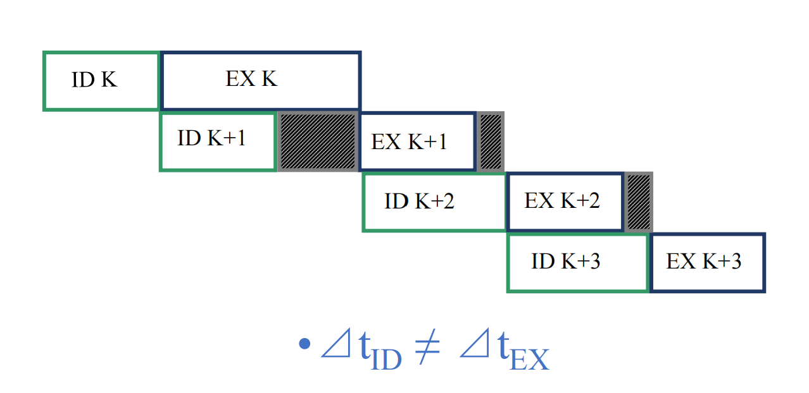
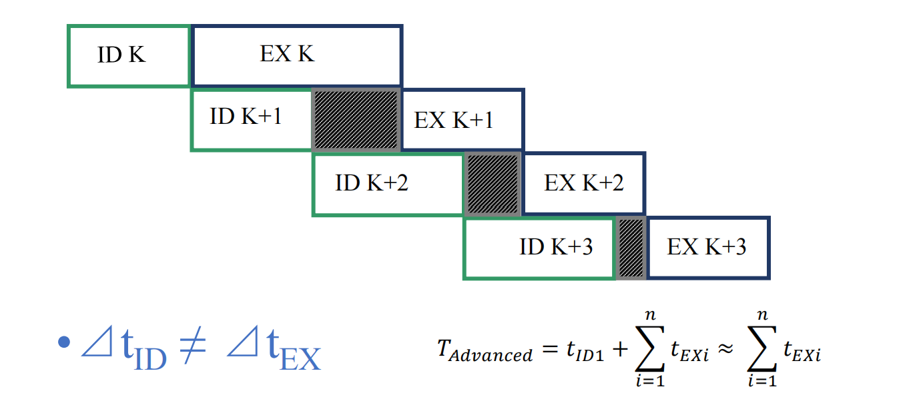
- 添加buffer之后ID不用等待EX阶段结束之后才进行下一条指令的译码，因为ID阶段的结果已经存放在buffer中了
## 2. Classes of poplining

Charasteristics of pipelining:
- 单功能流水线：只有一个固定功能的流水线。涉及仅针对单一类型的运算
- 多功能流水线：流水线的每个部分以不同的方式连接(不同阶段进行灵活组合)可以实现不同的功能
    - 使处理器能够更灵活地分配计算资源


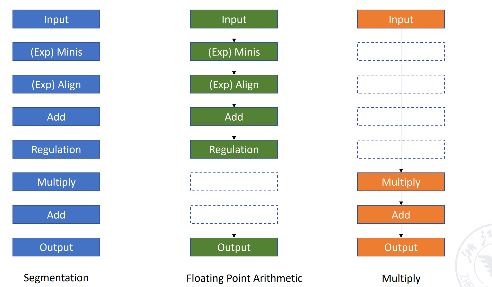

针对多功能流水线的划分

- 静态流水线：同一个时刻流水线只能做一个功能。**流水线的功能同一时刻是固定的**

> 例如在刚刚的例子中，流水线要么做浮点加法要么做乘法

- 动态流水线：同一个时刻可以做多个功能。可以不用等待浮点加法第n条结束(即某一任务完全排空)，就可以开始乘法

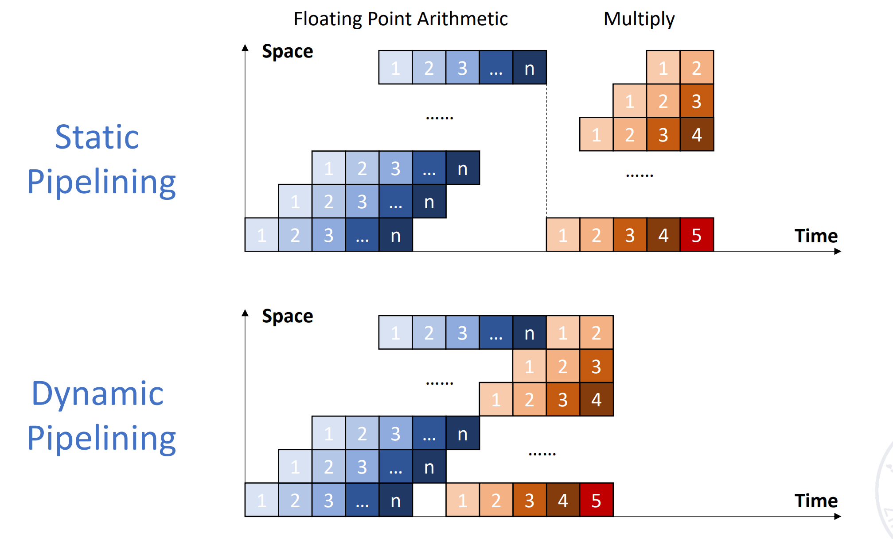

从不同的粒度分类：
- Component level pipelining (in component - operation pipelining)：处理器内部组件内进行的流水线操作。例如，在同个ALU钟可以通过流水线技术让不同操作的各个阶段并行进行
- Processor level pipelining (inter component - instruction pipelining):跨多个处理器组件的流水线操作，通常是指指令集的流水线。不同的指令在不同组件中进行取指、解码、执行等操作
- Inter processor pipelining (inter processor - macro pipelining)：更大规模的流水线设计，涉及多处理器或多核系统。在这种架构下，不同的处理器(或核)处理不同部分的任务

还可以分为线性或者非线性：
- Linear pipelining:不存在功能部件的回路，指令一依次在流水线的各个阶段中处理，每个阶段只进行一次运算，数据不会返回到之前的阶段。指令从一端流入，处理完毕后从另一端流出。
- Nonlinear pipelining:功能部件可能多次使用，造成回路

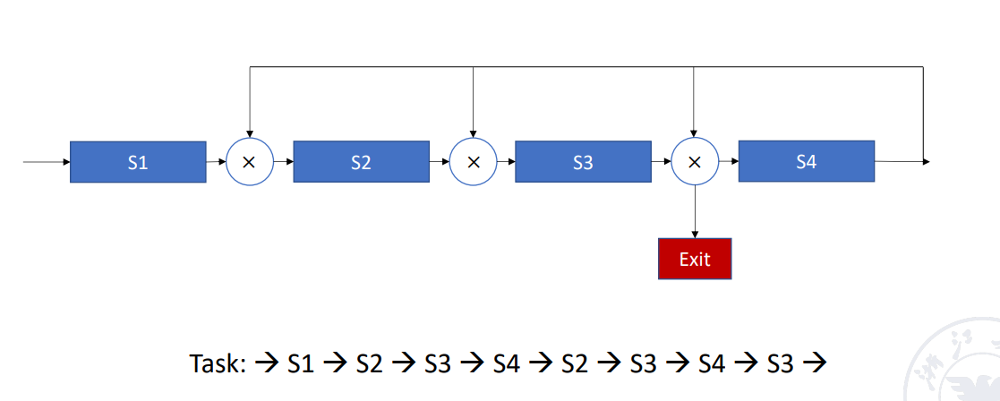

还可以分为顺序/乱序：
- ordered pipelining：指令进出流水线的顺序相同，指令的执行顺序和完成是确定视为
- disordered pipelining

进来和流出的顺序不一样。后面的指令与前面的指令无关，则可以先出来，不能则要等待。
- 乱序执行但是最后通过某些机制进行顺序调整
- 当流水线因为某一条指令堵塞时，处理器可以执行后续的指令

还可以分为向量/标量处理器
- scalar processor：每次只能处理单一的数据元素。它的指令处理数据都是标量，意味着每条指令处理一个数据值。

- vector processor：The processor has vector data representation and vector instructions. It is the combination of vector data representation and pipelining technology.采用向量指令处理多个数据元素(即一个向量)而不是单个标量。向量流水线的设计结合了向量数据表示与流水线技术，每次执行一条指令时处理的数据量非常大

## 3. Performance evaluation of pipelining
### 3.1 Throughput
流水线希望我们提高单位时间内处理的任务越多越好，即提高吞吐率
- 目的是提高处理的任务数，而不是减少时间

Throughput(TP) 
$$
TP=\dfrac{n}{T_K}<TP_{max}
$$

(实际上TP会有损耗)
- n是指令数
- $T_k$是流水线总的执行时间

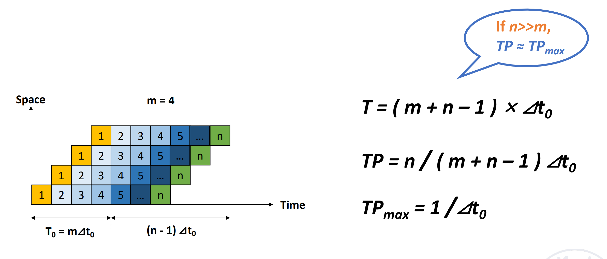

$$
TP=\dfrac{n}{n+m-1}TP_{max}
$$

- $$n>>m, TP\approx TP_{max}

Suppose the time of segments are different in pipelining, then the longest segment in the pipelining is called the bottleneck segment.

> Example
>Time of S1,S3,S4:$\Delta t$
>Time of S2:$\Delta 3t$(Bottleneck)
> 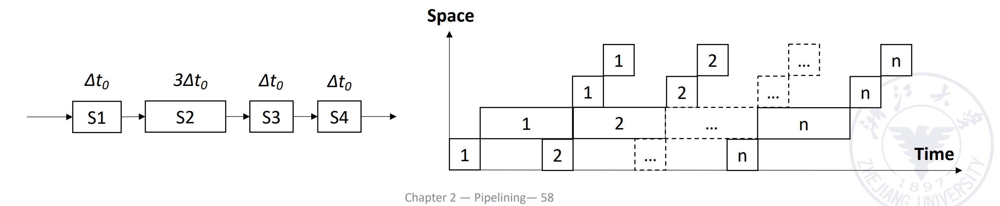
> 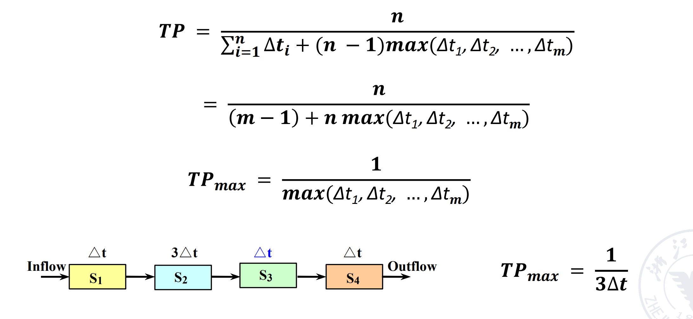
> $TP_{max}$只和瓶颈段的时间有关
#### 3.1.1 Common methods to solve pipeline bottleneck
- Subdivision 把瓶颈分成若干段执行

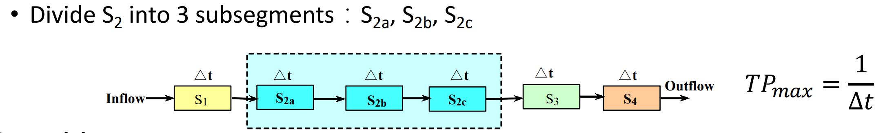

- Repetition 在瓶颈段多使用几个部件

### 3.2 Speedup
$$
SP=\frac{n \times m}{m+n-1}
$$
- if $n>>m,Sp_{max} \approx m$

### 3.3 Efficiency

效率，从计算机部件的角度：纵轴代表使用的不同的功能部件。效率指的是我们真正使用这个部件占整个时空的百分比。
- 流水线中硬件资源的利用率

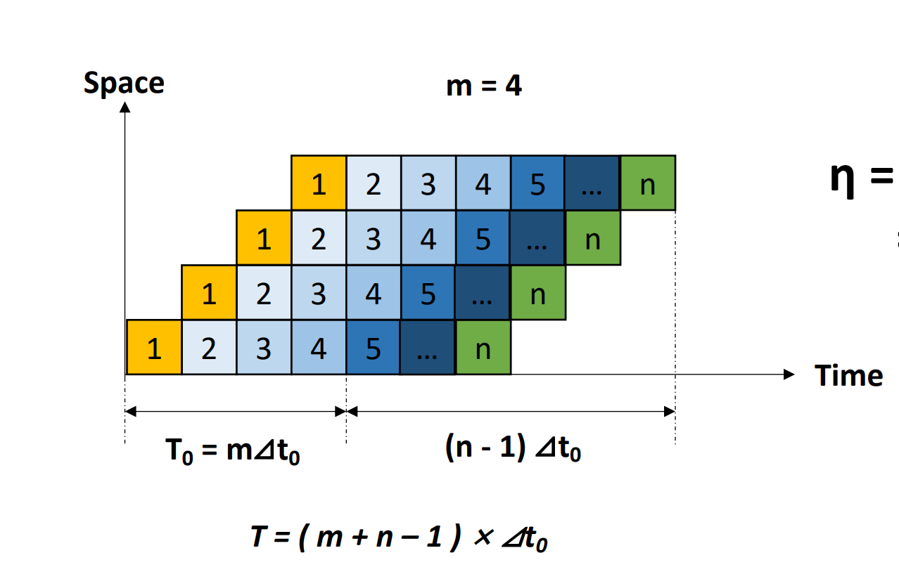
$$
η=\frac{n \times m \times \Delta t_0}{m \times(n+m-1) \times \Delta t_0}=\frac{n}{m+n-1}
$$
- 注意效率得到的结果应该是百分比，之前是吞吐量、加速比都是没有量纲的数
- if $n>>m, η\approx 1$ 实际上不可能为1，流水线进入和排空的时间是不可以忽略的

### 3.4 Pipeline Performance

- vector Calculation in static Pipeline

现在有两个向量 A 和 B，我们要计算 A 点乘 B，通过下面的动态双功能流水线运算。

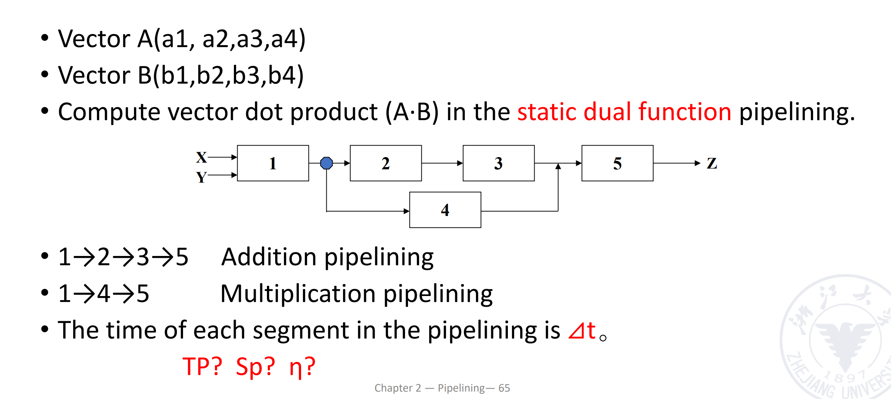

注意到这里是静态流水线，同一时刻只能做一类事情，需要先完成一种操作再完成另一种。这里我们需要先做乘法，排空，再做加法。做加法时，第三个乘法的结果需要等前两个乘法的结果相加后，再计算。

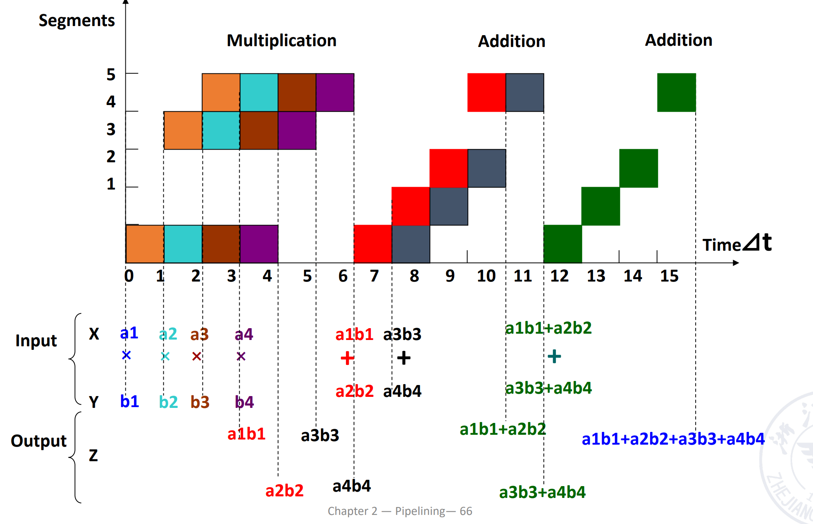

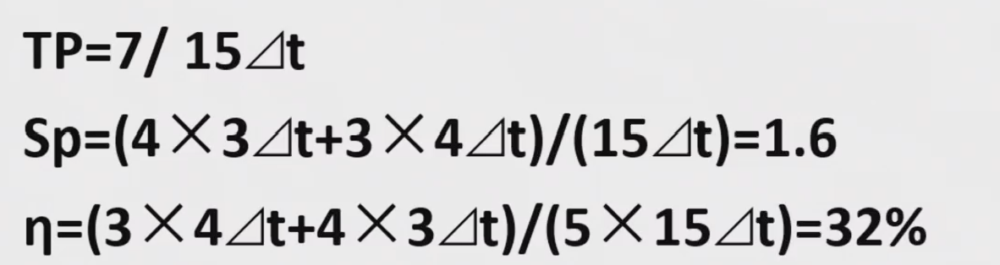

- vector Calculation in dynamic Pipeline

动态流水线，可以在前一个功能还没有做完的时候执行另一个功能，不需要排空。

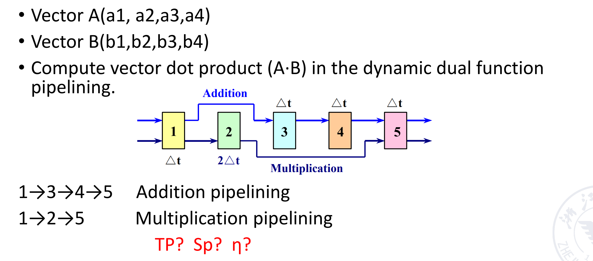

这里当两个乘法的结果算出来之后，就可以执行对应的加法。

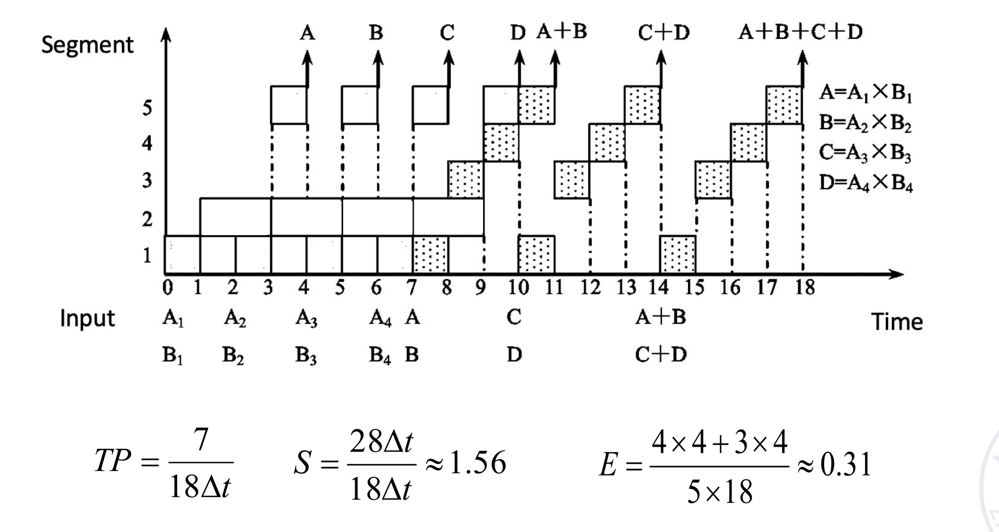

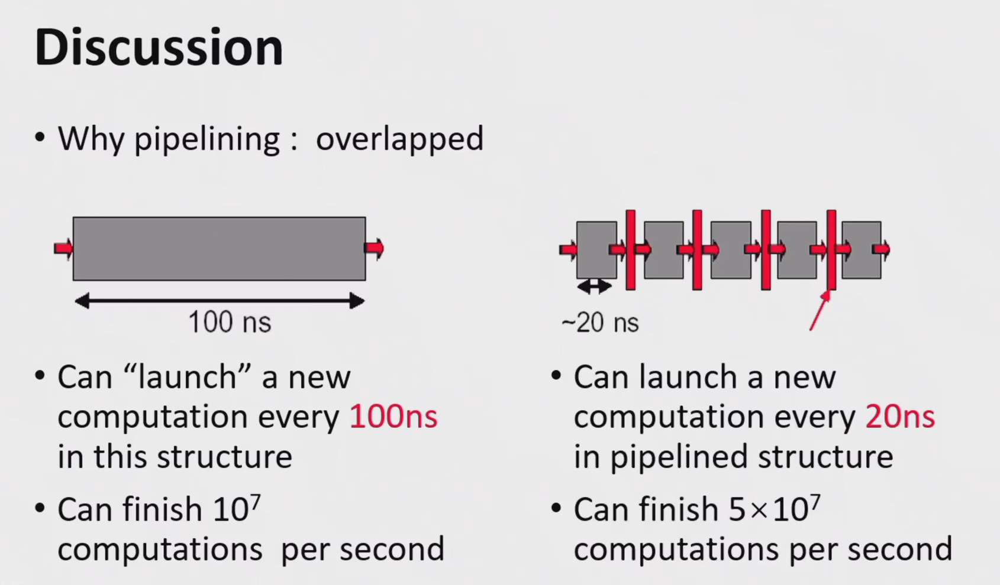

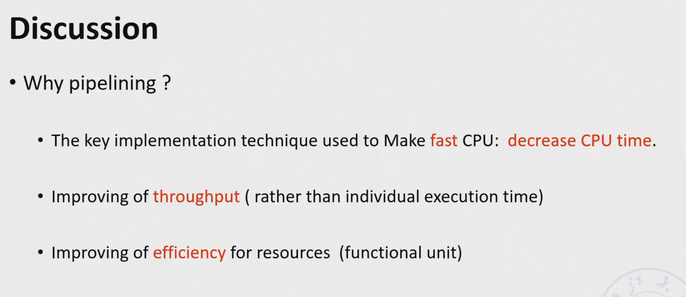

- 如果各个阶段是完全平衡的，每条指令的执行时间就是每个阶段所需要的时间，所以理想情况下的加速比也就是流水线的阶段数
- Too many stages
    - Lots of complications：流水线调度复杂，控制逻辑复杂
    - Should take care of possible dependencies among in-flight instructions
    - Control logic is huge
    - 导致性能瓶颈的产生
    - 硬件要求提高
流水线的性能有关：动态（不需要排空，但需要硬件支持）还是静态，流水线段数，代码质量（冒险）

## 4. Hazards of Pipeline 
- structure hazards:A required resource is busy
- data hazard:need to wait for previous instruction to complete its data read/write.
- control hazard: Deciding on control action depends on previous instruction.

### 4.1 structure hazards

对结构的争用,资源存在冲突

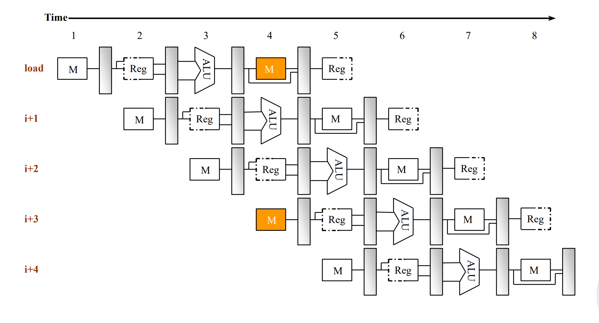

- 一般通过加bubble或者加硬件进行解决（满足需求），或者同一块memory区分不同的cache

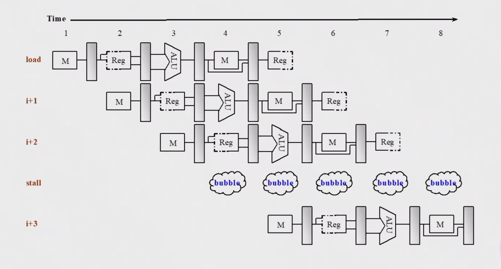

### 4.2 data hazard

一条指令的执行依赖于前面指令对于数据访问的完成

可以加 bubble, 或者通过 forwarding 前递数据，但并不是所有的情况都可以解决。

- Read After Write (RAW) 
```RISCV
FADD.D F6,F0,F12
FSUB.D F8,F6,F14
```

> Forwarding解决这种类型的冒险

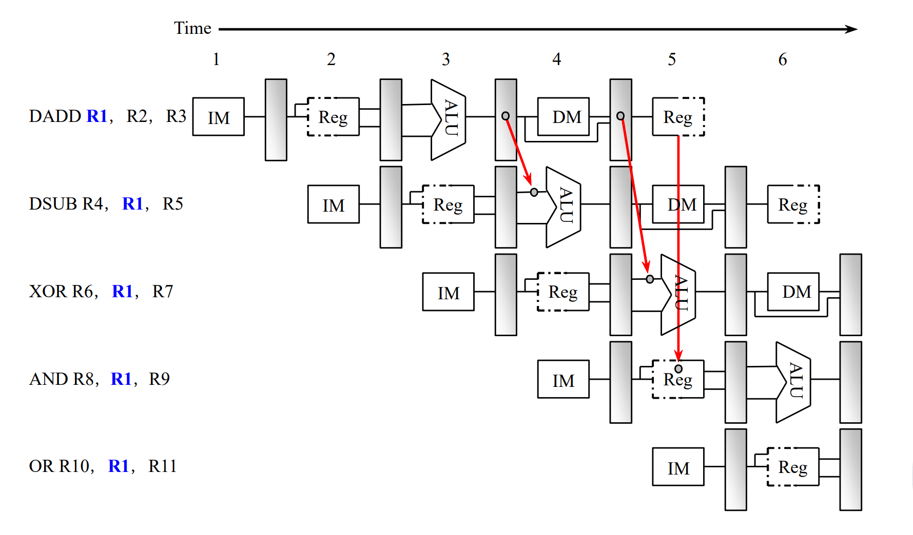


- Write After Read (WAR)
```RISCV
FDIV.D F2,F6,F4
FADD.D F6,F0,F12
```
- 可以更换F2对应的寄存器

> Name Dependences（在乱序流水线中可能出现冒险）

- Write After Write (WAW)
```RISCV
FDIV.D F2，F0，F4
FSUB.D F2，F6，F14
```

- 不能更换F2对应的寄存器，存在写入顺序的问题

Name Dependence,顺序流水线不会引起数据的冒险，但在乱序流水线会发生冒险的问题

- code scheduling to avoid stalls

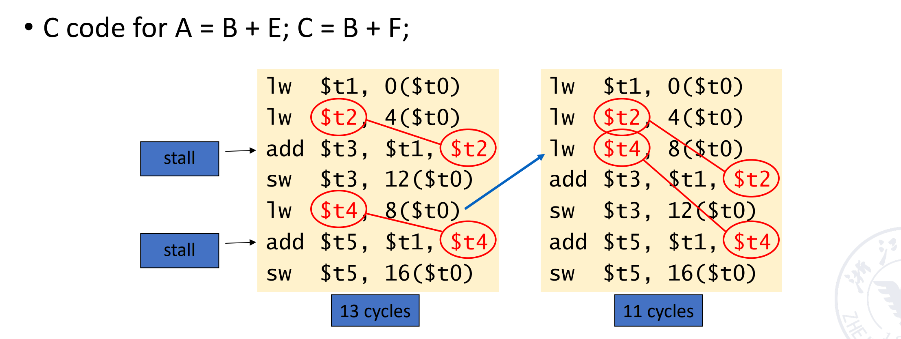
- 静态调度：程序还没有运行，编译器在程序编译阶段重新排列指令顺序，减少等待时间
- 动态调度：程序运行时，处理器为我们优化了代码

### 4.3 control hazard

- 定义：控制冒险发生在流水线遇到分支指令时，必须等待分支指令的结果才能确定下一步的执行路径。如果分支预测错误，流水线必须丢弃错误路径上的指令

为了减少分支指令带来的stall，我们使用分支预测的技术
- static branch prediction
    - 基于经典的分支行为
        - branch-taken
        - branch-not-taken
- dynamic branch prediction
    - Hardware measures actual branch behavior
        - 根据历史记录(如上一次分支结果)，预测下一次分支
    - 我们认为未来的行为将会延续现在的趋势

### 5. Data Hazards(4.2)
### 6. Control Hazards

在RISC-V中，有无条件跳转`jal`,`jalr`和有条件跳转`beq`,`bne`,`blt`,`bge`,`bltu`,`bgeu`

可以在ID阶段就**算出要跳转的目标地址**，同时进行分支预测。只有预测错误时才需要stall来flush掉之前的结果，预测成功不需要stall

#### 6.1 Static Branch Prediction
1. Predict-not-taken

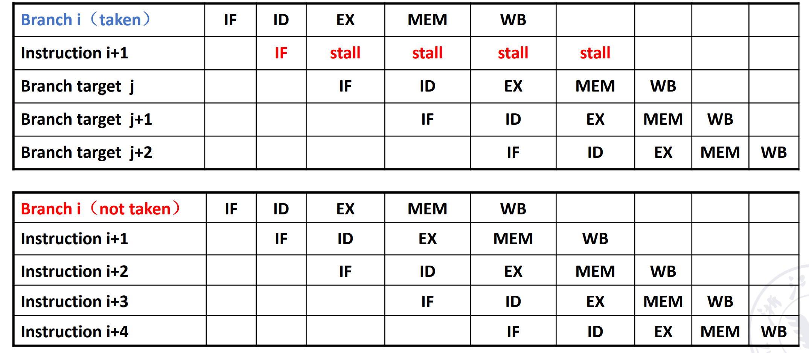

- 预测错误停顿一个周期，预测正确不停顿

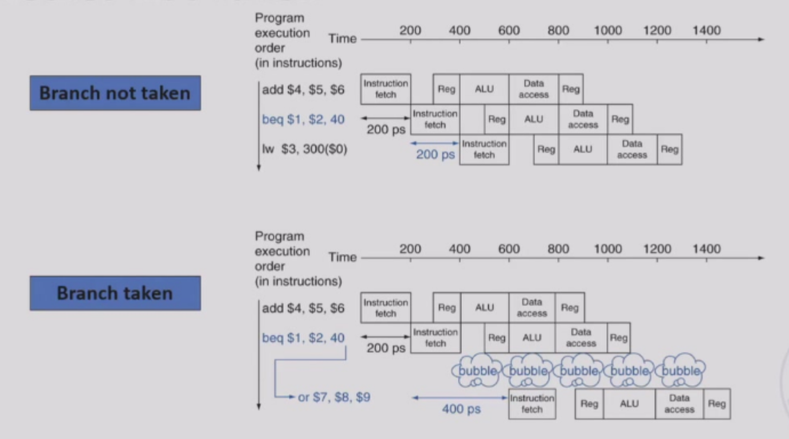

2. Predict-taken

3. Data Hazards for branches
- If a comparison register is a destination of 2nd or 3rd preceding ALU instruction
```RISCV
add x1,x2,x3
add x4,x5,x6
beq x1,x4,target
```
- Can solve using forwarding

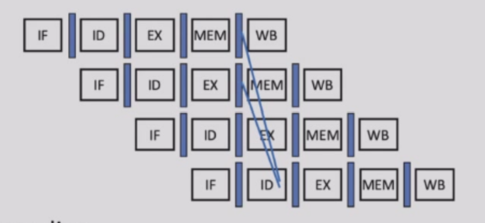

- If a comparison register is a destination  of preceding ALU instruction or 2nd preceding load instruction
```RISCV
lw x1,0(x2)
add x4,x5,x6
beq x1,x4,target
```
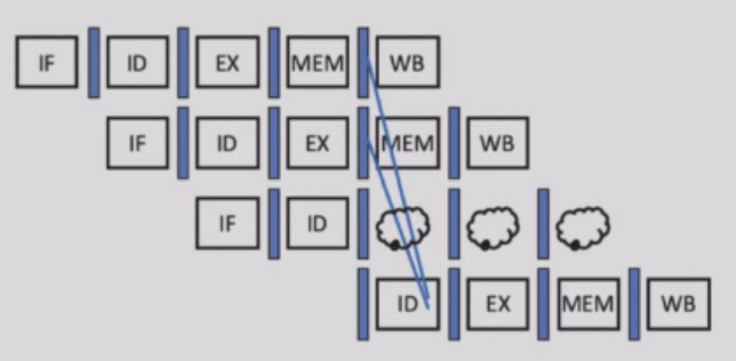
- If a comparison register is a destination of immediately preceding load instruction
    - Need 2 stall cycles 
```RISCV
lw x1,0(x2)
beq x1,x0,target
```
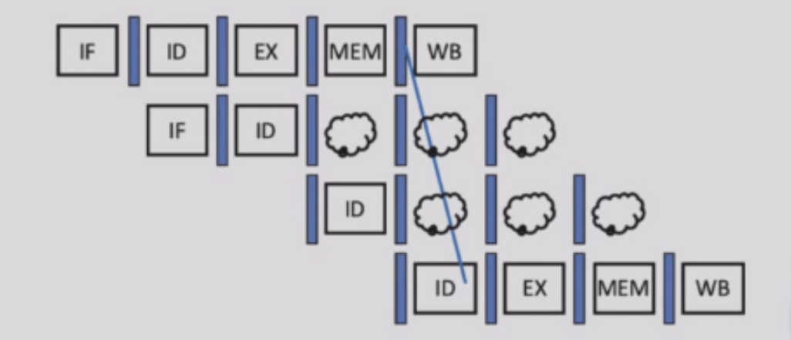

#### 6.2 Dynamic Branch Prediction
- In deeper and superscalar pipelines, branch penalty is more significant
- Use dynamic prediction
    - Branch prediction buffer(branch history table)
    - Indexed by recent branch instruction address
    - Stores outcome(taken or not taken)
    - To execute a branch
    - Look up the branch prediction buffer
        - Check table,expect the same outcome
        - Start fetching from fall-through or target
        - If wrong,flush pipeline and flip prediction

- Branch history
    - 1-bit predictor
    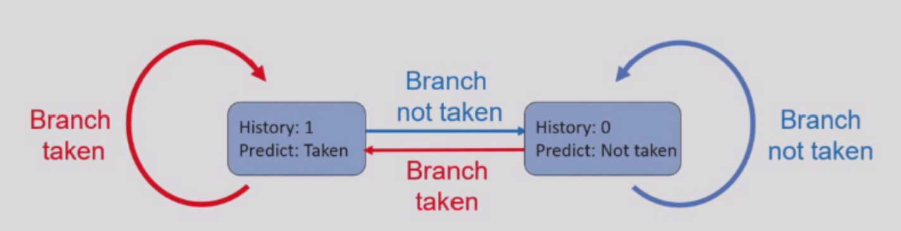
    - Inner loop branches mispredicted twice
    - 容易在分支频繁变化的时候产生错误预测
    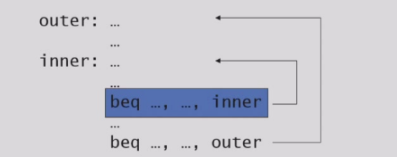
    - Mispredict as taken on last iteration of inner loop
    - Then mispredict as not taken on first iteration of inner loop next time around
    - 2-bit predictor
    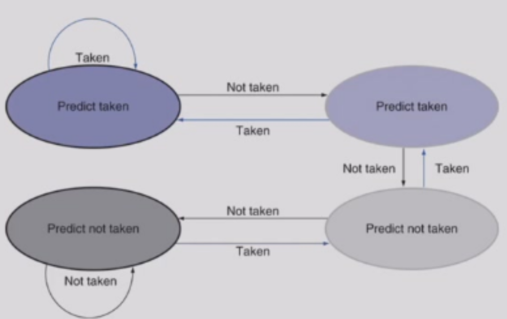
    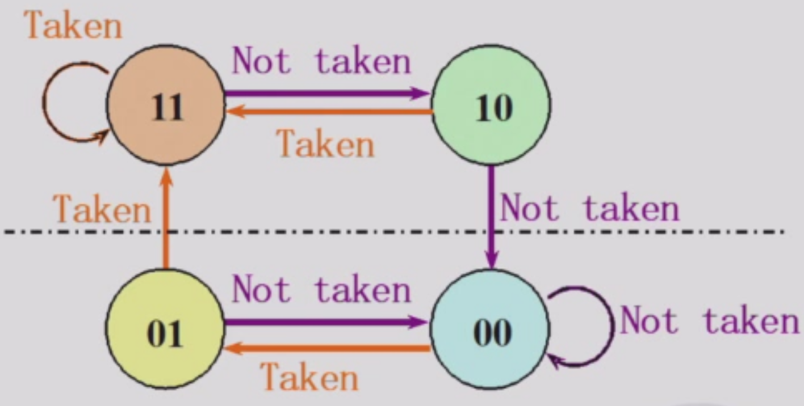

### 6.3 Advanced Techniques for instruction Delivery and Speculation

- Increasing Instruction Fetch Bandwith 
    - Branch-Target Buffers(BTB):放预测的PC值，取指时在buffer中取。与TLB表类似，在未找到对应PC的情况下更新表的内容
    - BTB是一个基于分支指令地址索引的表，存储了分支指令之前的执行结果。
    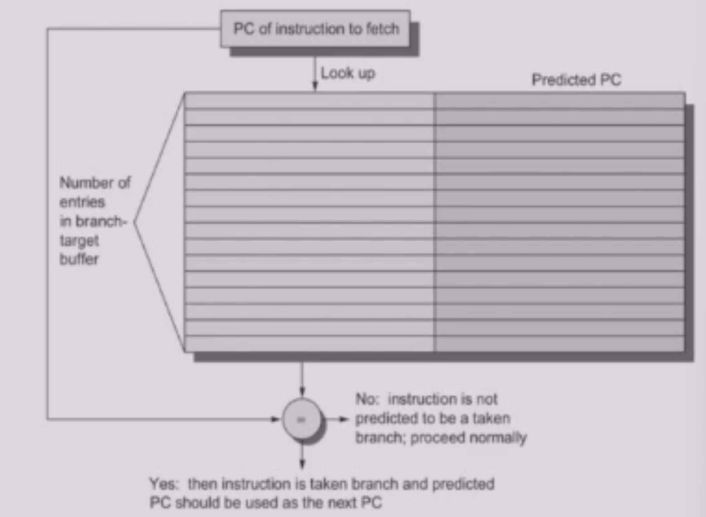
    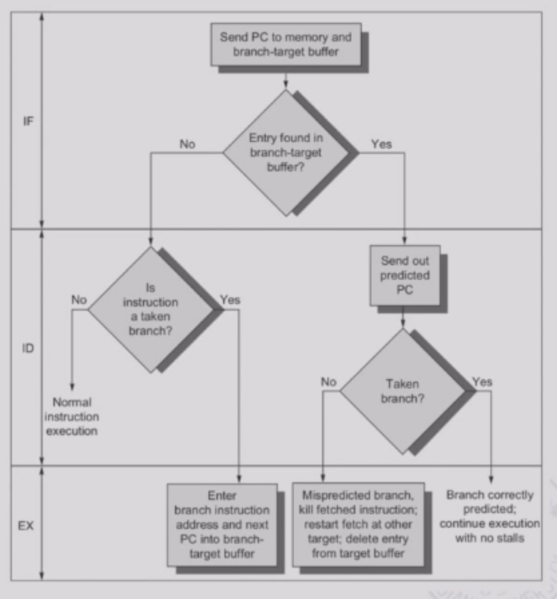
    - BTB存储了分支指令和目标地址
    - 如果在表中找到了对应的项，那么立即取出对应的目标地址，作为下一个时钟周期IF阶段的PC，也就是说，如果表中有对应项，我们采取的预测方式是Assume Branch Taken 
        - 分支预测正确：处理器从BTB获取目标地址，并直接预取目标位置的指令。这大大提高了分支跳转的速度，减少了处理器在预测正确时的延迟
        - 分支预测错误：如果分支预测错误，则需要清空流水线并更新BTB，将该PC对应的表项从目标地址缓存表中删除
    - 如果在表中没有找到对应的项，那么我们采取的预测方式是`Assume Branch Not Taken`
        - 预测错误，清空已经执行的指令，并且下一个时钟周期使得目标地址进入IF阶段。与此同时，将这条分支指令的PC值以及对应的目标地址填入目标地址缓存表中，在表中新增一项
        - 如果分支没有执行正常情况，继续执行指令流即可
- Specialized Branch Predictors:Predicting Procedure Returns,Indirect Jump and Loops Branches
    - Integretd Instruction Fetch Units(集成指令提取单元):从内存中提取指令并将其传递给处理器的执行单元
        - 集成指令预测
        - 指令的提前取指
        - 指令内存的访问和缓存
    - 在现代多发射处理器架构中，指令提取不再是一个简单的单级流水线阶段，而是需要更复杂的实现

#### Calculating the Branch Target
- 即使有了复制预测模块，仍然需要计算目标地址
    - taken branch需要有一个周期的penalty
- Branch Target Buffer
    - Cache or target address
    - Indexed by PC when instruction fetched
        - If hit and instruction is branch predicted taken, can fetch target immediately
        
    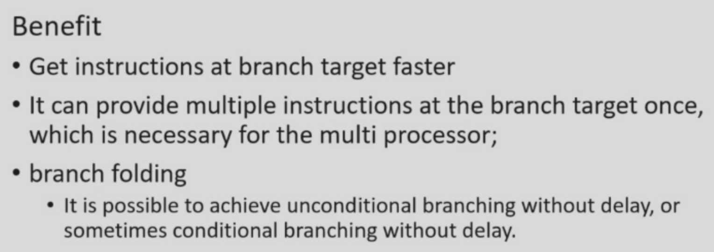
    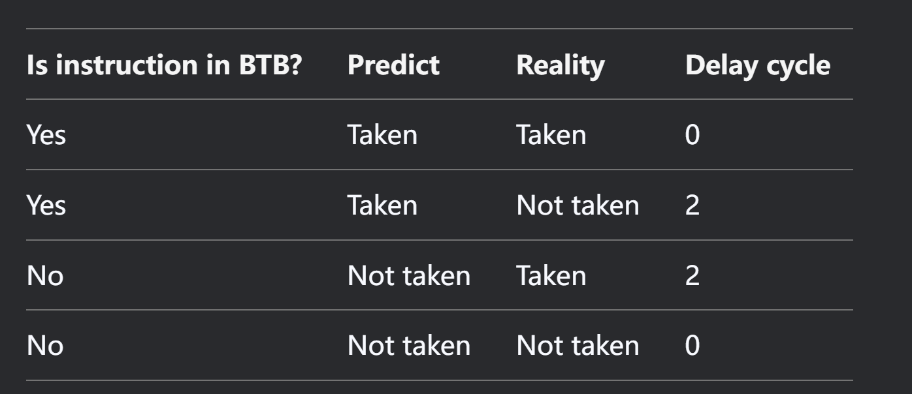
- BTB的更新与维护
    - 表加入机制：当一个新的分支指令出现其目标地址不在BTB中时，处理器会将这个分支指令和它的目标地址存入表中
    - 表移除机制：如果一个分支指令不再跳转(即不被执行)，处理器会从BTB中移除该条指令的条目，以腾出空间给其他分支指令

### 7. Schedule of Nonlinear pipelining

对于非线性流水线，功能部件可能经历多次，有调度问题

- 纵轴代表不同的功能部件，横坐标表示拍数。即每一拍需要用到的功能部件

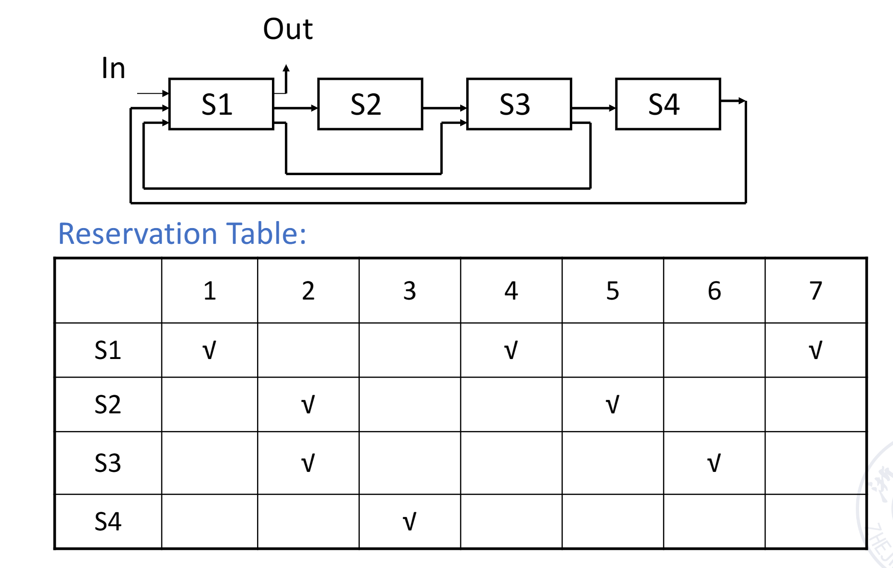

#### ***算法步骤***：

- Initial conflict vector:使用二进制表示，各个位置取每一拍存在冲突的并集。如果是1，则从图存在，否则冲突不存在
    - 第一个部件，隔8拍会产生冲突；第二个部件：1.5.6；第三个部件：无；第四、五个部件：1
    - 将对应八位二进制数的1.5.6.8位设为1，其他为0，得到了初始的冲突向量10110001
- conflict vector

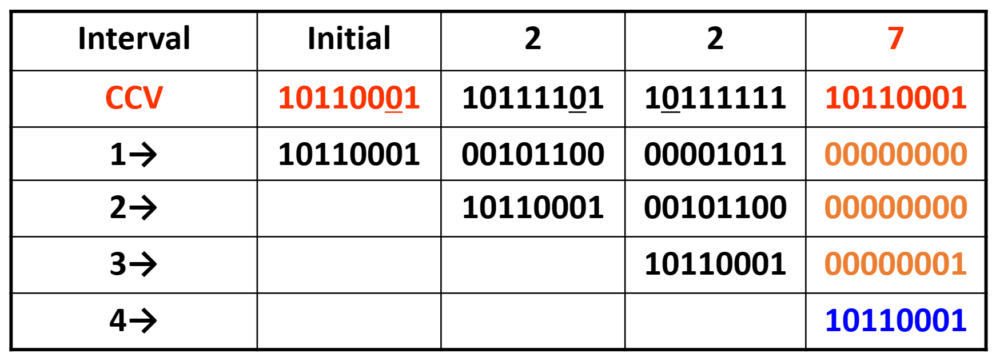

对于第三列，隔两排进下一条指令，我们就把冲突向量向右移动两位(高位补0)，得到了新的冲突向量，并和本来的冲突向量做或运算得到CCV。(注意这里最左侧一列表示向右移动了多少次)

找到了一个循环调度：2-2-7
- State transition graph
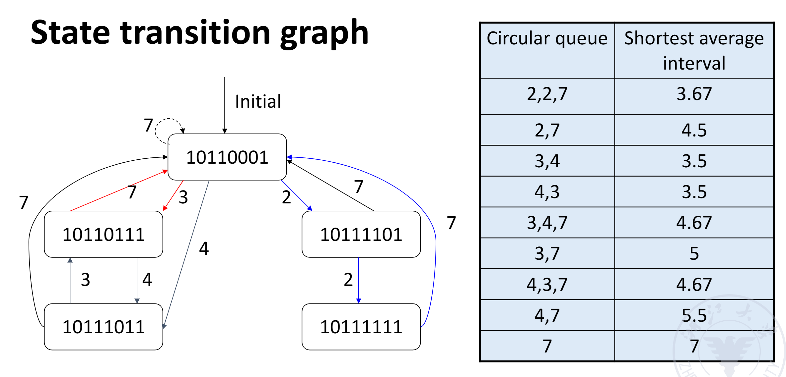
- Circular queue：只要形成回路即可，没有一定规定需要从初始状态回到初始状态
- Shortest average interval：做的总移动数除以移动次数