# Chapter 3: Memory Hierarchy
## 1. Introduction
### 1.1 Memory

内存层次

- Register 
- Cache
- Memory
- Storage 

存储技术

- Mehanical Memory
- Electronic Memory
    - SRAM(做Cache)
    - DRAM(做Memory)
        - SDRAM
        - DDR
    - GDRAM
        - GDDR
    - HBM
    - EPPROM
        - NAND
        - NOR
- Optical Memory 

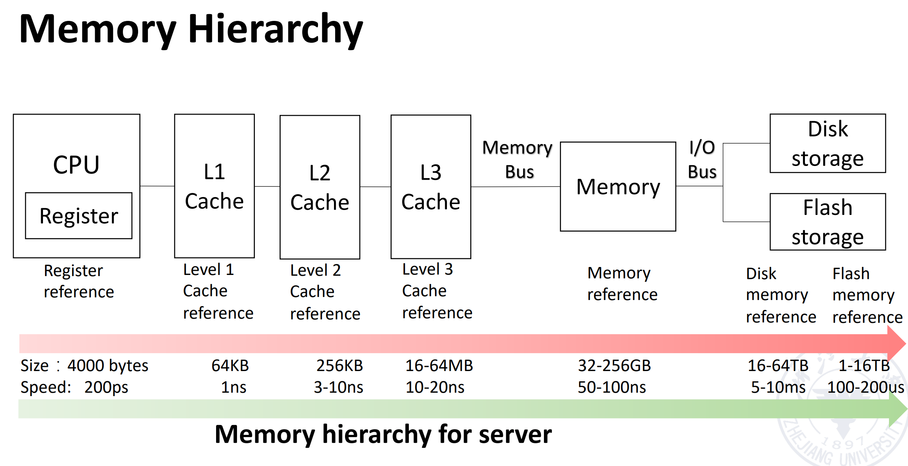

### 1.2 Cache Memory

Cache:a safe place for hiding or storing things. （现在也不安全）

- Cache **Hit/Miss**:When the processor can/cannot find a requested data item in the cache 
    - Cache miss会到来额外的开销：由延迟和带宽决定
- Cache **Block/Line**:A fixed-size collection of the data containing the requested word,retrieved from the main memory and placed into the cache
- Cache **Locality**:
    - Temporal locality:need the requested word again soon访问过这个数据，之后很可能再次访问
    - Spatial locality:likely need other data in the block soon访问了这个位置 ，之后很可能再次访问附近的位置的数据

    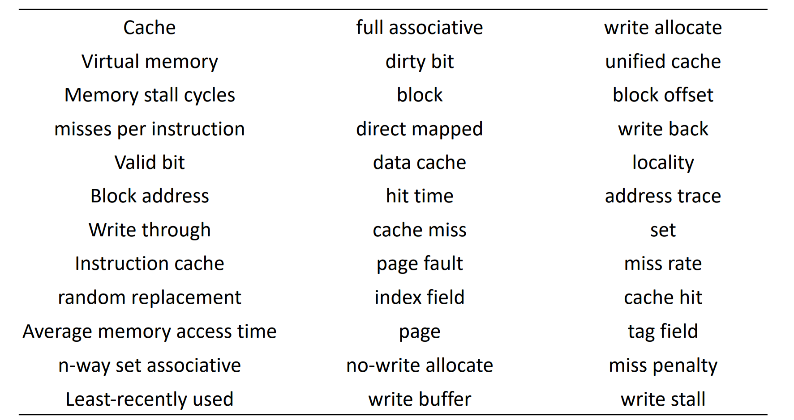
## 2. Four Question for Cache Designers

Caching is a general concept used in processors,operating systems,file systems,and applications

- Q1:Where can a block be placed in the upper level/main memory? (Block placement)
    - Fully Associative,Set Associative,Direct Mapped
- Q2:How is a block found if it is in the upper level/main memory?(Block identification)
    - Tag/Block
- Q3:Which block should be replaced on a Cache/main memory miss?(Block replacement)
    - Random,LRU,FIFO
- Q4:What happens on a write?(Write strategy)
    - Write back or Write through(with write buffer)

### 2.1 Block Placement
- Direct Mapped:一个块在cache中有一个固定的位置(通常通过取模得到，冲突多)
    - 找方便，易冲突
    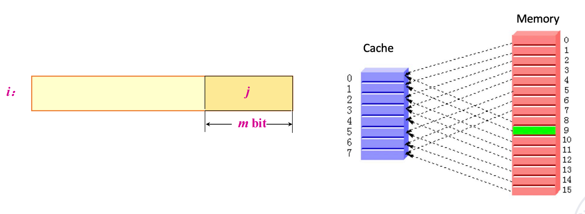
- Fully Associative:块可以放在cache里的位置
    - 不好找，冲突少
- Set Associative
    - 块可以放在一个组里的任何位置，组里可以放若干个块
    - 直接映射相当于一路组相联，全相联相当于n路组相联(n是cache的块数)
    - A set is a group of blocks in the cache
    $$
        Set Index=Block Address MOD Number of sets in the chache
    $$

### 2.2 Block Identification

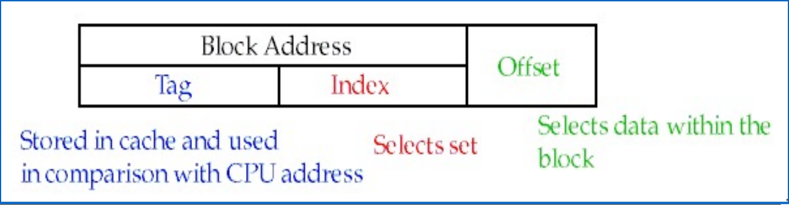
- address tag存储了存储在block中的数据的主存地址
- 当检查cache时，处理器会比较我们需要的memory address和cache tag，如果二者是相等的，那么将会cache hit并且数据现在已经在cache中
- 通常情况下，每一个block都会有一个`valid bit`来判断cache block中的内容是否有效

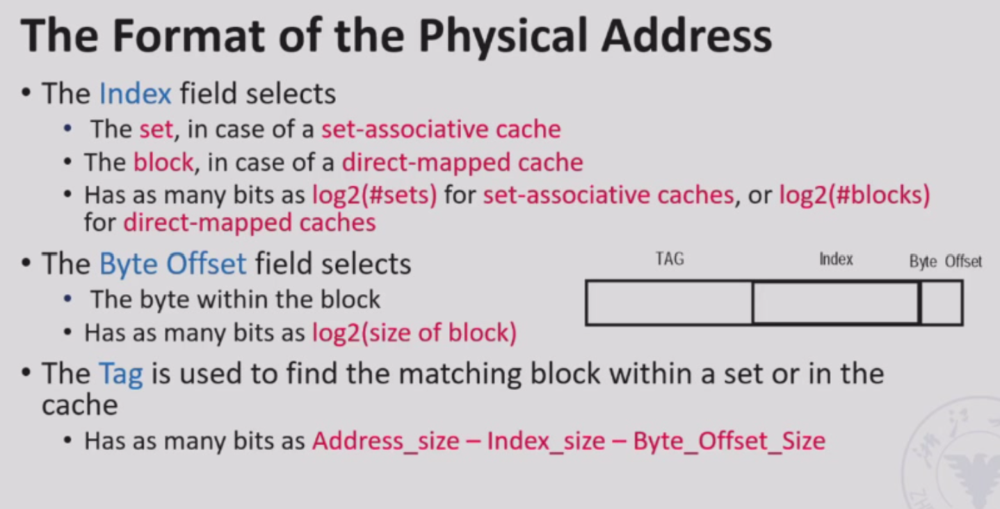

### 2.3 Block Replacement
- Random replacement:randomly pick any block
    - 硬件上容易实现，只需要随机数发生器即可
    - 在缓存中均匀分配
    - 可能会驱逐一个即将被访问的块
- Least-Recently Used(LRU):pick the block in the set which was least recently accessed
    - 认为刚刚访问过的数据接下来还有可能被访问
    - 需要额外的位数来记录访问的时间。一般我们用的是近似的LRU
- First in,First Out(FIFO):Choose a block from the set which was first came into the cache

> Suppose：Cache blocck size is 3, and access sequence is shown as follows.2,3,2,1,5,2,4,5,3,4

- FIFO
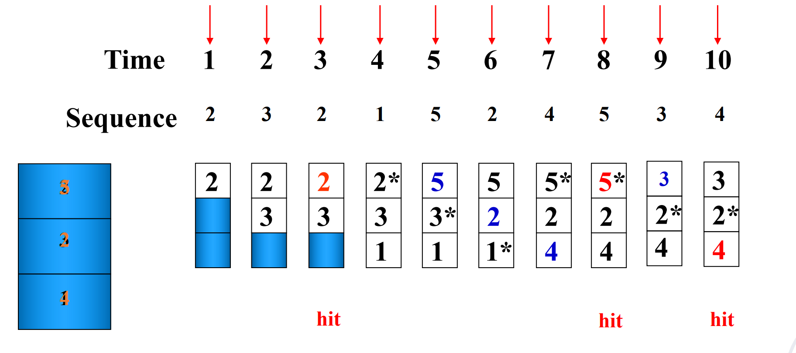
- LRU
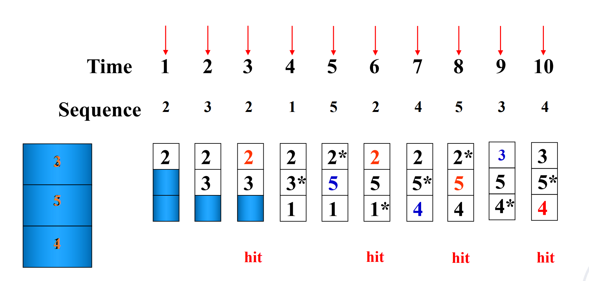
- OPT
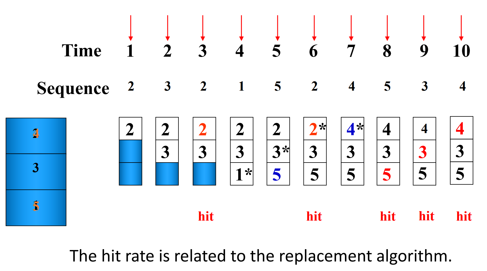

Hit rate is related to the replacement algorithm, the access sequence, the cache block size.

#### 2.3.1 Stack Replacement algorithm

有些算法随着N增大命中率非下降，有些算法随着N增大命中率反而会下降

我们把随着N增大命中率非下降的算法称为 stack replacement algorithm

$B_t(n)$ 在t时间cache的block大小为n的一组被包含的访问序列
- $B_t(n)$是$B_t(n+1)$的子集是堆栈型替换算法的条件：随着n的增大，先前能命中的也一定能命中

LRU replacement algorithm is a stack replacement algorithm, while FIFO is not.

For LRU algorithm, the hit ratio always increases with the increase of cache block.

> 用栈来模拟LRU，栈顶是最近访问的，栈底是最久未访问的，每次要替换的时候，替换栈底元素。通过下面的图可以看到栈大小为n时的命中率
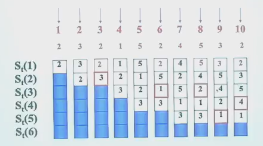

#### 2.3.2 LRU Implementation - Comparison Pair Method

如何只通过门和触发器来实现LRU算法？---Comparison Pair Method

- 基本思想：让任何两个cache块之间两两结对，用一个触发器的状态代表两个块的先后顺序(比如1表示A刚刚被访问过，0表示B刚被访问过)。通过门电路对触发器的状态进行逻辑组合，找到最久未被访问的块

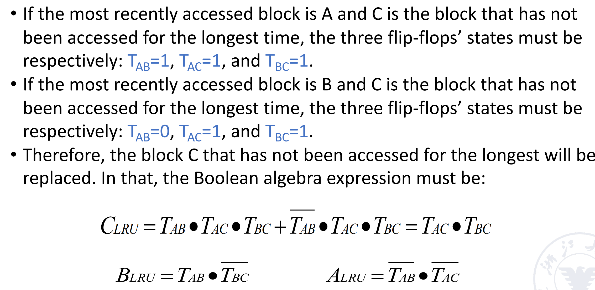
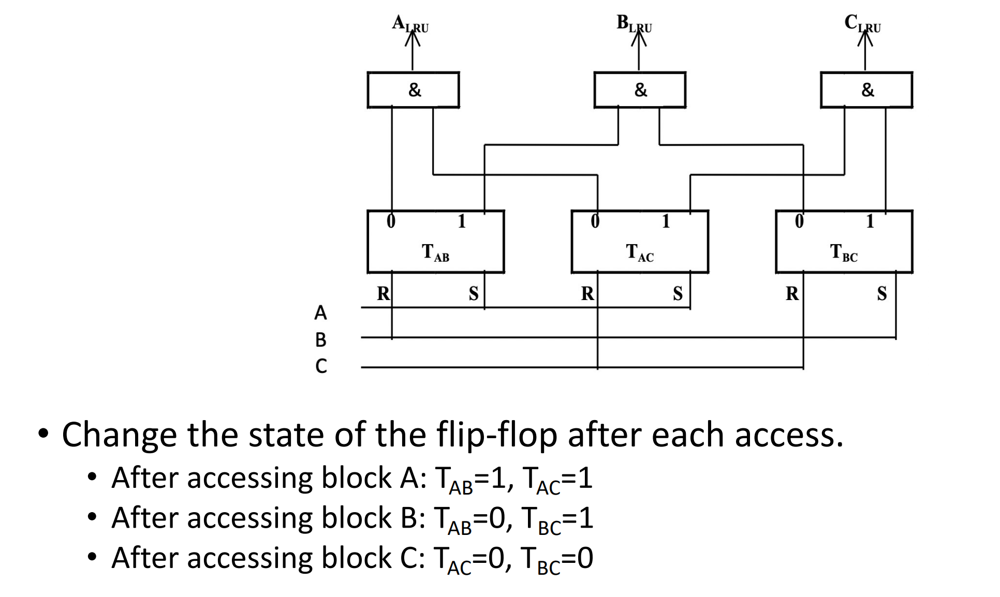

- Hardware usage analysis

    - 假设有p个cache blocks，我们需要$C_p^2= \frac{p(p-1)}{2}$

    - 当p超过8时，需要的触发器过多，这个算法就不适用了

### 2.4 Write Strategy
- Write Hit
    - Write Through:同时写回cache和内存。写到内存的时间较长，这个过程需要Write Stall，或者使用Write buffer(当buffer填满时无法避免使用Write Stall)

    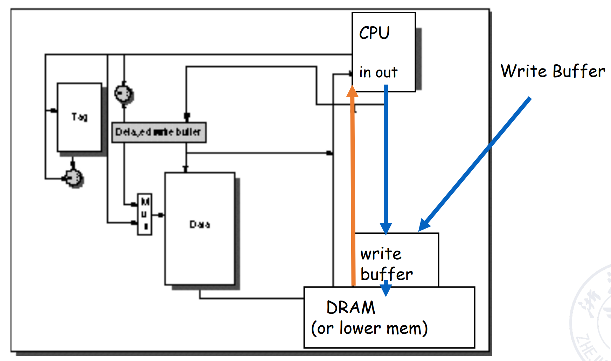
    - Write Back:在cache中写，同时通过一个额外的dirty bit表示这个块已经被修改,先用cache临时存储，最后一起写回内存
- Write Miss
    - Write Allocate:将要写的块先读到cache中，再写进主存
    - Write Around:直接写到内存，数据不会在cache中进行存储
- In general, write-back caches use write-allocate , and write-through caches use write-around.

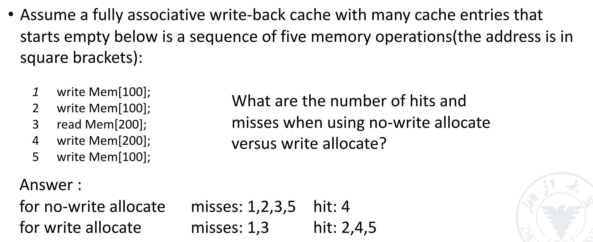

## 3. Memory System Performs
- $CPU\ Execution\ time=(CPU\ clock\ cycles + Memory\ stall\ cycles) \times CPU\ clock\ cycle\ time$
- $Memory\ stall\ cycles = IC\times MemAccess refs per instructions \times Miss rate \times Miss Penalty$

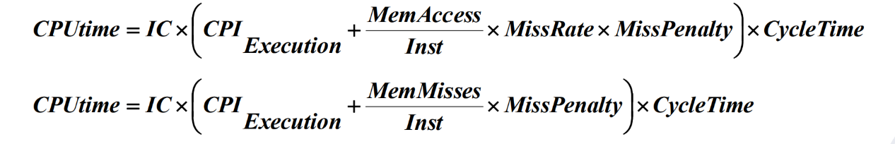

- CPI Execution includes ALU and Memory instructions

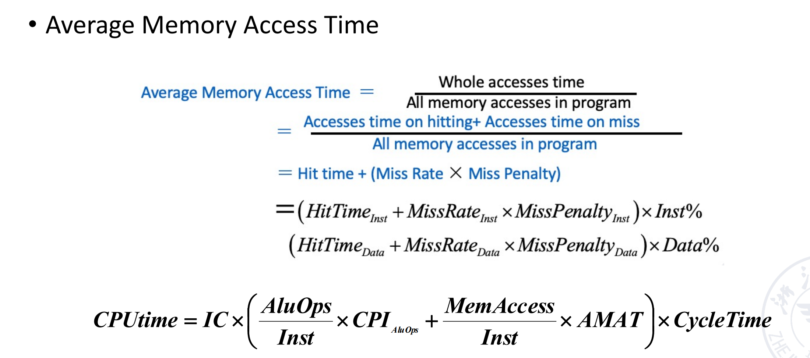

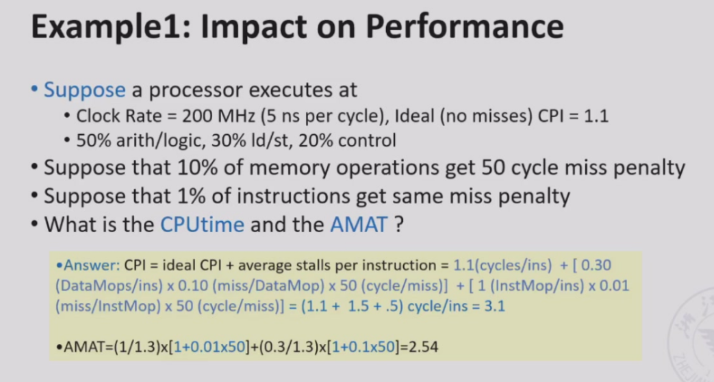

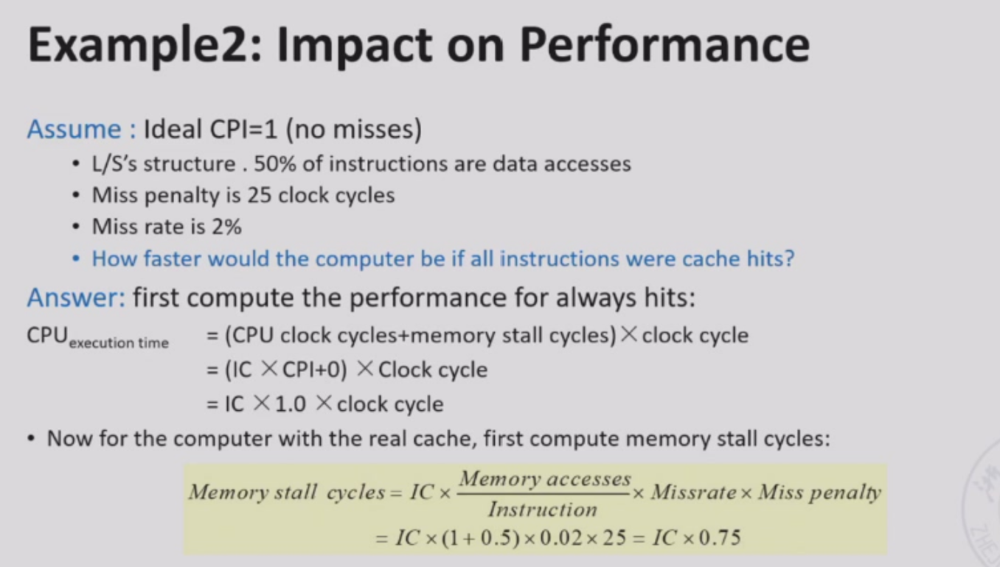

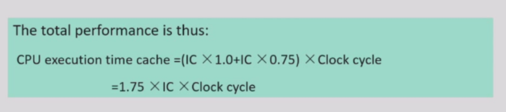

How to improve

- Reduce the miss penalty
- Reduce the miss rate
- Reduce the time to hit in the cache
- Reduce the miss penalty and miss rate via parallelism

## 4. Virtual Memory

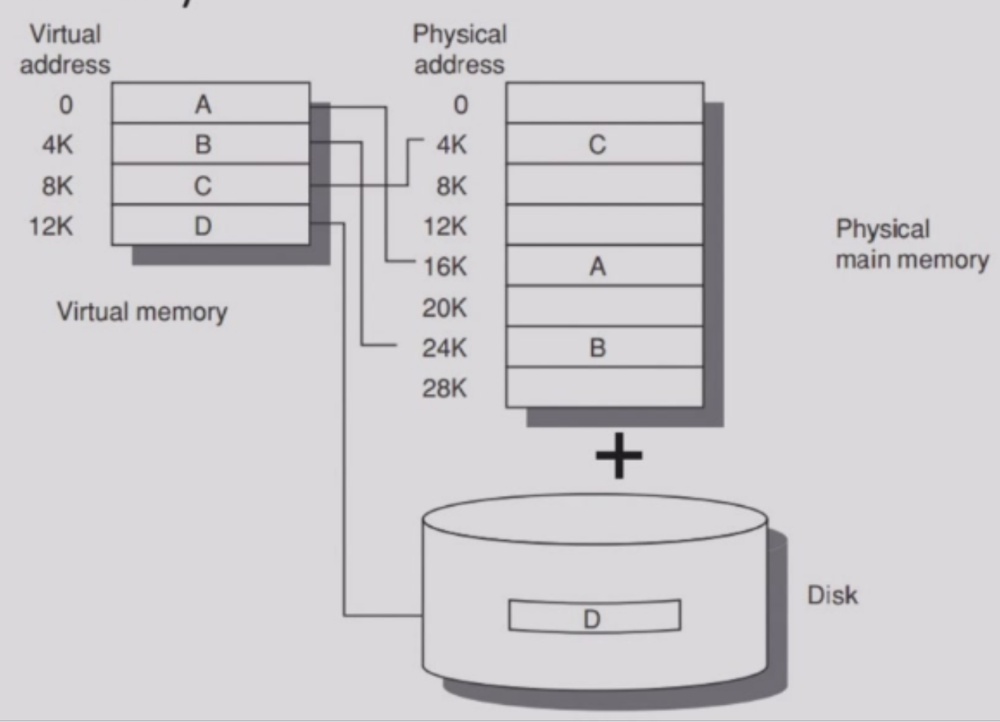

物理内存是有限的，虚拟内存让用户体验到一个抽象的更大的内存

- Why virtual memory?
    - 可以让进程使用不连续的物理内存空间(虚拟地址上是连续的)；更好地隔离不同进程
- virtual-physical address translation
- memory protection/sharing among multi-program
- easier/flexible memory management
- share a smaller amount of physical memory among many processes(隔离：每个进程都有一个相对独立的空间，不会访问其他程序的空间。一种安全机制)
- Introduces another level of secondary storage

**Virtual Memory = Main Memory + Secondary Storage**
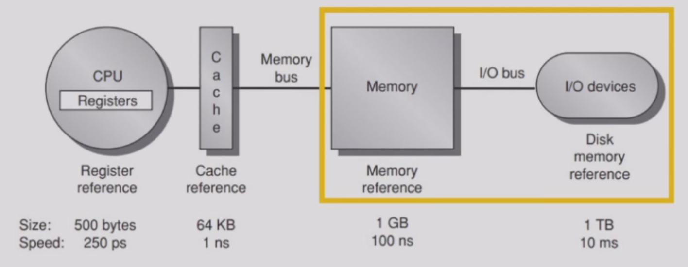

- Virtual Memory Allocation
    - Paged virtual memory
        - `page`:fixed-size block(the block conception in virtual memory)
        - page address:page number||offset
    - Segmented virtual memory
        - `segment`:variable-size block
        - segment address:segment number||offset
    
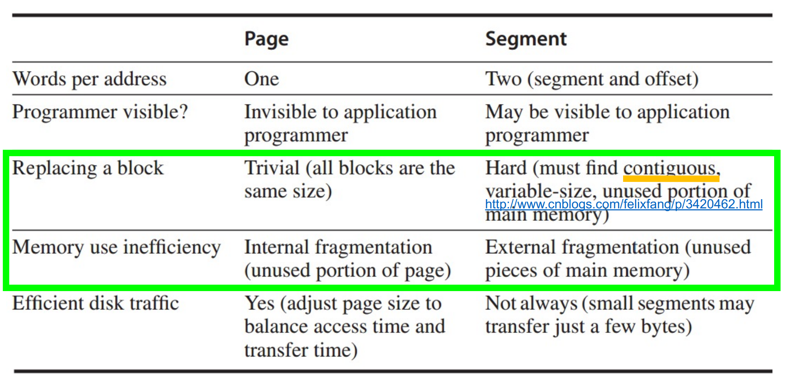
> 分页式的易于实现，方便替换。现在常用段页式结合或者纯页式

### 4.1 How virtual memory works?

Cache 的四个问题在虚拟内存中都有对应

- Q1. Where can a block be placed in main memory?
    - 缺失代价很高，因此我们采用全相联的方式，以降低 miss rate。
- Q2. How is a block found if it is in main memory?
    - 虚拟地址分两部分，偏移量和页号。页号是页表的索引
    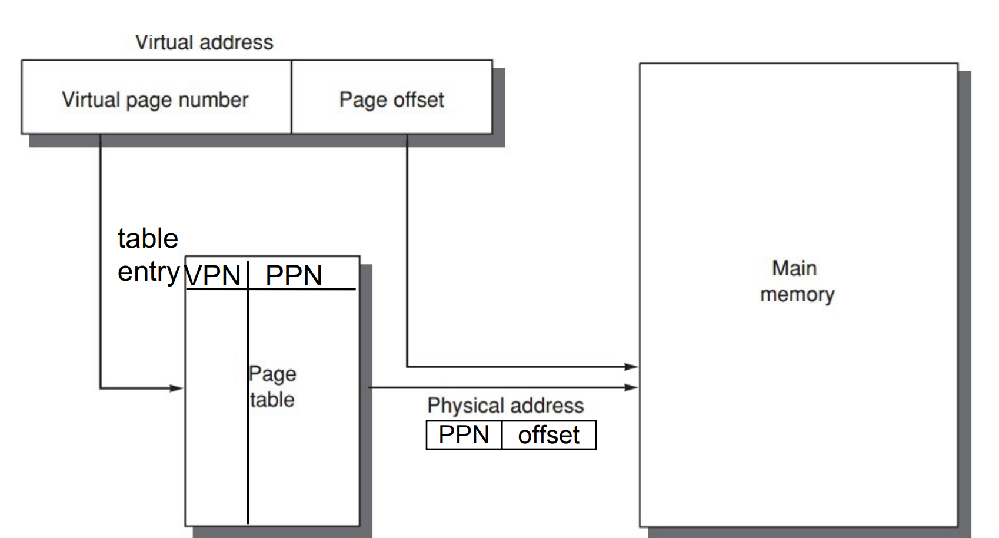
- Q3. Which block should be replaced on a virtual memory miss?
    - Least Recently Used (LRU) block, with use/reference bit.
- Q4. What happens on a write?
    - Write-back strategy（如果向disk写的代价太大）, with diry bit(数据即将被占用的时候再写入).

### 4.2 Page Table
- Page tables are often large
- 页表是被存储在主存中的
> e.g. 32-bit virtual address, 4KB pages, 4 bytes per page table entry.
>
> page table size=$(2^{32}/2^{12})\times 2^2=2^{22}bytes= 4MB$

- Logically two memory accesses for data access:
    - 从页表中获取物理地址
    - 从物理地址中得到数据
    - 通过offset找到page中的具体位置

正常来说页表需要两次访问内存，访问效率低下

- 页表被存储在主存中，要先访问主存寻找对应的页表从而获得物理地址
- 然后根据得到的物理地址
访问主存拿到数据

因此我们需要cache page table,即TLB

**Translation lookaside buffer (TLB)**

> 避免了进行两次访问操作，节省访问时间 

- TLB Entry:

    - tag:portions of the virtual address (VPN);
    - data:a physical page frame number (PPN), protection field, valid bit, use bit, dirty bit;
    - 不包含偏移量
> 发送 tag (VPN) 尝试匹配，并看访问类型是否违规。如果匹配成功，就把对应的 PPN 送到 Mux，将偏移量加上 PPN 得到物理地址。
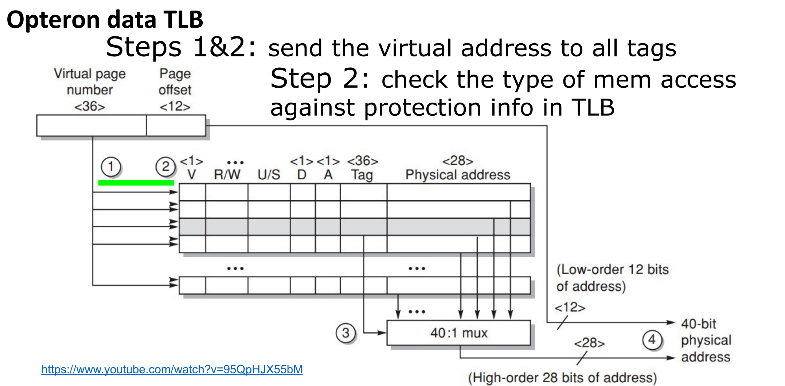
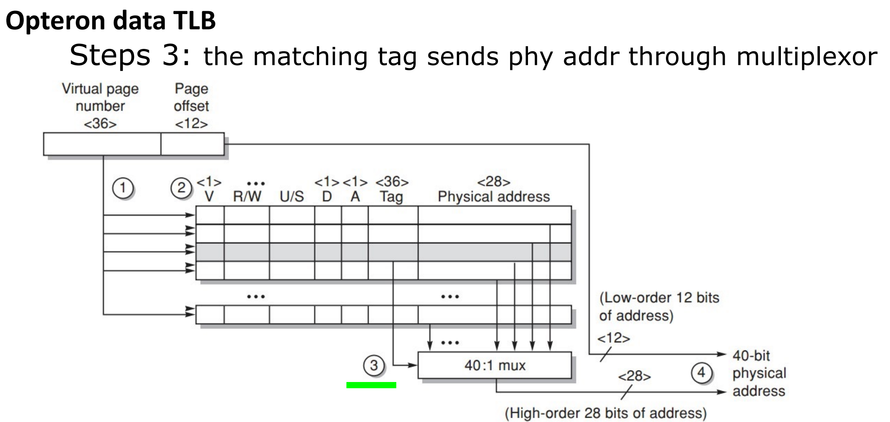
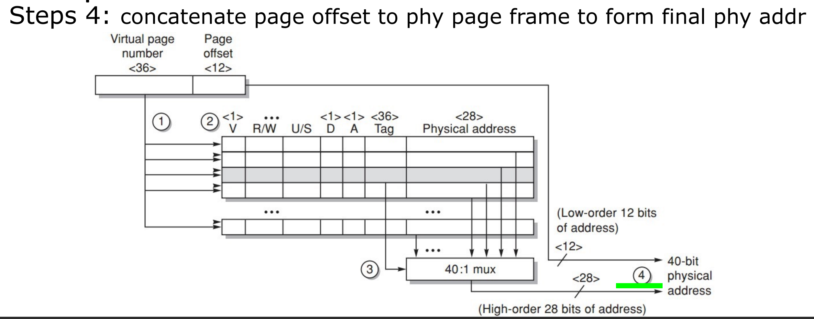
> 最后一步合并页内偏移才能访问真正的物理地址。如果TLB未找到对应的页，则需要更新TLB，采用LRU策略进行更新。
### 4.3 Page Size Selectiq
- Pros of larger page size
    - Smaller page table, less memory (or other resources used for the memory map);页更少，所以页表更小。
    - Larger cache with fast cache hit;页更大，所以cache命中的时间更短(因为我们需要遍历的页更少)
    - Transferring larger pages to or from secondary storage is more efficient than transferring smaller pages;一次搬运更多的数据，所以更高效，小页可能需要搬运多次。
    - Map more memory, reduce the number of TLB misses;TLB miss 次数更少。
- Pros of smaller page size
    - Conserve storage:When a contiguous region of virtual memory is not equal in size to a multiple of the page size, a small page size results in less wasted storage.减少对内存的使用，内部碎片更少。

#### **1. 更大页大小的优点（Pros of larger page size）**

##### **(1) 页表更小（Smaller page table, less memory）**
- **解释**：
  - 页表（Page Table）是操作系统用来管理虚拟内存和物理内存映射的数据结构。
  - 如果页大小较大，那么相同的内存空间需要的页数会更少，因此页表会更小。
  - 较小的页表占用更少的内存资源，同时也减少了页表查找的开销。

- **例子**：
  - 假设内存大小为 4GB，页大小为 4KB，则需要 \(2^{20}\) 个页表项。
  - 如果页大小为 2MB，则只需要 \(2^{11}\) 个页表项。

##### **(2) 缓存命中更快（Larger cache with fast cache hit）**
- **解释**：
  - 页大小较大时，单个页可以容纳更多的数据。
  - 当程序访问内存时，如果数据在同一个页中，可以减少页表查找的次数，从而提高缓存命中率。
  - 缓存命中更快，因为需要遍历的页更少。

- **例子**：
  - 如果程序需要访问连续的内存区域，较大的页可以减少页表查找的次数。

##### **(3) 数据传输更高效（Transferring larger pages is more efficient）**
- **解释**：
  - 当内存页需要从磁盘（或其他辅助存储设备）加载到内存时，较大的页可以一次性传输更多的数据。
  - 相比于多次传输小页，传输大页的效率更高。

- **例子**：
  - 如果页大小为 4KB，加载 1MB 数据需要 256 次传输。
  - 如果页大小为 2MB，加载 1MB 数据只需要 1 次传输。

##### **(4) 减少 TLB 未命中次数（Reduce the number of TLB misses）**
- **解释**：
  - TLB（Translation Lookaside Buffer）是用于加速虚拟地址到物理地址转换的硬件缓存。
  - 较大的页可以映射更多的内存，因此 TLB 可以覆盖更多的内存区域，从而减少 TLB 未命中的次数。

- **例子**：
  - 如果 TLB 可以缓存 64 个页表项，页大小为 4KB 时，TLB 只能覆盖 256KB 的内存。
  - 如果页大小为 2MB，TLB 可以覆盖 128MB 的内存。

---

#### **2. 更小页大小的优点（Pros of smaller page size）**

##### **(1) 节省存储空间（Conserve storage）**
- **解释**：
  - 当程序需要的内存区域不是页大小的整数倍时，较小的页可以减少内存浪费（内部碎片）。
  - 较小的页可以更灵活地分配内存，减少未使用的内存空间。

- **例子**：
  - 如果页大小为 4KB，程序需要 5KB 内存，则会分配 2 个页（8KB），浪费 3KB。
  - 如果页大小为 1KB，程序需要 5KB 内存，则会分配 5 个页（5KB），没有浪费。

---

#### **总结**
- **更大页大小的优点**：
  - 页表更小，减少内存占用。
  - 缓存命中更快，减少页表查找次数。
  - 数据传输更高效，减少 I/O 操作次数。
  - 减少 TLB 未命中次数，提高地址转换效率。

- **更小页大小的优点**：
  - 减少内存浪费，提高内存利用率。

---

#### **实际应用中的权衡**
在实际操作系统中，页大小的选择需要根据具体应用场景和硬件特性进行权衡：
- **大页**：适合需要大量连续内存访问的应用（如数据库、科学计算）。
- **小页**：适合内存需求较小且不连续的应用（如桌面应用程序）。

**Use both**:multiple page sizes

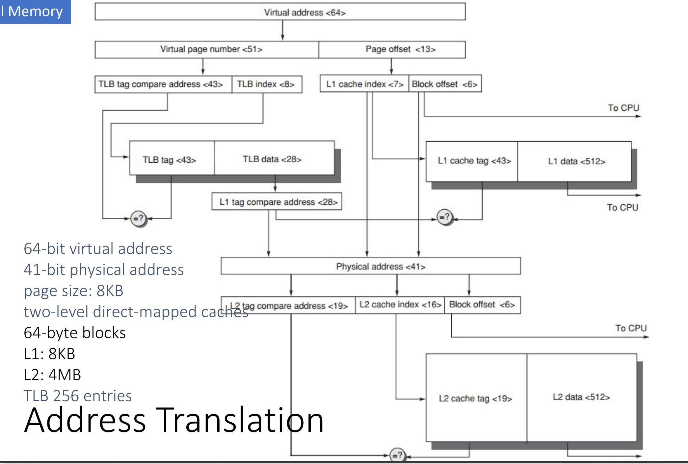

### 4.4 Mem Protection&&Sharing Among Programs
#### 4.4.1 Multiprogramming
- 允许计算机被多个并发执行的程序共享
- 需要保护并且在程序中共享

#### 4.4.2 Process
- Maintain correct process behavior保持正确的进程行为
    - computer designer必须确保the processor portion of the process state（进程状态的处理器部分）能够被保存和重新存储
    - OS designer必须确保进程之间的计算不会彼此影响
- 将主存划分从而使得多个不同的进程在内存中同一时刻都拥有它们的状态

这部分内容主要涉及计算机体系结构中的 **存储层次结构（Memory Hierarchy）**、**缓存（Cache）** 和 **虚拟内存（Virtual Memory）**。以下是详细的解释：

---
### 5 Summary
#### **1. 存储层次结构（Memory Hierarchy）**

##### **从单级到多级（From single level to multi level）**
- **单级存储**：早期的计算机系统只有一种存储设备（如磁鼓存储器），速度慢且容量有限。
- **多级存储**：现代计算机系统采用多级存储层次结构，将存储设备分为多个层次，每个层次在速度、容量和成本之间进行权衡。
  - **层次结构**：
    1. **寄存器（Registers）**：速度最快，容量最小，成本最高。
    2. **缓存（Cache）**：速度较快，容量较小，成本较高。
    3. **主存（Main Memory）**：速度中等，容量较大，成本中等。
    4. **辅助存储（Secondary Storage）**：速度较慢，容量最大，成本最低（如硬盘、SSD）。
    5. **三级存储（Tertiary Storage）**：速度最慢，容量极大，成本最低（如磁带、光盘）。

- **目的**：通过多级存储层次结构，平衡速度、容量和成本，提高系统整体性能。

##### **存储系统的性能参数（Evaluate the performance parameters）**
- **平均每比特成本（Average price per bit, C）**：
  - 存储层次中，越靠近顶层的存储设备（如寄存器、缓存）成本越高，越靠近底层的存储设备（如硬盘）成本越低。
  - 通过多级存储层次结构，可以在保证性能的同时降低整体成本。

- **命中率（Hit rate, H）**：
  - 命中率是指访问数据时，数据在某一级存储中找到的概率。
  - 命中率越高，系统性能越好。

- **平均内存访问时间（Average memory access time, T）**：
  - 平均内存访问时间是访问数据所需的平均时间。
  - 计算公式：$T = H \times T_{\text{hit}} + (1 - H) \times T_{\text{miss}}$
    - $T_{\text{hit}}$：命中时的访问时间。
    - $T_{\text{miss}}$：未命中时的访问时间（需要从下一级存储中加载数据）。

---

#### **2. 缓存基础知识（Cache Basic Knowledge）**

##### **映射规则（Mapping Rules）**
- 缓存将主存中的数据映射到缓存中，常见的映射规则包括：
  1. **直接映射（Direct Mapping）**：
     - 主存中的每个块只能映射到缓存中的一个特定位置。
     - 优点：实现简单。
     - 缺点：容易发生冲突，导致缓存命中率降低。
  2. **全相联映射（Fully Associative Mapping）**：
     - 主存中的每个块可以映射到缓存中的任意位置。
     - 优点：冲突少，缓存命中率高。
     - 缺点：实现复杂，查找速度慢。
  3. **组相联映射（Set Associative Mapping）**：
     - 主存中的每个块可以映射到缓存中的一组位置。
     - 优点：平衡了直接映射和全相联映射的优点。

##### **访问方法（Access Method）**
- **顺序访问（Sequential Access）**：
  - 按顺序访问数据，适合连续存储的数据。
- **随机访问（Random Access）**：
  - 可以任意访问数据，适合非连续存储的数据。

##### **替换算法（Replacement Algorithm）**
- 当缓存已满时，需要替换掉某个缓存块，常见的替换算法包括：
  1. **最近最少使用（LRU, Least Recently Used）**：
     - 替换最近最少使用的缓存块。
  2. **先进先出（FIFO, First In First Out）**：
     - 替换最早进入缓存的缓存块。
  3. **随机替换（Random Replacement）**：
     - 随机选择一个缓存块进行替换。

##### **写策略（Write Strategy）**
- **写直达（Write Through）**：
  - 每次写操作同时更新缓存和主存。
  - 优点：数据一致性高。
  - 缺点：写操作速度慢。
- **写回（Write Back）**：
  - 写操作只更新缓存，当缓存块被替换时才写回主存。
  - 优点：写操作速度快。
  - 缺点：数据一致性较低。

##### **缓存性能分析（Cache Performance Analysis）**
- 缓存的性能主要取决于命中率和访问时间。
- 提高缓存性能的方法：
  - 增加缓存容量。
  - 优化映射规则和替换算法。
  - 提高缓存访问速度。

---

#### **3. 虚拟内存（Virtual Memory）**

##### **内存组织结构对缓存未命中率的影响（The influence of memory organization structure on Cache failure rate）**
- 虚拟内存通过将主存和辅助存储结合，扩展了程序的可用内存空间。
- 虚拟内存的组织结构（如页大小、页表设计）会影响缓存的未命中率：
  1. **页大小**：
     - 较大的页可以减少页表大小和 TLB 未命中次数，但可能增加内部碎片。
     - 较小的页可以减少内部碎片，但可能增加页表大小和 TLB 未命中次数。
  2. **页表设计**：
     - 多级页表可以减少页表占用的内存空间，但可能增加地址转换时间。
  3. **TLB（Translation Lookaside Buffer）**：
     - TLB 是用于加速虚拟地址到物理地址转换的硬件缓存。
     - TLB 的命中率直接影响缓存性能。