# Chapter 4 Instruction-Level Parallelism

**RISC处理器的经典五级流水线**

- Dependences are a property of programs 依赖性是程序的一种性质
- Hazards are properties of pipeline organization 冒险是流水线组织的一种特性

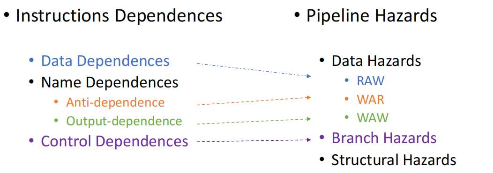

## 4.1 Dynamic Scheduling

简单的流水线技术的主要限制是

- 指令顺序发布并执行

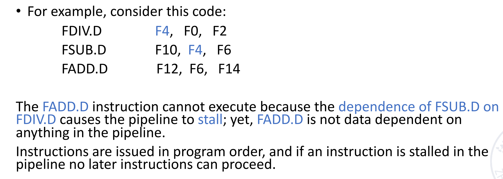

前两条指令存在数据依赖，DIV语句的执行时间一般很长。那么前两条指令就会等待除法完成，顺序执行里面后面的指令也会跟着等(但其实和除法没有关系)，这样就造成了浪费

- **Idea**：动态调度
- **Method**：out-of-order execution

/image-90.png)

> 乘法的运算时间长，同时出现的频率高

- load/store属于整数运算部件
- scoreboard记录当前系统所有的状态(指令进行到什么状态，功能部件当前被那条指令使用，寄存器组，指令用了哪些寄存器)

在之前的顺序流水线视线中，ID阶段 我们会检测结构冒险和数据冒险。如果都不发生，那么将会将这条指令放到下一阶段EX

我们现在希望减弱检测条件，只要没有结构冒险(结构冒险是无法解决)，就允许进入到下一阶段，具体分成两个阶段分别检测结构和数据冒险

- `Issue(IS)`:解码指令，检测结构冒险(顺序读入)
- `Read Operands(RO)`:等待至没有数据冒险，接下来读取操作数，乱序执行(接收数据过程中只要没有数据冒险就可以执行)

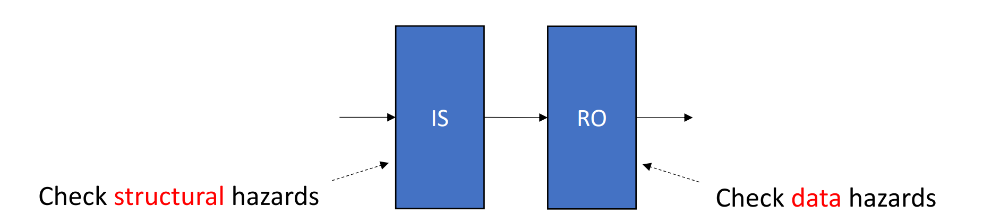

IS一定是顺序取，RO不一定顺序(只要没有数据冒险就可以执行，有冒险的等待，没有冒险的执行，这就会导致乱序的出现)

- **Scoreboard algorithm**是一种调度指令的算法
- Robert Tomasulo introduces register **renaming** in hardware to minimize WAW and WAR hazards, named Tomasulo’s Approach.

### 4.1.1 Scoreboard Algorithm

计分板算法的基本结构

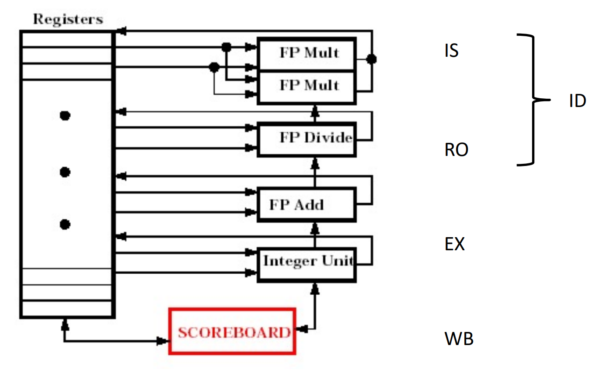

表是实时更新的。当指令流出(结束WB阶段)，scoreboard上就不会有其相关的信息

- Instruction Status记录每条指令执行到哪一步
- Function Component Status
- Register Status

```asm
FLD F6, 34(R2)
FLD F2, 45(R3)
FMUL.D F0, F2, F4
FSUB.D F8, F2, F6
FDIV.D F10, F0, F6
FADD.D F6, F8, F2 
```

- Instruction Status

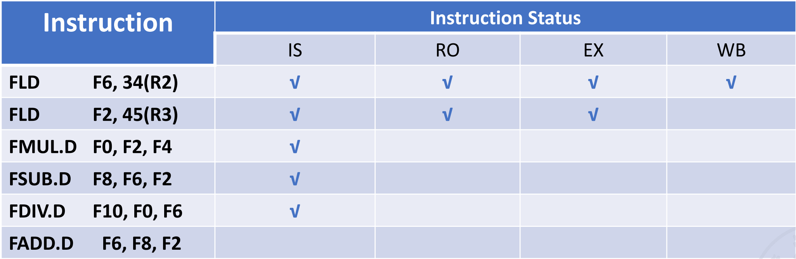

此时指令1结束，scoreboard上没有其相关的信息。指令2还没有WB，后面的3、4需要用到2的结果F2，因此指令3、4只是完成了IS阶段，还没有执行RO阶段(存在数据冒险)。指令5用到3的结果，也不能进入RO。指令6是ADD加法操作，此时指令4是SUB，也会用到加法运算范媛，因此产生结构冒险，无法进入IS。

- Function Component Status

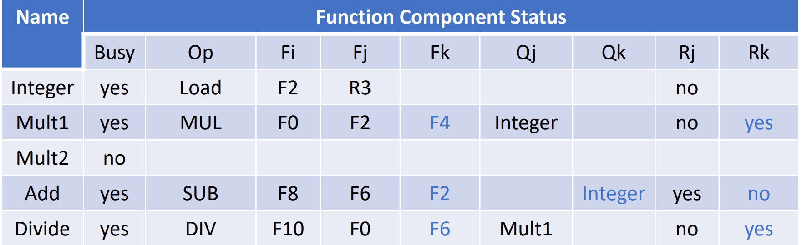

- busy代表当前这个单元是否有指令正在使用。op表示这个单元正在被哪类指令使用
- $F_i,F_j,F_k$代表目标操作数和源操作数($F_i$是目标操作数，$F_j,F_k$是源操作数)
- $Q_j,Q_k$代表源操作数来自哪个部件
    - 如Mult1的Qj=integer说明来自整数部件(此时正在执行Load指令)
- $R_j,R_k$代表源操作数的状态
    - yes-operands is ready but no ready没读是因为其他的操作数还没有read
    - $no\&Q_j=null$:operand is ready
    - $no\&Q_j \neq null$:operand is not ready其他指令会修改这个操作数，而且还没有执行完毕
- Register Status

$F_i$这一列加上op这一列组合成了这张表，表示这个寄存器将被什么指令修改

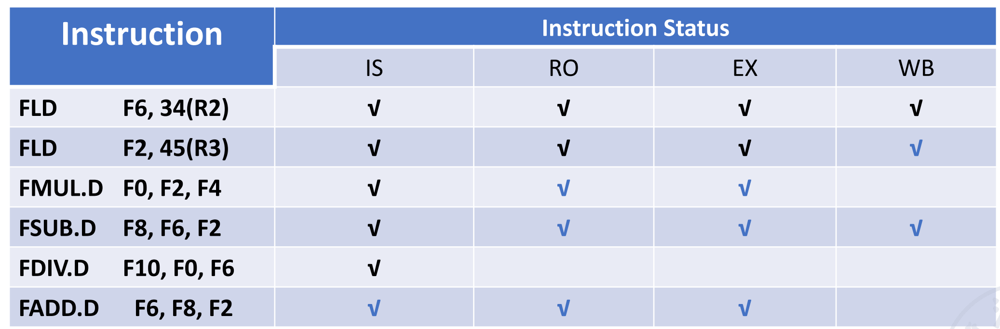
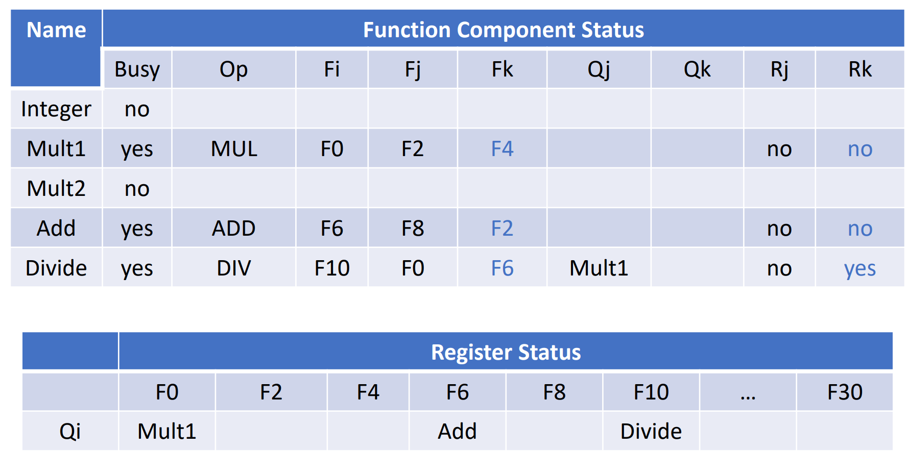
> 注意到在这之后，最后一条ADD指令必须等到DIV指令RO之后才能WB(否则会修改F6)


Scoreboard算法可以检测出冲突，但是不能解决冲突，还是通过阻塞的方法来解决，scoreboard上面的信息页比较复杂，效率不高

### 4.1.2 Tomasulo’s Approach

These name dependences can all be eliminated by register renaming

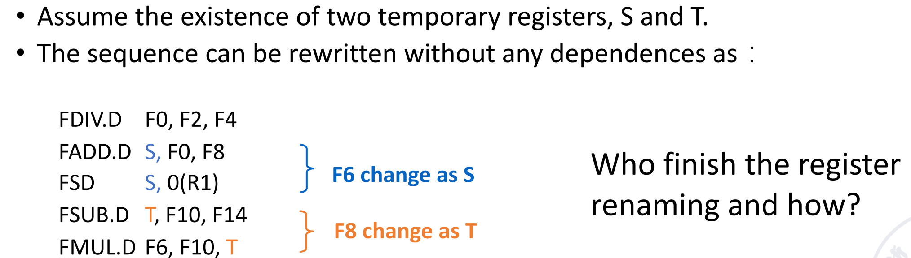

The basic structure of a floating-point unit using Tomasulo’s approach :

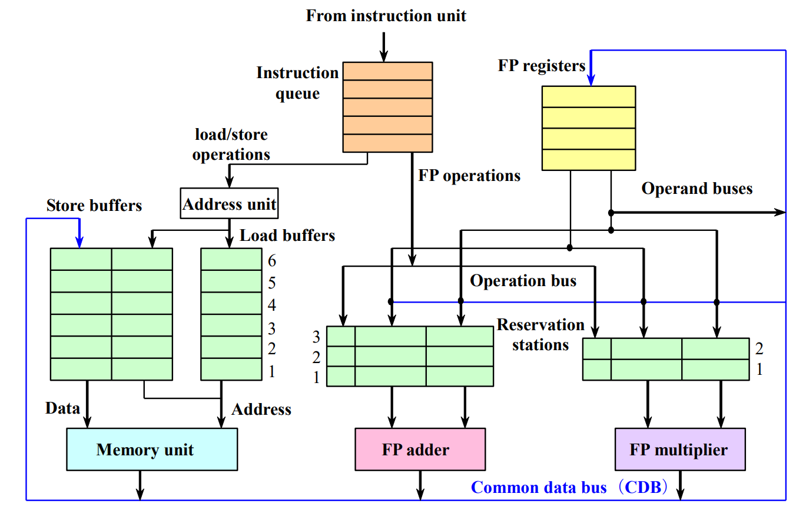

指令从指令队列出来(顺序)，先进入绿色的buffer，随后再进行操作。如果buffer已经满了还有指令要进入就需要等待(阻塞)。

这里Reservation Station的目的是为了一次性放进来多条指令，然后再buffer内完成乱序，即buffer内哪条指令操作数ready了就执行

此外在保留站内部还要进行rename，有可能依赖的是另一个保留站里的指令。每个保留站有唯一的命名

- It tracks when operands for instructions are available to minimize RAW hazards;

- It introduces register renaming in hardware to minimize WAW and WAR hazards.

#### Steps
- `Issue`(发射):从指令队列的头部取出下一条指令(FIFO)

从队列中顺序取出指令，并放入对应的保留站，进入保留站后，就会进行重命名，消除了WAR和WAW冒险

- 如果保留站有空位，就将指令放到保留站中
    - 如果操作数就绪(在寄存器中)直接加在到保留站
    - 若操作数未就绪，记录该操作数产生的功能单元(即等待其他指令的结果)
- 如果保留站没有空位，就等待阻塞(即保留站的空闲情况决定了指令是否流出，而不是由功能部件的情况决定)

- `Execute`:
    - 保留站里的指令操作数都就就绪了，就可以执行。这一步实现了乱序
    - load and store需要两步执行操作
        - 计算有效地址：当指令的基址寄存器的值就绪时，计算内存地址：`有效地址=基地址+偏移量`，将计算出的有效地址存入load/store buffer。(避免因内存延迟阻塞流水线)
        - 当内存单元就绪时，进行load/store操作
- `Write Results`
    - 通过 CDB 总线将结果写回到寄存器的同时，将结果发到其他所有标记了的（先前寄存器中没有值被标记值来源，计算得到之后需要被赋值）保留站里。（因此 CDB 也会影响 CPU 的效率，因此现在用多条总线保证效率）
    - 只有当要写入的值和要写入的地址都准备就绪且内存单元空闲时，才会将数据从Store Buffer写入内存

## 4.2 Hardware-Based Speculation

为了让指令执行完成的顺序也是顺序的，我们添加了一个reorder buffer

结果先写到reorder buffer,在buffer里按照指令流出的顺序依次协会寄存器。因此我们再每个指令后面加上一个commit状态，当前面的指令都commit之后才能commit

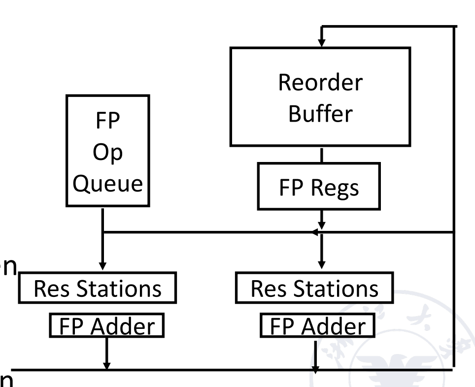

The basic structure of a FP unit using Tomasulo’s algorithm and extended to handle speculation:

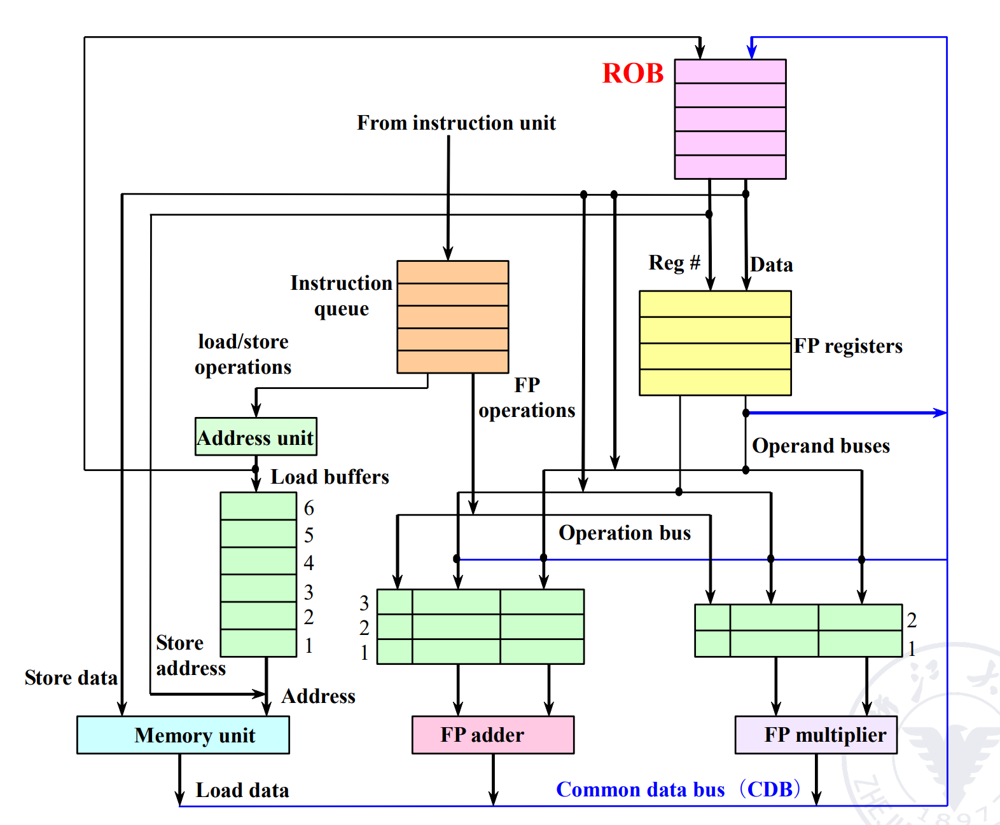

- Issue:从指令队列中取出指令
- Execution:operand on operands(EX)
- Write Result:finish execution(WB)
- Commit:update register with reorder result

Hardware-based speculation包含三个关键的思想 ：

- 动态分支预测来选择执行的指令
- 利用推测，可以在解决控制依赖问题之前执行命令(能够撤销错误推测指令序列的影响)
- 进行动态调度，以应对不同组合方式的基本模块调度(与之相对，没有推测的动态调度只能部分重叠基本模块，因为它要求先解析一个分支，然后才能实际执行后续基本模块中的指令)

**执行程序的方法实质**：数据流执行，也就是操作数一旦可用就立即执行

前面的IS和EX阶段与Tomasulo算法一样只是WB阶段增加了一个commit状态，只有当指令commit之后才能写回寄存器

- WB
    - 当结果可用时，将结果写在CDB上(还有在发射指令时发送的ROB标签，也就是指令写回时对应的顺序)，并从CDB写到ROB以及任何等待这一结果的保留站。
    - 将保留站(刚刚写在CDB上的指令所使用的保留站)标记为可用
    - 对于存储器指令(load and store)需要执行一些额外的操作。 
        - 如果要存储的值已经准备就绪，则将它写到ROB条目的值字段来等待访问存储器
        - 如果要存储的值还不可用，则必须监视CDB，直到该数值被广播，再更新该存储指令ROB条目的值字段
- Instruction Commit:根据要提交的指令是预测错误的分支指令、存储指令还是任意其他指令(可以正常提交的指令)有三种不同的操作模式
    - **正常提交**：当一个指令到达ROB的头部而且其结果出现在缓冲区中时，进行正常提交，此时处理器用结果更新寄存器，并从ROB中清除该指令
    - **存储指令提交**：具体步骤与正常提交相似，但是更新的是存储器而不是结果寄存器。
    - **预测错误的分支提交**：当指令到达ROB的头部时
        - 如果推测是错误的**ROB被清空**，执行过程从该分支的正确后续指令重新开始。
        - 如果推测是正确的，则该分支完成提交
    
指令一旦提交完毕，它在ROB中的相应项被收回，寄存器或存储器目的地址将被更新，并且不再需要ROB项。

如果ROB填满，则停止发射指令，直到有空闲条目为止。

!!! example Example
    
    The status tables when `FMUL.D` is ready to commit:

    - **Dest**: 这里是保留站的名称（一个字段）,在这里可以是即将进入到ROB中的标号，而不是寄存器的名称,也就是这个保留站条目所生成结果的目的地

    - **Example Table**:
    
    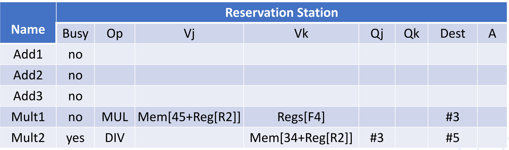

    - **Busy**标识标识当前正在执行的指令，也就是尚未commit的指令

!!! Practice
    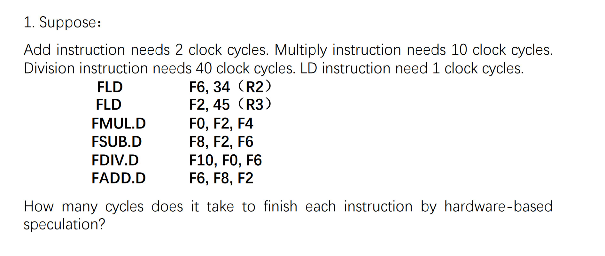
    
    - 发射阶段需要两个周期，由发射和解码两部分组成
    - `commit`部分与CPU的运算不冲突，CPU的运行效率并不会受到影响。**相当于整个过程中只是多了commit部分的等待过程，但是运算部分的周期与commit所需要花费的周期没有直接关系，write back之后就可以直接使用对应的数据**
    - 实际上加上ROB之后，前面的执行和Tomasulo算法是一样的，只是多了一个commit状态，需要加一列按照流出顺序提交，必要的时候需要等待

- Instructions are finished in order according to ROB经过ROB处理的指令是有序输出的
- It can be precise exception.处理中断时，提供精确异常
- It is easily extended to integer register and integer function unit.
- But the hardware is too complex.

## 4.3 Exploiting ILP Using Multiple Issue and Static Scheduling

多流出，也就是一拍可以流出多条指令

- Superscalar:

可以分为静态调度超标量和动态调度超标量。静态调度是通过编译器来完成的，动态调度是通过硬件来完成的

每个时钟周期发射的指令条数可能不一样

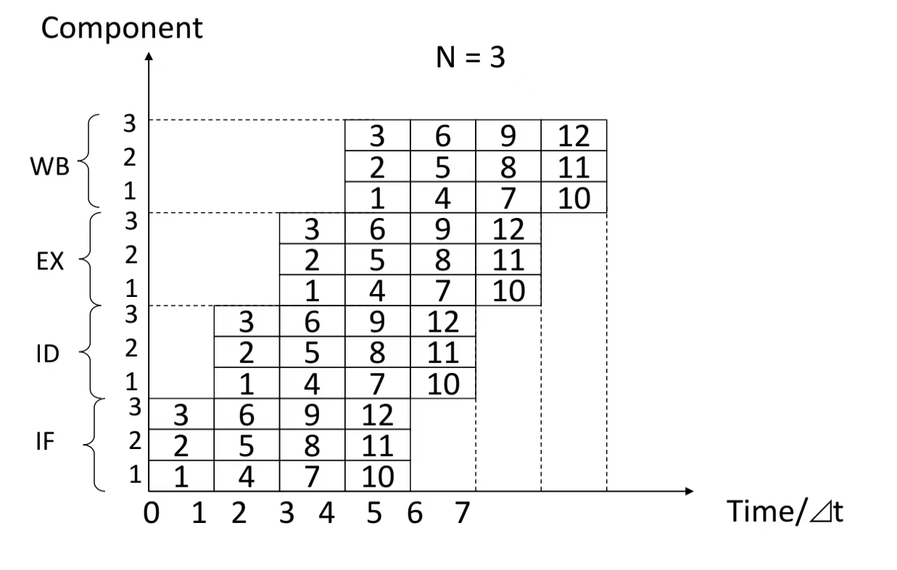

- VLIW (Very Long Instruction Word)：将多条指令包装在一条指令中

 超长指令字也是通过编译器完成的

 每个时钟周期发射的指令条数是固定的。它们组成一条长指令或者一个指令包

 !!!example
    我们考虑一个VLIW处理器，在上面包含5种运算的指令，包括一个整数运算、两个浮点运算和两个存储器访问。这些指令可能拥有与每个功能单元相对应的一组字段

    这些指令可能拥有与每个功能单元相对应的一组字段，每个单元可能为16~24位，得到的指令长度介于80~120位之间

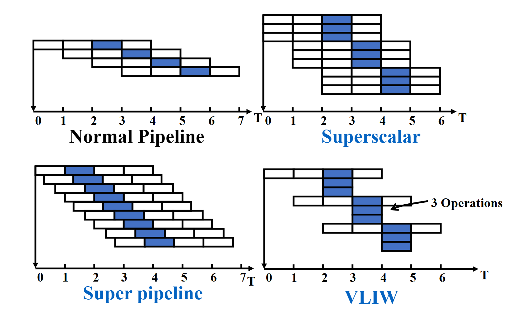

### 4.3.1 Based on static scheduling

In a typical superscalar processor, 1 to 8 instructions can be issued per clock cycle.

我们要进行结构冒险和数据冒险的检测。需要注意的是，如果遇到了分支跳转指令，那么只流出这一条，不能和其他指令一起流出。如果处理器有分支预测，那么下一个周期就可以根据预测结果进行发射；如果不带预测，我们就需要等待分支结果，然后再发射。

!!!example

    - Assumption: Two instructions flow out every clock cycle:
        - 1 integer instruction + 1 floating-point operation instruction
    - Among them, load, store and branch instructions are classified as integer instructions.
    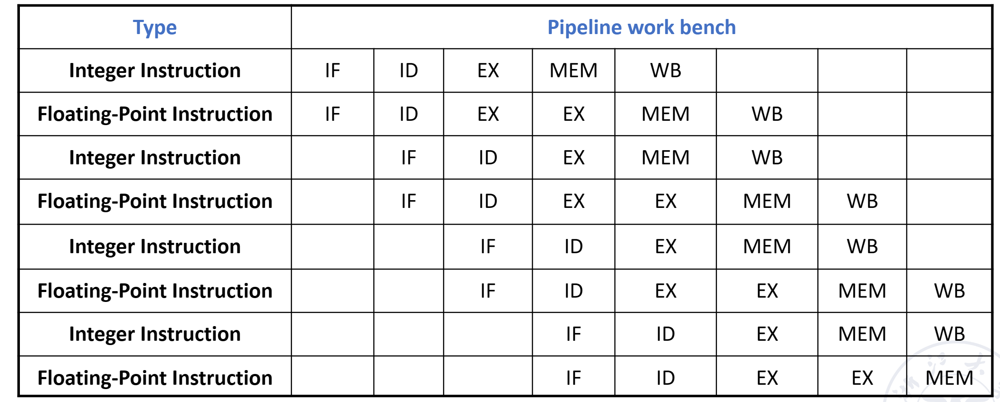

### 4.3.2 Based on dynamic scheduling

Extended Tomasuloalgorithm: supports two-way superscalar

指令顺序进入保留站，分开处理

!!!example
    ```RISCV
    Loop:
    FLD    F0, 0 (R1)   // Take an array element and put it into F0
    FADD.D F4, F0, F2   // add the scalar in F2
    FSD    F4, 0 (R1)   // storeresult
    ADDI   R1, R1, 8    // increment pointer by 8 //(each data occupies 8 bytes)
    BNE    R1, R2, Loop // If R1 is not equal to R2, it means it is not over yet, move to Loop to continue
    ```
    
    对于没有分支预测的情况：可以看到分支后面的一条指令，在周期7才能执行(即周期6分支指令执行结束)

    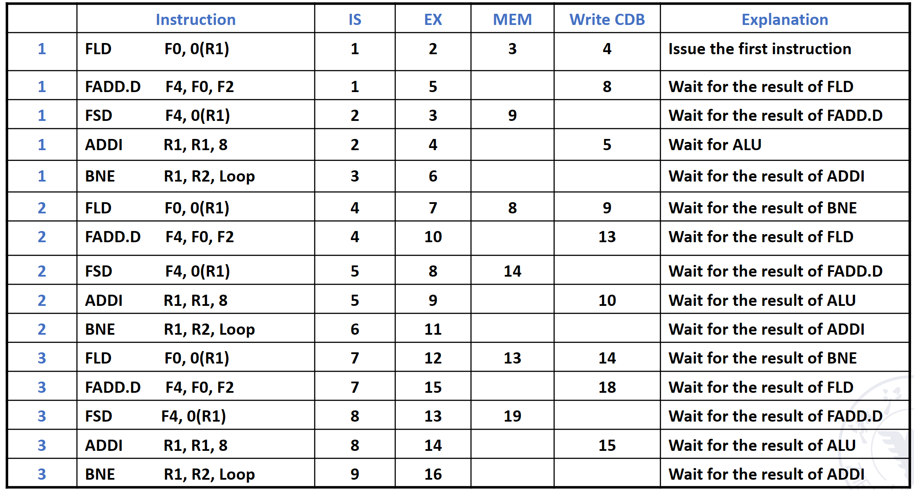
    
    - The program can basically reach 3 beats and 5 instructions
        - IPC＝5/3＝1.67 items/beat
    - the execution efficiency is not very high.
        - A total of 15 instructions were executed in 16 beats.
        - The average command execution speed is 15/16=0.94 per beat.

### 4.3.3 Very long instruction word technology(VLIW)

Assemble multiple instructions that can be executed in parallel into a very long instruction.

At compile time, multiple unrelated or unrelated operations that can be executed in parallel are combined to form a very long instruction word with multiple operation segments.

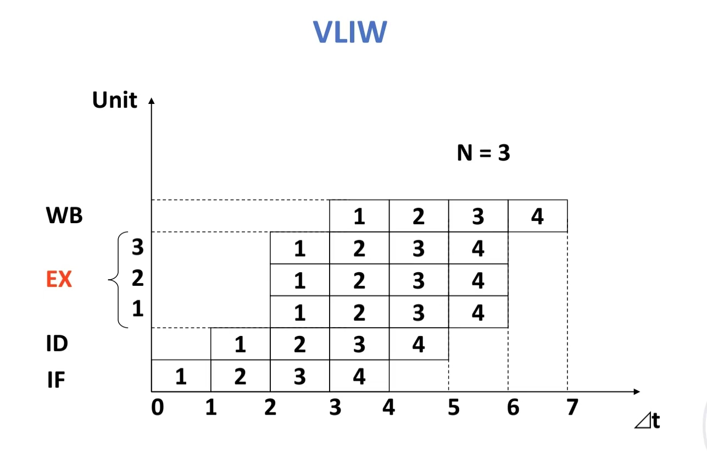
> 相当于只在EX阶段进行了并行操作

### 4.3.4 Superpipeline processor

A pipeline processor with 8 or more instruction pipeline stages is called a superpipelining processor.

在一个很小的$\Delta t$时间(小于一个阶段的用时)后就发射下一条指令

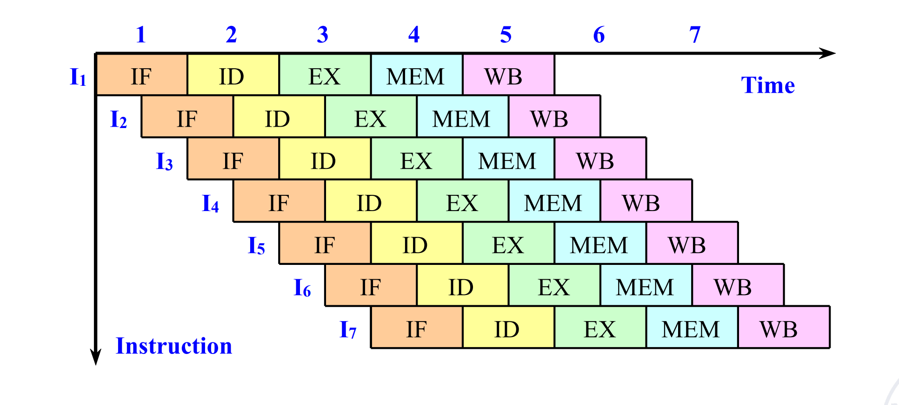

- 本质就是流水线的细分

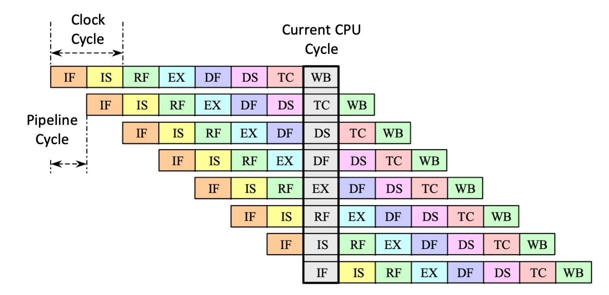