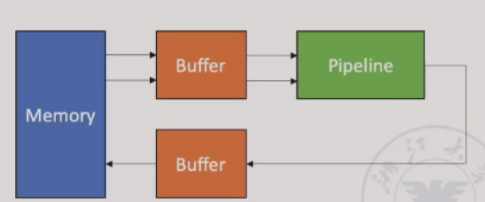
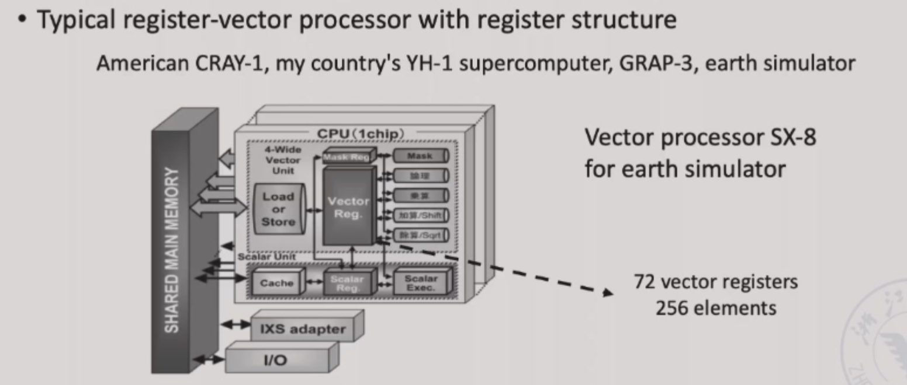
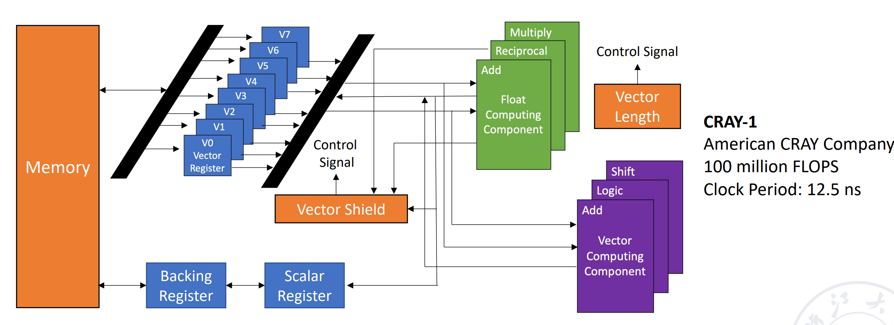
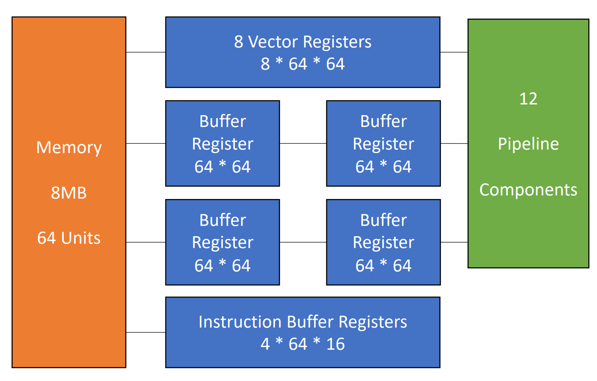
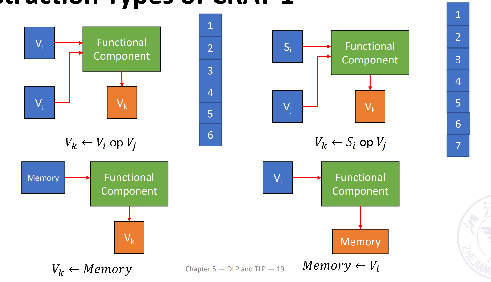

# Chapter 5: DLP and TLP

## 5.1 SIMD:vector processor

- SIMD架构可以利用重要的data-level parallelism
    - Matrix-oriented(矩阵导向)的科学计算
    - Media-oriented image and sound processors（面向媒体的图像和声音处理器 ）
- SIMD在功耗效率上优于MIMD：由于MIMD体系结构需要为每个数据操作获取一条指令，所以一条指令可移植性多个数据操作的SIMD的能效可能更高
- SIMD允许程序员采用顺序思维方式，但通过并行数据操作来获得并行加速比

### 5.1.1 Vector processor and Scalar processor
- **vector processor**：A pipeline processor, in which the vector data representation and the corresponding vector instructions are set,is called the vector processor具有向量数据表示及对应向量指令的流水线处理器
- **scalar processor**：A pipeline processor that does not have vector data representation and corresponding vector instructions is called the scalar processor

#### 三种向量处理模式
- Horizontal Processing Method(横向处理法):Vector calculations are performed horizontally from left to right向量计算按行从左到右水平执行，逐行计算完成后才进行下一行
> 计算 `A[i] + B[i]` 时，先完成 `A[0]+B[0]`，再处理 `A[1]+B[1]`

!!! note "Problems with horizontal processing"
    - **数据相关性(RAW)**：（如 `A[i+1] = A[i] + 1`），会导致流水线停顿，效率低下
    - **多功能流水线瓶颈**：若使用静态多功能流水线(如交替执行加法和乘法)，每次切换操作需要排空流水线，吞吐量甚至低于串行执行

- Vertical Processing Method(垂直处理法)：The vector calculation is performed vertically from top to bottom in a column manner.向量计算按列从上到下垂直执行
- Horizontal and vertical processing method(group processing method)

!!! example
    $D=A\times (B+C),A.B.C.D$——vector of length N
    - Horizontal processing method：

    先计算$d_1\leftarrow a_1\times (b_1+c_1)$，再计算$d_2\leftarrow a_2\times (b_2+c_2)$，再计算$d_3\leftarrow a_3\times (b_3+c_3)$，以此类推

    $$
    k_i \leftarrow b_i+c_i
    $$
    $$
    d_i \leftarrow a_i\times k_i
    $$

    循环里的两个语句存在数据相关。因此有N个数据相关，需要进行2N次功能切换

    - Vertical processing method

    先计算加法，$B+C$得到一个向量K在计算乘法$A\times K$得到D

    $$
    K \leftarrow B+C
    $$
    $$
    D \leftarrow A\times K
    $$

    只有一次数据相关：第二步的乘法D=A×K需要依赖第一步的加法结果K。
    只有两次功能切换：从其他操作(如加载数据的整数component)切换到加法器；从加法器切换到乘法器

    Memory to memory structure：数据放在buffer中，从buffer中取数在pipeline中运算，再把结果存回buffer中从而存回memory中

    - Horizontal and vertical processing method

    如果N太大了，不能用一个向量来直接装下所有数据，就需要多次运算。假设$N=S\times n+r$,即我们把N个数据分成了S组，每组有n个数据，最后一组有r个数据。组内做纵向运算，组间作横向运算

    类似于解决分块矩阵问题先进行组内的从加法到乘法的过程，组间按照组别的顺序依次处理

    共有S+1个数据相关，2(S+1)个功能切换

    Register-register structure:将每一组的n个数据放在寄存器中，每次运算从寄存器中取出组数据，得到的结果存储在寄存器中

- Memory-memory structure：源向量和目标向量都在内存中，中间结果也需要写会内存

- Register-register structure:需配置快速访问的向量寄存器，用于存储源向量、目标向量和中间结果，使得运算部件的输入、输出端均与向量寄存器相连，形成寄存器寄存器型操作流水线

### 5.1.2 CRAY-1 Vector Processor



有8个向量寄存器，每组向量集训期有64位。有12条单功能流水线，可以并行工作



#### 5.1.2.1 Features CRAY-1 Vector Processor
- Each vector register Vi has a separate bus connected to 6 vector functional units.每个向量寄存器Vi均通过独立总线连接到6个向量功能单元
- Each vector function unit also has a bus that returns the result of the operation to the vector register bus.每个向量功能单元也有一条总线，用于将运算结果返回到向量寄存器总线
- As long as there is no Vi conflict and functional conflict, each Vi and each functional unit can work in parallel, which greatly speeds up the processing of vector instructions.只要不存在Vi冲突*(两条指令试图同时写统一向量寄存器时发生冲突)*和功能单元冲突，各个Vi和各功能单元即可并行工作，从而显著加速向量指令的处理

- Vi conflict: The source vector or result vector of each vector instruction working in parallel uses the same Vi.当向量寄存器有依赖的时候，后续指令要在前面指令的结果出来之后再执行。这里并不是等前面的向量的每一个元素都计算完，而是等前面的向量的第一个元素计算完就开始计算第一个元素的后续指令。
    - Writing and reading data related
    $$
    V0\leftarrow V1+V2
    $$
    $$
    V3\leftarrow V4\times V0
    $$
    - Reading data related
    $$
    V0\leftarrow V1+V2
    $$
    $$
    V3\leftarrow V4\times V1
    $$
    
    要看是否有对应的连接通路使V1能够被连续读取，如果没有只能进行等待

- Functional conflict:Each vector instruction working in parallel must use the same functional unit.

$$
V0\leftarrow V1\times V2
$$
$$
V3\leftarrow V4\times V5
$$

如果我们只有一个乘法不见，就会有结构冲突。我们只能等前一条指令全部完成(最后一个元素做完才可以)，才能开始下一条指令

#### 5.1.2.2 Instruction Types of CRAY-1



向量加法需要6拍；乘法需要7拍；读写需要6拍

#### 5.1.2.3 Improve the Performance of Vector Processor

- 配置多个功能单元并且让它们可以并行工作，即通过硬件冗余来提高并行度
- 使用**Link Technology**来加速向量指令的执行：将依赖指令的流水线首尾相连，减少中间结果写会延迟
- 使用**recycling mining technology**(回收挖掘技术)加快循环处理，通过硬件预取(提前将下一轮循环的数据从内存加在到缓存)和数据复用(循环中的中间结果保留在寄存器，避免重复加载)优化循环中的向量操作
- 使用多处理器系统进一步提升性能

我们重点关注不依赖于硬件提升的`Link Technology`

- Link Technology:It has two related instructions that are written first and then read. In the case of no conflicts between functional components and source vector conflicts, functional components can be linked for pipeline processing to achieve the purpose of speeding up execution.如果我们有两条指令，第一条指令的结果是第二条指令的输入，那么我们就可以把这两条指令链接起来，这样就可以减少一次读写的时间。

!!! Example "Use link technology to perform vector operations on CRAY-1"
    $D=A\times (B+C) A,B,C,D$ ——vector of length N,假设$N\leq64$,均为浮点数，B和C已经被存在V0和V1中

    ```
    V3 <- memory    // access vector A
    V2 <- V0 ＋ V1  // Vector B and Vector C perform floating point addition
    V4 <- V2 * V3   // Floating point multiplication, the result is stored in V4
    ```

    这里前两条指令没有冲突，可以并行完成。第三条指令需要等前两条指令完成，存在RAW，不能并行但可以链接。

    这里假设把数据从寄存器送到功能部件需要一拍，功能部件的结果写回到寄存器也需要一拍。把数据从内存送到fetch function unit需要一拍
    !!! quesion
        计算下面的指令，假设三条指令串行执行；1 和 2 并行执行后执行 3；使用 link 技术，这三种情况下的拍数。

        ```
        V3 <- A
        V2 <- V0 + V1
        V4 <- V2 * V3
        ```

        注意到向量功能内部也是流水的
        - The execution time using serial method
        ??? answer
            经过8拍V0的第一个元素到达V2，那么再过(N-1)拍V0的最后一个元素就会到达V2.[(1+6+1)+N-1] + [(1+6+1)+N-1] + [(1+7+1)+N-1] = 3N+22 拍
        - The first two instructions are parallel, and the third is serial.
        ??? answer
            max{[(1+6+1)+N-1], [(1+6+1)+N-1]} + [(1+7+1)+N-1] = 2N+15
        - Use link technology.
        ??? answer
            我们只需要知道 V4 的第一个结果多久可以出来：8+1+7+1=9 拍，随后还有 (N-1) 条指令，因此总共需要的拍数为 max{(1+6+1), (1+6+1)} + (1+7+1)+N-1 = N+16.