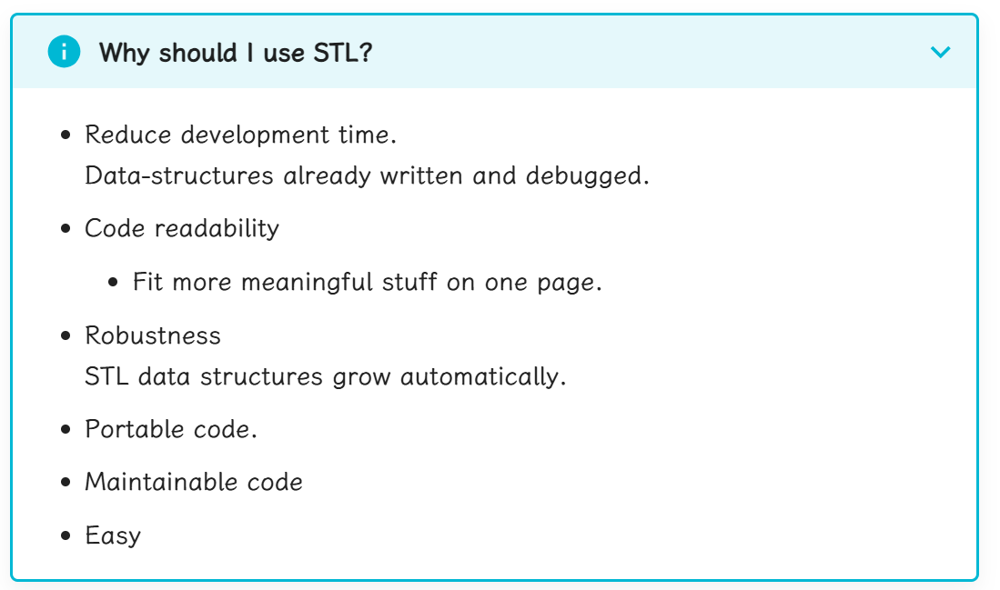

# Chapter 2：Container(容器)

Collection objects are objects that can store an arbitrary number of other objects
- collection本身是对象
- 其可以存储任何对象

在C++中，容器在STL中
- STL=Standard Template Library
- Part of the ISO Standard C++ Library 
- Data Structures and algorithms for C++.



Library includes
- A pair of class((pairs of anything, int/int, int/char, etc))
- Containers
    - vector(可变数组)
    - deque(可变数组，在两侧延伸,双端队列)
    - list(double-linked)
    - sets and maps(哈希)
    - Basic Algorithms(sort,searh,etc)
- All identifiers in library are in the namespace std:`using namespace std;`


## 2.1 Vector
每个容器是一个头文件，需要include
```cpp
#include <iostream>
#include <vector>
using namespace std;
int main( ) {
    // Declare a vector of ints (no need to worry about size)
    vector<int> x;
    // Add elements
    for (int a=0; a<1000; a++)
    x.push_back(a);
    // Have a pre-defined iterator for vector class, can use it to print out the items in vector
    vector<int>::iterator p;
    for (p=x.begin(); p<x.end(); p++)
    cout << *p << " ";
    return 0;
}
```
- 这是泛型定义(generic classes),我们需要指定`vector`和vector内元素的类型`vector<int> x`
- `vector<int>::iterator`是一个类型我们称之为迭代器
    - it不是一个指针,`*`和`++`针对iterator进行了重载
- 语法糖（C++11）
```cpp
for(auto i:x)//auto是指类型自动推断。这里会从x中依次取出一个值，最后放到i里去
{
    cout<<i<<" ";
}
```

### vector
- 可以根据需求进行容量扩充
- 私有保持容器中已有元素的个数
- 维护插入元素的顺序
### 2.1.1 Basic Vector Operations
- Constructors
```cpp
vector<ElementType> c;
vector<ElementType> c1(c2);将c2容器中的元素复制到c1容器中
vector<ElementType> c(n,element);//初始化为n个element
vector<ElementType> c(n);
```
- Simple Methods
```cpp
V.size();//num items
V.empty();//true if empty
v1==v2;//true if equal（元素相同，且在容器中的顺序相同，其他关系运算符也可以使用）
V.swap(v2);将V中的元素与v2交换
```
- Iterators
```cpp
V.begin();//first position(地址)
V.end();//last position(地址)
```
- Element Access
```cpp
V[index];//element at position i
V.at(index);//不能作为左式向指定位置写入元素
V.front();//first element
V.back();//last element
```
> vector[] vs v.at():vector[]不会进行边界检查，越界后行为不可预测
- Add/Remove/Find
```cpp
V.push_back(element);//add to end
V.pop_back();//remove from end
V.insert(pos,element);//pos为iterator
V.erase(pos);//pos为iterator
V.clear();//remove all elements
find(pos_first,pos_last,element);//在first和last之间寻找element,返回值是element对应的迭代器位置
```

### 2.1.2 Two ways to use Vector
- Preallocate
```cpp
vector<int> v(10);
cout<<v.capacity()<<endl;//输出为10 
cout<<v.size()<<endl;//输出为10(说明元素被初始化为0)
v[5]=1;//okay
v[11]=1;//bad
```
- Grow tail
```cpp
vector<int> v2;
int i;
while(cin>>i)
{
    v.push_back(i);
}
```
## 2.2 List Class
与vector相同的基本概念
- Constructor
- 比较链表的能力(==,!=,<,<=,>,>=)
- 访问链表的两端

```cpp
x.front();//first element
x.back();//last element
```
- Ability to assign items to a list,remove items
```cpp
x.push_back(item);//后插入
x.push_front(item);//前插入
x.pop_back();//删除最后一个元素
x.pop_front();//删除第一个元素
x.erase(pos1,pos2);//删除pos1到pos2之间的元素
```

```cpp
#include <iostream>
#include <list>
#include <string>
using namespace std;
int main()
{
    list<string>s;
    s.push_back("hello");
    s.push_back("world");
    s.push_front("tide");
    s.push_front("crimson");
    s.push_front("alabama");
    list<string>iterator:: p;
    for (p=s.begin(); p!=s.end(); p++)
        cout << *p << " ";
    cout << endl;
}
```
> 这里是`p!=s.end()`因为列表每个空间是动态分配的，后申请的空间不能保证先申请的空间后面。对`vector`来说空间是连续的

```cpp
list<int> lst1;
list<int>::iterator iter1=lst1.begin();
list<int>::iterator iter2=lst1.end();
while(iter1<iter2)
```
> iter1和iter2不能通过比较大小的形式进行链表遍历管理，因为列表每个空间是动态分配的，分配的内存在存储空间内不一定是连续的

- Maintaining an ordered list
```cpp
#include <iostream>
#include <list>
#include <string>
using namespace std;
int main(void)
{
    list<string> s;
    string t;
    list<string>::iterator p;
    for(int a=0;a<5;a++)
    {
        cout<<"Enter a string: ";
        cin>>t;
        p=s.begin();
        while(p!=s.end()&&*p<t)
        {
            p++;
        }
    s.insert(p,t);
    }
    for(p=s.begin();p!=p.end();p++)
    {
        cout<<*p<<" ";
    }
    return 0;
}
```  
## 2.3 Maps
- Maps are collections that contain pairs of values
- Pairs是由一个key和一个value组成的
- 在map中，key values通常用来排序和确定元素，被映射的值存储这个key相关的内容
    - key内部的实现机制中是自动根据key进行排序的
- 查找的工作原理是提供一个键并通过这个键进行检索
- Maps的实现原理是通过二叉搜索树实现的

- map中的常用函数总结

|函数|	功能|	时间复杂度|
|---|---|---|
|insert	|插入一对映射	|$\mathcal{O}(\log n)$
|count	|判断关键字是否存在	|$\mathcal{O}(\log n)$
|size	|获取映射对个数	|$\mathcal{O}(1)$
|clear	|清空	|$\mathcal{O}(n)$

- 我们向映射中加入新映射对的时候就是通过插入pair来实现的。如果插入的key之前已经存在了，将不会用插入的新的value替代原来的value，也就是这次插入是无效的。
```cpp
#include <map>
#include <string>
#include <utility>
using namespace std;
int main() {
    map<string, int> dict;              // dict 是一个 string 到 int 的映射，存放每个名字对应的班级号，初始时为空
    dict.insert(make_pair("Tom", 1));   // {"Tom"->1}
    dict.insert(make_pair("Jone", 2));  // {"Tom"->1, "Jone"->2}
    dict.insert(make_pair("Mary", 1));  // {"Tom"->1, "Jone"->2, "Mary"->1}
    dict.insert(make_pair("Tom", 2));   // {"Tom"->1, "Jone"->2, "Mary"->1}
    //但是如果我们使用dict["Tom"]=2;对Tom进行赋值，那么Tom的value就会变成2，不可更改的性质仅限于insert函数
    return 0;
}
```


```cpp
#include <map>
#include <string>

map<string,float> price;//key是string，value是float
price["snapple"]=0.75;
price["coke"]=0.50;
string item=0;
double total=0;
while(cin>>item)
{
    total+=price[item];//字符串作为下标
}
```
- count函数是用来查找key的，如果找到返回1找不到返回0
```cpp
#include <iostream>
#include <map>
#include <string>

int main() {
    // 创建一个 map，键是字符串，值是整数
    std::map<std::string, int> myMap;

    // 向 map 中插入一些键值对
    myMap["apple"] = 1;
    myMap["banana"] = 2;
    myMap["cherry"] = 3;

    // 使用 count 函数检查键是否存在
    std::string key = "banana";
    if (myMap.count(key) > 0) {
        std::cout << key << " exists in the map with value " << myMap[key] << std::endl;
    } else {
        std::cout << key << " does not exist in the map." << std::endl;
    }

    // 检查一个不存在的键
    key = "grape";
    if (myMap.count(key) {
        std::cout << key << " exists in the map with value " << myMap[key] << std::endl;
    } else {
        std::cout << key << " does not exist in the map." << std::endl;
    }

    return 0;
}
```
```cpp
map<long,int> root;
root[4]=2;
root[10000000]=1000;
long l;
cin>>l;
if(root.count(l))//寻找是否有key=l的value，有则输出
{
    cout<<root[l]<<endl;
}
else cout<<"not found"<<endl;
```
- Example
```cpp
std::map<std::string,int> m{{"CPU",10},{"GPU",15},{"RAM",20}};

print_map("1) Initial map: ",m);

m["CPU"]=25;//更新原有的字典元素
m["SSD"]=30;//添加新的字典元素
print_map("2) Updated map: ",m);

//Using operator[] with non-existent key always performs an insert
std::cout<<"3) m[UPS] = "<<m["UPS"]<<'\n';
print_map("4) Updated map: ",m);

m.erase("GPU");//删除GPU
print_map("5)After erase: ",m);

m.clear();
std::cout<<std::boolalpha<<"6)Map is empty: "<<m.empty()<<'\n';
```
## 2.4 Iterator(迭代器)
1.  声明
```cpp
list<int>::iterator p;//p是list容器对应的迭代器
```
2. 操作
- Front of container
```cpp
list<int> L;
li=Ll.begin();
```
- Past the end
```cpp
li=L.end();
```
- Can Increment
```cpp
li=L.begin();
li++;
```
- Can be dereferenced
```cpp
*li=10;
```
- 迭代器可以通过解引用的方式直接更改对应容器中的值

在 C++ 中，迭代器（Iterator）是一种用于遍历容器（如 `vector`、`list`、`map` 等）中元素的对象。C++ 标准库定义了多种类型的迭代器，每种迭代器支持不同的操作。


#### **C++ 标准迭代器类型**
1. **输入迭代器（Input Iterator）**：
   - 支持读取容器中的元素。
   - 只能单向移动（从前向后）。
   - 例如：`istream_iterator`。

2. **输出迭代器（Output Iterator）**：
   - 支持向容器中写入元素。
   - 只能单向移动（从前向后）。
   - 例如：`ostream_iterator`。

3. **前向迭代器（Forward Iterator）**：
   - 支持读取和写入容器中的元素。
   - 可以单向移动（从前向后）。
   - 例如：`forward_list` 的迭代器。

4. **双向迭代器（Bidirectional Iterator）**：
   - 支持读取和写入容器中的元素。
   - 可以双向移动（从前向后或从后向前）。
   - 例如：`list` 的迭代器。

5. **随机访问迭代器（Random Access Iterator）**：
   - 支持读取和写入容器中的元素。
   - 可以随机访问容器中的任意元素（支持 `+`、`-`、`[]` 等操作）。
   - 例如：`vector` 和 `deque` 的迭代器。

---