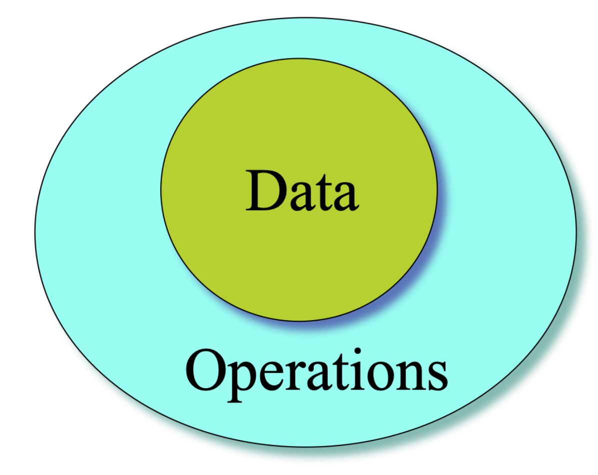
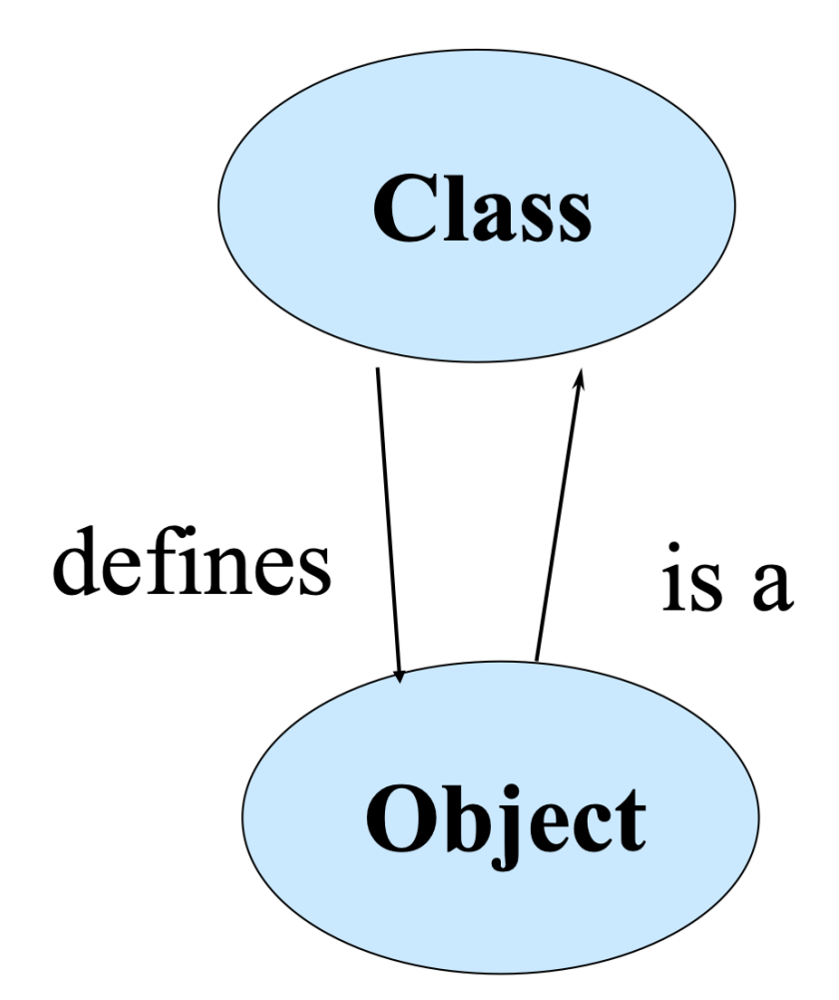

# Chapter 3: Class
## 1 Introduction
```C
typedef struct point {
    float x;
    float y;
} Point;

void print(const Point *p)
{
    printf("%d %d\n", p->x, p->y);
}

void move(Point* p,int dx, int dy)
{
    p->x += dx;
    p->y += dy;
}

int main()
{
    Point a;
    a.x = 1;
    a.y = 2;
    print(&a);
    move(&a, 10, 20);
    print(&a);
}
```

- 这是C语言风格的代码。函数只能在结构体的外面
```cpp
typedef struct point {
    int x;
    int y;
    void print();       
}Point;
```

C++可以把函数也放到结构里面。这里只是声明，但不会产生实际代码。
- 声明在结构内的函数是不独立的，从属于`Point`结构，需要一个body
```cpp
    int x;
    int y;
    void print();       
}Point;

void Point::print()
{
    printf("%d %d\n", x, y);
}
```

- `a.print()`即可调用结构体内部的成员函数，但是这个成员函数如何知道我们要输出`a.x,a.y`呢

- `this`指针指向的对象就是`a`

```cpp
void Point::init(int x, int y)
{
    this->x = x;
    this->y = y;
}
```
> 这里必须加this，否则类似于局部变量会屏蔽全局变量，编译器会认为x=x，相当于给形参赋值，什么也没做

## 2 Resolver

预解析器

- `<class name>::<function name>`
- `::<function name>`

```cpp
void S::f() {
    ::f(); // Would be recursive otherwise!
    ::a++; // Select the global a
    a--; // The a at class scope
}

```

`this`:the hidden parameter
- `this`是每个成员函数的隐藏参数，其类型是对应的类的类型

*e.g.* `void Point::move(int dx,int dy);`可以写作`void Point::move(Point* this,int dx,int dy);`

- To call the function, you must specify a variable.

*e.g.* p.move(10,10); can be recognized as Point::move(&p,10,10);

## 3 Object

**Object=Attribute+Services**
- Data:the properties or status
- Operations:the functions



- In C++, an object is just a variable, and the purest definition is "a region of storage".
- The struct variables learned before are just objects in C++.

### 3.1 Object vs Class
- Object(this cat)
    - Represent things,events or concepts--实体
    - Respond to message at runtime
- Classes(this cat)
    - Define properties of instances
    - Act like types in C++



### 3.2 OOP Characteristics
- Everything is an object.
- A program is a bunch of objects telling each other what to do by sending messages.
程序就是一堆对象，互相发送消息，告诉对方要做什么 (what instead of how)
> 上课的时候，老师在讲课，电脑在发送消息给投影仪...
老师让同学站起来，这个消息发送过后，具体如何站起来，只由同学自己决定。
- Every object has a type.
- All objects of a particular type can receive the same messages.
同类的对象，都可以接受相同的消息。
可以接受相同消息的对象，也可以认为是同个类型。
## 4 Constructor

我们需要有机制，保证对象被创建时有合理的初值
- 构造函数和结构名字完全相同
- 本地变量被创建时，构造函数被调用
- 在一个类中构造函数可以重载，也就是可以定义多个构造函数

```cpp
struct Point{
    ...
    Point();
}
Point::Point()
{
    ...
}
```
- 当我们创建变量时`Point b;`,编译器就会自动调用对应类的构造函数。如果有参数就`Point a(1,2)`即可

1. Constructor with arguments

- 构造函数允许有参数从而允许对象确定特定的初值

```cpp
class Tree {
  int height;
public:
  Tree(int initialHeight);  // Constructor
  ~Tree();  // Destructor
  void grow(int years);
  void printsize();
};

Tree::Tree(int initialHeight) {
  height = initialHeight;
  cout << "inside Tree constructor" << endl;
}
```
> Tree t(12);或Tree t=12;都可以接受相同的消息
2. Initializer list

- 成员变量可以在结构内被初始化
```cpp
struct Point{
    int x=0;
    int y=0;
};//这被称为定义初始化
```
- 构造函数也可以用初始化列表初始化成员变量

```cpp
struct Point{
    Point(xx,yy);
    int x;
    int y;
};

Point::Point(int xx,int yy):x(xx),y(yy)
{
    ...
}
```

> 定义初始化->初始化列表->函数赋值(定义一个成员函数，在成员结构内部直接通过函数对其进行赋值)

3. The default constructor
- 是一种可以没有参数的构造函数

```cpp
struct Y
{
    float f;
    int i;
    Y(int a);//这不是一个没有参数的构造函数，所以在创建时必须传递变量 
};
Y y1[]={Y(1),Y(2),Y(3)};//OK
Y y2[2]={Y(1)};//error,分配空间就必须传递参数进行构造
```

```cpp
Student() {
        name = "Unknown";
        age = 0;
        std::cout << "Default constructor called!" << std::endl;
    }

```
> 不向构造函数传递参数就是默认没有参数

**"auto" default constructor**
- 如果有构造函数，编译器会确保构造函数始终会被调用
- 如果没有构造函数，编译器会自动给这个类创建一个默认的构造函数

## 5 Destructor

The destructor is named after the name of the class with a leading tidle(~).The destructor never has any arguments

- 没有返回类型，没有参数
- 当其作用于结束时，析构函数会被自动调用
- 先调用构造函数的后被析构

```cpp
void f(int i) {
    if(i < 10) {
    //! goto jump1; // Error: goto bypasses init
    }
    X x1;  // Constructor called here
    jump1:
    switch(i) {
        case 1 :
        X x2;  // Constructor called here
        break;
    //! case 2 : // Error: case bypasses init
        X x3;  // Constructor called here
        break;
    }
} 
```
> 这里 jump 跳过了 x1 的构造，但在进入函数 f 时空间已经被分配好了，当函数结束时，析构仍然会自动进行，如果没有默认零值的话析构会出问题。
switch case 并不能隔绝变量的作用域，里面的 x2, x3 的作用域就是这对大括号，当我们进入 switch case 时空间就已经分配，当离开大括号时析构出现问题。