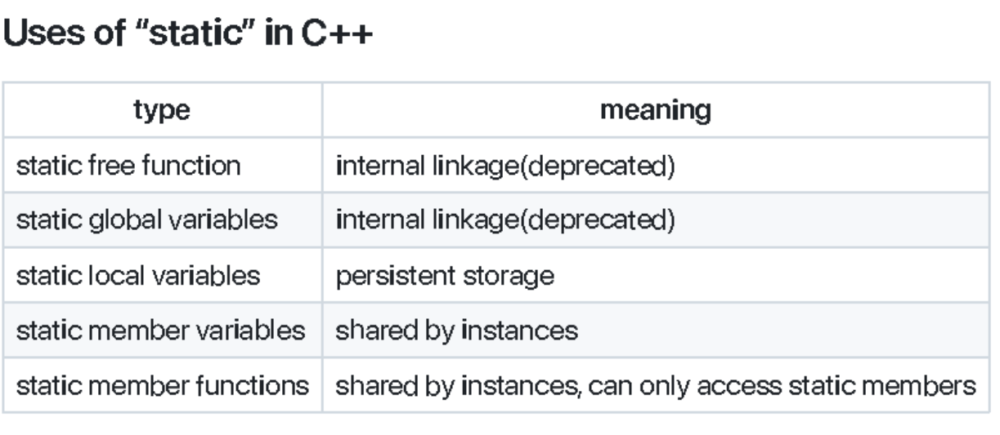
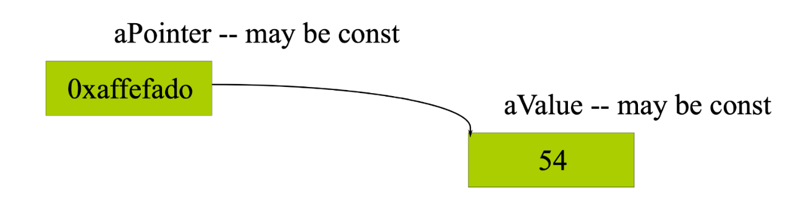
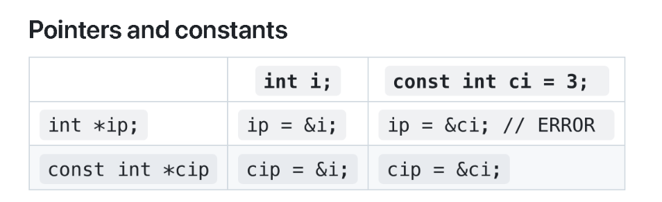
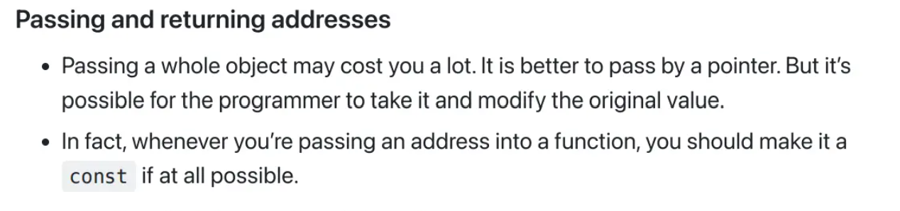
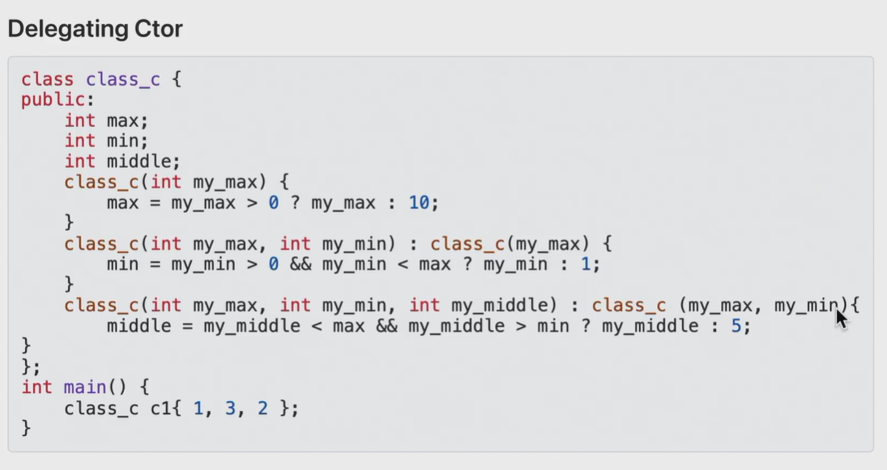
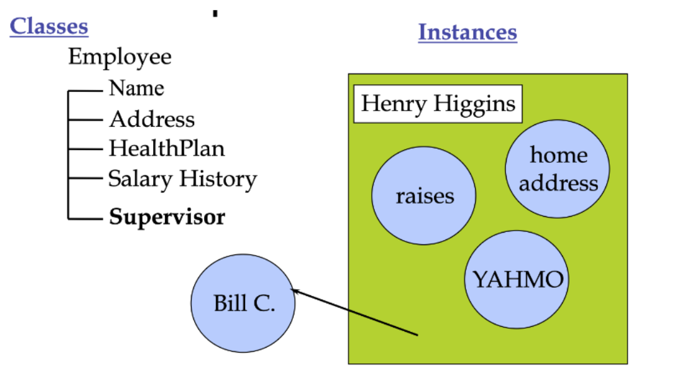

# Chapter 4:Inside Object
## 1 Local and member variables

|	|local|	global|	member|
|---|---|---|---|
|lifecycle|	{}|	全局|	对象|
|scope|	{}|	全局|	成员函数内|
- 成员变量的作用域和生存期是分离的。如C语言中的static静态变量，和全局变量一样最开始就存在，但是只能作用于这个函数

## 2 C++ Access Control

The members of a class can be cataloged,marked as
- `public`: public means all member declarations that follow are available to everyone.
- `private`:The private keyword means that no one can access that member except inside function members of that type.只有在**类**内部（**不是对象**）包括内部函数和内部变量可以访问。
    - 可以通过指针访问其他对象的私有变量
> 结构中默认为`public`,类中默认为`private`

```cpp
struct B {
private:
    int j;
public:
    void f(B *p) {
        p->j = 'A';
    }
}

B b, bb;
B.f(&bb);
```
> 这种形式是正确的。private的边界是类不是对象

- `protected`:不让外界访问，可以让继承者访问
## Friends 友元

- is a way to explicitly grant access to a function that isnʼt a member of the structure是非成员访问类的一种函数
- The class itself controls which code has access to its members.类自身对哪些结构可以访问类进行控制
- Can declare a global function as a friend, as well as a member function of anotherclass, or even an entire class, as a friend.友元可以是全局函数、成员函数甚至是整个类

其他函数、结构就可以访问本对象的变量。只有自己可以决定友元

```cpp
struct X {
private:
    int i;
public:
    void initialize();
    friend void g(X*, int i);
    friend void Y::y();
}
```

- 不同文件中的变量初始化顺序无法确定，因为这由链接器决定而不是C++编译器
    - 有依赖关系的变量尽量放在相同的文件中

- **友元关系不具有传递性**：不能通过中间友元进行跨友元访问
## 3 Where are the objects
- 非静态成员函数：属性(property)
- 非静态成员函数：方法(method)
> 二者是与对象相关的
### 3.1 Local object
- Local variables are defined inside a method, have a scope limited to the method to which they belong 
如果一个局部变量的名字与类的字段（成员变量）名字相同，那么在方法内部，局部变量会“遮蔽”同名的字段，导致无法直接访问字段。
```cpp
int TicketMachine::refundBalance(){
    int amountToRefund;
    amountToRefund=balance'
    balance=0;
    return amountToRefund;;
}
```
- 与字段(field)同名的局部变量将阻止从method内访问该字段
### 3.2 Fields,parameters,local variables
- 所有三种变量都可以存储与其定义类型相匹配的值
```cpp
class MyClass {
    int field; // 字段
    void myMethod(int parameter) { // 参数
        int localVariable = 10; // 局部变量
    }
}
```
- 字段定义在构造函数和方法之外，但在类的内部
    - 字段是类的成员变量
- 字段用于存储对象的持久数据，这些数据在对象的整个生命周期内都存在，字段的值决定了对象的当前状态
- 字段的生命周期与其所在对象相同    
    - 当对象被创建时，字段被初始化
    - 当对象被销毁时，字段也随之销毁
- 字段具有类作用域
    - 字段可以在类的任何构造函数或方法中访问
    - 字段的访问权限取决于其修饰符
- 只要他们被定义为private,field不能在类外部的任何位置被访问
- 形式参数和局部变量的生命周期
    - 形式参数和局部变量的生命周期仅限于构造函数或方法的执行期间
    - 它们的值在每次调用时被创建，在调用结束后被销毁
    - 因此它们的作用是临时存储而不是永久存储

|特性|字段(field)|参数(parameters)|局部变量(Local Variable)|
|---|---|---|---|
|定义位置|类内部，构造函数和代码块外部|方法或构造函数的参数列表|方法或代码块内部|
|生命周期|与对象相同|方法调用期间|代码块执行期间|
|作用域|整个类|方法内部|代码块内部|
|存储数据|对象的持久数据|方法调用时传入的值|临时数据|
---

|特性|形式参数(Formal Parameters)|局部变量(Local Variables)|
|---|---|---|
|定义位置|构造函数或方法的头部|构造函数或方法的主体内部|
|初始化|由实际参数初始化|必须在使用前显式初始化|
|生命周期|构造函数或方法执行期间|构造函数或方法执行期间|
|作用域|仅限于定义它们的构造函数或方法|仅限于定义它们的代码块|
|默认值|由实际参数初始化|无默认值|

### 3.3 Global objects
- Consider
```cpp
#include "x.h"
X global_x1(12,34);
X global_x2(8,16);
```
- 全局对象的构造函数在进入main函数之前被调用
    - 没有参数会调用默认构造函数
    - 构造函数的调用顺序取决于对象定义的顺序
    - `global_x`在`global_x2`之前被初始化
    - `main()`不再是最先被调用的函数
- 析构函数被调用当
    - `main()`exists or
    - `exit()`is called
#### Static Initialization
- order of construction within a file is known
    - 初始化的顺序由定义的顺序决定，有依赖关系的对象要注意定义顺序
- Order between files is unspecified
    - 不同文件中的变量初始化顺序无法确定，它是由链接器确定的而不是由编译器决定的。有**依存关系**的对象不允许在不同的文件中定义
- A non-local static object is:
    - defined at global `static int globalVar=10;`or namespace scope`namespace MyNamespace{static int namespaceVar=10;}`
    - declared static in a class
    ```cpp
    class MyClass{
        public:
            static int classVar;
    }
    int MyClass::classVar=10;
    ```
    - defined static at file scope`static int fileVar=40;`

## 4 Static
- Two basic meanings
    - Static storage-Local:本地变量或函数
    - Restricted access-global：全局变量或函数，只有当前文件可以访问
- Allocated once at a fixed address
    - Visibility of a name 
    - internal linkage


- static修饰的全局函数会限制其作用域为当前文件
- static修饰全局变量，只能在其定义的文件中使用
- static修饰局部变量：具有持久存储，第一次初始化时被创建，程序结束时释放
- static修饰成员变量，由类的所有实例(对象)共享，只会在整个程序中被创建一次
    - 有静态成员变量时需要有一个根的定义`int StartMen`。类中只是给出了声明，但是不会分配内存，需要一个根的定义
    - 表现：在这个类内所有的对象都维持相同的值，对象A修改了那么对象B中这个变量的值也会随之改变
- static修饰成员函数：由类的所有实例共享且只能访问静态成员变量。通过`<class name>::function name()`的形式直接调用，无需创建类的实例(对象)
    - 静态成员函数没有`this`指针，不能调用非静态成员变量，也不能访问非静态成员函数。但是可以在还没有创建对象的时候就调用静态成员函数

## 5 Reference
### 5.1 Declaring Reference
- Refrence is a new way to manipulate objects in C++
```cpp
char c;
char *p=&c;//a pointer to a character
char &r=c;//a reference to a character
```
`*,&`可以是标点，也可以是运算符，如`&`在第二行是一个运算符在第三行是一个标点

当我们声明引用时，必须有引用的变量，此时r相当于c的一个别名


- `&`表明其右侧的变量是一个引用
- Local or global variable
    - `type& rename = name;`
    - For ordinary variables, the initial value is required.

- In parameter lists and member variables
    - `type& rename;`
    - Binding defined by caller or constructor函数只有在调用时，参数才能被绑定

```cpp
void f ( int& x );
f(y); // initialized when function is called
```
> 这样可以实现函数对函数外变量的值的修改
### 5.2 Rules of references
- 引用必须在定义时被一个已有的变量进行绑定
- 初始化可以建立一种绑定关系

- In declaration
```cpp
int x=3;
int &y=x;
const int &z=x;
```
- As a function argument
```cpp
void f(int &x);
f(y);
```

- 关系一旦确立是不能更改的
    - 可以看做一种一次性的指针
- 赋值操作可以改变引用指向的对象的值
```cpp
int &y=x;
y=12;//这时x的值也相应地变成12
```
- 引用的对象必须有一个具体的、有内存地址的对象
```cpp
void func(int &x);
func(i*3);//error因为i*3只能作为右值，不会分配内存
```

#### Pointers VS References
- 引用
    - 不能是空的
    - 依赖于已经存在的变量，是变量的别名
    - 绑定关系后不能更换到其他地址
- 指针
    - 可以被置为空指针
    - 指针变量是独立于已经存在的对象
    - 可以指向位于不同地址的变量

### 5.3 Restrictions
- No references to references
    - 引用本身是一个别名，它必须绑定到一个具体的对象，因为**引用本身不是一个独立的对象**，它只是目标对象的别名，所以C++不允许引用的引用出现
- No pointers to references没有指针的引用
    - **引用本身不是一个独立的对象，它只是目标对象的别名**，因此引用没有自己的内存地址
```cpp
int &*p;//illegal
```
- Reference to pointer is OK
    - 指针是一个明确的对象，有明确的内存地址，可以进行内存关系上的绑定。
    - 这种用法通常用于函数参数中，以便在函数内部修改指针本身
```cpp
void f(int *&p) {
    p = new int(20); // 修改指针 p
}
```

- No arrays of references没有引用的数组(数组中的元素是引用)
    - 数组要求元素是独立的对象，因此不能创建引用的数组

### 左值、右值与右值引用
- 在赋值表达式中，出现在等号左边的就是左值，而在等号右边的就是右值
- 可以取地址、有名字的就是左值，反之，不能取地址的、没有名字的就是右值
- C++11有两个概念组成：一个是将亡值，一个是纯右值
- 右值引用只能用右值初始化，不能用左值初始化，除非是const的左值

## 6 Constant
- declare a variable to have a constant value
```cpp
const int x = 123;  // const, literal(字面量)
x = 27;     // illegal!
x++;    // illegal!
int y = x;  // ok, copy const to non-const
y = x;  // ok, same thing
const int z = y;    // ok, const is safer
```

- Constants are variables常量本质上是变量，只是他们是不可以被修改的:常量声明时必须初始化且初始化后其值不能被修改
    - Observe scoping rules：常量可以定义在全局作用域、局部作用域或命名空间内，常量的作用域决定了它在程序中的可见性和生命周期
    - Declared with `const` type modifier：常量通过`const`类型修饰符声明
        - `const`关键字用于声明常量，表示该变量的值不可修改
        - `const`可以修饰基本类型、指针、引用、类对象等
- A const in C++ defaults to internal linkageC++中常量默认具有内部链接
    - the compiler tries to avoid creating storage for a const -- holds the value in itssymbol table.编译器会尽量避免为常量分配存储空间，而是将常量的值保存在符号表中：如果常量是一个字面值，编译器通常会将其置于代码段`text`中而不会为其分配内存
    - extern forces storage to be allocated.extern关键字会强制为常量分配存储空间：当需要在多个文件中共享一个常量时，可以使用`extern`关键字，这时会将常量的连接属性改为外部链接，并为其分配存储空间
```cpp
// file1.cpp
extern const int x = 10; // 外部链接，分配存储空间

// file2.cpp
extern const int x; // 声明 x，使用 file1.cpp 中定义的常量
cout << x << endl; // 输出 10
```

### 6.1 Compile time Constants
```cpp
const int bufsize = 1024;
```
- 常量的值必须被初始化
- 除非做一个显式的`extern`声明
```cpp
extern const int bufsize;
```
- 编译器不会允许你更改它的值

### 6.2 Runtime Constants
- `const`值可以直接被使用
```cpp
const int class_size = 12;
int finalGrade[class_size];//ok
int x;
cin>>x;
const int size=x;
double classAverage[size];//ok
```

### 6.3 Aggregates
- Itʼs possible to use const for aggregates, but storage will be allocated. In thesesituations, const means “a piece of storage that cannot be change
    - 可以使用`const`修饰聚合类型(如数组、结构体等)，但会为其分配存储空间
    - 在这种情况下，`const`的含义是 **"一块不可修改的存储空间"**
```cpp
const int arr[] = {1, 2, 3, 4, 5}; // arr 是一个常量数组
// arr[0] = 10; // 错误：arr 是常量，不能修改

struct Point {
    int x, y;
};

const Point p = {10, 20}; // p 是一个常量结构体
// p.x = 30; // 错误：p 是常量，不能修改
```
- However, the value cannot be used at compile time because the compiler is notrequired to know the contents of the storage at compile time.尽管聚合类型的常量是`const`的，但是它们的值不能在编译时使用，因为编译器不需要再编译时知道存储空间的内容
    - 对于简单的常量(如`const int x = 10;`),编译器通常会在编译时将其值直接嵌入代码段中
    - 但是对于聚合类型的常量，编译器通常不会再编译时知道具体的内容，因此无法在编译时使用它们的值(编译器在编译时只能看到一条语句)
    - 这意味着聚合类型的常量不能用于需要在编译时确定值的场景，例如数组大小、模板参数等

```cpp
const int size = 10; // 简单常量
int arr[size]; // 正确：size 是编译时常量

const int values[] = {1, 2, 3, 4, 5}; // 常量数组
// int arr2[values[0]]; // 错误：values[0] 不是编译时常量
```

### 6.4 Pointers and const 


- `const`后面跟的是常量
```cpp
char * const q = "abc";//指针本身是一个常量，指针不能修改，但是其指向的对象是可以修改的
*q = 'c';//OK
q++;//Error,
const char *p = "ABCD"; // (*p) is a const char
*p = 'b'; // ERROR! (*p) is the const
```



### 6.5 String Literals
```cpp
char* s = "abc";
```
- `s`是被初始化为指向字符串常量的指针
- `s`的实际类型应该是`const char *s`，但是编译器允许忽略`const`
- 不要尝试修改字符串常量的字符值，这是未定义的行为
```cpp
char* s = "Hello, world!";
// s[0] = 'h'; // 未定义行为：尝试修改字符串常量
```
- 如果你需要修改字符串，应该将其放在字符数组中
   - 字符数组会将字符串常量复制到栈内存中，因此可以安全地修改
   - 字符数组是可修改的，因为它是一个独立的存储空间
```cpp
char s[] = "Hello, world!";
s[0] = 'h'; // 正确：修改字符数组的内容
cout << s << endl; // 输出 "hello, world!"
```

### 6.6 Conversions
- Can always treat a non-const value as const 
```cpp
void f(const int* x);
int a = 15;
f(&a);//ok会将非常量int*隐式转化为const int*
const int b = a;
f(&b);//ok
b = a + 1;//ERROR常量的值不能再修改
```
- 不能将常量对象当作非常量对象使用，除非使用显式类型转换（const_cast）
```cpp
const int b = 15;
int* p = const_cast<int*>(&b); // 使用 const_cast 去除常量性
*p = 20; // 危险：修改常量对象的值，可能导致未定义行为
```
### 6.7 函数中的const
- 函数参数中的const:可以防止参数被意外修改
    - 可以用于传递大型对象(如类对象)时，避免拷贝开销，同时确保对象不会被修改
```cpp
void f(const int& x) {
    x++;//这是不合法的
}
```
- 函数返回值中的const：防止返回值被意外修改
```cpp
int f3(){return 1;}
const int f4(){return 1;}
int main()
{
    const int j=f3();//ok
    int k=f4();//ok
}
```


### 6.8 const object
- 如果一个对象是const的
```cpp
const Currency the_raise(42,38);
```
- 那么只有被声明为const的成员函数才能被调用
- 放在函数声明末尾的`const`实际上是用来修饰`this`指针的
```cpp
class Point
{
    int x,y;
public:
    point(int xx,int yy):x(xx),y(yy){}
    void setX(int xx);
    void setY const(int yy);
    void print() const{cout<<x<<","<<y<<endl;}
}
int main(void)
{
    const point p(1,2);//const object
    p.print();//ok,因为print函数是const的
    cout<<p.getX()<<endl;//这是非法的，因为getX函数不是const的
    cout<<p.getY()<<endl;//这是合法的，因为getY函数是const的
}
```
> 静态成员函数不能是const的，因为静态成员函数没有this指针

```cpp
int Date::set_day(int d){
//...error check d here...
    day = d;
// ok, non-const so can modify
}
int Date::get_day() const {
    day++;
//ERROR modifies data member
    set_day(12); // ERROR calls non-const member
    return day; // ok
}
```
> 如果 set_day() 是一个非const成员函数（即未声明为 const）则编译器认为它可能修改成员变量。在const函数中调用非 const 函数会导致编译错误，因为这会破坏 const 的语义保证。
- const成员函数的定义
    - 定义和声明中都要重复添加关键字`const`
    - 不做更改的成员变量被定义为`const`是更加安全的
- 类中的常量段
```cpp
class A
{
    const int i;
};
```
> 需要在构造函数的初始化列表中被初始化
```cpp 
class HasArray
{
    const int size;//非静态成员变量不能直接在类定义中初始化
    int array[size];//error
}
class HasArray
{
    enum {size=100};
    int array[size];//OK
}
class HasArray
{
    static const int size=100;//静态成员变量可以初始化
    int array[size];//OK
}
```

## 7 Dynamically allocated memory
### 7.1 new
- `new`是一种在程序运行时为内存动态分配空间的方式，指针是访问那块内存的唯一方式
- `{}`可以用来给使用`new`生成的空间对象进行初始化
- new得到的结果一定是指针
- new是向**进程**申请空间,不是直接向操作系统申请空间
- new存在的问题是每一次找到可用的空间需要的时间可能会越来越长
```cpp
int * psome = new int[10];
delete[] psome;
```
### 7.2 delete
- `delete`可以在讲述使用某一块内存时将内存返还给内存池
- `[]`可以告知程序应该释放整个数组，而不只是元素

### 7.3 Dynamically allocated memory
- 不要使用`delete`去释放没有使用`new`分配的空间
- 不要使用`delete`去释放一个已经释放过的空间
- 使用`delete[]`当我们使用`new[]`去申请数组的时候
- 使用`delete`当我们使用`new`去申请单一实体的时候

```cpp
delete p;//只析构p指向的位置，释放该变量，其它数组成员不会被析构
delete []p;//会析构数组中所有元素，然后释放数组空间
```

## 8 Overloaded functions
可以让用户定义的类型像原生类型一样具有运算能力
- Allows user-defined types to act like built in types.
- Another way of function call

### 8.1 Overloaded Constructors
- 构造函数和类有相同的名字 
- 有时需要默认构造函数
- 有时需要另一个有参数的构造函数
- 具有相同名称但是不同参数列表的构造函数是可以同时存在的

#### Function overloading
- 有不同参数列表的相同函数
```cpp
void print(char * str, int width); // #1
void print(double d, int width); // #2
void print(long l, int width); // #3
void print(int i, int width); // #4
void print(char *str); // #5
print("Pancakes", 15);
print("Syrup");
print(1999.0, 10);
print(1999, 12);
print(1999L, 15);
```
#### Overloaded const and none-const functions
- 有无参数的构造函数可以构成重载的关系
- 有无const限定的函数可以构成重载关系
```cpp
void f() const;
void f();
```

### 8.2 Delegating Constructors(代理构造函数)
- 如果不同版本的重载函数在其内部做相同的事情
    - Obviously code duplication is a prominent sign of bad design在每个构造函数中重复代码会导致代码冗余，这是不良设计的标志
    - The problem with calling a function inside a constructor is that it happens after initialization.但如果在构造函数中调用一个普通成员函数来封装公共逻辑，又可能引发问题，因为成员函数调用发生在对象初始化之后(即对象已构造完成)，这可能导致某些成员变量未按照预期初始化

```cpp
class Info{
public:
    Info(){InitRest();}
    Info(int i):Info(){type=i;}
    Info(char e):Info(){name=e;}
}
```

- 很多类中有很多做相似事情的构造函数中
```cpp
class class_c{
public:
    int max;
    int min;
    int middle;
    class_c(){}
    class_c(int my_max){
        max=my_max > 0 ? my_max : 10;
    }
    class_c(int my_max, int my_min) {
        max = my_max > 0 ? my_max : 10;
        min = my_min > 0 && my_min < max ? my_min : 1;
    }
    class_c(int my_max, int my_min, int my_middle) {
        max = my_max > 0 ? my_max : 10;
        min = my_min > 0 && my_min < max ? my_min : 1;
        middle = my_middle < max && my_middle > min ? my_middle : 5;
    }
}
```


- 代理可以进行串联
- 前提是构造函数是重载的


- 当一个构造函数委托给另一个构造函数(称为目标构造函数)时，**目标构造函数会先执行，然后才执行委托构造函数的剩余代码**
- 一个构造函数不能同时委托给其它构造函数且使用初始化列表初始化成员变量
    - 在构造函数内赋值(而非使用初始化列表)是次优选择们应该优先使用初始化列表。如果允许在使用构造函数的同时初始化替他成员将会使初始化顺序难以定义

- 代理关系可以形成一个`link`
```cpp
class Info{
public:
    Info():Info(1){}//delegating
    Info(int i):Info(i,'a'){}//target&delegating
    Info(char e):Info(1,e){}
private:
    Info(int i,char e):type(i),name(e){}//target
}
```
- 但是link不能形成闭环

### 8.3 Default arguments
```cpp
Stash(int size,int initQuantity=0);
```
- 默认参数是指在函数声明时给出的参数的值，如果在调用函数时没有提供特定值编译器会自动给参数插入默认值

```cpp
int harpo(int n,int m = 4,int j = 5);
int chico(int n,int m = 6,int j);
int groucho(int k=1;int m=2;int n=3);
beeps=harpo(2);
beeps=harpo(1,8);
beeps=harpo(8,7,6);
```
- 默认参数必须从右向左依次定义
    - 如果某个参数有默认值，那么它右侧的参数也必须有默认值
    - 不允许“跳过”右侧参数直接为左侧参数指定默认值

```cpp
void foo(int a, int b = 10, int c = 20);  // 正确：默认参数从右向左
void bar(int a = 10, int b, int c = 20);  // 错误：b 没有默认值
```
- 原理：C++在调用函数时，参数是按照从左到右的顺序压栈的，如果允许左侧参数默认值优先，编译器无法推断中间哪些参数被忽略

#### Pitfall of default arguments

- 默认参数只能在函数声明(原型)中指定，不能在函数定义中重复
- 默认参数可能被不规范的声明覆盖：如果函数有多个声明(如不同的头文件中)且默认参数不一致会导致未定义行为
- 默认参数的初始化顺序依赖：默认参数的值在调用点确定，而非函数定义点。如果默认参数是全局变量或表达式，其值可能被意外修改
```cpp
int default_val = 10;

void func(int x = default_val);  // 默认参数依赖全局变量

int main() {
    default_val = 20;
    func(); // x=20，而非 10！
}
```

### 8.4 Inline Function(内联函数)
- 内联函数在编译时将函数的目标代码插入每个调用该函数的地方
#### Overhead for a function call(函数调用的额外开销)
- 在执行一条命令之前需要设备花费的时间
    - Push parameters
    - Push return address
    ...
    - Prepare the return value
    - Pop all pushed

#### Inline functions

- An inline function is to be expanded in place, like a preprocessor macro, so theoverhead of the function call is eliminated.内联函数会在调用处原地展开，类似于预处理宏，从而消除函数调用的开销

```cpp
inline int f(int i)
{
    return i*2;
}
```

- 在定义和声明中要重复出现关键字`inline`
- 一个内联函数的定义可能不会在obj文件中生成任何代码

- 必须将内联函数的函数体放在头文件中，然后进行`include`操作：内联函数在编译时会被直接展开到调用位置(类似宏替换)，因此**编译器在每个调用函数的源文件中都需要看到其完整定义**
- 不需要担心内联函数的多次定义，内联函数的定义都只是声明因为他们毕竟没有函数体
- 所有源文件中包含的内联函数定义必须**完全一致**(否则将会被视作未定义行为)
- 内联函数可以消除函数调用的额外开销
- 任何定义在类的声明内部的函数都是被自动地视为inline
- 编译器不必满足你将函数声明为inline的请求，它可能判定该函数过大，或发现函数调用了自身(递归在inline函数既不被允许也不可能实现)，又或者你所用的特定编译器可能未实现此功能
- Pitfall of inline
    - 可以将内联成员函数的定义放在类的大括号外部。
    - 但这些函数的定义必须放在可能被调用的位置之前，这种情况下应该放在头文件中，而不能定义在即将使用的cpp文件中，会导致链接错误
- 在类内部定义的成员函数采用就地定义方式，但为了保持接口的整洁性，建议将所有定义放在类外部
#### 适用情况
- Inline:
    - 小型函数，只有两到三行
    - 频繁被调用(如循环体内部)
- Not Inline:
    - 超过20行的大型函数
    - 递归的函数
### 8.5 内联变量
- 为何引入内联变量

在C++17之前，在头文件中定义变量会导致问题，因为每个包含该头文件的翻译单元(即.cpp文件)都会生成该变量的独立副本。这经常会导致链接阶段出现多重定义错误

```cpp
// constants.h
const int MAX_SIZE = 100;  // 每个包含该头文件的.cpp都会生成自己的MAX_SIZE副本

// 链接时可能产生"ODR(One Definition Rule)违规"
```

为避免此问题，变量通常需要在头文件中用extern声明，并在单个.cpp文件中定义：

```cpp
// header.h
extern int globalValue;

// source.cpp
int globalValue = 42;
```

这种方式虽然可行，但是需要将声明和定义分离，并不总是方便

使用内联变量，可以直接在头文件中定义变量而不会导致链接错误

- 内联变量的特性
    - 跨翻译单元的单一定义：编译器确保即使变量被多个文件包含，也只会存在一个实例
    - 头文件中的初始化：可以在头文件中同时声明和初始化变量，使代码更加清晰
    - 适用于全局或静态变量：非常适合全局变量、类的静态成员
- 何时使用内联变量
    - 在头文件中定义全局常量
    ```cpp
    // config.h
    inline constexpr int MAX_CONNECTIONS = 1000;  // 所有包含文件共享同一常量
    inline constexpr std::string_view API_URL = "https://api.example.com";
    ```
    - 当静态类成员需要在类定义中直接初始化时
    ```cpp
    class Logger {
    public:
        inline static int logLevel = 1;  // 直接初始化静态成员
        inline static std::mutex logMutex;  // 甚至可用于线程安全控制
    };
    ```
    - 需要在多个头文件中保持变量单一定义时
    - 简化配置值或设置的管理时
- 何时不使用内联变量
    - 避免对大型对象或占用大量内存的变量使用内联，可能导致不必要的内存占用
    - 不要用于在每个翻译单元有独立实例的变量
    ```cpp
    // counter.h
    inline int counter = 0;  // 所有文件共享同一个计数器

    // file1.cpp
    void foo() { ++counter; } 

    // file2.cpp 
    void bar() { ++counter; }  // 操作的是同一个全局变量
    ```
    - 谨慎对待运行时可能被修改的变量，可能导致意外的副作用
    ```cpp
    // config.h
    inline bool debugMode = false;  // 危险！所有修改会影响所有包含文件

    // 不同.cpp文件可能产生竞争条件
    ```
### 8.6 Weak
弱符号(weak)与内联(inline)的区别

inline和weak是两个不同的关键字，用于不同的目的，主要涉及函数和变量的处理

- 链接阶段作用：这两个关键字都与编译过程中链接阶段的符号管理有关
- 允许多重定义：在特定条件下，它们都允许多个定义存在而不会导致链接错误


## 9 
!!!
    1. 要通过初始化列表对内部对象初始化
    
    2. 内部成员对象往往是被声明为private的

- Composition:construct new object with existing objects.用已有的对象创建对象
- 对象可以用来构建其它对象
- 包含的方式
    - 对象内部有其它对象(Fully)
    - 通过引用或指针访问其它对象(by reference)




```cpp
class Person{...}
class Currency{...}
class SavingAccount{
public:
    SavingAccount(
        const char* name,
        const char* address,
        int cents
    );
    ~SavingAccount();
    void print();
private:
    Person m_server;
    Currency m_balance;
}
SavingAccount::SavingAccount(
    const char* name,
    const char* address,
    int cents
):m_saver(name,address),m_balance(0,cents){}
void SavingAccount::print()
{
    m_saver.print();
    m_balance.print();
}
```
> 在类被初始化之前，子类先被初始化


### Embedded objects
- 所有被嵌入的对象都要被初始化
    - 当没有提供参数并且有默认构造函数(或者可以自动生成一个)那么构造函数会被调用
- 构造函数可以包含初始化列表
    - 可以包含多个对象，用逗号分隔
    - 这时可选的
    - 用于向子构造函数提供参数
- 析构函数会被自动调用，先析构类自身，再析构子类

### Remember 
- 如果我们这样编写构造函数(假设子对象有相应的set访问器)：
```cpp
SavingsAccount::SavingsAccount(
    const char* name, 
    const char* address, 
    int cents) {
    m_saver.set_name(name);
    m_saver.set_address(address);
    m_balance.set_cents(cents);
}
```
这种情况下，默认构造函数仍然会被调用

这种写法会导致
- 不必要的默认构造：先构造默认函数，然后立即覆盖
- 效率低下：对于复杂的对象，可能造成双重初始化

推荐做法依然是使用初始化列表直接初始化
### public vs private
- 通常将嵌入对象设为私有
    - 它们是底层实现的一部分
    - 新类只继承原类(嵌入式对象)的部分公共接口
    - 具有封装性好(隐藏实现细节，只暴露必要的接口)，安全性高(防止外部直接修改内部状态)，灵活性(可以修改内部实现而不影响客户端代码)
```cpp
class SavingsAccount {
private:
    Person m_saver;  // 私有嵌入式对象
    Money m_balance;
public:
    void setSaverName(const string& name) {
        m_saver.set_name(name);  // 通过包装方法控制访问
    }
    // ... 其他接口
};
``` 
- 如果需要在新对象中完全保留子对象的所有公共接口，可以将嵌入式对象设为public
    - 需要完全暴露子对象的所有功能
    - 组合类只是子对象的简单容器
    - 需要保持与子对象接口的完全兼容性
```cpp
class SavingsAccount {
public:
    Person m_saver;  // 公开的嵌入式对象
    // ... 其他成员
};

// 假设Person类有set_name()方法
SavingsAccount account;
account.m_saver.set_name("Fred");  // 直接访问嵌入式对象的公共接口
```
### Fully vs reference
- "Fully"表示"对象就在这里，作为对象的一部分"，而通过引用表示"对象在别处"
- 对于完全包含的对象，构造函数和析构函数会被自动调用，而通过引用则需要手动初始化和销毁对象
- 引用方式通常用于一下情况：
    - 逻辑上不属于"完全包含"关系
    - 对象大小在开始时未知
    - 资源需要在运行时分配/连接
- 其它OOP语言只使用引用方式

#### Fully
```cpp
class Engine {}; // 引擎类

class Car {
    Engine engine; // 完全包含的引擎对象
};
```

- 对象内存作为父对象的一部分分配
- 生命周期管理：
    - 构造：父对象构造时自动构造
    - 析构：父对象析构时自动析构
- 访问速度快
- 大小固定(编译时确定)

#### By reference
```cpp
class Car {
    Engine* engine; // 通过指针引用
public:
    Car() : engine(new Engine()) {} // 手动构造
    ~Car() { delete engine; }      // 手动析构
};
```
- 存储的是对象的指针/引用 
- 生命周期管理
    - 需要显式创建和销毁对象
    - 可以使用只能指针简化管理
- 更灵活
    - 可以延迟初始化
    - 可以动态改变引用的对象
    - 支持多态
### Clock Display
