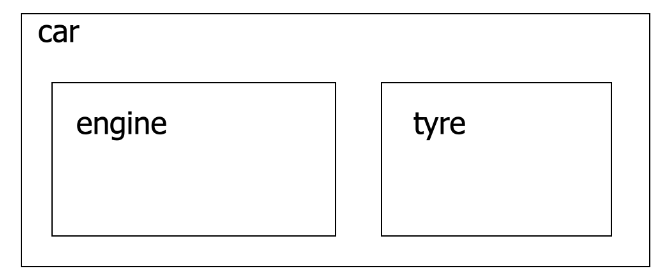
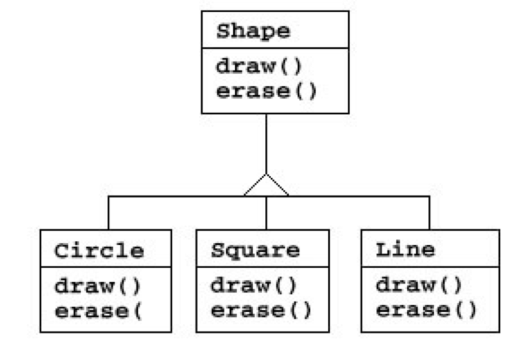
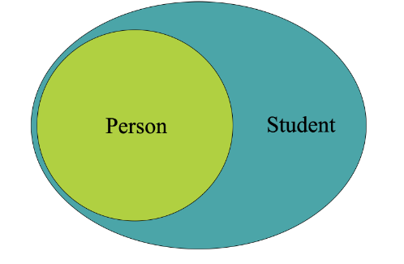
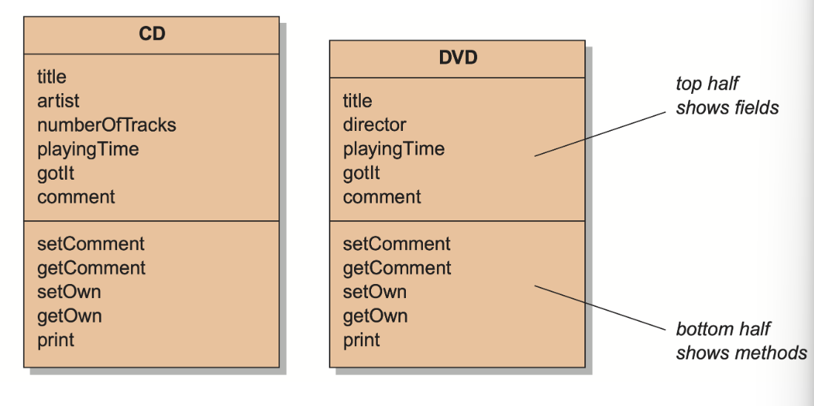
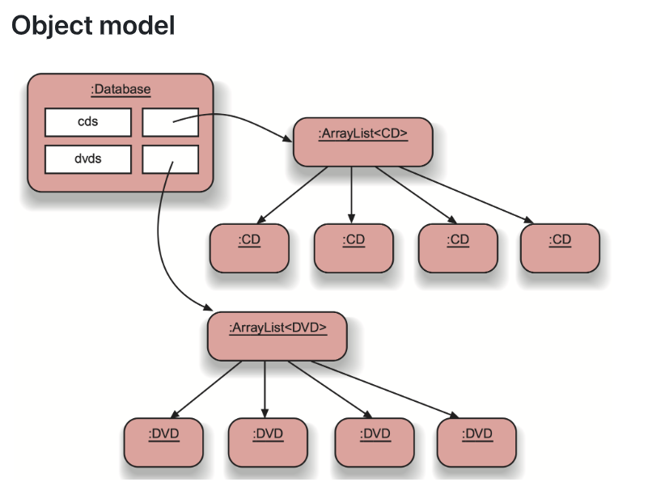
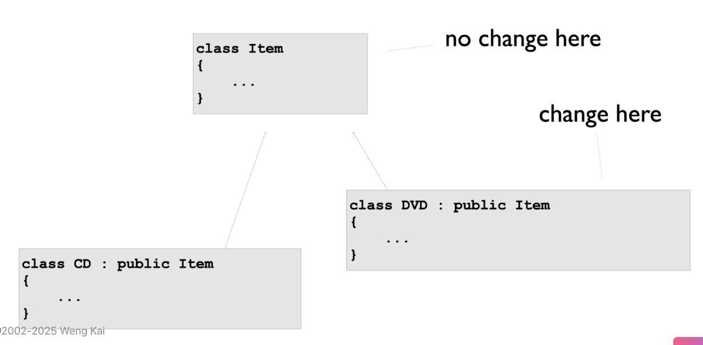
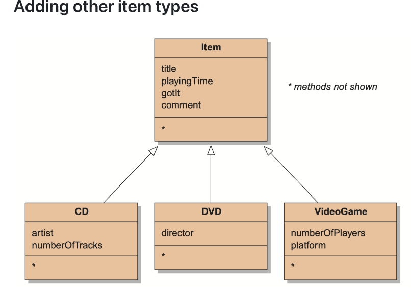
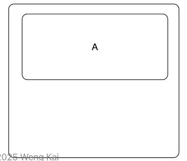
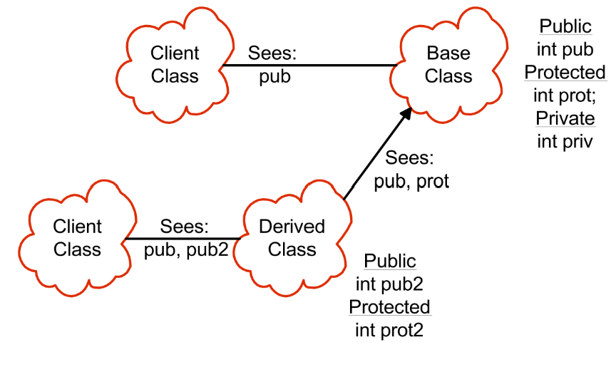

# Chapter 5: Inheritance

!!! Reuse
    1. Composition:用已有的类来写新的类
    - It is the relation of "has-a"
    - “披着羊皮的狼”
    

    2.Inheritance:基于已有的类来写新的类

    - Inheritance is to take the existing class, clone it, and then make additions and modifications to the clone.使用对外的接口(已有的public方法)进行使用已有的类
    

## 1 Inheritance

- Language inplementation technique

- 面向对象设计的重要方法
- 允许共享
    - 成员数据(往往不能被直接访问私有成员变量，只能通过接口进行间接访问)
    - 成员函数
    - 接口


The ability to define the behavior or implementation of one class as a superset of another class将一个类的行为或实现定义为另一个类的超集(父类)




!!! Example
    **DoME**
    - is an application that let sus store information about CDs and DVDs.We can 
        - enter information about CDs and DVDs
        - search,for example, all CDs in the database by a certain artist, or all DVDs by a given director

    - CD
        - the title of the album
        - the artist(name of the band or singer)
        - the number of tracks on the CD
        - the total playing time
        - a 'got it' flag that indicates whether I own a copy of this CD;
        - a comment (some arbitrary text)
    - DVD
        - the title of the DVD
        - the name of the director
        - the playing time
        - a 'got it' flag that indicates whether I own a copy of this DVD;
        - a comment (some arbitrary text)
    
    
    

    ???+ note "Without Inheritance"
        ```cpp
        class Database{
            vector<CD> cds;
            vector<DVD> dvds;
        public:
            void addCD(const CD& cd);
            void addDVD(const DVD& dvd);
            void list(){
                for(auto& cd : cds){cd.print();}
                for(auto& dvd : dvds){dvd.print();}
            }
        };
        ```

    ??? note "With Inheritance"
        - Inheritance allows us to define one class as an extension of another
        - Using inheritance:
            1. Define a superclass: `Item`
            2. Define subclasses: `CD` and `DVD`
            3. Define common attributes in superclass
            4. Subclasses inherit and add special attributes

        
        


- Advantage
    - 避免了代码的冗余
    - 代码的重复利用
    - Easier maintenance
    - Extendibility

- 基类(Base Class)/超类(Super)/父类(Parent)
- 子类(Sub)/派生类(Derived)

## 2 What does it inherited?
- 继承的内容
    - 私有成员变量
    - 公有成员函数
    - 私有成员函数
    - protected 成员
    - 静态成员

### 2.1 Private Member

##### 1.  在派生类对象内部存在一个超类对象

```cpp
class Base {
private:
    int x;  // 私有成员
public:
    void setX(int val) { x = val; }
};

class Derived : public Base {
private:
    int x;  // 与父类同名的独立变量
};
```
- 当创建`Derived`对象时，内存中会包含
    - 完整的`Base`子对象(包含私有成员X)
    - 新增的`Derived::x`(与Base::x完全独立)

##### 2. 访问控制规则

- 私有成员不可见性：派生类无法直接访问父类的私有成员("如`Base::x`")

!!! Warning "只能通过接口间接访问父类的私有成员变量"
    ```cpp
    Derived d;
    d.setX(10);  // 必须通过父类公有方法间接访问私有成员
    ```
##### 3. 同名变量的Name Hiding

```cpp
Derived d;
d.x = 5;      // 访问的是 Derived::x
d.Base::x = 5; // 错误！无法直接访问 Base::x（私有）
```

- 派生类中定义的`x`会遮蔽继承的同名变量
- 二者内存地址不同，是完全不同的变量

!!! Note "Derived-Class Objects and the Derived-to-Base Conversion"
    - 派生类包含多个部分
        - 派生类中定义的非静态对象
        - 父类中定义的基类对象
    
    ```cpp
    class A...
    class B:public A...
    ```
    

### 2.2 Public Member Functions

- 所有父类public成员函数都是派生类的public成员函数
- 定义了类的接口

### 2.3 Private Member Functions
- 在派生类均为不可访问的

### 2.4 Protected Member
- 派生类是可以完全访问的
### 2.5 Static Members
- 它们仍然是类范围内的成员，强调静态成员的作用域是类级别的
    - 所有实例共享一份静态成员
    - 可通过雷鸣直接访问(无需实例化)

## 3 Scopes and access in C++



这张图展示的是 **C++ 类继承中的访问控制规则**，描述了基类（Base Class）和派生类（Derived Class）成员在不同作用域下的可见性。


### **1. 核心概念说明**
| 术语               | 含义                                                                 |
|--------------------|----------------------------------------------------------------------|
| **Client Class**   | 使用类的代码（如 `main()` 函数或其他类）                              |
| **Derived Class**  | 通过继承获得基类成员的子类                                           |
| **访问控制符**     | `public`、`protected`、`private` 决定成员的可见性                    |

---

### **2. 图中场景分解**
#### **(1) 第一组：基类单独存在时**
```cpp
class Base {
public:
    int pub;     // 公有成员
protected:
    int prot;    // 保护成员
private:
    int priv;    // 私有成员
};
```
- **Client Class 可见性**  
  → 只能访问 `pub`（公有成员）  
  → `prot` 和 `priv` 不可见（编译错误）

#### **(2) 第二组：派生类继承基类**
```cpp
class Derived : public Base {  // 公有继承
public:
    int pub2;    // 新增公有成员
protected:
    int prot2;   // 新增保护成员
};
```
- **Client Class 可见性**  
  → 能访问 `pub`（继承的公有成员）和 `pub2`（新增公有成员）  
  → `prot`、`prot2`、`priv` 仍不可见  

- **Derived Class 内部可见性**  
  → 能访问 `pub`、`prot`（继承的公有和保护成员）  
  → **不能访问** `priv`（基类私有成员永远不可见）  
  → 可访问自身新增的 `pub2`、`prot2`

---

### **3. 访问控制规则总结**
| 成员类型       | 基类内部 | 派生类内部 | Client代码 |
|---------------|----------|------------|------------|
| `public`      | ✅       | ✅         | ✅         |
| `protected`   | ✅       | ✅         | ❌         |
| `private`     | ✅       | ❌         | ❌         |


- Declare an **Employee** class
```cpp
class Employee {
public:
    Employee(const string& name, const string& ssn);
    const string& get_name() const;
    ...
protected:
    string m_name;
    string m_ssn;
};

Emplyee::Employee(const string& name, const string& ssn):m_name(name),m_ssn(ssn){}

...
```

- Now add Manager
```cpp
class Manager:public Employee{
public:
    Manager(const string& name, const string& ssn, const string& title);
    ...
}
```
- Inheritance and constructors
   - Think of inherited traits as anembedded object继承的对象可以被视作嵌入的对象
   - Base class is mentioned by class name父类部分需要使用父类的构造函数
   ```cpp
    Manager::Manager(const string& name, const string& ssn, const string& title = "")  
    : Employee(name, ssn),  // ➊ 先调用基类构造函数  
      m_title(title)        // ➋ 再初始化派生类成员  
    {}                      // ➌ 构造函数体（此处为空）
   ```
## 4 More on Comstructors
- 基类总是先被构造
- 如果没有显式的参数传递给基类的构造函数
    - 默认构造函数会被调用

- 父类私有对象不能直接被子类使用，但是可以被接口间接使用。
    - 虽然父类的私有对象不能被直接使用，但是仍然是子类的一部分
- 子类构造要等待父类构造完成后被调用
- 一个类的public函数也是它们的子类的public函数，也就是`接口`
