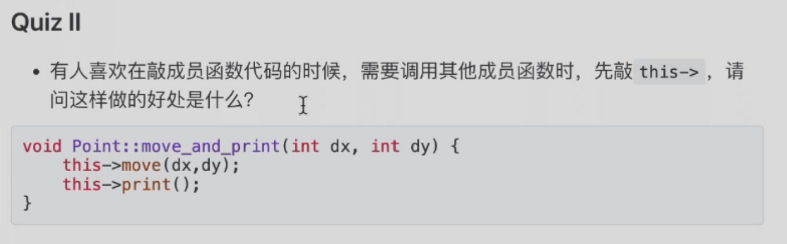
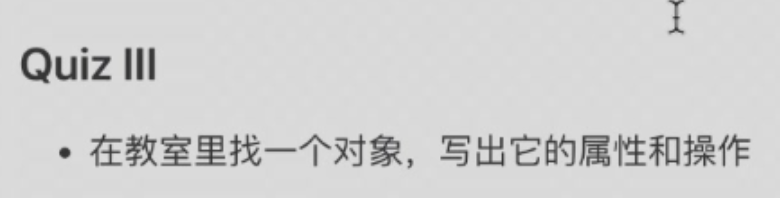
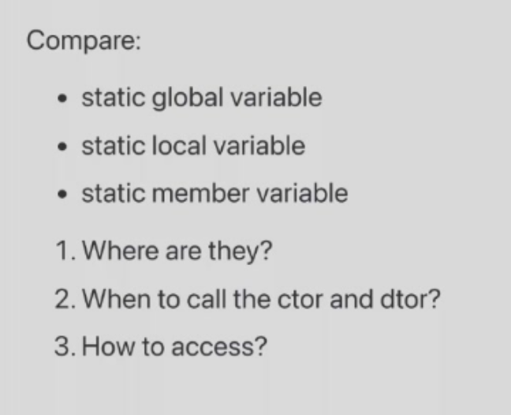
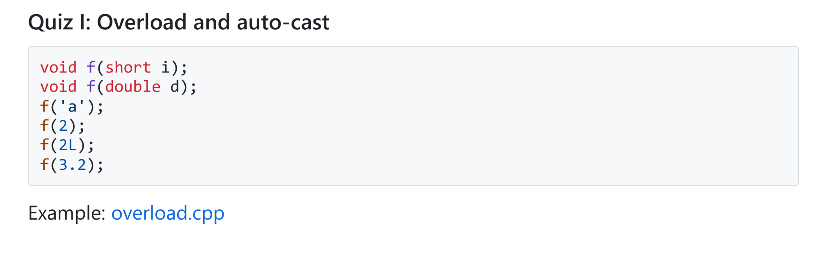

- Class

1. Quiz 1: why all these functions take a pointer a Point as the first  parameter?
- 程序中会有很多个Point结构体，避免使用全局变量


- 打出this后会直接显示出成员内部的函数，避免打错字


- 电脑：内存大小、处理器型号；访存，执行CPU运算

- Inside Class
1. Quiz 1:Can an object access private member of another object of the same class?

- 可以，边界是class而不是object，访问由编译器控制

2. Quiz 2:For a local object,when and where is the constructorand destructor called

- 函数结束时调用析构函数，运行到构造函数所在行调用构造函数

3. Quiz 3:


1. 静态全局变量在全局数据区；静态本地变量在全局数据区；静态成员变量在全局数据区

2. 静态全局变量如果是一个对象在main之前被调用，程序结束时析构；静态本地变量在函数第一次被调用时构造，在整个程序结束时析构；静态成员变量跟着全局变量(根的定义)构造析构

3. 静态全局变量在所在文件中可以被访问；静态本地变量只在函数内部可以被访问；静态成员变量如果是public都可以访问，private只有类的内部可以访问

- Reference

4. Quiz 4
```cpp
string p1("Fred");
const string* p=&p1;//指针可以修改，被指的不能被修改
string const* p=&p1;//指针可以修改，不能修改被指的内容
string* const p=&p1;//指针不能修改，可以通过p修改被指的内容
```

5. Quiz 5



- f('a'):`error`
- f(2):`error`
- f(2L):`error`
- f(3.2):double

