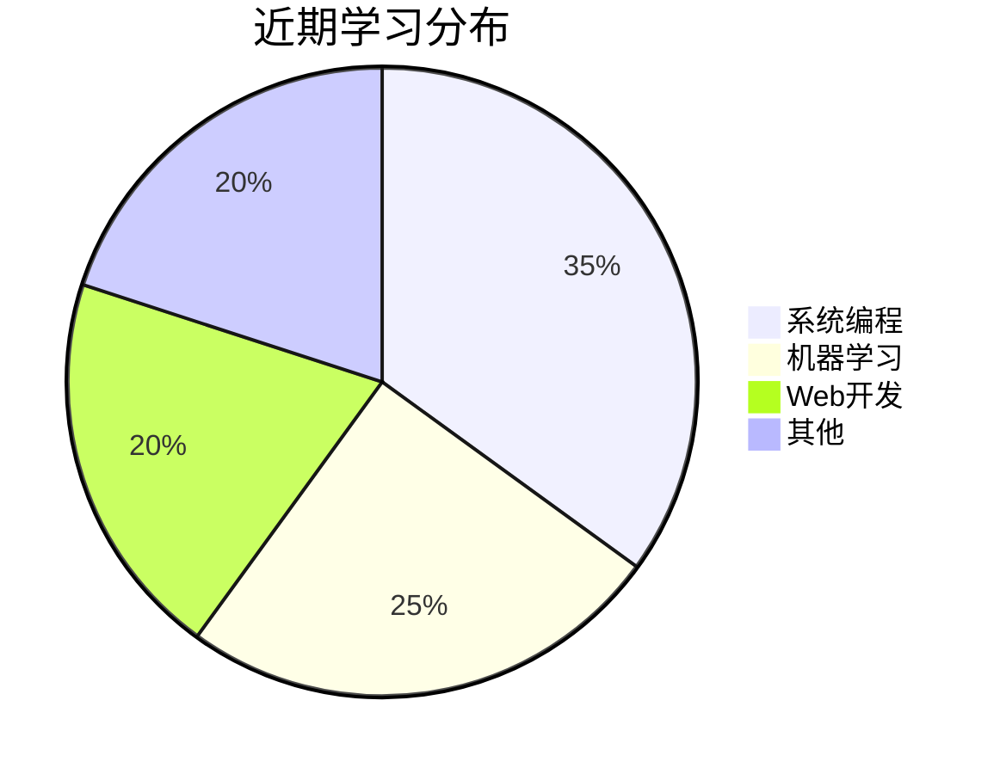

# 🎓 BruceYang's CS Journey

**浙江大学 · 计算机科学与技术 2023级**

`CS Undergrad | Open Source Contributor | Tech Explorer`

{ width="150" }

  

---

## 📖 课程笔记速递

### 专业核心课
- [《数据结构与算法》笔记](/courses/dsa/)  
  `#ADT` `#复杂度分析` `2024-春`  
  
- [《计算机系统》实验报告](/courses/csapp/)  
  `#CacheLab` `#BombLab` `2023-冬`

### 数学基础
- [《离散数学》重点整理](/courses/discrete-math/)  
  `#图论` `#群论` `2023-秋`

[查看全部课程 →](/courses/)

---

## 🔥 硬核项目

=== "课程设计"
    - **[MiniOS开发](https://github.com/BruceYang/MiniOS)**  
      《操作系统》课程实验项目  
      `C` `x86 Assembly` `★34`
    - **[RISC-V模拟器](https://github.com/BruceYang/RISC-V-Simulator)**  
      《计算机组成》大作业  
      `Verilog` `Python`

=== "开源贡献"
    - **[浙江大学课程攻略](https://github.com/QSCTech/zju-icicles)**  
      参与维护的ZJU课程资料库  
      `Markdown` `CC-BY-NC-SA`

---

## 🧩 技术碎片

- **最新动态**：  
  ✅ 2024-04-20 完成《编译原理》词法分析器实验  
  🌟 2024-04-15 获得PAT顶级满分  

---

## 🏆 资源宝库

| 类别 | 链接 |
|------|------|
| 教材下载 | [ZJU图书馆](http://lib.zju.edu.cn) |
| 实验平台 | [拼题A](https://pintia.cn) |
| 学术工具 | [Overleaf模板](https://www.overleaf.com/latex/templates/zju-thesis/) |

---

🏛️ **求是创新** · © 2024 BruceYang @ Zhejiang University  
[浙大CS官网](http://www.cs.zju.edu.cn) | [CC98论坛](https://cc98.org)

---
